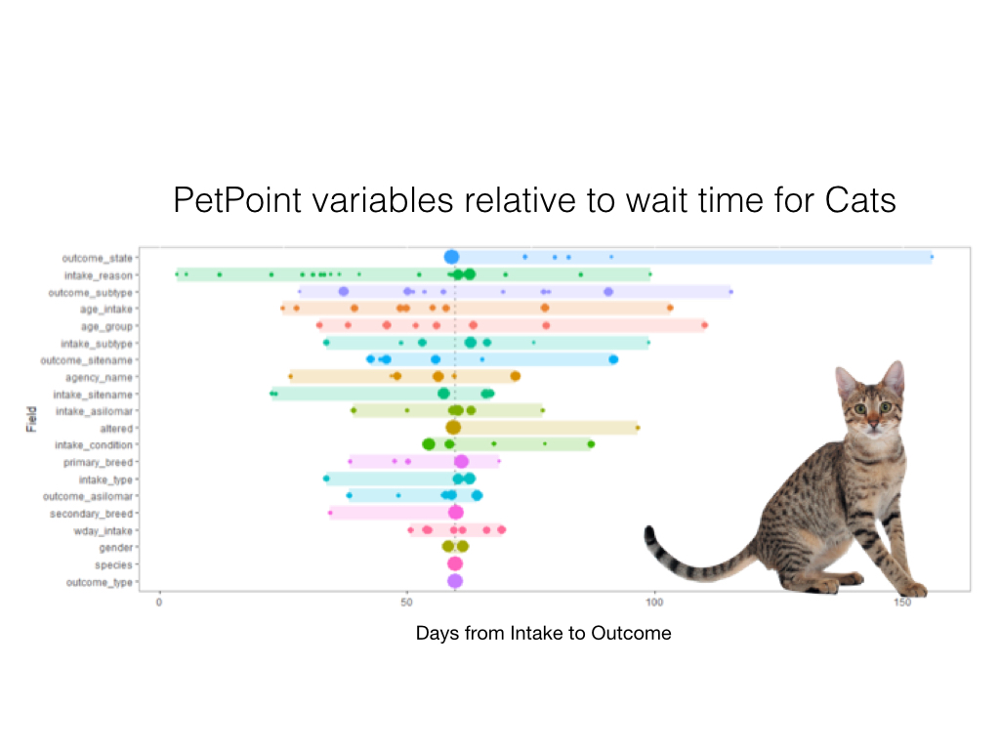
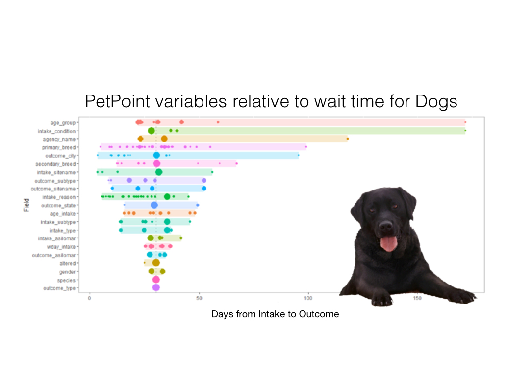

```{r setup, include=FALSE, message = FALSE}
knitr::opts_chunk$set(echo = FALSE, message = FALSE, warning = FALSE)
```

## Executive Summary  

* Most animals' outcomes are adoption, and the 'wait time' from intake to outcome is longer for cats than for dogs   

* Younger age and poorer health contributes to longer wait time for cats; and intake and wait time for younger, health-compromised cats is highest in spring/summer

* Dogs showed no differences in wait time based on age, health, size, or season

* Increased resources in spring/summer months for young, unhealthy cats may shorten wait times and alleviate staff burden


## Contributors
**Alex Lesicko, PhD** is a postdoctoral fellow studying auditory coding at the University of Pennsylvania. She recently moved to Philadelphia from Chicago, where she completed her PhD in neuroscience.

**Jake Riley** is a clinical data analyst at the Children's Hospital of Philadelphia (CHOP). He enjoys developing tools for analytic teams and specializes on data visualization and geospatial information systems (GIS). 

**Javier Jasso** is a certified speech–language pathologist and a PhD candidate in communication sciences and disorders at the University of Texas at Austin. Javier has expertise in the assessment of culturally/linguistically diverse children, focusing on bilingual language acquisition. 

**Katerina Placek** is a PhD candidate in neuroscience at the University of Pennsylvania and a co-organizer of R-Ladies Philly. She enjoys integrating outreach with teaching and learning in the local data science community.

## Problem definition and dataset

In this series of analyses, we investigated factors relating to an animal's trajectory in the PAWS system using PetPoint data from 2018. We operationalized animal trajectory as wait time and outcome (e.g. adoption), with wait time defined as time in days from intake to release. We restricted our analyses to dogs and cats, as other animals' data points were sparse and compromised statistical power. Our primary factors of interest included animal characteristics (size, breed, health), intake type, and seasonal patterns. Through this, we aimed to elucidate factors contributing to an animal's time in the PAWS system.

## Results
Our analyses focused on four facets of the PetPoint dataset:  
1. Data Exploration and defining 'Wait Time'   
2. Animal Characteristics  
3. Intake and Outcome Characteristics  
4. Seasonal/Locational Patterns

```{r workspace}
library(tidyverse) # data manipulation
library(lubridate) # date formatting
library(reshape2)
library(psych)
library(knitr)
options(scipen = 999) # turn off scientific notation

df_name <- "petpoint.csv"
```

## 1. Data Exploration and Defining 'Wait Time'
We first examined animals' outcomes for all 3018 animals in the 2018 Pet Point datset.
```{r raw_data}
convert_date <-  function(x) {
    mdy_hm(x) %>% as.Date()
}

master_animal <- read.csv("../../Data/processed_data/master_animal.csv")

raw_data <-
    read.csv(paste0("../../Data/", df_name), na.strings = "") %>%
    select(-c(X, animal_type, markings, dob, 
              STATEFP:INTPTLON)) %>% 
    mutate_at(vars(matches("date")), funs(convert_date)) %>% 
    mutate(wait_days = as.integer(difftime(release_date, intake_date, units = "days"))) %>%
    group_by(species) %>%
    mutate(long_wait = wait_days > median(wait_days, na.rm = T)) %>%
    ungroup() %>% 
    mutate(age_intake = as.numeric(age_intake)) %>%  
    mutate(intake_asilomar = replace(intake_asilomar, intake_asilomar== "Unassigned", NA)) %>% 
    mutate(intake_sitename = replace(intake_sitename, intake_sitename== "2007 Recordkeeping"| intake_sitename== "The PACCA Legacy", NA))
```

```{r}
raw_data %>%
    filter(!is.na(outcome_type)) %>%
    group_by("Outcome Type" = outcome_type) %>% 
    summarise("Number of Animals"=n())%>% 
    kable()
```

And we calculated the numbers of animals per species in the PetPoint dataset:

```{r}
nanimals <- as.data.frame(table(raw_data$species))
kable(nanimals, col.names = c("Species",
                           "Number of Animals"))
```

Next, we calculated 'wait time' (time in days from intake to release) for each animal. Animals who unfortunately did not have a release date (i.e. outcome type of 'Died' or 'Euthanasia' due to health reasons) and animals whose outcome was unknown (i.e. outcome type of 'Admin Missing') were not included in our calculations of wait time.
```{r}
raw_data %>%
    mutate(median = median(wait_days, na.rm =TRUE)) %>% 
    group_by(wait_days, median) %>% 
    summarise(n=n()) %>% 
    ggplot(aes(x = wait_days, y = n)) +
        geom_col() +
        geom_vline(aes(xintercept = median)) +
        geom_text(aes(x = median, label="\nMedian = 45 Days", y=40), colour="black", angle=90, text=element_text(size=20)) +
        xlab("Days from Intake to Release")+
        ylab("Number of animals")+
        theme(axis.title=element_text(size=14), strip.text = element_text(size=20), legend.position = "none")+
        ggtitle("Wait Time for PAWS animals in 2018")
```

We found that the median wait time for an animal at PAWS in 2018 was 45 days.

We then analyzed outcome type and wait time based on animal species:
```{r}
raw_data %>%
    filter(!is.na(outcome_type)) %>%
    group_by(species, outcome_type) %>% 
    mutate(median = median(wait_days, na.rm =)) %>% 
    group_by(Species = species, "Outcome Type" = outcome_type, "Median Wait Time (Days)" = median) %>% 
    summarise("Number of Animals"=n()) %>% 
    kable()
```
 
And visualized the wait time per outcome types per species (Note, animals with no 'wait time' were excluded):
```{r}
raw_data <- raw_data %>%
    filter(!is.na(wait_days))
    
raw_data %>%
    filter(!is.na(outcome_type)) %>%
    group_by(species, outcome_type, wait_days) %>% 
    mutate(median = median(wait_days, na.rm =)) %>% 
    group_by(outcome_type, median, species, wait_days) %>% 
    summarise(n=n()) %>% 
    ggplot(aes(x = wait_days, y = n, col = species)) +
        geom_col() +
        facet_wrap(species~outcome_type, scales = "fixed")+
        xlab("Days from Intake to Release") +
        theme(legend.position = "none", axis.title=element_text(size=10), strip.text = element_text(size=10))+
        ggtitle("Outcome for PAWS animals in 2018 - By Species")
```

And also visualized the frequency of wait time lengths per species:
```{r}
raw_data %>%
    group_by(species) %>% 
    mutate(median = median(wait_days, na.rm =)) %>% 
    group_by("Species" = species, "Median Wait Time (Days)" = median)%>% 
    summarise()%>% 
    kable()
    
raw_data %>%
    group_by(species) %>% 
    mutate(median = median(wait_days, na.rm =)) %>% 
    group_by(wait_days, species) %>% 
    summarise(n=n()) %>% 
    ggplot(aes(x = wait_days, y = n, fill = species)) +
        geom_col() +
        facet_wrap(~species, scales = "fixed") +
        xlab("Days from Intake to Release")+
        ylab("Number of animals")+
        theme(axis.title=element_text(size=14), strip.text = element_text(size=20), legend.position = "none")+
        ggtitle("Wait Time for PAWS animals in 2018 - By Species")
```

We found that the median wait time for a PAWS cat in 2018 was 51 days and that the median wait time for a PAWS dog in 2018 was 18 days.

```{r custom_functions}
# confirm if numeric/date fields should be cut
check_n_cat <- function(x) {
    (is.numeric(x) | is.integer(x) | is.Date(x)) &
    n_distinct(x) > 15
}

# cut numeric and dates into 10 groups
cut_custom <- function(x){
    label <- # create cut labels ex: "[0-4)" "[5-9)"
        cut(
            x, 
            breaks = 10, 
            include.lowest = TRUE, 
            dig.lab = 5,
            right = FALSE, 
            ordered_result = TRUE) 
    
    ord <- # will create order ex: "(02)"
        paste0("(", str_pad(as.integer(label), 2, pad = "0"), ") ")
    
    # if cut returns brackets, add order ex: "(02) [5-9)"
    ifelse(str_detect(label, "\\["), paste0(ord, label), as.character(label))
}

# lump categorical data into 10 groups
collapse_cat <- function(x, n = 10) {
    n_cat <- n_distinct(x)-n
        
    fct_lump(x, n) %>% 
        str_replace("^Other$", paste0("Other (", n_cat, ")"))
}
```

```{r df_as_categories}
# vector of variables to ignore in df_as_categories
ignore_vars <- "outcome_trello_id"

# transform all columns: remove ignore_vars columns, remove rows with NAs cut numeric data into categories, lump categorical data, add id
df_as_categories <-
    raw_data %>% 
    select(-one_of(ignore_vars)) %>%
    filter(complete.cases(.)) %>%
    mutate_if(check_n_cat, funs(cut_custom)) %>%
    #mutate_all(collapse_cat) %>% 
    mutate(id = row_number())
```

```{r get_fields}
# table of class attributes
column_class <- 
  tibble(name = colnames(raw_data)) %>% 
  mutate(ord = row_number(),
         class = as.character(sapply(raw_data, class)),
         n = as.integer(sapply(raw_data, n_distinct)),
         class = ifelse(n <= 2, "logical", class))

# vector of column names
get_vars <- names(df_as_categories)

# function to create counts, first column selected by integer #, this is similar to a gather of all field & field values followed by count but resulting in fewer rows at each step
agg_fields <-
    function(i){
        df_as_categories %>% 
        select(value = i) %>% 
        mutate(field = names(df_as_categories)[i],
               value = as.character(value)) %>% 
        group_by(field, value) %>% 
        summarise(n = n()) %>% 
        ungroup() %>% 
        group_by(field, value) %>% 
        summarise(n = sum(n)) %>% 
        ungroup()
    }

# base table
get_fields <- 
    agg_fields(1)

# for loop to append rows
for(i in 2:length(get_vars)){
    get_fields <-
        bind_rows(get_fields,
                  agg_fields(i))
}
```

Next, for each species, we visualized which PetPoint variables contributed to differences in wait time:

 



We focused our subsequent analyses on the variables with the greatest contributions to wait times (i.e. the longest horizontal lines on each plot).

## 2. Animal Characteristics
For animal characteristics contributing to wait time at PAWS, we first examined breed per species:
```{r}
# plot n per breed
raw_data %>%
  ggplot(aes(x = primary_breed, col = species)) +
  geom_bar() +
  facet_wrap(~species, scales = "free") +
  ylab("Number of Animals") +
  xlab("Breed") +
  coord_flip() +
theme(strip.text = element_text(size=14), axis.text.x = element_text(color = "grey20", size = 8), legend.position = "none")+
        ggtitle("Breed frequency per Species")
```

Most, if not all, cats from PAWS were 'domestic short hair', while dogs' breed variability was greater.

We then classified each animal as having a 'long' or a 'short' wait time based on the median wait time per species, and examined whether wait time differed on breed for dogs and cats:
```{r}
# plot n per breed
raw_data %>%
  ggplot(aes(x = primary_breed, fill = long_wait)) +
  geom_bar() +
  facet_wrap(~species, scales = "free") +
  ylab("Number of Animals") +
  xlab("Breed") +
  coord_flip() +
theme(strip.text = element_text(size=14), axis.text.x = element_text(color = "grey20", size = 8))+
        ggtitle("Breed frequency per Species by Wait Time")
```

Our findings indicate that for dogs, Shih Tzus tend to have shorter wait times whereas Terriers tend to have longer wait times.

Based on the large number of unique dog breeds in the PetPoint dataset, we classified dogs into 3 size categories based on average weight per breed. We then visualized wait times by size category:
```{r}
#group by category for dog breeds to analyse more easily as factor
dog_breeds <- sort(unique(raw_data$primary_breed[raw_data$species=="Dog"]))

#small = under 24 lbs; med = 24-44 lbs; large = 44+ lbs

small_breeds <- c("Beagle", "Bichon Frise", "Chihuahua, Long Coat", "Chihuahua, Short Coat", "Dachshund, Miniature Long Haired", "Dachshund, Miniature Smooth Haired", "Dachshund, Standard Smooth Haired", "Griffon, Brussels", "Havanese", "Kooikerhondje", "Lhasa Apso", "Maltese", "Miniature Pinscher", "Mixed Breed, Small (under 24 lbs fully grown)", "Papillon", "Pekingese", "Pomeranian", "Poodle, Miniature", "Poodle, Toy", "Pug", "Schnauzer, Miniature", "Shiba Inu", "Shih Tzu", "Spaniel, Cavalier King Charles", "Terrier", "Terrier, Cairn", "Terrier, Jack Russell", "Terrier, Russell", "Terrier, Silky", "Terrier, Yorkshire")

medium_breeds <- c("American Eskimo", "Mixed Breed, Medium (up to 44 lbs fully grown)", "Schnauzer, Standard", "Spaniel", "Spaniel, American Cocker", "Spaniel, English Cocker", "Terrier, Staffordshire Bull", "Terrier, Tibetan", "Welsh Corgi, Cardigan")

large_breeds <- c("Australian Shepherd", "Border Collie", "Boxer", "Bulldog", "Bulldog, American", "Hound", "Mixed Breed, Large (over 44 lbs fully grown)", "Norwegian Elkhound", "Poodle, Standard","Retriever", "Retriever, Golden", "Retriever, Labrador", "Shepherd", "Terrier, American Pit Bull", "Terrier, Bull", "Terrier, Pit Bull")

raw_data <- raw_data %>% 
    mutate(size = ifelse(primary_breed %in% small_breeds, "Small (under 24 lbs)",
                ifelse(primary_breed %in% medium_breeds, "Medium (up to 44 lbs)",
                ifelse(primary_breed %in% large_breeds, "Large (over 44 lbs)", NA))))

raw_data$size <- factor(raw_data$size, levels = c("Small (under 24 lbs)","Medium (up to 44 lbs)","Large (over 44 lbs)"))

raw_data %>%
  filter(species == "Dog") %>%
  ggplot(aes(x = size, fill = long_wait)) +
  geom_bar() +
  xlab("Size Category") +
  ylab("Number of Animals") +
  coord_flip() +
 theme(axis.title=element_text(size=14), strip.text = element_text(size=10))+
        ggtitle("Wait time by Size: Dogs")

```

Our statistical analyses demonstrated no significant differences in wait time based on dog size category.

We then examined age group per species, to determine whether wait time different on age group for dogs and cats:
```{r}
# plot n per age group
raw_data %>%
  ggplot(aes(x = age_intake, fill = long_wait)) +
  geom_bar() +
  facet_wrap(~species, scales = "free") +
  coord_flip()+
  xlab("Age at Intake (Months)") +
  ylab("Number of Animals") +
theme(strip.text = element_text(size=14))+
        ggtitle("Age at Intake by Wait Time per Species")
```

We found that cats in younger age groups have longer wait times, whereas but found no differences in dogs based on age group.

Last, we examined health at intake and release per species relative to wait times.
```{r}
  raw_data %>%
    filter(!is.na(intake_asilomar))%>%
    group_by(intake_asilomar, species) %>% 
    mutate(median = median(wait_days, na.rm =)) %>% 
    group_by(Species = species, "Intake Asilomar" = intake_asilomar, "Median Wait Time (Days)" = median) %>% 
    summarise("Number of Animals"=n()) %>% 
    kable()

# plot n per intake health condition
  raw_data %>%
    filter(!is.na(intake_asilomar))%>%
    group_by(intake_asilomar, species) %>% 
    group_by(species, wait_days, intake_asilomar) %>% 
    summarise(n=n()) %>% 
    ggplot(aes(x = wait_days, y = n, col = intake_asilomar)) +
        geom_col() +
        xlab("Days from Intake to Relase") +
        ylab("Number of Animals") +
        facet_wrap(species~intake_asilomar, scales = "fixed", ncol = 4)+
        theme(strip.text = element_text(size=10), legend.position = "none") +
        ggtitle("Intake Health Condition")
```


```{r}
raw_data %>%
    filter(!is.na(intake_asilomar))%>%
    group_by(intake_asilomar, species) %>% 
    mutate(median = median(wait_days, na.rm =)) %>% 
    group_by(Species = species, "Outcome Asilomar" = intake_asilomar, "Median Wait Time (Days)" = median) %>% 
    summarise("Number of Animals"=n()) %>% 
    kable()


# plot n per outcome health condition
raw_data %>%
    filter(!is.na(outcome_asilomar))%>%
    group_by(species, wait_days, outcome_asilomar) %>% 
    summarise(n=n()) %>% 
    ggplot(aes(x = wait_days, y = n, col = outcome_asilomar)) +
        geom_col() +
        xlab("Days from Intake to Release") +
        ylab("Number of Animals") +
        facet_wrap(species~outcome_asilomar, scales = "fixed") +
        theme(strip.text = element_text(size=10), legend.position = "none")+
        ggtitle("Release Health Condition")
```

Our analyses revealed that for cats only, health condition at intake and relase was associated with longer median wait time. Specifically, cats classified as 'Treatable-Rehabilitatable' and 'Unhealthy/Untreatable' had longer wait times than cats classified as 'Healthy' or 'Treatable-Manageable'.

## 3. Intake  Characteristics
Next, we examined intake characteristics across the petpoint dataset. 
```{r}
master_animal_intake <- master_animal %>% 
    dplyr::select(intake_type,
           intake_subtype,
           wait_days, 
           animal_type) %>% 
    filter(!is.na(intake_type)) %>% 
    mutate(intake_type = factor(intake_type), 
           animal_type = factor(animal_type), 
           wait = as.numeric(wait_days))
```

We first examined the frequency of primary intake type for all animals and calculated the median wait days for all animals based on intake type:
```{r}
ggplot(master_animal_intake, aes(intake_type))+
    geom_bar(color="turquoise", fill="turquoise")+
    xlab('Intake Type') +
    ylab('Number of Animals')+
    coord_flip() +
    ggtitle("Frequency of Intake Type")

```

```{r}
master_animal_intake %>%
    group_by("Intake Type" = intake_type) %>% 
    summarise("Number of Animals" = n(), "Median Wait Time (Days)" = median(wait_days)) %>% 
    kable()
```

Using analysis of variance, we examined whether wait days differed based on animal intake type:
```{r}
intake_aov <- aov(wait_days ~ intake_type, master_animal_intake) 
#summary(intake_aov)

ggplot(master_animal_intake, aes(x = intake_type, y = wait_days, col = intake_type)) +
    geom_boxplot() +
    xlab('Intake Type') +
    ylab('Days from Intake to Release')+
    theme(legend.position = "none") +
    ggtitle("Wait Time by Intake Type")
```

Our results indicated that animals at PAWS with an intake of "Stray" or "Transfer In" had significantly longer wait times relative to animals who with an intake type of "Owner/Guardian Surrender" or "Return."

We next examined intake type by species:
```{r summary_animal.type}
master_animal_intake %>%
    group_by("Intake Type" = intake_type) %>% 
    filter(animal_type=='cat') %>% 
    summarise("Number of Cats" = n(), "Median Wait Time (Days)" = median(wait_days))%>% 
    kable()

master_animal_intake %>%
     group_by("Intake Type" = intake_type) %>% 
    filter(animal_type == 'dog') %>% 
     summarise("Number of Dogs" = n(), "Median Wait Time (Days)"  = median(wait_days))%>% 
    kable()
```

And we examined whether the effect of intake type on wait time differed by animal species:
```{r interaction}
intake_type_int <- lm(wait_days ~ intake_type*animal_type, master_animal_intake)
#summary(intake_type_int)

master_animal_intake %>% 
filter(!is.na(animal_type)) %>% 
ggplot(., aes(x = intake_type, y = wait_days, col = animal_type))+
    geom_boxplot() +
    xlab('Intake Type') +
    ylab('Days from Intake to Release')+
    ggtitle("Wait Time by Intake Type per Species") +
    theme(legend.title = element_blank())
```

We found that as previously, cats had longer wait times for each intake type relative to dogs.

We next examined the intake subtype for all animals:
```{r}
#plotting frequency of intake_subtype var:
ggplot(master_animal_intake, aes(intake_subtype)) +
    geom_bar(color="gold", fill="gold")+
    xlab('Intake Subtype') +
    ylab('Number of Animals')+
    coord_flip()+
    ggtitle("Frequency of Intake Subtype")
```

```{r}
master_animal_intake %>%
    group_by("Intake Subtype" = intake_subtype) %>% 
    summarise("Number of Animals" = n(), "Median Wait Time (Days)" = median(wait_days)) %>% 
    kable()
```

We focused our analysis of intake subtype on animals in the Public Dropoff and Returned Adoption categories:
```{r}
subtype_filter <- master_animal_intake %>% 
    filter(intake_subtype == 'Returned Adoption' |
               intake_subtype == 'Public Drop Off')
```

```{r}
intake_subtype_lm <- lm(wait_days ~ intake_subtype, subtype_filter)
#summary(intake_subtype_lm)

ggplot(subtype_filter, aes(x = intake_subtype, y = wait_days, col = intake_subtype)) +
    geom_boxplot() +
    xlab('Intake Subtype') +
    ylab('Days from Intake to Release')+
    ggtitle("Wait Time by Intake Type") +
    theme(legend.position = "none")
```

We found that animals with an intake subtype of 'Public Drop Off' had a significantly longer wait time than animals with an intake subtype of 'Returned Adoption.'

## 4. Seasonal and Locational Patterns
Last, we examined animals' wait time at PAWS by season and location. 
We examined the frequency of intakes per month: 
```{r}
#Extract intake month
master_animal$intake_month <- format(as.Date(master_animal$intake_date), "%B")
#Plot monthly trends in intake
master_animal$intake_month_fac = factor(master_animal$intake_month, levels = month.name)
intake_month_counts <- table(master_animal$intake_month_fac)
df_intake_month_counts <- data.frame(intake_month_counts)
names(df_intake_month_counts)[1]<-"Month"
df_intake_month_counts$Season <- c(rep("Winter",2), rep("Spring",3), rep("Summer",3), rep("Fall",3), "Winter")

ggplot(df_intake_month_counts, aes(x=Month, y=Freq, fill = Season)) + 
    geom_bar(stat = "identity") + 
    scale_fill_manual(values = c("Winter" = "slateblue4", "Spring" = "cyan4", "Summer" = "yellow2", "Fall" = "sienna2")) + 
    ggtitle("Monthly Trends in Intake - All Facilities") + theme(plot.title = element_text(hjust = 0.5), axis.text.x = element_text(color = "grey20", size = 8, angle = 90))+ 
    ylab("Number of Intakes")
```

And examined the frequency of releases per month:
```{r}
#Extract release month
master_animal$release_month <- format(as.Date(master_animal$release_date), "%B")

#Plot monthly trends in release
master_animal$release_month_fac = factor(master_animal$release_month, levels = month.name)
release_month_counts <- table(master_animal$release_month_fac)
df_release_month_counts <- data.frame(release_month_counts)
names(df_release_month_counts)[1]<-"Month"
df_release_month_counts$Season <- c(rep("Winter",2), rep("Spring",3), rep("Summer",3), rep("Fall",3), "Winter")

ggplot(df_release_month_counts, aes(x=Month, y=Freq, fill = Season)) + 
    geom_bar(stat = "identity") + 
    scale_fill_manual(values = c("Winter" = "slateblue4", "Spring" = "cyan4", "Summer" = "yellow2", "Fall" = "sienna2")) + 
    ggtitle("Monthly Trends in Release - All Facilities") + theme(plot.title = element_text(hjust = 0.5), axis.text.x = element_text(color = "grey20", size = 8, angle = 90))+ 
    ylab("Number of Intakes")
```

And calculated the difference between intakes and releases per month:
```{r}
#Plot intake-outtake index
df_intake_outtake_index <- cbind(df_intake_month_counts[1],df_intake_month_counts[3])

df_intake_outtake_index$Index <-(df_intake_month_counts$Freq-df_release_month_counts$Freq)/(df_intake_month_counts$Freq+df_release_month_counts$Freq)

ggplot(df_intake_outtake_index, aes(x=Month, y=Index, fill = Season)) + 
    geom_bar(stat = "identity") + 
    scale_fill_manual(values = c("Winter" = "slateblue4", "Spring" = "cyan4", "Summer" = "yellow2", "Fall" = "sienna2")) + 
    ggtitle("Intake-Outtake Index - All Facilities") + theme(plot.title = element_text(hjust = 0.5), axis.text.x = element_text(color = "grey20", size = 8, angle = 90))+ 
    ylab("Index value")
```

We found that the summer and spring months have higher intakes relative to releases.

We then looked at monthly trends in intakes and releases by species:
```{r}
#Subset Data by Species
cat <- master_animal[ which(master_animal$species=='Cat'), ]
dog <- master_animal[ which(master_animal$species=='Dog'), ]

#calculate monthly trends in intake by species
cat_intake_month_counts <- table(cat$intake_month_fac)
dog_intake_month_counts <- table(dog$intake_month_fac)
df_intake_month_counts_species <- data.frame(cat_intake_month_counts, dog_intake_month_counts)
df_intake_month_counts_species <- df_intake_month_counts_species[-3]
names(df_intake_month_counts_species)[1] <- "Month"
names(df_intake_month_counts_species)[2] <- "Cats"
names(df_intake_month_counts_species)[3] <- "Dogs"

df_intake_month_counts_species <- melt(df_intake_month_counts_species, id.vars='Month')
df_intake_month_counts_species$Season <- c(rep("Winter",2), rep("Spring",3), rep("Summer",3), rep("Fall",3), "Winter")

#calculate monthly trends in release by species
cat_release_month_counts <- table(cat$release_month_fac)
dog_release_month_counts <- table(dog$release_month_fac)
df_release_month_counts_species <- data.frame(cat_release_month_counts, dog_release_month_counts)
df_release_month_counts_species <- df_release_month_counts_species[-3]
names(df_release_month_counts_species)[1] <- "Month"
names(df_release_month_counts_species)[2] <- "Cats"
names(df_release_month_counts_species)[3] <- "Dogs"

df_release_month_counts_species <- melt(df_release_month_counts_species, id.vars='Month')
df_release_month_counts_species$Season <- c(rep("Winter",2), rep("Spring",3), rep("Summer",3), rep("Fall",3), "Winter")

#calculate monthly trends in intake-outtake index by species
df_intake_outtake_index_species <- cbind(df_intake_month_counts_species[1],df_intake_month_counts_species[2],df_intake_month_counts_species[4])

df_intake_outtake_index_species$Index <-(df_intake_month_counts_species$value-df_release_month_counts_species$value)/(df_intake_month_counts_species$value+df_release_month_counts_species$value)

ggplot(df_intake_outtake_index_species, aes(x=Month, y=Index, fill = Season)) + geom_bar(stat='identity', position='dodge') + scale_fill_manual(values = c("Winter" = "slateblue4", "Spring" = "cyan4", "Summer" = "yellow2", "Fall" = "sienna2")) + facet_wrap(~ variable) + ggtitle("Intake-Outtake Index - All Facilities") + theme(plot.title = element_text(hjust = 0.5)) + theme(axis.text.x = element_text(angle=90, hjust=1))
```

We found that cats have higher intakes than releases in spring and summer months, but observed no seasonal patterns for dogs.


We then examined seasonal patterns in intake-release index by location for each species: 
```{r}
#Subset Data by Intake Location
GFA <- master_animal[ which(master_animal$intake_sitename=='Grays Ferry Avenue'), ]
PAC <- master_animal[ which(master_animal$intake_sitename=='PAC'), ]
GA <- master_animal[ which(master_animal$intake_sitename=='Grant Avenue'), ]
PAWS_FP <- master_animal[ which(master_animal$intake_sitename=='PAWS Foster Program'), ]
PAWS_OA <- master_animal[ which(master_animal$intake_sitename=='PAWS Offsite Adoptions'), ]
```

```{r}
#Subset Intake Location Data by Species
GFA_cat <- GFA[ which(GFA$species=='Cat'), ]
GFA_dog <- GFA[ which(GFA$species=='Dog'), ]

PAC_cat <- PAC[ which(PAC$species=='Cat'), ]
PAC_dog <- PAC[ which(PAC$species=='Dog'), ]

GA_cat <- GA[ which(GA$species=='Cat'), ]
GA_dog <- GA[ which(GA$species=='Dog'), ]

PAWS_FP_cat <- PAWS_FP[ which(PAWS_FP$species=='Cat'), ]
PAWS_FP_dog <- PAWS_FP[ which(PAWS_FP$species=='Dog'), ]

PAWS_OA_cat <- PAWS_OA[ which(PAWS_OA$species=='Cat'), ]
PAWS_OA_dog <- PAWS_OA[ which(PAWS_OA$species=='Dog'), ]
```

```{r}
#Plot Monthly Trends in Intake-Release Index by Species for Each Location

#Grays Ferry Avenue
GFA_cat_intake_month_counts <- table(GFA_cat$intake_month_fac)
GFA_dog_intake_month_counts <- table(GFA_dog$intake_month_fac)
df_GFA_intake_month_counts_species <- data.frame(GFA_cat_intake_month_counts, GFA_dog_intake_month_counts)
df_GFA_intake_month_counts_species <- df_GFA_intake_month_counts_species[-3]
names(df_GFA_intake_month_counts_species)[1] <- "Month"
names(df_GFA_intake_month_counts_species)[2] <- "Cats"
names(df_GFA_intake_month_counts_species)[3] <- "Dogs"

df_GFA_intake_month_counts_species <- melt(df_GFA_intake_month_counts_species, id.vars='Month')
df_GFA_intake_month_counts_species$Season <- c(rep("Winter",2), rep("Spring",3), rep("Summer",3), rep("Fall",3), "Winter") 

#PAC
PAC_cat_intake_month_counts <- table(PAC_cat$intake_month_fac)
PAC_dog_intake_month_counts <- table(PAC_dog$intake_month_fac)
df_PAC_intake_month_counts_species <- data.frame(PAC_cat_intake_month_counts, PAC_dog_intake_month_counts)
df_PAC_intake_month_counts_species <- df_PAC_intake_month_counts_species[-3]
names(df_PAC_intake_month_counts_species)[1] <- "Month"
names(df_PAC_intake_month_counts_species)[2] <- "Cats"
names(df_PAC_intake_month_counts_species)[3] <- "Dogs"

df_PAC_intake_month_counts_species <- melt(df_PAC_intake_month_counts_species, id.vars='Month')
df_PAC_intake_month_counts_species$Season <- c(rep("Winter",2), rep("Spring",3), rep("Summer",3), rep("Fall",3), "Winter") 

#Grant Avenue
GA_cat_intake_month_counts <- table(GA_cat$intake_month_fac)
GA_dog_intake_month_counts <- table(GA_dog$intake_month_fac)
df_GA_intake_month_counts_species <- data.frame(GA_cat_intake_month_counts, GA_dog_intake_month_counts)
df_GA_intake_month_counts_species <- df_GA_intake_month_counts_species[-3]
names(df_GA_intake_month_counts_species)[1] <- "Month"
names(df_GA_intake_month_counts_species)[2] <- "Cats"
names(df_GA_intake_month_counts_species)[3] <- "Dogs"

df_GA_intake_month_counts_species <- melt(df_GA_intake_month_counts_species, id.vars='Month')
df_GA_intake_month_counts_species$Season <- c(rep("Winter",2), rep("Spring",3), rep("Summer",3), rep("Fall",3), "Winter") 

#PAWS Foster Program
PAWS_FP_cat_intake_month_counts <- table(PAWS_FP_cat$intake_month_fac)
PAWS_FP_dog_intake_month_counts <- table(PAWS_FP_dog$intake_month_fac)
df_PAWS_FP_intake_month_counts_species <- data.frame(PAWS_FP_cat_intake_month_counts, PAWS_FP_dog_intake_month_counts)
df_PAWS_FP_intake_month_counts_species <- df_PAWS_FP_intake_month_counts_species[-3]
names(df_PAWS_FP_intake_month_counts_species)[1] <- "Month"
names(df_PAWS_FP_intake_month_counts_species)[2] <- "Cats"
names(df_PAWS_FP_intake_month_counts_species)[3] <- "Dogs"

df_PAWS_FP_intake_month_counts_species <- melt(df_PAWS_FP_intake_month_counts_species, id.vars='Month')
df_PAWS_FP_intake_month_counts_species$Season <- c(rep("Winter",2), rep("Spring",3), rep("Summer",3), rep("Fall",3), "Winter") 


#PAWS Offsite Adoptions
PAWS_OA_cat_intake_month_counts <- table(PAWS_OA_cat$intake_month_fac)
PAWS_OA_dog_intake_month_counts <- table(PAWS_OA_dog$intake_month_fac)
df_PAWS_OA_intake_month_counts_species <- data.frame(PAWS_OA_cat_intake_month_counts, PAWS_OA_dog_intake_month_counts)
df_PAWS_OA_intake_month_counts_species <- df_PAWS_OA_intake_month_counts_species[-3]
names(df_PAWS_OA_intake_month_counts_species)[1] <- "Month"
names(df_PAWS_OA_intake_month_counts_species)[2] <- "Cats"
names(df_PAWS_OA_intake_month_counts_species)[3] <- "Dogs"

df_PAWS_OA_intake_month_counts_species <- melt(df_PAWS_OA_intake_month_counts_species, id.vars='Month')
df_PAWS_OA_intake_month_counts_species$Season <- c(rep("Winter",2), rep("Spring",3), rep("Summer",3), rep("Fall",3), "Winter") 

#Grays Ferry Avenue
GFA_cat_release_month_counts <- table(GFA_cat$release_month_fac)
GFA_dog_release_month_counts <- table(GFA_dog$release_month_fac)
df_GFA_release_month_counts_species <- data.frame(GFA_cat_release_month_counts, GFA_dog_release_month_counts)
df_GFA_release_month_counts_species <- df_GFA_release_month_counts_species[-3]
names(df_GFA_release_month_counts_species)[1] <- "Month"
names(df_GFA_release_month_counts_species)[2] <- "Cats"
names(df_GFA_release_month_counts_species)[3] <- "Dogs"

df_GFA_release_month_counts_species <- melt(df_GFA_release_month_counts_species, id.vars='Month')
df_GFA_release_month_counts_species$Season <- c(rep("Winter",2), rep("Spring",3), rep("Summer",3), rep("Fall",3), "Winter")


#PAC
PAC_cat_release_month_counts <- table(PAC_cat$release_month_fac)
PAC_dog_release_month_counts <- table(PAC_dog$release_month_fac)
df_PAC_release_month_counts_species <- data.frame(PAC_cat_release_month_counts, PAC_dog_release_month_counts)
df_PAC_release_month_counts_species <- df_PAC_release_month_counts_species[-3]
names(df_PAC_release_month_counts_species)[1] <- "Month"
names(df_PAC_release_month_counts_species)[2] <- "Cats"
names(df_PAC_release_month_counts_species)[3] <- "Dogs"

df_PAC_release_month_counts_species <- melt(df_PAC_release_month_counts_species, id.vars='Month')
df_PAC_release_month_counts_species$Season <- c(rep("Winter",2), rep("Spring",3), rep("Summer",3), rep("Fall",3), "Winter")

#Grant Avenue
GA_cat_release_month_counts <- table(GA_cat$release_month_fac)
GA_dog_release_month_counts <- table(GA_dog$release_month_fac)
df_GA_release_month_counts_species <- data.frame(GA_cat_release_month_counts, GA_dog_release_month_counts)
df_GA_release_month_counts_species <- df_GA_release_month_counts_species[-3]
names(df_GA_release_month_counts_species)[1] <- "Month"
names(df_GA_release_month_counts_species)[2] <- "Cats"
names(df_GA_release_month_counts_species)[3] <- "Dogs"

df_GA_release_month_counts_species <- melt(df_GA_release_month_counts_species, id.vars='Month')
df_GA_release_month_counts_species$Season <- c(rep("Winter",2), rep("Spring",3), rep("Summer",3), rep("Fall",3), "Winter")

#PAWS Foster Program
PAWS_FP_cat_release_month_counts <- table(PAWS_FP_cat$release_month_fac)
PAWS_FP_dog_release_month_counts <- table(PAWS_FP_dog$release_month_fac)
df_PAWS_FP_release_month_counts_species <- data.frame(PAWS_FP_cat_release_month_counts, PAWS_FP_dog_release_month_counts)
df_PAWS_FP_release_month_counts_species <- df_PAWS_FP_release_month_counts_species[-3]
names(df_PAWS_FP_release_month_counts_species)[1] <- "Month"
names(df_PAWS_FP_release_month_counts_species)[2] <- "Cats"
names(df_PAWS_FP_release_month_counts_species)[3] <- "Dogs"

df_PAWS_FP_release_month_counts_species <- melt(df_PAWS_FP_release_month_counts_species, id.vars='Month')
df_PAWS_FP_release_month_counts_species$Season <- c(rep("Winter",2), rep("Spring",3), rep("Summer",3), rep("Fall",3), "Winter")


#PAWS Offsite Adoptions
PAWS_OA_cat_release_month_counts <- table(PAWS_OA_cat$release_month_fac)
PAWS_OA_dog_release_month_counts <- table(PAWS_OA_dog$release_month_fac)
df_PAWS_OA_release_month_counts_species <- data.frame(PAWS_OA_cat_release_month_counts, PAWS_OA_dog_release_month_counts)
df_PAWS_OA_release_month_counts_species <- df_PAWS_OA_release_month_counts_species[-3]
names(df_PAWS_OA_release_month_counts_species)[1] <- "Month"
names(df_PAWS_OA_release_month_counts_species)[2] <- "Cats"
names(df_PAWS_OA_release_month_counts_species)[3] <- "Dogs"

df_PAWS_OA_release_month_counts_species <- melt(df_PAWS_OA_release_month_counts_species, id.vars='Month')
df_PAWS_OA_release_month_counts_species$Season <- c(rep("Winter",2), rep("Spring",3), rep("Summer",3), rep("Fall",3), "Winter")


#Grays Ferry Avenue
df_GFA_intake_outtake_index_species <- cbind(df_GFA_intake_month_counts_species[1],df_GFA_intake_month_counts_species[2],df_GFA_intake_month_counts_species[4])

df_GFA_intake_outtake_index_species$Index <-(df_GFA_intake_month_counts_species$value-df_GFA_release_month_counts_species$value)/(df_GFA_intake_month_counts_species$value+df_GFA_release_month_counts_species$value)

ggplot(df_GFA_intake_outtake_index_species, aes(x=Month, y=Index, fill = Season)) + geom_bar(stat='identity', position='dodge') + scale_fill_manual(values = c("Winter" = "slateblue4", "Spring" = "cyan4", "Summer" = "yellow2", "Fall" = "sienna2")) + facet_wrap(~ variable) + ggtitle("Intake-Outtake Index - Grays Ferry Avenue") + theme(plot.title = element_text(hjust = 0.5), axis.text.x = element_text(angle=90, hjust=1))

#PAC
df_PAC_intake_outtake_index_species <- cbind(df_PAC_intake_month_counts_species[1],df_PAC_intake_month_counts_species[2],df_PAC_intake_month_counts_species[4])

df_PAC_intake_outtake_index_species$Index <-(df_PAC_intake_month_counts_species$value-df_PAC_release_month_counts_species$value)/(df_PAC_intake_month_counts_species$value+df_PAC_release_month_counts_species$value)

ggplot(df_PAC_intake_outtake_index_species, aes(x=Month, y=Index, fill = Season)) + geom_bar(stat='identity', position='dodge') + scale_fill_manual(values = c("Winter" = "slateblue4", "Spring" = "cyan4", "Summer" = "yellow2", "Fall" = "sienna2")) + facet_wrap(~ variable) + ggtitle("Intake-Outtake Index - PAC") + theme(plot.title = element_text(hjust = 0.5), axis.text.x = element_text(angle=90, hjust=1))

#Grant Avenue
df_GA_intake_outtake_index_species <- cbind(df_GA_intake_month_counts_species[1],df_GA_intake_month_counts_species[2],df_GA_intake_month_counts_species[4])

df_GA_intake_outtake_index_species$Index <-(df_GA_intake_month_counts_species$value-df_GA_release_month_counts_species$value)/(df_GA_intake_month_counts_species$value+df_GA_release_month_counts_species$value)

ggplot(df_GA_intake_outtake_index_species, aes(x=Month, y=Index, fill = Season)) + geom_bar(stat='identity', position='dodge') + scale_fill_manual(values = c("Winter" = "slateblue4", "Spring" = "cyan4", "Summer" = "yellow2", "Fall" = "sienna2")) + facet_wrap(~ variable) + ggtitle("Intake-Outtake Index - Grant Avenue") + theme(plot.title = element_text(hjust = 0.5), axis.text.x = element_text(angle=90, hjust=1))

#PAWS Foster Program
df_PAWS_FP_intake_outtake_index_species <- cbind(df_PAWS_FP_intake_month_counts_species[1],df_PAWS_FP_intake_month_counts_species[2],df_PAWS_FP_intake_month_counts_species[4])

df_PAWS_FP_intake_outtake_index_species$Index <-(df_PAWS_FP_intake_month_counts_species$value-df_PAWS_FP_release_month_counts_species$value)/(df_PAWS_FP_intake_month_counts_species$value+df_PAWS_FP_release_month_counts_species$value)

ggplot(df_PAWS_FP_intake_outtake_index_species, aes(x=Month, y=Index, fill = Season)) + geom_bar(stat='identity', position='dodge') + scale_fill_manual(values = c("Winter" = "slateblue4", "Spring" = "cyan4", "Summer" = "yellow2", "Fall" = "sienna2")) + facet_wrap(~ variable) + ggtitle("Intake-Outtake Index - PAWS Foster Program") + theme(plot.title = element_text(hjust = 0.5), axis.text.x = element_text(angle=90, hjust=1))

#PAWS Offsite Adoptions
df_PAWS_OA_intake_outtake_index_species <- cbind(df_PAWS_OA_intake_month_counts_species[1],df_PAWS_OA_intake_month_counts_species[2],df_PAWS_OA_intake_month_counts_species[4])

df_PAWS_OA_intake_outtake_index_species$Index <-(df_PAWS_OA_intake_month_counts_species$value-df_PAWS_OA_release_month_counts_species$value)/(df_PAWS_OA_intake_month_counts_species$value+df_PAWS_OA_release_month_counts_species$value)

ggplot(df_PAWS_OA_intake_outtake_index_species, aes(x=Month, y=Index, fill = Season)) + geom_bar(stat='identity', position='dodge') + scale_fill_manual(values = c("Winter" = "slateblue4", "Spring" = "cyan4", "Summer" = "yellow2", "Fall" = "sienna2")) + facet_wrap(~ variable) + ggtitle("Intake-Outtake Index - PAWS Offsite Adoptions") + theme(plot.title = element_text(hjust = 0.5), axis.text.x = element_text(angle=90, hjust=1)) 
```

We then examined seasonal patterns in wait time: 
```{r}
cols = c("January" = "slateblue4", "February" = "slateblue4", "March" = "cyan4", "April" = "cyan4", "May" = "cyan4", "June" = "yellow2", "July" = "yellow2", "August" = "yellow2", "September" = "sienna2", "October" = "sienna2", "November" = "sienna2", "December" = "slateblue4")
    
ggplot(master_animal, aes(x=intake_month_fac, y=wait_days, col = intake_month_fac))+ 
    geom_boxplot()+ 
    scale_colour_manual(values = cols)+
    ggtitle("Wait Time by Intake Month") +
    theme(plot.title = element_text(hjust = 0.5), axis.text.x = element_text(angle=90, hjust=1), legend.position = "none") +
        ylab("Days from Intake to Release")+
        xlab("Month")
```

And examined seasonal patterns in wait time per species: 
```{r}
ggplot(master_animal, aes(x=intake_month_fac, y=wait_days, col = intake_month_fac))+ 
    geom_boxplot()+ 
    scale_colour_manual(values = cols)+
    facet_wrap(~species)+
    ggtitle("Wait Time by Intake Month per Species") +
    theme(plot.title = element_text(hjust = 0.5), axis.text.x = element_text(angle=90, hjust=1), legend.position = "none") +
        ylab("Days from Intake to Release")+
        xlab("Month")
```

We then visualized the wait time by location for each species.
```{r}
raw_data %>%
    filter(species == "Cat") %>%
    filter(!is.na(intake_sitename)) %>%
    group_by(intake_sitename) %>% 
    group_by(wait_days, intake_sitename) %>% 
    summarise(n=n()) %>% 
    ggplot(aes(x = wait_days, y = n, fill = intake_sitename)) +
        geom_col() +
        facet_wrap(~intake_sitename, scales = "free_x") +
        expand_limits(x = 0, y = 0) +
        annotate("text", label= median) + 
        xlab("Days from Intake to Release") +
        theme(legend.position = "none", strip.text = element_text(size=14))+
          ylab('Number of Animals') +
        ggtitle("Cats: Wait Time by Location")
```

Our findings demonstrated that PAWS offsite adoptions has the shortest wait time for cats.

```{r}
raw_data %>%
    filter(species == "Dog") %>%
    group_by(intake_sitename) %>% 
    group_by(wait_days, intake_sitename) %>% 
    summarise(n=n()) %>% 
    ggplot(aes(x = wait_days, y = n, fill = intake_sitename)) +
        geom_col() +
        facet_wrap(~intake_sitename, scales = "free_x") +
        expand_limits(x = 0, y = 0) +
        xlab("Days from Intake to Release") +
        theme(legend.position = "none", strip.text = element_text(size=14))+
        ylab('Number of Animals')+
        ggtitle("Dogs: Wait Time by Location")
```

Our findings demonstrated that the PAC location has the shortest wait time for dogs.

Last, we examined wait time by intake health condition for each species.
```{r}
master_animal %>% 
    filter(species=="Cat") %>% 
    ggplot(., aes(x=intake_month_fac, y=wait_days, col = intake_month_fac))+ 
    geom_boxplot()+ 
    scale_colour_manual(values = cols)+
    facet_wrap(~intake_condition)+
    ggtitle("Cats: Wait Time by Intake Condition")+
    theme(plot.title = element_text(hjust = 0.5), axis.text.x = element_text(angle=90, hjust=1), legend.position = "none")+
        ylab("Days from Intake to Release")+
        xlab("Month")
```

For cats, we found a that animals classified as 'Sick', 'Injured', and 'Under 7 Weeks' tended to have longer wait times in the spring and summer months.

```{r}
master_animal %>% 
    filter(species=="Dog") %>% 
    ggplot(., aes(x=intake_month_fac, y=wait_days, col = intake_month_fac))+ 
    geom_boxplot()+ 
    scale_colour_manual(values = cols)+
    facet_wrap(~intake_condition)+
    ggtitle("Dogs: Wait Time by Intake Condition")+
    theme(plot.title = element_text(hjust = 0.5), axis.text.x = element_text(angle=90, hjust=1), legend.position = "none")+
        ylab("Days from Intake to Release")+
        xlab("Month")
```

For dogs, we found a that animals classified as 'Injured' and 'Sick' also tended to have longer wait times in the spring and summer months.

## Conclusions and Next Steps
In conclusion, our analyses revealed that animal characteristics, intake characteristics, and seasonal and locational patterns contribute to animals' wait times at PAWS in the 2018 year. Almost all animals' outcomes from 2018 were adoptions, meaning that PAWS is fulfilling its goal of finding homes for needy animals in the Philadelphia area. The median wait time for cats (51 days) was longer than the median wait time for dogs (18 days), and this was likely due to 1) greater number of cats vs dogs, and 2) longer wait times for sick, young cats in the spring and summer months. We also observed differences in wait time by PAWS location for each species, but this is likely due to the number and species of animals at each location. Overall, our findings indicate that PAWS may want to focus resources on young and sick cats in the spring and summer months in order to reduce wait times.