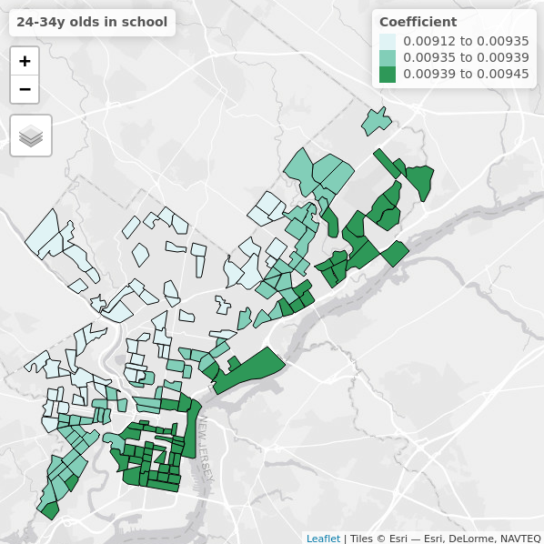
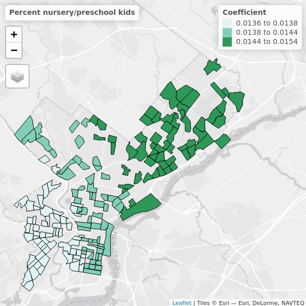
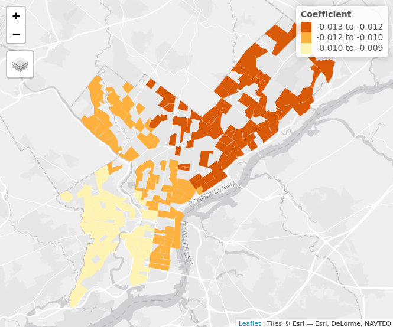

```{r setup, include=FALSE}
rm(list = ls())
knitr::opts_chunk$set(echo = TRUE, fig.height= 5, fig.width = 8, message = FALSE, warning = FALSE)
packages <- c("here","readr","tidyverse", "lubridate", "skimr","gtools","knitr",
              "data.table", "formattable", "cowplot", "dplyr", "stringr", "tidyr", "forcats",
              "caret", "kableExtra", "psych", "reshape2", "kableExtra", "janitor", "tidytext", "gridExtra")
invisible(lapply(packages, require, character.only = TRUE))
```

```{r ggplot theme, echo = FALSE}
theme_report <- function () { 
  theme_bw(base_size = 10) %+replace% 
    theme(
      axis.title.x = element_text(face="bold", margin = margin(5, 0, 5, 0)),
      axis.title.y  = element_text(face="bold", angle=90, margin = margin(0, 5, 0, 5)),
      axis.text.y  = element_text(hjust = 0.95),
      plot.title = element_text(face="bold", margin = margin(5, 0, 5, 0)),
      legend.text = element_text(margin = margin(5, 0, 5, 0)),
      legend.title = element_text(face="bold", margin = margin(5, 0, 5, 0)),
      strip.text.x = element_text(margin = margin(7, 0, 7, 0)),
      strip.text.y = element_text(angle=90, margin = margin(0, 7, 0, 7))
    )
}
```

# Executive Summary

**Adoptions**

* Adoptions made up 92% of all cats' outcomes and 93% of all dogs' outcomes at PAWS in 2018
* On average cats waited longer (52 days) than dogs (20 days) to find an adopter
* The age groups that find adopters the fastest are 12 weeks - 1 year for cats, and 6 months - 4 years for dogs
* The age groups that take longest to find an adopter are up to 12 weeks for cats, and under 4 weeks or over 10 years for dogs
* Animals that are not healthy at intake but experience a health improvement at PAWS spend significantly more time at PAWS, but represent only a small fraction (7-10%) of all animals
* Strays and transfers-in had the highest wait times for both cats and dogs, compared to owner surrenders and returns
* While by far most animals arrive at PAWS via partner transfers-in, the next highest volume of animals arrive at PAWS via Project MEOW (cats) and ACCT diversions (dogs).
* Peak intake months for cats are March-May and releases are August and November, while dog intakes and releases both peak in December and January
* Months when more animals arrived at the shelter than were released were March - June for cats, and July and October for dogs
* Across species, animals released via the Foster Program spent the longest time in PAWS' care, followed by animals at Grant Ave. 

**Applications**

* On average, cat applications took longer to process than dog applications (19 days vs 8 days)
* Application processing times for animals were longer when animals were adopted from PAWS Foster Program or PAWS Offsite Adoptions
* Application checklist items took 1.2 days to complete for cats and 0.9 days for dogs, with vet checks taking the longest to process (1.8 days
* Requesting a specific animal is associated with a slightly higher rate of adoption than applying without a specific animal in mind

Denied and Red flagged applications:

* Denied applications were few, and tended to differ from approved applications in terms of home pet policy (no pet policy stated in application) and had had unfortunate incidents with prior pets
* Application factors influencing adoptions include the number of children in the home, animal type, and the date submitted. 
* Applications from neighborhoods with a lower household median income (under $50,000/year) are more likely to be red flagged and denied, compared to those with a higher household median income (over $50,000/year).

**Applicant Characteristics**

Cat applicants: 

* Majority have a monthly pet budget of $100
* Majority expected to leave the animal alone at home for longer hours (8 hours)
* Majority lived with no other adult in the home
* Majority had no children
* Live in areas with a lower median income than dog applicants
* Live in areas where more people rely on public transit for their commute

Dog applicants: 

* Majority have a monthly pet budget of $200-500
* Majority shared their home with 1 other adult
* Majority had no children
* Live in areas with a higher median income than cat applicants
* Live in areas where fewer people rely on public transit for their commute

Recommendations

• We recommend redesiging the application to enforce standardized, limited, and logical responses. For
example, for certain questions, allow only a single response or provide a drop down menu. Doing so will
save PAWS staff time when reviewing applications and help with future analyses.

\newpage
# Problem definition and dataset

The 2019 R-Ladies for PAWS Datathon aimed to help the [Philadelphia Animal Welfare Society (PAWS)](https://phillypaws.org/) improve its adoptions processes. For this data challenge, PAWS made 2018 data available containing adoption application form submissions, staff processing of applications, and animal outcome data. We developed analytic approaches to better understand the following topics:

1. An animal's trajectory at PAWS
2. An adoption application's trajectory at PAWS
3. Geographic characteristics that influence adoptions
4. Social media activity that could influence adoptions

The data included the following datasets:
1. PetPoint data for animals who had a recorded outcome at PAWS in 2018 (this means that animals who were active at PAWS at the time of download, i.e. Jnauary 2019, were not included).


# Timeline and Workflow

Prior to kickoff, data were obtained and preprocessed. After downloading the data from multiple sources, individual entries were matched based on first name, last name, address, and other relevant variables. Once matched, any identifiable information was removed from the dataset. This occurred before the data were made available to the group for analysis. 

**February 12**: Kickoff Meetup: At this event, the project was introduced and teams were formed to work on one of the 4 topics outlined above. All participants were encouraged to join the R-Ladies Philly Slack workspace and to set up a GitHub account (which was used as the main collaborative platform). 

After the kickoff meetup, groups worked together online, getting together on an as-needed basis. Questions were asked and answered via Slack, with an occasional clarification email to PAWS.

**March 26**: Conclusion Meetup: At this meetup, teams presented their results and discussed their experiences. Individual team reports were finalized in the weeks following this meetup, and then integrated into the present report. 

\newpage
# Results
## 1. Animal Trajectories

This analysis investigated factors relating to an animal's trajectory in the PAWS system using PetPoint data from 2018. The group operationalized animal trajectory as wait time and outcome (e.g. adoption), with wait time defined as time in days from intake to outcome. We restricted analyses to dogs and cats, as other animals' data points were sparse and compromised statistical power. Our primary factors of interest included animal characteristics (size, breed, health), intake type, and seasonal patterns. 

### Contributors

**Alex Lesicko, PhD** is a postdoctoral fellow studying auditory coding at the University of Pennsylvania. She recently moved to Philadelphia from Chicago, where she completed her PhD in neuroscience.

**Jake Riley** is a clinical data analyst at the Children's Hospital of Philadelphia (CHOP). He enjoys developing tools for analytic teams and specializes on data visualization and geospatial information systems (GIS). 

**Javier Jasso** is a certified speech–language pathologist and a PhD candidate in communication sciences and disorders at the University of Texas at Austin. Javier has expertise in the assessment of culturally/linguistically diverse children, focusing on bilingual language acquisition. 

**Katerina Placek** is a PhD candidate in neuroscience at the University of Pennsylvania and a co-organizer of R-Ladies Philly. She enjoys integrating outreach with teaching and learning in the local data science community.

### Summary

* Most animals' outcomes are adoption, and the 'wait time' from intake to outcome is longer for cats than for dogs
* Younger age and poorer health contributes to longer wait time for cats; and intake and wait time for younger, health-compromised cats is highest in spring/summer
* Dogs showed no differences in wait time based on age, health, size, or season
* Increased resources in spring/summer months for young, unhealthy cats may shorten wait times and alleviate staff burden

```{r workspace, echo = FALSE}

# Our analyses focused on four facets of the PetPoint dataset:  
# 1. Data Exploration and defining 'Wait Time'   
# 2. Animal Characteristics  
# 3. Intake and Outcome Characteristics  
# 4. Seasonal/Locational Patterns

options(scipen = 999) # turn off scientific notation

df_name <- "petpoint.csv"
```

### 1. Initial Observations

First, we looked at the overall adoption percentages for cats vs. dogs, compared to other outcomes. Among the cats that were taken in at PAWS in 2018, 92% (2,390 cats) were adopted, 1.31% (34 cats) were transferred out or returned to their owner or guardian, and 6.7% (174 cats) died or were euthanized. For dogs, 93% (387 dogs) were adopted, 4.78% (20 dogs) were transferred out or returned to their owners or guardians, and 2.63% (11 dogs) died or were euthanized. In subsequent analyses, we focused only on those animals whose outcome was "Adoption", "Returned to Owner or Guardian" or "Transfer Out".

```{r raw_data_include_all, echo = FALSE}
convert_date <-  function(x) {
    mdy_hm(x) %>% as.Date()
}

raw_data_all <-
    read.csv(paste0(here::here("/Data/", df_name)), na.strings = "") %>%
    select(-c(X, animal_type, markings, dob, 
              STATEFP:INTPTLON)) %>% 
    filter(outcome_type != "Admin Missing") %>% 
    filter(species != "Wild Mammal") %>% 
    mutate_at(vars(matches("date")), funs(convert_date)) %>% 
    mutate(stay_days = as.integer(difftime(outcome_date, intake_date, units = "days"))) %>%
    group_by(species) %>%
    ungroup() %>% 
    mutate(age_intake = as.numeric(age_intake)) %>%  
    mutate(intake_asilomar = replace(intake_asilomar, intake_asilomar== "Unassigned", NA)) %>% 
    mutate(intake_sitename = replace(intake_sitename, intake_sitename== "2007 Recordkeeping"| intake_sitename== "The PACCA Legacy", NA))

outcome_by_species <- raw_data_all %>%
    group_by("Outcome Type" = outcome_type,
             "Species" = species) %>% 
    summarise("Number of Animals"=n()) %>%
    spread(Species, `Number of Animals`)

outcome_by_species$pct_Cat <- outcome_by_species$Cat/sum(outcome_by_species$Cat)
outcome_by_species$pct_Dog <- outcome_by_species$Dog/sum(outcome_by_species$Dog)

g1 <- ggplot(outcome_by_species, aes(x = `Outcome Type`, y = pct_Cat)) +
    geom_bar(stat = "identity", fill = "aquamarine3") + 
    geom_text(aes(label = paste(round(pct_Cat*100, digits=2),"%") , y = pct_Cat), size = 3, position = position_stack(vjust = 0.5)) + 
    ggtitle("Cats") + 
    xlab("Outcome Type") + 
    ylab ("Percent") +
    theme(axis.text.x = element_text(angle = 30, hjust = 1))
    
g2 <- ggplot(outcome_by_species, aes(x = `Outcome Type`, y = pct_Dog)) +
    geom_bar(stat = "identity", fill = "aquamarine3") + 
    geom_text(aes(label = paste(round(pct_Dog*100, digits=2),"%") , y = pct_Dog), size = 3, position = position_stack(vjust = 0.5)) + 
    ggtitle("Dogs") + 
    xlab("Outcome Type") + 
    ylab ("Percent") +
    theme(axis.text.x = element_text(angle = 30, hjust = 1))

grid.arrange(g1,g2, ncol = 2, top = "Percent Animals by Species and Outcome Type")

```


```{r raw_data, echo = FALSE}

# We first examined animals' outcomes for all animals in the 2018 Pet Point datset. Of the 2831 animals, 2777 were adopted, 30 were returned to their owner or guardian, and 24 were transferred out. With regard to animal species, there were 2424 cats (2390 adopted, 18 returned to owner, and 16 transferred out) and 407 dogs (387 adopted, 12 returned to owner, and 8 transferred out). 

master_animal <- read.csv(here::here("/Data/processed_data/master_animal.csv"))

raw_data <-
    read.csv(paste0(here::here("/Data/", df_name)), na.strings = "") %>%
    select(-c(X, animal_type, markings, dob, 
              STATEFP:INTPTLON)) %>% 
    filter(outcome_type != "Admin Missing") %>% 
    filter(species != "Wild Mammal") %>% 
    mutate_at(vars(matches("date")), funs(convert_date)) %>% 
    mutate(wait_days = as.integer(difftime(release_date, intake_date, units = "days"))) %>%
    group_by(species) %>%
    mutate(long_wait = wait_days > median(wait_days, na.rm = T)) %>%
    ungroup() %>% 
    filter(!is.na(wait_days)) %>% 
    mutate(age_intake = as.numeric(age_intake)) %>%  
    mutate(intake_asilomar = replace(intake_asilomar, intake_asilomar== "Unassigned", NA)) %>% 
    mutate(intake_sitename = replace(intake_sitename, intake_sitename== "2007 Recordkeeping"| intake_sitename== "The PACCA Legacy", NA))

outcome_types <- raw_data %>%
    filter(!is.na(outcome_type)) %>%
    group_by("Outcome Type" = outcome_type) %>% 
    summarise("Number of Animals"=n())

nanimals <- as.data.frame(table(raw_data$species))
# kable(nanimals, col.names = c("Species",
#                           "Number of Animals"))
```

We then looked at the median 'wait time' (time in days from intake to release date) for an animal at PAWS in 2018. Across all animals, the median wait time was 45 days (51 days for cats, and 18 days for dogs). Cats waited approx. 18.5 days to be transferred out, 4.5 days to be reunited with their owner, and 52 days to find an adopter, while dogs waited 1.5 days to be transferred out, 2 days to be reunited with their owner, and 20 days to be adopted.

```{r, include = FALSE}
raw_data %>%
    mutate(median = median(wait_days, na.rm =)) %>% 
    group_by(wait_days, median) %>% 
    summarise(n=n()) %>% 
    ggplot(aes(x = wait_days, y = n)) +
        geom_col() +
        geom_vline(aes(xintercept = median)) +
        geom_text(aes(x = median, label="\nMedian = 45 Days", y=40), colour="black", angle=90, text=element_text(size=20)) +
        xlab("Days from Intake to Outcome")+
        ylab("Number of animals")+
        theme(axis.title=element_text(size=14), strip.text = element_text(size=20), legend.position = "none")+
        ggtitle("Wait Time for all PAWS animals in 2018")
```

```{r, include = FALSE}
raw_data %>%
    filter(!is.na(outcome_type)) %>%
    group_by(species, outcome_type) %>% 
    mutate(median = median(wait_days, na.rm =)) %>% 
    group_by(Species = species, "Outcome Type" = outcome_type, "Median Wait Time (Days)" = median) %>% 
    summarise("Number of Animals"=n()) %>% 
    kable()

raw_data %>%
    filter(!is.na(outcome_type)) %>%
    group_by(species, outcome_type, wait_days) %>% 
    mutate(median = median(wait_days, na.rm =)) %>% 
    group_by(outcome_type, median, species, wait_days) %>% 
    summarise(n=n()) %>% 
    ggplot(aes(x = wait_days, y = n, col = species)) +
        geom_col() +
        facet_wrap(species~outcome_type, scales = "fixed")+
        xlab("Days from Intake to Outcome") +
        theme(legend.position = "none", axis.title=element_text(size=10), strip.text = element_text(size=10))+
        ggtitle("Outcome for PAWS animals in 2018 - By Species")
```

```{r, include = FALSE}
raw_data %>%
    group_by(species) %>% 
    mutate(median = median(wait_days, na.rm =)) %>% 
    group_by("Species" = species, "Median Wait Time (Days)" = median)%>% 
    summarise()%>% 
    kable()
    
raw_data %>%
    group_by(species) %>% 
    mutate(median = median(wait_days, na.rm =)) %>% 
    group_by(wait_days, species) %>% 
    summarise(n=n()) %>% 
    ggplot(aes(x = wait_days, y = n, fill = species)) +
        geom_col() +
        facet_wrap(~species, scales = "fixed") +
        xlab("Days from Intake to Outcome")+
        ylab("Number of animals")+
        theme(axis.title=element_text(size=14), strip.text = element_text(size=20), legend.position = "none")+
        ggtitle("Wait Time for PAWS animals in 2018 - By Species")
```


```{r custom_functions, echo = FALSE}
# confirm if numeric/date fields should be cut
check_n_cat <- function(x) {
    (is.numeric(x) | is.integer(x) | is.Date(x)) &
    n_distinct(x) > 15
}

# cut numeric and dates into 10 groups
cut_custom <- function(x){
    label <- # create cut labels ex: "[0-4)" "[5-9)"
        cut(
            x, 
            breaks = 10, 
            include.lowest = TRUE, 
            dig.lab = 5,
            right = FALSE, 
            ordered_result = TRUE) 
    
    ord <- # will create order ex: "(02)"
        paste0("(", str_pad(as.integer(label), 2, pad = "0"), ") ")
    
    # if cut returns brackets, add order ex: "(02) [5-9)"
    ifelse(str_detect(label, "\\["), paste0(ord, label), as.character(label))
}

# lump categorical data into 10 groups
collapse_cat <- function(x, n = 10) {
    n_cat <- n_distinct(x)-n
        
    fct_lump(x, n) %>% 
        str_replace("^Other$", paste0("Other (", n_cat, ")"))
}
```

```{r df_as_categories, echo = FALSE}
# vector of variables to ignore in df_as_categories
ignore_vars <- "outcome_trello_id"

# transform all columns: remove ignore_vars columns, remove rows with NAs cut numeric data into categories, lump categorical data, add id
df_as_categories <-
    raw_data %>% 
    select(-one_of(ignore_vars)) %>%
    filter(complete.cases(.)) %>%
    mutate_if(check_n_cat, funs(cut_custom)) %>%
    #mutate_all(collapse_cat) %>% 
    mutate(id = row_number())
```

```{r get_fields, echo = FALSE}
# table of class attributes
column_class <- 
  tibble(name = colnames(raw_data)) %>% 
  mutate(ord = row_number(),
         class = as.character(sapply(raw_data, class)),
         n = as.integer(sapply(raw_data, n_distinct)),
         class = ifelse(n <= 2, "logical", class))

# vector of column names
get_vars <- names(df_as_categories)

# function to create counts, first column selected by integer #, this is similar to a gather of all field & field values followed by count but resulting in fewer rows at each step
agg_fields <-
    function(i){
        df_as_categories %>% 
        select(value = i) %>% 
        mutate(field = names(df_as_categories)[i],
               value = as.character(value)) %>% 
        group_by(field, value) %>% 
        summarise(n = n()) %>% 
        ungroup() %>% 
        group_by(field, value) %>% 
        summarise(n = sum(n)) %>% 
        ungroup()
    }

# base table
get_fields <- 
    agg_fields(1)

# for loop to append rows
for(i in 2:length(get_vars)){
    get_fields <-
        bind_rows(get_fields,
                  agg_fields(i))
}
```

### 2. Animal Characteristics

Next, for each species, we visualized which PetPoint variables contributed to differences in wait time, and focused our subsequent analyses on the variables with the greatest contributions to wait times: primary breed, age group, and health at intake.

For animal characteristics contributing to wait time at PAWS, we first examined primary breed per species. The graph below shows the top 5 most frequent cat breeds and the top 10 most frequent dog breeds at PAWS in 2018. We found that most, if not all, cats from PAWS in 2018 were 'domestic short hair', while dogs' breed variability was greater, with the most frequent dogs being labeled Terrier, Shih Tzu, Pit Bull Terrier, and Chihuahua. In both graphs, the "Other" category represents a total count of animals in breeds that were not in the top 5 or 10 most frequent. 

```{r, echo = FALSE}

# `r knitr::include_graphics('1_Animals/cats.001.jpeg')`
# 
# `r knitr::include_graphics('1_Animals/dogs.001.jpeg')`

# plot n per breed
by_breed <- raw_data %>%
    group_by(species, primary_breed) %>%
    summarise(n = n()) %>%
    arrange(species, desc(n)) %>%
    group_by(species, Breed = factor(c(as.character(primary_breed[1:5]), rep("Other", n() - 5)),
                            levels = c(as.character(primary_breed[1:5]), "Other"))) %>%
    tally(n)
    
by_breed_cats <- by_breed[by_breed$species == "Cat",]
by_breed_cats$Breed <- factor(by_breed_cats$Breed,
                levels = as.character(by_breed_cats$Breed[order(by_breed_cats$n, decreasing = TRUE)]))

g1 <- ggplot(by_breed_cats, aes(x = Breed, y = n)) +
    geom_bar(stat = "identity") +
    ylab("Number of Animals") +
    xlab("Breed") +
    coord_flip() +
    theme(strip.text = element_text(size=14), axis.text.x = element_text(color = "grey20", size = 8), legend.position ="none")+
    ggtitle("Breed frequency Cats")

by_breed <- raw_data %>%
    group_by(species, primary_breed) %>%
    summarise(n = n()) %>%
    arrange(species, desc(n)) %>%
    group_by(species, Breed = factor(c(as.character(primary_breed[1:10]), rep("Other", n() - 10)),
                            levels = c(as.character(primary_breed[1:10]), "Other"))) %>%
    tally(n)

by_breed_dogs <- by_breed[by_breed$species == "Dog",]
by_breed_dogs$Breed <- factor(by_breed_dogs$Breed,
                levels = as.character(by_breed_dogs$Breed[order(by_breed_dogs$n, decreasing = TRUE)]))

g2 <- ggplot(by_breed_dogs, aes(x = Breed, y = n)) +
    geom_bar(stat = "identity") +
    ylab("Number of Animals") +
    xlab("Breed") +
    coord_flip() +
    theme(strip.text = element_text(size=14), axis.text.x = element_text(color = "grey20", size = 8), legend.position ="none")+
    ggtitle("Breed frequency Dogs")

grid.arrange(g1, g2, ncol = 1)

```


```{r, include = FALSE}
# We then classified each animal as having a 'long' or a 'short' wait time based on the median wait time per species, and examined whether wait time differed on breed for dogs and cats:

# plot n per breed
raw_data %>%
  ggplot(aes(x = primary_breed, fill = long_wait)) +
  geom_bar() +
  facet_wrap(~species, scales = "free") +
  ylab("Number of Animals") +
  xlab("Breed") +
  coord_flip() +
theme(strip.text = element_text(size=14), axis.text.x = element_text(color = "grey20", size = 8))+
        ggtitle("Breed frequency per Species by Wait Time")
```

We then looked at wait times by breed, and found that among dogs, Shih Tzus tend to have shorter wait times whereas Terriers tend to have longer wait times. However, given the large number of unique dog breeds in the PetPoint dataset, it was difficult to draw definitive conclusions. Therefore, we classified dogs into 3 size categories based on average weight per breed: 

- small = under 24 lbs (Beagle, Bichon Frise, Chihuahua, Long Coat, Chihuahua, Short Coat, Dachshund, Miniature Long Haired, Dachshund, Miniature Smooth Haired, Dachshund, Standard Smooth Haired, Griffon, Brussels, Havanese, Kooikerhondje, Lhasa Apso, Maltese, Miniature Pinscher, Mixed Breed, Small (under 24 lbs fully grown), Papillon, Pekingese, Pomeranian, Poodle, Miniature, Poodle, Toy, Pug, Schnauzer, Miniature, Shiba Inu, Shih Tzu, Spaniel, Cavalier King Charles, Terrier, Terrier, Cairn, Terrier, Jack Russell, Terrier, Russell, Terrier, Silky, Terrier, Yorkshire)) 
- medium = 24-44 lbs (American Eskimo, Mixed Breed, Medium (up to 44 lbs fully grown), Schnauzer, Standard, Spaniel, Spaniel, American Cocker, Spaniel, English Cocker, Terrier, Staffordshire Bull, Terrier, Tibetan, Welsh Corgi, Cardigan) 
- large = 44+ lbs (Australian Shepherd, Border Collie, Boxer, Bulldog, Bulldog, American, Hound, Mixed Breed, Large (over 44 lbs fully grown), Norwegian Elkhound, Poodle, Standard,Retriever, Retriever, Golden, Retriever, Labrador, Shepherd, Terrier, American Pit Bull, Terrier, Bull, Terrier, Pit Bull)

```{r, include = FALSE}
#group by category for dog breeds to analyse more easily as factor
dog_breeds <- sort(unique(raw_data$primary_breed[raw_data$species=="Dog"]))

#small = under 24 lbs; med = 24-44 lbs; large = 44+ lbs

small_breeds <- c("Beagle", "Bichon Frise", "Chihuahua, Long Coat", "Chihuahua, Short Coat", "Dachshund, Miniature Long Haired", "Dachshund, Miniature Smooth Haired", "Dachshund, Standard Smooth Haired", "Griffon, Brussels", "Havanese", "Kooikerhondje", "Lhasa Apso", "Maltese", "Miniature Pinscher", "Mixed Breed, Small (under 24 lbs fully grown)", "Papillon", "Pekingese", "Pomeranian", "Poodle, Miniature", "Poodle, Toy", "Pug", "Schnauzer, Miniature", "Shiba Inu", "Shih Tzu", "Spaniel, Cavalier King Charles", "Terrier", "Terrier, Cairn", "Terrier, Jack Russell", "Terrier, Russell", "Terrier, Silky", "Terrier, Yorkshire")

medium_breeds <- c("American Eskimo", "Mixed Breed, Medium (up to 44 lbs fully grown)", "Schnauzer, Standard", "Spaniel", "Spaniel, American Cocker", "Spaniel, English Cocker", "Terrier, Staffordshire Bull", "Terrier, Tibetan", "Welsh Corgi, Cardigan")

large_breeds <- c("Australian Shepherd", "Border Collie", "Boxer", "Bulldog", "Bulldog, American", "Hound", "Mixed Breed, Large (over 44 lbs fully grown)", "Norwegian Elkhound", "Poodle, Standard","Retriever", "Retriever, Golden", "Retriever, Labrador", "Shepherd", "Terrier, American Pit Bull", "Terrier, Bull", "Terrier, Pit Bull")

raw_data <- raw_data %>% 
    mutate(size = ifelse(primary_breed %in% small_breeds, "Small (under 24 lbs)",
                ifelse(primary_breed %in% medium_breeds, "Medium (up to 44 lbs)",
                ifelse(primary_breed %in% large_breeds, "Large (over 44 lbs)", NA))))

raw_data$size <- factor(raw_data$size, levels = c("Small (under 24 lbs)","Medium (up to 44 lbs)","Large (over 44 lbs)"))

wait_days_by_size <- raw_data %>%
    filter(species == "Dog") %>%
    group_by(size) %>%
    summarise(median_wait = median(wait_days))

# overall are there differences in wait days between breed sizes?
kruskal.test(raw_data$wait_days[raw_data$species == "Dog"] ~ raw_data$size[raw_data$species == "Dog"])

# at p = 0.19, not really; however, the difference between medium dogs' median wait time (11 days) and small and large dogs' wait times (17 and 20 days) seems too large to be completely nonsignificant.. 

pairwise.wilcox.test(raw_data$wait_days[raw_data$species == "Dog"], 
                          raw_data$size[raw_data$species == "Dog"], 
                          p.adjust.method="none")

# at p's of 0.079 and 0.081 it's worth mentioning.

raw_data %>%
  filter(species == "Dog") %>%
    group_by(size) %>%
    summarise(median_wait = median(wait_days)) %>%
    ggplot(aes(x = size, y = median_wait)) +
    geom_bar(stat = "identity", fill = "aquamarine3") +
    xlab("Size Category") +
    ylab("Number of Days") +
    coord_flip() +
    theme(axis.title=element_text(size=14), strip.text = element_text(size=10))+
    ggtitle("Wait time by Size: Dogs")

```

While overall our analyses indicated no statistically significant differences in wait time based on dog size category, it is worth mentioning that medium sized dogs' wait time (11 days) trended towards being shorter than the wait time of small breeds (17 days) or large breeds (20 days).

```{r, include = FALSE}
# plot n per age group
raw_data %>%
  ggplot(aes(x = age_intake, fill = long_wait)) +
  geom_bar() +
  facet_wrap(~species, scales = "free") +
  coord_flip()+
  xlab("Age at Intake (Months)") +
  ylab("Number of Animals") +
theme(strip.text = element_text(size=14))+
        ggtitle("Age at Intake by Wait Time per Species")
```

We then examined age group per species, to determine whether wait time different on age group for dogs and cats. For cats and dogs alike, the longest wait times were in the 0-4 weeks age group. Understandably, these kittens and puppies require more time at PAWS before they can be adopted out. Interestingly, the longer wait time holds for cats up to 12 weeks, after which it decreases from roughly 65 days to 35 days. Cats aged between 12 weeks and 1 year spend the least amount of time at PAWS (approx. 26 and 17.5 days respectively). Dogs aged 6 months to 4 years spent the least amount of time at PAWS, while the time at PAWS increased more sharply for dogs 10 or more years of age. 

```{r wait time by animal age, echo = FALSE}

wait_by_age <- raw_data %>%
    mutate(median = median(wait_days, na.rm =)) %>% 
    group_by(species, age_group) %>% 
    summarise(median=median(wait_days)) 

wait_by_age$age_group <- factor(wait_by_age$age_group,
                levels = c("Less than 4 weeks",
                           "4 to 6 weeks",
                           "6 to 12 weeks",
                           "12 weeks to 6 months",
                           "6 months to 1 year",
                           "1 to 2 years",
                           "2 to 4 years",
                           "4 to 6 years",
                           "6 to 10 years",
                           "10 or more years"))
wait_by_age <- wait_by_age %>%
    spread(species, median)

g1 <- ggplot(wait_by_age, aes(x = `age_group`, y = Cat)) +
    geom_bar(stat = "identity", fill = "aquamarine3") + 
    geom_text(aes(label = Cat , y = Cat), size = 3, position = position_stack(vjust = 0.5)) + 
    ggtitle("Cats") + 
    xlab("Age Group") + 
    ylab ("Median Wait Time") +
    theme(axis.text.x = element_text(angle = 45, hjust = 1))
    
g2 <- ggplot(wait_by_age, aes(x = `age_group`, y = Dog)) +
    geom_bar(stat = "identity", fill = "aquamarine3") + 
    geom_text(aes(label = Dog , y = Dog), size = 3, position = position_stack(vjust = 0.5)) + 
    ggtitle("Dogs") + 
    xlab("Age Group") + 
    ylab ("Median Wait Time") +
    theme(axis.text.x = element_text(angle = 45, hjust = 1))

grid.arrange(g1,g2, ncol = 2, 
             top = "Median Wait Time, by Species and Age Group")

```

Last, we examined health status at intake per species relative to wait times. For dogs, we observed that the longest wait times were associated with dogs that came in as "treatable-manageable". However, these dogs represent only a small fraction of the dogs coming in at PAWS, so this effect is unlikely to impact overall wait times for dogs.

```{r, echo = FALSE}
condition_intake <- raw_data %>%
    filter(!is.na(intake_asilomar))%>%
    group_by(intake_asilomar, species) %>% 
    mutate(median = median(wait_days, na.rm =)) %>% 
    group_by(Species = species, "Intake Asilomar" = intake_asilomar, "Median Wait Time (Days)" = median) %>% 
    summarise("Number of Animals"=n())

g1 <- ggplot(data=condition_intake[condition_intake$Species == "Dog",], aes(x = `Intake Asilomar`, y = `Median Wait Time (Days)`)) +
    geom_bar(stat = "identity", fill = "aquamarine3") +
    xlab("ASILOMAR condition at intake") +
    ylab("Median Wait Time (Days)") +
    theme(axis.title=element_text(size=14), strip.text = element_text(size=10))+
    ggtitle("Wait time") +
    theme(axis.text.x = element_text(angle = 45, hjust = 1))

g2 <- ggplot(data=condition_intake[condition_intake$Species == "Dog",], aes(x = `Intake Asilomar`, y = `Number of Animals`)) +
    geom_bar(stat = "identity", fill = "aquamarine3") +
    xlab("ASILOMAR condition at intake") +
    ylab("Number of Animals") +
    theme(axis.title=element_text(size=14), strip.text = element_text(size=10))+
    ggtitle("Number of animals") +
    theme(axis.text.x = element_text(angle = 45, hjust = 1))

grid.arrange(g1,g2,top = "Dogs by Intake Condition", ncol = 2)

```

For cats, our analyses revealed that health condition at intake was associated with a longer median wait time. Specifically, cats classified as 'Treatable-Rehabilitatable' and 'Unhealthy/Untreatable' had longer wait times than cats classified as 'Healthy' or 'Treatable-Manageable'. While cats whose intake status was "Unhealthy/Untreatable" were very few, PAWS took in a very high number of cats labeled as "Treatable-Rehabilitate", and these were also the ones with the longest wait time. Because of this, efforts to reduce the wait time for these cats would likely impact overall wait times for cats. 

```{r, echo = FALSE}

g1 <- ggplot(data=condition_intake[condition_intake$Species == "Cat",], aes(x = `Intake Asilomar`, y = `Median Wait Time (Days)`)) +
    geom_bar(stat = "identity", fill = "aquamarine3") +
    xlab("ASILOMAR condition at intake") +
    ylab("Median Wait Time (Days)") +
    theme(axis.title=element_text(size=14), strip.text = element_text(size=10))+
    ggtitle("Wait time") +
    theme(axis.text.x = element_text(angle = 45, hjust = 1))

g2 <- ggplot(data=condition_intake[condition_intake$Species == "Cat",], aes(x = `Intake Asilomar`, y = `Number of Animals`)) +
    geom_bar(stat = "identity", fill = "aquamarine3") +
    xlab("ASILOMAR condition at intake") +
    ylab("Number of Animals") +
    theme(axis.title=element_text(size=14), strip.text = element_text(size=10))+
    ggtitle("Number of animals") +
    theme(axis.text.x = element_text(angle = 45, hjust = 1))

grid.arrange(g1,g2,top = "Cats by Intake Condition", ncol = 2)

```

We also looked at health change from intake to outcome. Specifically, we created the following health change categories: 

- no change = an animal's intake and outcome ASILOMAR status were the same
- decline = an animal's outcome ASILOMAR status changed from Healthy to Treatable or Unhealthy; or from Treatable to Unhealthy
- improvement = an animal's outcome ASILOMAR status changed from Treatable or Unhealthy to Healthy; or from Unhealthy to Treatable. 

For cats, we observed that the wait time is longest for those cats that experience an improvement in overall condition while at PAWS (78 days), although these cats represent only 10% of the total cats at PAWS. Cats that experienced no change in condition while at PAWS (89%) had a median wait time of 47 days. 

```{r echo = FALSE}
raw_data$health_change <- NA
raw_data$health_change[as.character(raw_data$intake_asilomar) == as.character(raw_data$outcome_asilomar)] <- "no_change"
raw_data$health_change[as.character(raw_data$intake_asilomar) %in% c("Healthy",
                                                                     "Treatable-Manageable",
                                                                     "Treatable-Rehabilitatable") & 
                           as.character(raw_data$outcome_asilomar) %in% c("Unhealthy/Untreatable")] <- "decline"
raw_data$health_change[as.character(raw_data$intake_asilomar) %in% c("Healthy") & 
                           as.character(raw_data$outcome_asilomar) %in% c("Treatable-Manageable",
                                                                     "Treatable-Rehabilitatable")] <- "decline"
raw_data$health_change[as.character(raw_data$intake_asilomar) %in% c("Unhealthy/Untreatable") & 
                           as.character(raw_data$outcome_asilomar) %in% c("Healthy",
                                                                     "Treatable-Manageable",
                                                                     "Treatable-Rehabilitatable")] <- "improvement"
raw_data$health_change[as.character(raw_data$intake_asilomar) %in% c("Treatable-Manageable", "Treatable-Rehabilitatable") & 
                           as.character(raw_data$outcome_asilomar) %in% c("Healthy")] <- "improvement"

raw_data$health_change <- as.factor(raw_data$health_change)

# plot n per intake health condition
  # raw_data %>%
  #   filter(!is.na(intake_asilomar))%>%
  #   group_by(intake_asilomar, species) %>% 
  #   group_by(species, wait_days, intake_asilomar) %>% 
  #   summarise(n=n()) %>% 
  #   ggplot(aes(x = wait_days, y = n, col = intake_asilomar)) +
  #       geom_col() +
  #       xlab("Days from Intake to Outcome") +
  #       ylab("Number of Animals") +
  #       facet_wrap(species~intake_asilomar, scales = "fixed", ncol = 4)+
  #       theme(strip.text = element_text(size=10), legend.position = "none") +
  #       ggtitle("Intake Health Condition")

health_change_data <- raw_data %>%
    filter(!is.na(health_change))%>%
    group_by(health_change, species) %>% 
    mutate(median = median(wait_days, na.rm =)) %>% 
    group_by(Species = species, "Health Change" = health_change, "Median Wait Time (Days)" = median) %>% 
    summarise("Number of Animals"=n())

g1 <- ggplot(data=health_change_data[health_change_data$Species == "Cat",], 
             aes(x = `Health Change`, y = `Median Wait Time (Days)`)) +
    geom_bar(stat = "identity", fill = "aquamarine3") +
    xlab("ASILOMAR condition change") +
    ylab("Median Wait Time (Days)") +
    theme(axis.title=element_text(size=14), strip.text = element_text(size=10))+
    ggtitle("Wait time") +
    theme(axis.text.x = element_text(angle = 45, hjust = 1))

g2 <- ggplot(data=health_change_data[health_change_data$Species == "Cat",], aes(x = `Health Change`, y = `Number of Animals`)) +
    geom_bar(stat = "identity", fill = "aquamarine3") +
    xlab("ASILOMAR condition change") +
    ylab("Number of Animals") +
    theme(axis.title=element_text(size=14), strip.text = element_text(size=10))+
    ggtitle("Number of animals") +
    theme(axis.text.x = element_text(angle = 45, hjust = 1))

grid.arrange(g1,g2,top = "Cats by Health Condition Change", ncol = 2)

```

For dogs, we observed that the wait time is also longest for those dogs that experience an improvement in overall condition while at PAWS (26 days), although these dogs also represent only a small percentage (7%) of the total dogs at PAWS. Dogs that experienced no change in condition while at PAWS (93%) had a median wait time of 20 days. 

```{r, echo = FALSE}
g1 <- ggplot(data=health_change_data[health_change_data$Species == "Dog",], 
             aes(x = `Health Change`, y = `Median Wait Time (Days)`)) +
    geom_bar(stat = "identity", fill = "aquamarine3") +
    xlab("ASILOMAR condition change") +
    ylab("Median Wait Time (Days)") +
    theme(axis.title=element_text(size=14), strip.text = element_text(size=10))+
    ggtitle("Wait time") +
    theme(axis.text.x = element_text(angle = 45, hjust = 1))

g2 <- ggplot(data=health_change_data[health_change_data$Species == "Dog",], aes(x = `Health Change`, y = `Number of Animals`)) +
    geom_bar(stat = "identity", fill = "aquamarine3") +
    xlab("ASILOMAR condition change") +
    ylab("Number of Animals") +
    theme(axis.title=element_text(size=14), strip.text = element_text(size=10))+
    ggtitle("Number of animals") +
    theme(axis.text.x = element_text(angle = 45, hjust = 1))

grid.arrange(g1,g2,top = "Dogs by Health Condition Change", ncol = 2)

```

```{r, include = FALSE}
raw_data %>%
    filter(!is.na(outcome_asilomar))%>%
    group_by(outcome_asilomar, species) %>% 
    mutate(median = median(wait_days, na.rm =)) %>% 
    group_by(Species = species, "Outcome Asilomar" = outcome_asilomar, "Median Wait Time (Days)" = median) %>% 
    summarise("Number of Animals"=n()) %>% 
    kable()
```

```{r, include = FALSE}
# plot n per outcome health condition
raw_data %>%
    filter(!is.na(outcome_asilomar))%>%
    group_by(species, wait_days, outcome_asilomar) %>% 
    summarise(n=n()) %>% 
    ggplot(aes(x = wait_days, y = n, col = outcome_asilomar)) +
        geom_col() +
        xlab("Days from Intake to Outcome") +
        ylab("Number of Animals") +
        facet_wrap(species~outcome_asilomar, scales = "fixed") +
        theme(strip.text = element_text(size=10), legend.position = "none")+
        ggtitle("Outcome Health Condition")
```

### 3. Intake  Characteristics

```{r, echo = FALSE}

# Next, we examined intake characteristics across the petpoint dataset. 

master_animal_intake <- master_animal %>% 
    dplyr::select(intake_type,
           intake_subtype,
           wait_days, 
           animal_type) %>% 
    filter(!is.na(intake_type)) %>% 
    mutate(intake_type = factor(intake_type), 
           animal_type = factor(animal_type), 
           wait = as.numeric(wait_days))
```

```{r, include = FALSE}
# We first examined the frequency of primary intake type for all animals and calculated the median wait days for all animals based on intake type. 

ggplot(master_animal_intake, aes(intake_type))+
    geom_bar(color="turquoise", fill="turquoise")+
    xlab('Intake Type') +
    ylab('Number of Animals')+
    coord_flip() +
    ggtitle("Frequency of Intake Type")

```

```{r, include = FALSE}
master_animal_intake %>%
    group_by("Intake Type" = intake_type) %>% 
    summarise("Number of Animals" = n(), "Median Wait Time (Days)" = median(wait_days)) %>% 
    kable()
```

```{r, include = FALSE}
# Using analysis of variance, we examined whether wait days differed based on animal intake type:

intake_aov <- aov(wait_days ~ intake_type, master_animal_intake) 
#summary(intake_aov)

ggplot(master_animal_intake, aes(x = intake_type, y = wait_days, col = intake_type)) +
    geom_boxplot() +
    xlab('Intake Type') +
    ylab('Days from Intake to Outcome')+
    theme(legend.position = "none") +
    ggtitle("Wait Time by Intake Type")

# Our results indicated that animals at PAWS with an intake of "Stray" or "Transfer In" had significantly longer wait times relative to animals who with an intake type of "Owner/Guardian Surrender" or "Return."

```

We examined intake characteristics across the petpoint dataset, by species:

```{r summary_animal.type, echo = FALSE}
master_animal_intake_cat <- master_animal_intake %>%
    group_by("Intake Type" = intake_type) %>% 
    filter(animal_type=='cat') %>% 
    summarise("Number of Cats" = n(), "Median Wait Time (Days)" = median(wait_days))

master_animal_intake_dog <- master_animal_intake %>%
    group_by("Intake Type" = intake_type) %>% 
    filter(animal_type == 'dog') %>% 
    summarise("Number of Dogs" = n(), "Median Wait Time (Days)"  = median(wait_days))

g1 <- ggplot(data=master_animal_intake_cat, 
             aes(x = `Intake Type`, y = `Median Wait Time (Days)`)) +
    geom_bar(stat = "identity", fill = "aquamarine3") +
    xlab("Intake Type") +
    ylab("Median Wait Time (Days)") +
    theme(axis.title=element_text(size=14), strip.text = element_text(size=10))+
    ggtitle("Cats") +
    theme(axis.text.x = element_text(angle = 45, hjust = 1))

g2 <- ggplot(data=master_animal_intake_dog, 
             aes(x = `Intake Type`, y = `Median Wait Time (Days)`)) +
    geom_bar(stat = "identity", fill = "aquamarine3") +
    xlab("Intake Type") +
    ylab("Median Wait Time (Days)") +
    theme(axis.title=element_text(size=14), strip.text = element_text(size=10))+
    ggtitle("Dogs") +
    theme(axis.text.x = element_text(angle = 45, hjust = 1))

grid.arrange(g1,g2,top = "Wait time by intake type", ncol = 2)
              
```

We found that cats had longer wait times for each intake type relative to dogs. Furthermore, for both cats and dogs, strays and transfers in had the highest wait times. Interestingly, for cats (but not dogs) that were surrenedered by their owner, these also had a high wait time (40 days). 

And we examined whether the effect of intake type on wait time differed by animal species:

```{r interaction, include = FALSE}
intake_type_int <- lm(wait_days ~ intake_type*animal_type, master_animal_intake)
#summary(intake_type_int)

intake_by_species <-  master_animal_intake %>% 
    filter(!is.na(animal_type)) %>%
    ggplot(., aes(x = intake_type, y = wait_days, col = animal_type))+
    geom_boxplot() +
    xlab('Intake Type') +
    ylab('Days from Intake to Outcome')+
    ggtitle("Wait Time by Intake Type per Species") +
    theme(legend.title = element_blank())

# We found that as previously, cats had longer wait times for each intake type relative to dogs.

```

We next examined the intake subtype for all animals:

```{r, echo = FALSE}

master_animal_intake_subtype <-  master_animal_intake %>%
    filter(!is.na(animal_type)) %>%
    group_by("Intake Subtype" = intake_subtype, animal_type) %>% 
    summarise("Number of Animals" = n(), "Median Wait Time (Days)" = median(wait_days)) 

#plotting frequency of intake_subtype var:
g1 <- ggplot(master_animal_intake_subtype[master_animal_intake_subtype$animal_type == "cat",], aes(x = `Intake Subtype`, y = `Number of Animals`)) +
    geom_bar(color="gold", fill="gold", stat = "identity") +
    xlab('Intake Subtype') +
    ylab('Number of Animals')+
    coord_flip()+
    ggtitle("Cats")

g2 <- ggplot(master_animal_intake_subtype[master_animal_intake_subtype$animal_type == "cat",], aes(x = `Intake Subtype`, y = `Median Wait Time (Days)`)) +
    geom_bar(color="gold", fill="gold", stat = "identity") +
    xlab('Intake Subtype') +
    ylab('Median Wait Time (days)')+
    coord_flip()+
    ggtitle("Cats")

g3 <- ggplot(master_animal_intake_subtype[master_animal_intake_subtype$animal_type == "dog",], aes(x = `Intake Subtype`, y = `Number of Animals`)) +
    geom_bar(color="gold", fill="gold", stat = "identity") +
    xlab('Intake Subtype') +
    ylab('Number of Animals')+
    coord_flip()+
    ggtitle("Dogs")

g4 <- ggplot(master_animal_intake_subtype[master_animal_intake_subtype$animal_type == "dog",], aes(x = `Intake Subtype`, y = `Median Wait Time (Days)`)) +
    geom_bar(color="gold", fill="gold", stat = "identity") +
    xlab('Intake Subtype') +
    ylab('Median Wait Time (days)')+
    coord_flip()+
    ggtitle("Dogs")

grid.arrange(g1, g2, g3, g4, ncol = 2)
```

We found that for both cats and dogs, partner transfers in accounted for the vast majority of the intakes. However, differences were observed for the next highest intake subtypes: outside of partner transfers in, the majority of cats arrived at PAWS via Project Meow (395 cats, or 19.7%), Public Drop_off (342 cats, or 17%)), and Returned Adoption (134 cats, or 7%). Meanwhile, for dogs that did not arrive at PAWS via Partner Transfer In, the majority were ACCT Diversion (43 dogs or 13%), Returned Adoptions (42 dogs or 13%), and In-Person Surrender to Shelter (24 dogs or 7%). 

It is also worth noting that for both dogs and cats, returned adoptions experienced the speediest re-adoption (15 days median wait for cats, and 10 days median wait for dogs). The next intake subtypes that were associated with shortest wait times for cats were In-Person Surrender to Shelter (36 days), while for dogs these were ACCT Diversion (12 days) and In Person Surrender to Shelter (14.5 days). 

We found one record of a dog whose intake subtype was "Project Meow", which may have been an input error - but we included it in the graph nonetheless. 

```{r, include = FALSE}
subtype_filter <- master_animal_intake %>% 
    filter(intake_subtype == 'Returned Adoption' |
               intake_subtype == 'Public Drop Off')
```

```{r, include = FALSE}
intake_subtype_lm <- lm(wait_days ~ intake_subtype, subtype_filter)
#summary(intake_subtype_lm)

ggplot(subtype_filter, aes(x = intake_subtype, y = wait_days, col = intake_subtype)) +
    geom_boxplot() +
    xlab('Intake Subtype') +
    ylab('Days from Intake to Outcome')+
    ggtitle("Wait Time by Intake Type") +
    theme(legend.position = "none")

# We found that animals with an intake subtype of 'Public Drop Off' had a significantly longer wait time than animals with an intake subtype of 'Returned Adoption.'

```

### 4. Seasonal and Locational Patterns

Last, we examined animals' wait time at PAWS by season and species. We examined the frequency of intakes and releases per month: 

```{r, include = FALSE}
#Extract intake month
master_animal$intake_month <- format(as.Date(master_animal$intake_date), "%B")
#Plot monthly trends in intake
master_animal$intake_month_fac = factor(master_animal$intake_month, levels = month.name)
intake_month_counts <- table(master_animal$intake_month_fac[master_animal$species == "Cat"])
df_intake_month_counts <- data.frame(intake_month_counts)
names(df_intake_month_counts)[1]<-"Month"
df_intake_month_counts$Season <- c(rep("Winter",2), rep("Spring",3), rep("Summer",3), rep("Fall",3), "Winter")

g1 <- ggplot(df_intake_month_counts, aes(x=Month, y=Freq, fill = Season)) + 
    geom_bar(stat = "identity") + 
    scale_fill_manual(values = c("Winter" = "slateblue4", "Spring" = "cyan4", "Summer" = "yellow2", "Fall" = "sienna2")) + 
    ggtitle("Cats") +
    theme(plot.title = element_text(hjust = 0.5), axis.text.x = element_text(color = "grey20", size = 8, angle = 90))+ 
    ylab("Number of Intakes")


intake_month_counts <- table(master_animal$intake_month_fac[master_animal$species == "Dog"])
df_intake_month_counts <- data.frame(intake_month_counts)
names(df_intake_month_counts)[1]<-"Month"
df_intake_month_counts$Season <- c(rep("Winter",2), rep("Spring",3), rep("Summer",3), rep("Fall",3), "Winter")

g3 <- ggplot(df_intake_month_counts, aes(x=Month, y=Freq, fill = Season)) + 
    geom_bar(stat = "identity") + 
    scale_fill_manual(values = c("Winter" = "slateblue4", "Spring" = "cyan4", "Summer" = "yellow2", "Fall" = "sienna2")) + 
    ggtitle("Dogs") +
    theme(plot.title = element_text(hjust = 0.5), axis.text.x = element_text(color = "grey20", size = 8, angle = 90))+ 
    ylab("Number of Intakes")


```

```{r, echo = FALSE}
#Extract release month
master_animal$release_month <- format(as.Date(master_animal$release_date), "%B")

#Plot monthly trends in release
master_animal$release_month_fac = factor(master_animal$release_month, levels = month.name)
release_month_counts <- table(master_animal$release_month_fac[master_animal$species == "Cat"])
df_release_month_counts <- data.frame(release_month_counts)
names(df_release_month_counts)[1]<-"Month"
df_release_month_counts$Season <- c(rep("Winter",2), rep("Spring",3), rep("Summer",3), rep("Fall",3), "Winter")

g2 <- ggplot(df_release_month_counts, aes(x=Month, y=Freq, fill = Season)) + 
    geom_bar(stat = "identity") + 
    scale_fill_manual(values = c("Winter" = "slateblue4", "Spring" = "cyan4", "Summer" = "yellow2", "Fall" = "sienna2")) + 
    ggtitle("Cats") + theme(plot.title = element_text(hjust = 0.5), axis.text.x = element_text(color = "grey20", size = 8, angle = 90))+
    ylab("Number of Releases")

release_month_counts <- table(master_animal$release_month_fac[master_animal$species == "Dog"])
df_release_month_counts <- data.frame(release_month_counts)
names(df_release_month_counts)[1]<-"Month"
df_release_month_counts$Season <- c(rep("Winter",2), rep("Spring",3), rep("Summer",3), rep("Fall",3), "Winter")

g4 <- ggplot(df_release_month_counts, aes(x=Month, y=Freq, fill = Season)) + 
    geom_bar(stat = "identity") + 
    scale_fill_manual(values = c("Winter" = "slateblue4", "Spring" = "cyan4", "Summer" = "yellow2", "Fall" = "sienna2")) + 
    ggtitle("Dogs") + theme(plot.title = element_text(hjust = 0.5), axis.text.x = element_text(color = "grey20", size = 8, angle = 90))+
    ylab("Number of Releases")

grid.arrange(g1, g3, ncol = 2, top = "Intakes")

```

It appears that intakes are highest for cats in spring (peaking in May) and summer, and lowest in February and November. Meanwhile for dogs, the highest intakes are in winter (December and January), and the lowest in July and November. 

```{r, echo = FALSE}
grid.arrange(g2, g4, ncol = 2, top = "Releases")

```

On the other hand, for cats, releases from PAWS are highest in August, November and December, while for dogs the highest numbers of releases occur in December, January, August and June. 

```{r, include = FALSE}

# We also calculated the difference between intakes and releases per month:
#Plot intake-outtake index
df_intake_outtake_index <- cbind(df_intake_month_counts[1],df_intake_month_counts[3])

df_intake_outtake_index$Index <-(df_intake_month_counts$Freq-df_release_month_counts$Freq)/(df_intake_month_counts$Freq+df_release_month_counts$Freq)

ggplot(df_intake_outtake_index, aes(x=Month, y=Index, fill = Season)) + 
    geom_bar(stat = "identity") + 
    scale_fill_manual(values = c("Winter" = "slateblue4", "Spring" = "cyan4", "Summer" = "yellow2", "Fall" = "sienna2")) + 
    ggtitle("Intake-Release Index - All Facilities") + theme(plot.title = element_text(hjust = 0.5), axis.text.x = element_text(color = "grey20", size = 8, angle = 90))+ 
    ylab("Index value")

# We found that the summer and spring months have higher intakes relative to releases.

```

We then looked at monthly trends in intakes and releases by species. Specifically, the graphs below show the difference between total number of intakes and releases by month, divided by the total number of intakes and releases per month. The resulting bars can be interpreted as follows: 
- if >0, the number of intakes is greater than the number of releases
- if <0, the number of releases is greater than the number of intakes
- the closer to 0 a bar, the more evenly distributed intakes and releases were in that month

```{r, echo = FALSE}
#Subset Data by Species
cat <- master_animal[ which(master_animal$species=='Cat'), ]
dog <- master_animal[ which(master_animal$species=='Dog'), ]

#calculate monthly trends in intake by species
cat_intake_month_counts <- table(cat$intake_month_fac)
dog_intake_month_counts <- table(dog$intake_month_fac)
df_intake_month_counts_species <- data.frame(cat_intake_month_counts, dog_intake_month_counts)
df_intake_month_counts_species <- df_intake_month_counts_species[-3]
names(df_intake_month_counts_species)[1] <- "Month"
names(df_intake_month_counts_species)[2] <- "Cats"
names(df_intake_month_counts_species)[3] <- "Dogs"

df_intake_month_counts_species <- melt(df_intake_month_counts_species, id.vars='Month')
df_intake_month_counts_species$Season <- c(rep("Winter",2), rep("Spring",3), rep("Summer",3), rep("Fall",3), "Winter")

#calculate monthly trends in release by species
cat_release_month_counts <- table(cat$release_month_fac)
dog_release_month_counts <- table(dog$release_month_fac)
df_release_month_counts_species <- data.frame(cat_release_month_counts, dog_release_month_counts)
df_release_month_counts_species <- df_release_month_counts_species[-3]
names(df_release_month_counts_species)[1] <- "Month"
names(df_release_month_counts_species)[2] <- "Cats"
names(df_release_month_counts_species)[3] <- "Dogs"

df_release_month_counts_species <- melt(df_release_month_counts_species, id.vars='Month')
df_release_month_counts_species$Season <- c(rep("Winter",2), rep("Spring",3), rep("Summer",3), rep("Fall",3), "Winter")

#calculate monthly trends in intake-outtake index by species
df_intake_outtake_index_species <- cbind(df_intake_month_counts_species[1],df_intake_month_counts_species[2],df_intake_month_counts_species[4])

df_intake_outtake_index_species$Index <-(df_intake_month_counts_species$value-df_release_month_counts_species$value)/(df_intake_month_counts_species$value+df_release_month_counts_species$value)

ggplot(df_intake_outtake_index_species, aes(x=Month, y=Index, fill = Season)) + geom_bar(stat='identity', position='dodge') + scale_fill_manual(values = c("Winter" = "slateblue4", "Spring" = "cyan4", "Summer" = "yellow2", "Fall" = "sienna2")) + facet_wrap(~ variable) + ggtitle("Intake-Release Index - All Facilities") + theme(plot.title = element_text(hjust = 0.5)) + theme(axis.text.x = element_text(angle=90, hjust=1))
```

We found that cats have higher intakes than releases in March - June, while more releases than intakes were observed in October-December. For dogs, June and September represent spikes in intakes compared to releases. These findings may be useful for volunteer resourcing considerations during these times. 

We also examined seasonal patterns in intake-release index by location for each species. It is important to note here that these patterns only take into account the location of intake and the location at time of release, and do not track an animal's transfers within PAWS locations. Therefore, the location-specific results should be interpreted with caution. 

```{r, echo = FALSE}
#Subset Data by Intake Location
GFA <- master_animal[ which(master_animal$intake_sitename=='Grays Ferry Avenue'), ]
PAC <- master_animal[ which(master_animal$intake_sitename=='PAC'), ]
GA <- master_animal[ which(master_animal$intake_sitename=='Grant Avenue'), ]
PAWS_FP <- master_animal[ which(master_animal$intake_sitename=='PAWS Foster Program'), ]
PAWS_OA <- master_animal[ which(master_animal$intake_sitename=='PAWS Offsite Adoptions'), ]
```

```{r, echo = FALSE}
#Subset Intake Location Data by Species
GFA_cat <- GFA[ which(GFA$species=='Cat'), ]
GFA_dog <- GFA[ which(GFA$species=='Dog'), ]

PAC_cat <- PAC[ which(PAC$species=='Cat'), ]
PAC_dog <- PAC[ which(PAC$species=='Dog'), ]

GA_cat <- GA[ which(GA$species=='Cat'), ]
GA_dog <- GA[ which(GA$species=='Dog'), ]

PAWS_FP_cat <- PAWS_FP[ which(PAWS_FP$species=='Cat'), ]
PAWS_FP_dog <- PAWS_FP[ which(PAWS_FP$species=='Dog'), ]

PAWS_OA_cat <- PAWS_OA[ which(PAWS_OA$species=='Cat'), ]
PAWS_OA_dog <- PAWS_OA[ which(PAWS_OA$species=='Dog'), ]
```

```{r, echo = FALSE}
#Plot Monthly Trends in Intake-Release Index by Species for Each Location

#Grays Ferry Avenue
GFA_cat_intake_month_counts <- table(GFA_cat$intake_month_fac)
GFA_dog_intake_month_counts <- table(GFA_dog$intake_month_fac)
df_GFA_intake_month_counts_species <- data.frame(GFA_cat_intake_month_counts, GFA_dog_intake_month_counts)
df_GFA_intake_month_counts_species <- df_GFA_intake_month_counts_species[-3]
names(df_GFA_intake_month_counts_species)[1] <- "Month"
names(df_GFA_intake_month_counts_species)[2] <- "Cats"
names(df_GFA_intake_month_counts_species)[3] <- "Dogs"

df_GFA_intake_month_counts_species <- melt(df_GFA_intake_month_counts_species, id.vars='Month')
df_GFA_intake_month_counts_species$Season <- c(rep("Winter",2), rep("Spring",3), rep("Summer",3), rep("Fall",3), "Winter") 

#PAC
PAC_cat_intake_month_counts <- table(PAC_cat$intake_month_fac)
PAC_dog_intake_month_counts <- table(PAC_dog$intake_month_fac)
df_PAC_intake_month_counts_species <- data.frame(PAC_cat_intake_month_counts, PAC_dog_intake_month_counts)
df_PAC_intake_month_counts_species <- df_PAC_intake_month_counts_species[-3]
names(df_PAC_intake_month_counts_species)[1] <- "Month"
names(df_PAC_intake_month_counts_species)[2] <- "Cats"
names(df_PAC_intake_month_counts_species)[3] <- "Dogs"

df_PAC_intake_month_counts_species <- melt(df_PAC_intake_month_counts_species, id.vars='Month')
df_PAC_intake_month_counts_species$Season <- c(rep("Winter",2), rep("Spring",3), rep("Summer",3), rep("Fall",3), "Winter") 

#Grant Avenue
GA_cat_intake_month_counts <- table(GA_cat$intake_month_fac)
GA_dog_intake_month_counts <- table(GA_dog$intake_month_fac)
df_GA_intake_month_counts_species <- data.frame(GA_cat_intake_month_counts, GA_dog_intake_month_counts)
df_GA_intake_month_counts_species <- df_GA_intake_month_counts_species[-3]
names(df_GA_intake_month_counts_species)[1] <- "Month"
names(df_GA_intake_month_counts_species)[2] <- "Cats"
names(df_GA_intake_month_counts_species)[3] <- "Dogs"

df_GA_intake_month_counts_species <- melt(df_GA_intake_month_counts_species, id.vars='Month')
df_GA_intake_month_counts_species$Season <- c(rep("Winter",2), rep("Spring",3), rep("Summer",3), rep("Fall",3), "Winter") 

#PAWS Foster Program
PAWS_FP_cat_intake_month_counts <- table(PAWS_FP_cat$intake_month_fac)
PAWS_FP_dog_intake_month_counts <- table(PAWS_FP_dog$intake_month_fac)
df_PAWS_FP_intake_month_counts_species <- data.frame(PAWS_FP_cat_intake_month_counts, PAWS_FP_dog_intake_month_counts)
df_PAWS_FP_intake_month_counts_species <- df_PAWS_FP_intake_month_counts_species[-3]
names(df_PAWS_FP_intake_month_counts_species)[1] <- "Month"
names(df_PAWS_FP_intake_month_counts_species)[2] <- "Cats"
names(df_PAWS_FP_intake_month_counts_species)[3] <- "Dogs"

df_PAWS_FP_intake_month_counts_species <- melt(df_PAWS_FP_intake_month_counts_species, id.vars='Month')
df_PAWS_FP_intake_month_counts_species$Season <- c(rep("Winter",2), rep("Spring",3), rep("Summer",3), rep("Fall",3), "Winter") 


#PAWS Offsite Adoptions
PAWS_OA_cat_intake_month_counts <- table(PAWS_OA_cat$intake_month_fac)
PAWS_OA_dog_intake_month_counts <- table(PAWS_OA_dog$intake_month_fac)
df_PAWS_OA_intake_month_counts_species <- data.frame(PAWS_OA_cat_intake_month_counts, PAWS_OA_dog_intake_month_counts)
df_PAWS_OA_intake_month_counts_species <- df_PAWS_OA_intake_month_counts_species[-3]
names(df_PAWS_OA_intake_month_counts_species)[1] <- "Month"
names(df_PAWS_OA_intake_month_counts_species)[2] <- "Cats"
names(df_PAWS_OA_intake_month_counts_species)[3] <- "Dogs"

df_PAWS_OA_intake_month_counts_species <- melt(df_PAWS_OA_intake_month_counts_species, id.vars='Month')
df_PAWS_OA_intake_month_counts_species$Season <- c(rep("Winter",2), rep("Spring",3), rep("Summer",3), rep("Fall",3), "Winter") 

#Grays Ferry Avenue
GFA_cat_release_month_counts <- table(GFA_cat$release_month_fac)
GFA_dog_release_month_counts <- table(GFA_dog$release_month_fac)
df_GFA_release_month_counts_species <- data.frame(GFA_cat_release_month_counts, GFA_dog_release_month_counts)
df_GFA_release_month_counts_species <- df_GFA_release_month_counts_species[-3]
names(df_GFA_release_month_counts_species)[1] <- "Month"
names(df_GFA_release_month_counts_species)[2] <- "Cats"
names(df_GFA_release_month_counts_species)[3] <- "Dogs"

df_GFA_release_month_counts_species <- melt(df_GFA_release_month_counts_species, id.vars='Month')
df_GFA_release_month_counts_species$Season <- c(rep("Winter",2), rep("Spring",3), rep("Summer",3), rep("Fall",3), "Winter")


#PAC
PAC_cat_release_month_counts <- table(PAC_cat$release_month_fac)
PAC_dog_release_month_counts <- table(PAC_dog$release_month_fac)
df_PAC_release_month_counts_species <- data.frame(PAC_cat_release_month_counts, PAC_dog_release_month_counts)
df_PAC_release_month_counts_species <- df_PAC_release_month_counts_species[-3]
names(df_PAC_release_month_counts_species)[1] <- "Month"
names(df_PAC_release_month_counts_species)[2] <- "Cats"
names(df_PAC_release_month_counts_species)[3] <- "Dogs"

df_PAC_release_month_counts_species <- melt(df_PAC_release_month_counts_species, id.vars='Month')
df_PAC_release_month_counts_species$Season <- c(rep("Winter",2), rep("Spring",3), rep("Summer",3), rep("Fall",3), "Winter")

#Grant Avenue
GA_cat_release_month_counts <- table(GA_cat$release_month_fac)
GA_dog_release_month_counts <- table(GA_dog$release_month_fac)
df_GA_release_month_counts_species <- data.frame(GA_cat_release_month_counts, GA_dog_release_month_counts)
df_GA_release_month_counts_species <- df_GA_release_month_counts_species[-3]
names(df_GA_release_month_counts_species)[1] <- "Month"
names(df_GA_release_month_counts_species)[2] <- "Cats"
names(df_GA_release_month_counts_species)[3] <- "Dogs"

df_GA_release_month_counts_species <- melt(df_GA_release_month_counts_species, id.vars='Month')
df_GA_release_month_counts_species$Season <- c(rep("Winter",2), rep("Spring",3), rep("Summer",3), rep("Fall",3), "Winter")

#PAWS Foster Program
PAWS_FP_cat_release_month_counts <- table(PAWS_FP_cat$release_month_fac)
PAWS_FP_dog_release_month_counts <- table(PAWS_FP_dog$release_month_fac)
df_PAWS_FP_release_month_counts_species <- data.frame(PAWS_FP_cat_release_month_counts, PAWS_FP_dog_release_month_counts)
df_PAWS_FP_release_month_counts_species <- df_PAWS_FP_release_month_counts_species[-3]
names(df_PAWS_FP_release_month_counts_species)[1] <- "Month"
names(df_PAWS_FP_release_month_counts_species)[2] <- "Cats"
names(df_PAWS_FP_release_month_counts_species)[3] <- "Dogs"

df_PAWS_FP_release_month_counts_species <- melt(df_PAWS_FP_release_month_counts_species, id.vars='Month')
df_PAWS_FP_release_month_counts_species$Season <- c(rep("Winter",2), rep("Spring",3), rep("Summer",3), rep("Fall",3), "Winter")


#PAWS Offsite Adoptions
PAWS_OA_cat_release_month_counts <- table(PAWS_OA_cat$release_month_fac)
PAWS_OA_dog_release_month_counts <- table(PAWS_OA_dog$release_month_fac)
df_PAWS_OA_release_month_counts_species <- data.frame(PAWS_OA_cat_release_month_counts, PAWS_OA_dog_release_month_counts)
df_PAWS_OA_release_month_counts_species <- df_PAWS_OA_release_month_counts_species[-3]
names(df_PAWS_OA_release_month_counts_species)[1] <- "Month"
names(df_PAWS_OA_release_month_counts_species)[2] <- "Cats"
names(df_PAWS_OA_release_month_counts_species)[3] <- "Dogs"

df_PAWS_OA_release_month_counts_species <- melt(df_PAWS_OA_release_month_counts_species, id.vars='Month')
df_PAWS_OA_release_month_counts_species$Season <- c(rep("Winter",2), rep("Spring",3), rep("Summer",3), rep("Fall",3), "Winter")


#Grays Ferry Avenue
df_GFA_intake_outtake_index_species <- cbind(df_GFA_intake_month_counts_species[1],df_GFA_intake_month_counts_species[2],df_GFA_intake_month_counts_species[4])

df_GFA_intake_outtake_index_species$Index <-(df_GFA_intake_month_counts_species$value-df_GFA_release_month_counts_species$value)/(df_GFA_intake_month_counts_species$value+df_GFA_release_month_counts_species$value)

ggplot(df_GFA_intake_outtake_index_species, aes(x=Month, y=Index, fill = Season)) + geom_bar(stat='identity', position='dodge') + scale_fill_manual(values = c("Winter" = "slateblue4", "Spring" = "cyan4", "Summer" = "yellow2", "Fall" = "sienna2")) + facet_wrap(~ variable) + ggtitle("Intake-Release Index - Grays Ferry Avenue") + theme(plot.title = element_text(hjust = 0.5), axis.text.x = element_text(angle=90, hjust=1))

#PAC
df_PAC_intake_outtake_index_species <- cbind(df_PAC_intake_month_counts_species[1],df_PAC_intake_month_counts_species[2],df_PAC_intake_month_counts_species[4])

df_PAC_intake_outtake_index_species$Index <-(df_PAC_intake_month_counts_species$value-df_PAC_release_month_counts_species$value)/(df_PAC_intake_month_counts_species$value+df_PAC_release_month_counts_species$value)

ggplot(df_PAC_intake_outtake_index_species, aes(x=Month, y=Index, fill = Season)) + geom_bar(stat='identity', position='dodge') + scale_fill_manual(values = c("Winter" = "slateblue4", "Spring" = "cyan4", "Summer" = "yellow2", "Fall" = "sienna2")) + facet_wrap(~ variable) + ggtitle("Intake-Release Index - PAC") + theme(plot.title = element_text(hjust = 0.5), axis.text.x = element_text(angle=90, hjust=1))

#Grant Avenue
df_GA_intake_outtake_index_species <- cbind(df_GA_intake_month_counts_species[1],df_GA_intake_month_counts_species[2],df_GA_intake_month_counts_species[4])

df_GA_intake_outtake_index_species$Index <-(df_GA_intake_month_counts_species$value-df_GA_release_month_counts_species$value)/(df_GA_intake_month_counts_species$value+df_GA_release_month_counts_species$value)

ggplot(df_GA_intake_outtake_index_species, aes(x=Month, y=Index, fill = Season)) + geom_bar(stat='identity', position='dodge') + scale_fill_manual(values = c("Winter" = "slateblue4", "Spring" = "cyan4", "Summer" = "yellow2", "Fall" = "sienna2")) + facet_wrap(~ variable) + ggtitle("Intake-Release Index - Grant Avenue") + theme(plot.title = element_text(hjust = 0.5), axis.text.x = element_text(angle=90, hjust=1))

#PAWS Foster Program
df_PAWS_FP_intake_outtake_index_species <- cbind(df_PAWS_FP_intake_month_counts_species[1],df_PAWS_FP_intake_month_counts_species[2],df_PAWS_FP_intake_month_counts_species[4])

df_PAWS_FP_intake_outtake_index_species$Index <-(df_PAWS_FP_intake_month_counts_species$value-df_PAWS_FP_release_month_counts_species$value)/(df_PAWS_FP_intake_month_counts_species$value+df_PAWS_FP_release_month_counts_species$value)

ggplot(df_PAWS_FP_intake_outtake_index_species, aes(x=Month, y=Index, fill = Season)) + geom_bar(stat='identity', position='dodge') + scale_fill_manual(values = c("Winter" = "slateblue4", "Spring" = "cyan4", "Summer" = "yellow2", "Fall" = "sienna2")) + facet_wrap(~ variable) + ggtitle("Intake-Release Index - PAWS Foster Program") + theme(plot.title = element_text(hjust = 0.5), axis.text.x = element_text(angle=90, hjust=1))

#PAWS Offsite Adoptions
df_PAWS_OA_intake_outtake_index_species <- cbind(df_PAWS_OA_intake_month_counts_species[1],df_PAWS_OA_intake_month_counts_species[2],df_PAWS_OA_intake_month_counts_species[4])

df_PAWS_OA_intake_outtake_index_species$Index <-(df_PAWS_OA_intake_month_counts_species$value-df_PAWS_OA_release_month_counts_species$value)/(df_PAWS_OA_intake_month_counts_species$value+df_PAWS_OA_release_month_counts_species$value)

ggplot(df_PAWS_OA_intake_outtake_index_species, aes(x=Month, y=Index, fill = Season)) + geom_bar(stat='identity', position='dodge') + scale_fill_manual(values = c("Winter" = "slateblue4", "Spring" = "cyan4", "Summer" = "yellow2", "Fall" = "sienna2")) + facet_wrap(~ variable) + ggtitle("Intake-Release Index - PAWS Offsite Adoptions") + theme(plot.title = element_text(hjust = 0.5), axis.text.x = element_text(angle=90, hjust=1)) 
```

We then examined seasonal patterns in wait time, by species: 
```{r, include = FALSE}
cols = c("January" = "slateblue4", "February" = "slateblue4", "March" = "cyan4", "April" = "cyan4", "May" = "cyan4", "June" = "yellow2", "July" = "yellow2", "August" = "yellow2", "September" = "sienna2", "October" = "sienna2", "November" = "sienna2", "December" = "slateblue4")
    
ggplot(master_animal, aes(x=intake_month_fac, y=wait_days, col = intake_month_fac))+ 
    geom_boxplot()+ 
    scale_colour_manual(values = cols)+
    ggtitle("Wait Time by Intake Month") +
    theme(plot.title = element_text(hjust = 0.5), axis.text.x = element_text(angle=90, hjust=1), legend.position = "none") +
        ylab("Days from Intake to Outcome")+
        xlab("Month")
```

```{r, echo = FALSE}
ggplot(master_animal, aes(x=intake_month_fac, y=wait_days, col = intake_month_fac))+ 
    geom_boxplot()+ 
    scale_colour_manual(values = cols)+
    facet_wrap(~species)+
    ggtitle("Wait Time by Intake Month per Species") +
    theme(plot.title = element_text(hjust = 0.5), axis.text.x = element_text(angle=90, hjust=1), legend.position = "none") +
        ylab("Days from Intake to Outcome")+
        xlab("Month")
```

We also estimated wait time by location for each species.

```{r, echo = FALSE}
g1 <- raw_data %>%
    filter(species == "Cat") %>%
    filter(!is.na(outcome_sitename)) %>%
    group_by(outcome_sitename) %>% 
    group_by(outcome_sitename) %>% 
    summarise(median_wait=median(wait_days)) %>% 
    ggplot(aes(x = outcome_sitename, y = median_wait)) +
        geom_bar(stat = "identity") + 
        xlab("Location at Outcome") +
        ylab('Median Wait (Days)')+
        ggtitle("Cats") +
    theme(plot.title = element_text(hjust = 0.5), axis.text.x = element_text(angle=90, hjust=1), legend.position = "none")

g2 <- raw_data %>%
    filter(species == "Dog") %>%
    filter(!is.na(outcome_sitename)) %>%
    group_by(outcome_sitename) %>% 
    group_by(outcome_sitename) %>% 
    summarise(median_wait=median(wait_days)) %>% 
    ggplot(aes(x = outcome_sitename, y = median_wait)) +
        geom_bar(stat = "identity") + 
        xlab("Location at Outcome") +
        ylab('Median Wait (Days)')+
        ggtitle("Dogs") +
    theme(plot.title = element_text(hjust = 0.5), axis.text.x = element_text(angle=90, hjust=1), legend.position = "none")

grid.arrange(g1, g2, top = "Wait Time by Location", ncol=2)

```

Our findings demonstrat that cats adopted from PAC or from Offsite Adoptions spend the shortest time at PAWS, while cats in the Foster Program spend the longest time at PAWS. Similarly, dogs adopted at Offsite Adoptions spend the shortest time at PAWS, while dogs in the Foster Program spend the longest time at PAWS. Interestingly, for both cats and dogs, animals adopted from Grant Avenue spend longer in the shelter than animals adopted from any other PAWS location.

```{r, include = FALSE}
raw_data %>%
    filter(species == "Dog") %>%
    group_by(intake_sitename) %>% 
    group_by(wait_days, intake_sitename) %>% 
    summarise(n=n()) %>% 
    ggplot(aes(x = wait_days, y = n, fill = intake_sitename)) +
        geom_col() +
        facet_wrap(~intake_sitename, scales = "free_x") +
        expand_limits(x = 0, y = 0) +
        xlab("Days from Intake to Outcome") +
        theme(legend.position = "none", strip.text = element_text(size=14))+
        xlab('Number of Animals') +
        ylab('Days from Intake to Outcome')+
        ggtitle("Dogs: Wait Time by Location")
```

Last, we examined wait time by intake health condition for each species.

```{r, echo = FALSE}
master_animal %>% 
    filter(species=="Cat") %>% 
    ggplot(., aes(x=intake_month_fac, y=wait_days, col = intake_month_fac))+ 
    geom_boxplot()+ 
    scale_colour_manual(values = cols)+
    facet_wrap(~intake_condition)+
    ggtitle("Cats: Wait Time by Intake Condition")+
    theme(plot.title = element_text(hjust = 0.5), axis.text.x = element_text(angle=90, hjust=1), legend.position = "none")+
        ylab("Days from Intake to Outcome")+
        xlab("Month")
```

For cats, we found a that animals classified as 'Sick', 'Injured', and 'Under 7 Weeks' tended to have longer wait times in the spring and summer months.

```{r, echo = FALSE}
master_animal %>% 
    filter(species=="Dog") %>% 
    ggplot(., aes(x=intake_month_fac, y=wait_days, col = intake_month_fac))+ 
    geom_boxplot()+ 
    scale_colour_manual(values = cols)+
    facet_wrap(~intake_condition)+
    ggtitle("Dogs: Wait Time by Intake Condition")+
    theme(plot.title = element_text(hjust = 0.5), axis.text.x = element_text(angle=90, hjust=1), legend.position = "none")+
        ylab("Days from Intake to Outcome")+
        xlab("Month")
```

For dogs, we found a that animals classified as 'Injured' and 'Sick' also tended to have longer wait times in the spring and summer months.

### Conclusions and Next Steps
In conclusion, our analyses revealed that animal characteristics, intake characteristics, and seasonal and locational patterns contribute to animals' wait times at PAWS in the 2018 year. Almost all animals' outcomes from 2018 were adoptions, meaning that PAWS is fulfilling its goal of finding homes for needy animals in the Philadelphia area. The median wait time for cats (51 days) was longer than the median wait time for dogs (18 days), and this was likely due to 1) greater number of cats vs dogs, and 2) longer wait times for sick, young cats in the spring and summer months. We also observed differences in wait time by PAWS location for each species, but this is likely due to the number and species of animals at each location. Overall, our findings indicate that PAWS may want to focus resources on young and sick cats in the spring and summer months in order to reduce wait times.

\newpage
## 2. Application Trajectories

This analysis investigated factors relating to an application's trajectory at PAWS - from the time when an applicant submits an application, through the validation checks done by PAWS, to the time the application is marked as complete. The dataset analyzed here included trello IDs (1594 unique trello IDs) and their matched application data from the online application form (applications submitted dates between 2018-08-30 to 2018-12-31). 

### Contributors

* **Ramaa Nathan** (group leader) is an aspiring data scientist with a PhD in Computer Science and an ongoing masters in Applied Statistics. Her background is in finance and healthcare.
* **Kate Connolly** is a digital analyst at the Philadelphia Inquirer where she helps to maintain the analytics framework and to provide data-driven support and decisions across the organization.
* **Veena Dali** is a senior business intelligence analyst at Comcast working to provide data solutions to support business decisions. Her background is in Neuroscience and Computer Science.
* **Amy Goodwin Davies** is a data scientist with a background in psycholinguistics.
* **Brendan Graham** is a clinical data analyst at The Children’s Hospital of Philadelphia with a background in applied statistics.
* **Ambika Sowmyan** heads the Marketing data analytics group at Hartford Funds. Her background is in Finance and Retail and has a graduate degree in Management and Predictive Analytics.

### Summary

* For applications that resulted in adoption, cat applications took longer to process than dog applications. Cat apps took 19 days and dog apps took 8 days on average.
* Based on the animal's outcome site, adoption times were faster at PAWS Foster Program & PAWS Offsite Adoptions locations.
* Singles seem to prefer to adopt a pet. 
* There were 12 denied applications and 133 red flagged
* For the denied applications, the applicants had no known allergies and many of them had unfortunate incidents with prior pets
* There was a lot of missing data in the applications especially for the home pet policy question.
* We recommend redesiging the application to enforce standardized, limited, and logical responses. For example, for certain questions, allow only a single response or provide a drop down menu. Doing so will save PAWS staff time when reviewing applications and help with future analyses. 

### Data Pre-processing

```{r load_data, echo = FALSE, message = FALSE, warning = FALSE}
cat_apps = read_csv(here::here("/Data/cat_apps.csv"))
dog_apps = read_csv(here::here("/Data/dog_apps.csv"))
cat_actions = read_csv(here::here("/Data/cat_actions.csv"))
dog_actions = read_csv(here::here("/Data/dog_actions.csv"))
petpoint = read_csv(here::here("/Data/petpoint.csv"))
cat_cards = read_csv(here::here("/Data/cat_cards.csv"))
dog_cards = read_csv(here::here("/Data/dog_cards.csv"))
```

```{r cleaning_functions, echo = FALSE, message = FALSE, warning = FALSE}
convert_to_ind <- function(df, field){
    df %>% 
        mutate_(var = field) %>% 
        distinct(trello_id, animal_type, var) %>% 
        unnest(split = str_split(str_trim(var), ",")) %>%
        select(-var) %>% 
        filter(!is.na(split)) %>% 
        mutate(split = str_trim(split)) %>%
        mutate(n = 1,
               split = 
                   str_replace_all(split, "-", ".") %>% 
                   str_replace_all(., " ", ".") %>%
                   paste0(str_replace_all(field, "_", "."), 
                          "_", ., "_ind")) %>%
        distinct() %>% 
        spread(split, n, fill = 0)
}

clean_adoption_timeline <- function(x) {
  x %>% str_replace_all(.,"next-few-weeks","few-weeks")
}

clean_household_agree <- function(x) {
  x %>% str_replace_all(.,"it-s-a-surprise","a-surprise") %>% 
    str_replace_all(.,"yes,no","no,yes") %>%
    str_replace_all(.,"a-surprise,yes","yes,a-surprise")
}

clean_pet_policy <- function(x) {
  x %>% str_replace_all(.,"no-yet","not-yet") %>%
    str_replace_all(.,"havent-asked","not-yet") %>%
    str_replace_all(.,"n-a","not-applicable")
}

clean_experience <- function(x){
    x %>%
        str_replace_all(., "(grew-up-with)(-pet)", "\\1") %>% 
        str_replace_all(., "(euthanized)[^,]+", "\\1") %>% 
        str_replace_all(., "had-pet-die", "pet-died-in-care") %>% 
        str_replace_all(., "[^,]*(lived-with-housemate|lived-wit-prev)[^,]*", "past-housemates-pet") %>% 
        str_replace_all(., "currently-pets[^,]*", "current-housemates-pet") %>% 
        str_replace_all(., "(never-lived-)[^,]+", "\\1with") %>% 
        str_replace_all(., "(given-)[^,]*shelter", "\\1to-shelter") %>% 
        str_replace_all(., "(given-)(pet-)?(to-another)", "\\1away") %>% 
        str_replace_all(., "(bred-sold)-a-pet", "bred-sold")
}

clean_pet_kept <- function(x) {
  x %>% str_replace_all(.,"unsupervised-access-to-my-yard-9doggie-door-etc","unsupervised-access-to-my-yard-doggie-door-etc")
}

clean_budget <- function(x) {
  x %>% str_replace_all(.,"^-","") %>%
    parse_number(.) %>%
    gsub("[$]|[(]|[)]|[,]", "", .) %>% 
    as.numeric()
}

create_budget_range <- function(x) {
    case_when( x <= 25 ~ "<25",
               x <= 100 ~ "26-100", 
               x <= 200 ~ "101-200",
               x <= 500 ~ "201-500",
               x <= 1000 ~ "501-1000",
               x <= 5000 ~ "1001-5000",
               is.na(x) ~ "NA",
               TRUE ~ ">5000")
}

get_unique_elements <- function(df, colname) {
  elements_string <- do.call(paste, c(as.list(df[colname]), sep = ","))
  elements_list <- unique(trimws(unlist(strsplit(elements_string, c(",")))))
  unique_elements <- elements_list[!elements_list %in% c("","NA")]
  return(unique_elements)
}

get_elements_summary <- function(output_df, colname, new_colnames) {
  subset_df <- output_df[names(output_df) %in% new_colnames]
  elements_summary <- subset_df %>%
    summarise_all(sum, na.rm = TRUE) %>%
    gather(!!colname, "count")
  return(elements_summary)
}

clean_city <- function(colname) {
  colname %>% toupper(.) %>%
  gsub("[.]|[,]| PA$", "", .) %>%
  gsub("  ", " ", .) %>%
  gsub("MT ", "MOUNT ", .) %>%
  gsub("19010", "BRYN MAWR", .) %>%
  gsub("CHETSER", "CHESTER", .) %>%
  gsub("ROYERFORD", "ROYERSFORD", .) %>%
  gsub("NORTH WHALES", "NORTH WALES", .) %>%
  gsub("MONTGOMERY VALLAGE", "MONTGOMERY VILLAGE", .) %>%
  gsub("E LANSDOWNE", "EAST LANSDOWNE", .) %>%
  gsub("PHILLY|FILADELFIA|PHILIDELPHIA|PHIMADELPHIA|PHIALADELPHIA|PHIALDELPHIA|PHILDELPHIA", "PHILADELPHIA", .)
}
```

As our group focused on questions about application trajectories, our starting point was an applications dataset comprised of online dog and cat applications (`dog_apps.csv` and `cat_apps.csv`). Several data pre-processing steps are important to highlight: 

* We standardized some responses that differed between cat and dog applications but that we believe had the same meaning (e.g. `ideal_adoption_timeline` had responses "next-few-weeks" and "few-weeks" which we standardised as one response ("few-weeks"). (See further discussion of this issue in the *Data Issues affecting Analyses* section)
* We replaced text values for `children_in_home` and `adults_in_home` to our best intepretation of what the responder meant (e.g. "-2" we interpreted as "2") and considered values that were excessive (e.g. 15 children in the home) as missing data. 
* Due to a high variability of resonses on monthly and emergency budgets, we capped these responses at $10,000 (monthly) and $20,000 (emergency). Values higher than these we rounded down to the maximum. 


```{r echo = FALSE, message = FALSE, warning = FALSE}
cat_apps <- cat_apps %>%
  select(-X1) %>% 
  distinct() %>%
  transform(adults_in_home = as.numeric(adults_in_home)) %>%
  mutate(animal_type="cat",
         ZIP=ifelse(str_length(ZIP)<5,str_c("0",ZIP),ZIP))

dog_apps <- dog_apps %>% 
  select(-X1) %>% 
  distinct() %>% 
  transform(ZIP = as.character(ZIP)) %>%
  mutate(animal_type="dog",
         ZIP=ifelse(str_length(ZIP)<5,str_c("0",ZIP),ZIP))          

apps <- bind_rows(cat_apps,dog_apps)
apps <- apps %>% 
  select(-c(STATEFP,COUNTYFP,TRACTCE,GEOID,NAME,NAMELSAD,MTFCC,FUNCSTAT,ALAND,AWATER,INTPTLAT,INTPTLON)) %>%
  rename(trello_id = outcome_trello_id) %>%
  mutate(date_submitted = mdy(date_submitted),
         ideal_adoption_timeline = clean_adoption_timeline(ideal_adoption_timeline),
         all_household_agree = clean_household_agree(all_household_agree),
         home_pet_policy = clean_pet_policy(home_pet_policy),
         home_pet_policy = as.factor(home_pet_policy),
         home_owner = as.factor(home_owner),
         experience = clean_experience(experience),
         pet_kept = clean_pet_kept(pet_kept),
         adults_in_home = abs(adults_in_home),
         adults_in_home = replace(adults_in_home, adults_in_home > 15,NA),
         children_in_home = abs(children_in_home), #remove negative numbers
         children_in_home = replace(children_in_home, children_in_home > 15,NA), #remove any numbers greater than 15
         home_alone_avg = parse_number(home_alone_avg),
         home_alone_max = parse_number(home_alone_max),
         budget_monthly = clean_budget(budget_monthly),
         budget_monthly = replace(budget_monthly, budget_monthly > 10000, 10000),
         budget_emergency = clean_budget(budget_emergency),
         budget_emergency = replace(budget_emergency, budget_emergency > 20000, 20000),
         budget_monthly_ranges = as.factor(create_budget_range(budget_monthly)),
         budget_emergency_ranges = as.factor(create_budget_range(budget_emergency)))
         
#Cleanup city column
apps$City = clean_city(apps$City)
apps$City = replace(apps$City, apps$City %in% c("Y"),NA)
apps$City = as.factor(apps$City)

#Make State factor
apps$State <- as.factor(apps$State)
         
#only extract zip codes with 5 values
apps$ZIP <- str_extract(apps$ZIP, "^.{5}")

apps_with_indicators <- apps %>%
   left_join(convert_to_ind(apps,"reason_for_adoption")) %>%
   left_join(convert_to_ind(apps,"all_household_agree")) %>%
   left_join(convert_to_ind(apps,"allergies")) %>%
   left_join(convert_to_ind(apps,"home_owner")) %>%
   left_join(convert_to_ind(apps,"home_pet_policy")) %>%
   left_join(convert_to_ind(apps,"experience")) %>%
   left_join(convert_to_ind(apps,"budget_monthly_ranges")) %>%
   left_join(convert_to_ind(apps,"budget_emergency_ranges")) %>%
   left_join(convert_to_ind(apps,"home_alone_avg")) %>%
   left_join(convert_to_ind(apps,"home_alone_max")) %>%
   left_join(convert_to_ind(apps,"pet_kept")) %>%
   left_join(convert_to_ind(apps,"exercise")) %>%
   left_join(convert_to_ind(apps,"needs")) %>%
   left_join(convert_to_ind(apps,"return_pet"))
```

Our cleaned applications dataset contained 1906 rows, 1594 unique Trello IDs, and the submitted dates ranged from 2018-08-30 to 2018-12-31. 

```{r include = FALSE}
nrow(apps_with_indicators)
length(unique(apps_with_indicators$trello_id))
min(apps_with_indicators$date_submitted) - max(apps_with_indicators$date_submitted)
```


```{r echo = FALSE, message = FALSE, warning = FALSE}
apps_with_indicators %>% 
  ggplot(aes(x = date_submitted, fill = animal_type)) +
  geom_histogram(alpha = 0.5) +
    theme_report() +
    scale_x_date(date_breaks = "1 weeks") +
    theme(plot.title = element_text(hjust = 0.5), axis.text.x = element_text(angle=45, hjust=1)) +
    ggtitle("Number of Applications by Week, by Species") + 
    xlab("Week of Application Submission") + 
    ylab("Number of Applications Received")
```


```{r echo = FALSE, message = FALSE, warning = FALSE}
actions <- bind_rows(unique(cat_actions),
                     unique(dog_actions))

actions <- actions %>%
    distinct() %>%
    rename(trello_id = data.card.id) %>%
    gather(item, result, checklist_ACCT:checklist_VET) %>%
    group_by(trello_id) %>% 
    mutate(date_start = min(date)) %>% 
    filter(result == TRUE) %>%
    group_by(trello_id, item) %>%
    filter(date == max(date)) %>%
    ungroup() %>%
    mutate(wait = difftime(date, date_start, units = "days"),
           wait = round(as.numeric(wait), 2)) %>%
    select(-c(date, data.checkItem.state, type, result)) %>%
    distinct() %>%
    spread(item, wait) %>% 
    mutate(wday_start = lubridate::wday(date_start, label = TRUE, abbr = TRUE))
```

```{r echo = FALSE, message = FALSE, warning = FALSE}
# Add a new column "animal_type" to each dataset
cat_cards <- cat_cards %>% mutate(animal_type="cat");
dog_cards <- dog_cards %>% mutate(animal_type="dog");
#combine
cards <- bind_rows(cat_cards,dog_cards)

#dueComplete has been found to be unreliable - so remove it
cards <- cards %>% select(-dueComplete) %>%
  rename(trello_id = id) %>%
  mutate (last_label = sapply(cards$label_names, FUN=function(x)
            unlist(
              str_trim(
                tail(
                  str_split(x,",")[[1]],
                  1)))),
          num_labels = sapply(cards$label_names, FUN=function(x)
            ifelse(is.na(x),0,length(str_split(x,",")[[1]]))))

# convert dateLastActivity & due from character to Date
cards <- cards %>%
  mutate(dateLastActivity = mdy(dateLastActivity)) %>%
  mutate(due = mdy(due))

cards_with_indicators <- cards %>%
   #distinct(trello_id) %>%
   left_join(convert_to_ind(cards,"label_names"))

```

```{r echo = FALSE, message = FALSE, warning = FALSE}
petpoint <- petpoint %>% 
  select(-X1) %>%
  distinct() %>%
  filter(animal_type != "Wildlife") %>%
  select(-c(age_group,STATEFP,COUNTYFP,TRACTCE,GEOID,NAME,NAMELSAD,MTFCC,FUNCSTAT,ALAND,AWATER,INTPTLAT,INTPTLON)) %>%
  rename(trello_id = outcome_trello_id) %>%
  mutate(dob=mdy(dob),
         animal_type=str_to_lower(animal_type),
         intake_date=mdy_hm(intake_date,tz="America/New_York"),
         release_date=mdy_hm(release_date,tz="America/New_York"),
         outcome_date=mdy_hm(outcome_date,tz="America/New_York"),
         outcome_ZIP=as.character(outcome_ZIP),
         outcome_ZIP=ifelse(str_length(outcome_ZIP)<5,str_c("0",outcome_ZIP),outcome_ZIP),
         new_age_group = factor(case_when(age_intake<=1 ~ "<4 weeks",
                                   age_intake <= 3 ~ "4-12 weeks",
                                   age_intake <= 6 ~ "12weeks-6months",
                                   age_intake <= 12 ~ "6months-1year",
                                   age_intake <= 24 ~ "1-2years",
                                   age_intake <= 48 ~ "2-4years",
                                   age_intake <= 72 ~ "4-6years",
                                   age_intake <= 120 ~ "6-10years",
                                   is.na(age_intake) ~ "NA",
                                   TRUE ~ "older than 10years"),
                                levels=c("<4 weeks","4-12 weeks","12weeks-6months",
                                         "6months-1year","1-2years","2-4years",
                                         "4-6years","6-10years","older than 10years","NA"),
                                ordered=TRUE),
         process_time = (interval(intake_date,outcome_date) / ddays(1)),
         process_time_periods = cut(process_time,
                                    breaks=c(-Inf,1,3,5,10,30,90,180,Inf),
                                    labels=c("< 1day","2-3 days","4-5 days","6-10 days", "11-30 days", "31-90 days", "91-180days", ">180 days"))
         ) 

#Spread out the new_group data into different columns
petpoint_with_indicators <- petpoint %>%
  left_join(convert_to_ind(petpoint,"new_age_group"))
    
# Some duplicates remain
# all(duplicated(petpoint) == FALSE)  
# petpoint[duplicated(petpoint),]
# petpoint[petpoint$trello_id %in% c("5abd1fc3553a150daabdca1b", "5bd0fef0fbda7d61758333dc"),]
```

To our applications dataset, we added fields from Trello actions and cards. A card contains information about when the application started being processed by PAWS and what label PAWS determined it should have (e.g. "ready to adopt", "red flag", etc.), and Trello actions contained information about the steps in the baclground check process (e.g. vet check, Pet Point check, landlord check, etc.). We also matched applications with PetPoint outcome (`petpoint.csv`) to be able to analyze successful applications. One issue we encountered was that the date range for the applications dataset (123 days) was considerable smaller than the actions and petpoint datasets (417 and 413 days respectively), which was a result of when the online applications were re-initialized in the PAWS website. Similar data-preprocessing steps as we took for the applications dataset were taken for the actions, cards, and petpoints datasets.

```{r include = FALSE}
max(apps_with_indicators$date_submitted) - min(apps_with_indicators$date_submitted)
max(as_date(actions$date_start)) - min(as_date(actions$date_start))
max(as_date(petpoint$outcome_date)) - min(as_date(petpoint$outcome_date))
```

```{r echo = FALSE, message = FALSE, warning = FALSE}
apps_dates_cat <- cbind(as.character(apps_with_indicators$date_submitted[apps_with_indicators$animal_type == "cat"]), rep("apps", length(apps_with_indicators$date_submitted[apps_with_indicators$animal_type == "cat"])))
actions_dates_cat <- cbind(as.character(actions$date_start[actions$animal_type == "cat"]), rep("actions", length(actions$date_start[actions$animal_type == "cat"])))
petpoint_dates_cat <- cbind(as.character(petpoint$outcome_date[petpoint$animal_type == "cat"]), rep("petpoint", length(petpoint$outcome_date[petpoint$animal_type == "cat"])))
all_dates_cat <- as.data.frame(rbind(apps_dates_cat, actions_dates_cat, petpoint_dates_cat))
names(all_dates_cat)[1] <- "Date"
names(all_dates_cat)[2] <- "Dataset"
all_dates_cat$Date <- as_date(all_dates_cat$Date)

g1 <- all_dates_cat[all_dates_cat$Dataset == "actions",] %>% 
  ggplot(aes(x = Date)) +
  geom_histogram(alpha = 0.7, binwidth = 7) +
    theme_report() +
    scale_x_date(date_breaks = "2 week") +
    geom_vline(xintercept = min(apps_with_indicators$date_submitted), colour = "black") +
    geom_vline(xintercept = max(apps_with_indicators$date_submitted), colour = "black") +
    theme(plot.title = element_text(hjust = 0.5), axis.text.x = element_text(angle=45, hjust=1)) +
    ggtitle("Cats") + 
    xlab("Week when Trello Action Completed") + 
    ylab("Number of Trello Actions Completed")

apps_dates_dog <- cbind(as.character(apps_with_indicators$date_submitted[apps_with_indicators$animal_type == "dog"]), rep("apps", length(apps_with_indicators$date_submitted[apps_with_indicators$animal_type == "dog"])))
actions_dates_dog <- cbind(as.character(actions$date_start[actions$animal_type == "dog"]), rep("actions", length(actions$date_start[actions$animal_type == "dog"])))
petpoint_dates_dog <- cbind(as.character(petpoint$outcome_date[petpoint$animal_type == "dog"]), rep("petpoint", length(petpoint$outcome_date[petpoint$animal_type == "dog"])))
all_dates_dog <- as.data.frame(rbind(apps_dates_dog, actions_dates_dog, petpoint_dates_dog))
names(all_dates_dog)[1] <- "Date"
names(all_dates_dog)[2] <- "Dataset"
all_dates_dog$Date <- as_date(all_dates_dog$Date)


g2 <- all_dates_dog[all_dates_dog$Dataset == "actions",] %>% 
  ggplot(aes(x = Date)) +
  geom_histogram(alpha = 0.7, binwidth = 7) +
    theme_report() +
    scale_x_date(date_breaks = "2 week") +
    geom_vline(xintercept = min(apps_with_indicators$date_submitted), colour = "black") +
    geom_vline(xintercept = max(apps_with_indicators$date_submitted), colour = "black") +
    theme(plot.title = element_text(hjust = 0.5), axis.text.x = element_text(angle=45, hjust=1)) +
    ggtitle("Dogs") + 
    xlab("Week when Trello Action Completed") + 
    ylab("Number of Trello Actions Completed")

grid.arrange(g1,g2, ncol=1, top="Trello Actions by Species, by 2 Week Period")

```

We noticed that for both cat and dog applications, there was an increase in Trello actions that correlated with the re-introduction of online applications at the end of August 2018. At the minimum, this indicates an increase in tracking/recording overhead that coincided with the re-introduction of online applications. 

```{r echo = FALSE, message = FALSE, warning = FALSE}

# For the actions dataset, it was important for us to change the format of the data so each row represented a single `trello id` (prior to this each `checklist_item` for single `trello_id` had a separate row). For the purpose of analysing the denied and red-flagged applications, we created another dataset comprised of the applications and the cards datasets.

# Still don't know what the discrepancy is due to 
master_apps_report <- apps_with_indicators %>%
  filter(!is.na(trello_id)) %>%
  left_join(actions) %>%
  left_join(cards_with_indicators) %>%
  left_join(petpoint_with_indicators) %>% 
  mutate(adoption = factor(ifelse((!is.na(outcome_type) & outcome_type=="Adoption"),TRUE,FALSE)),
         adoption_time = difftime(outcome_date, date_submitted, units = "days"),
         adoption_time = round(as.numeric(adoption_time), 2),
         budget_monthly_ranges =factor(budget_monthly_ranges,
                                       levels=c("<25","26-100","101-200","201-500","501-1000","1001-5000",">5000","NA"),
                                       ordered=TRUE))

masterapps_20190324 <- readRDS(here::here("/Analyses/2_Applicants/masterapps_20190324.rds"))
masterapps_20190324 <- masterapps_20190324 %>% 
  mutate(adoption = factor(ifelse((!is.na(outcome_type) & outcome_type=="Adoption"),TRUE,FALSE)),
         adoption_time = difftime(outcome_date, date_submitted, units = "days"),
         adoption_time = round(as.numeric(adoption_time), 2),
         budget_monthly_ranges =factor(budget_monthly_ranges,
                                       levels=c("<25","26-100","101-200","201-500","501-1000","1001-5000",">5000","NA"),
                                       ordered=TRUE))

# setdiff(colnames(master_apps_report), colnames(masterapps_20190324))
# dim(master_apps_report)
# dim(masterapps_20190324)
# identical(master_apps_report, masterapps_20190324)
```

```{r echo = FALSE, message = FALSE, warning = FALSE}
apps_cards <- apps_with_indicators %>%
 filter(!is.na(trello_id)) %>%
 left_join(cards_with_indicators)
```

### Analysis of Time in Processing Applications

#### How Animal & Outcome Site Influence Application Timelines

Application timelines were measured by taking the difference between the time an application was submitted and the time that application resulted in an adoption. Only applications that resulted in adoption were assessed; applications that were denied were not included in the analysis. This is a potential area of further investigation. 

In general, cat applications typically take longer than dog applications. The chart below shows that the median adoption timeline for **cats** is approximately **19** days (vertical black line inside red box), while **dog** applications average about **8** to result in an adoption (vertical black line inside blue box). 

```{r kc_timeline_boxplot_animal, echo=FALSE, fig.height=3, fig.width=8, fig.align = "center"}

# boxplot of adoption_time by animal
master_apps_report %>%
  filter(!adoption_time < 0) %>%                                                        # remove negative values in adoption_time column
  
  ggplot(aes(x = animal_type, y = adoption_time, fill = animal_type)) +                 # break out checklist_item by cat & dog
  geom_boxplot(alpha = 0.4, outlier.alpha = 0.3) +                                      # make outliers and boxes more transparent
  scale_y_continuous(breaks = seq(0, 140, by=20)) +                                     # set y axis tick intervals at 20
  theme_light() + 
  ggtitle("Adoption Timeline by Animal") +                                              # set plot title
  labs(x = NULL,                                                                        # set plot labels
       y= "days between app submission & adoption",
       fill = "animal type") +
  theme(axis.text.y = element_text(size=10),
        plot.title = element_text(hjust = 0.5,                                          # title formatting (center, bold, padding)
                                  line = 15, 
                                  face = "bold", 
                                  margin = margin(t = 0, r = 0, b = 10, l = 0)),        
        axis.title.x = element_text(margin = margin(t = 10, r = 0, b = 5, l = 0)),      # x axis title formatting (padding)
        axis.title.y = element_text(margin = margin(t = 0, r = 20, b = 0, l = 5))) +    # y axis title formatting (padding)
  coord_flip()                  
```

The chart also illustrates that for longer-than-average application timelines, animal type may influence just *how much longer* those above-average timelines are. Of the longer-than-usual applications, cat ones took between 35 days and 70 days compared to about 18 days to 40 days for dogs.

The outcome site for an adoption also influences the timeline of an application. It's important to note that this analysis does not consider all the potential locations that an animal spent its time during the application process; it is strictly based on the animal's outcome site. 


```{r kc_heatmap_data, include=FALSE }
# isolate the data that is related to both outcome site & animal type
site_animal_df <- master_apps_report %>%
  drop_na(outcome_sitename) %>%                                   # one id with no adoption site, drop that id
  filter(!adoption_time < 0) %>%                                  # remove negative values in adoption_time column
  group_by(outcome_sitename, animal_type) %>%                     # before calculations, group data by outcome site
  summarize(mean = mean(adoption_time),                           # calculate mean, use summarize to collapse each site into single-row summary 
            median = median(adoption_time)) %>%                   # calculate median, use summarize to collapse each site into single-row summary 
  mutate_at(vars(mean, median), funs(round(., 2)))                # round the calcs to 2 decimal places
```

```{r kc_heatmap_site, echo=FALSE, fig.height=2.6, fig.width=7, fig.align = "center"}
# heatmap plot of median adoption time by animal & adoption site

site_animal_df %>%
  ggplot(aes(animal_type, outcome_sitename)) + 
  geom_tile(aes(fill = median),                                            # set tiles to be median adoption time
            color = "white") + 
  scale_fill_gradient(low = "aliceblue",                                                     # set tile gradient colors
                      high = "steelblue") +
  theme_bw() +
  labs(x = NULL,                                                                         # set plot labels
       y = NULL) +
  ggtitle("Median Adoption Time Heatmap") +                                              # set plot title
  scale_x_discrete(expand = c(0, 0)) +                                                   # visual editing, used to expand tiles to entire plot area on both axes
  scale_y_discrete(expand = c(0, 0)) +                                
  theme(axis.text.x = element_text(size=8),           
        axis.text.y = element_text(size=10),
        legend.position = "none",                                                        # remove legend
        plot.title = element_text(hjust = 0.5,                                           # title formatting (center, bold, padding)
                                  line = 15, 
                                  face = "bold", 
                                  margin = margin(t = 0, r = 0, b = 10, l = 0))) +
  coord_flip()
```
```{r kc_table_site_data, include=FALSE}
# fuction to collapse a specified column in a df; will be used in formattable 
collapse_rows_df <- function(df, variable){
  
  group_var <- enquo(variable)
  
  df %>%
    group_by(!! group_var) %>%
    mutate(groupRow = 1:n()) %>%
    ungroup() %>%
    mutate(!!quo_name(group_var) := ifelse(groupRow == 1, as.character(!! group_var), "")) %>%
    select(-c(groupRow))
}

# get count of each animal at each outcome_site
site_count <- master_apps_report %>%
  filter(outcome_type == "Adoption") %>%
  drop_na(outcome_sitename) %>%
  group_by(outcome_sitename, animal_type) %>%
  count(animal_type)

# add a column to site_count df join n counts on
site_count <- unite(site_count, combined, outcome_sitename, animal_type, remove = FALSE, sep = "")

# add a column to site_animal_df join n counts on
site_animal_df <- unite(site_animal_df, combined, outcome_sitename, animal_type, remove = FALSE, sep = "")

# join the two tables together
# combine the calculations with the n for each checklist_item
site_animal_join <- left_join(site_animal_df, site_count)
```

``` {r kc_table_site, echo=FALSE, fig.width=6}                                               
# drop the "combined" column and rename columns for formatting
# site_animal_join %>%
#   mutate_at(vars(mean, median), funs(round(., 0))) %>%                                          # round the calcs to 0 decimal places 
#   select(-c(mean, combined)) %>%
#   select(outcome_sitename, animal_type, n, median) %>%
#   rename("median adoption time" = "median") %>%
#   drop_na(outcome_sitename) %>%
#   collapse_rows_df(outcome_sitename) %>% 
#   
#   
#   formattable(align =c("l","l","c","c"), list(
#   `Indicator Name` = formatter("span", style = ~ style(color = "grey",font.weight = "bold")), 
#   `median adoption time`= color_tile("#FFFFFF", "#FFFFFF")))

kc_table_site <- site_animal_join %>%
  mutate_at(vars(mean, median), funs(round(., 0))) %>%                                          # round the calcs to 0 decimal places 
  select(-c(mean, combined)) %>%
  select(outcome_sitename, animal_type, n, median) %>%
  rename("median adoption time (days)" = "median") %>%
  drop_na(outcome_sitename) %>%
  collapse_rows_df(outcome_sitename)

kable(kc_table_site, "latex", booktabs = T,
      align =c("l","l","c","c")) %>% 
    kable_styling(full_width = F)
```

From the heatmap and table above, it's clear that overall median processing times for applications that resulted in adoptions were higher at PAWS Foster Program & PAWS Offsite Adoptions locations. This is especially true for cat applications at those places. 

Based on median values, here are the fastest & slowest time-to-adoption sites:

* **Cats**
    + Slowest: PAWS Foster Program
    + Fastest: Grays Ferry Avenue
* **Dogs**
    + Slowest: PAWS Foster Program
    + Fastest: PAC

Only one site had a higher median adoption time for dogs than for cats—Grays Ferry Avenue. This site also had the fewest cat adoptions, though (n=2). It's also important to note the small n size for dog apps at PAWS Offsite Adoptions (n=1). 

#### How Animal & Outcome Site Influence Application Checklist Items

```{r checklist_boxplot, echo=FALSE, fig.align="center", fig.height=5, fig.width=10, warning=FALSE}
#  REMOVED SOME OUTLIERS; days distribution boxplot, by checklist_item & animal
master_apps_report %>%
  filter(outcome_type == "Adoption") %>%
  gather(checklist_item, value, checklist_ACCT:checklist_VET) %>%                       # flatten checklist rows into one column (called "checklist_item") and corresponding values into one column (called "values")
  
  ggplot(aes(x = checklist_item, y = value)) +
  geom_boxplot(aes(fill = animal_type), alpha = 0.4, outlier.alpha = 0.1) +             # break out checklist_item by cat & dog
  scale_y_continuous(breaks = seq(0, 20, by=2),                                         # set y axis tick intervals at 2
                     limits=c(0, 20)) +                                                 # set y limit to 16 to "remove" highest outliers & see plots better 
  theme_light() + 
  ggtitle("Day Count Distribution by Checklist Item (Removed Some Outliers)") +
  labs(x = "checklist item",
       y= "days from last checklist item",
       fill = "animal type") +
  theme(plot.title = element_text(hjust = 0.5,                                          # title formatting (center, bold, padding)
                                  line = 15, 
                                  face = "bold", 
                                  margin = margin(t = 0, r = 0, b = 10, l = 0)),        
        axis.title.x = element_text(margin = margin(t = 20, r = 0, b = 5, l = 0)),      # x axis title formatting (padding)
        axis.title.y = element_text(margin = margin(t = 0, r = 20, b = 0, l = 5))) +    # y axis title formatting (padding)
  coord_flip()   
```

Most application items took between one and two days (median) to complete. While the animal type and outcome site didn't significantly impact the individual item times, cat applications generally exhibited slightly longer times between checklist items. Cat applications averaged about **1.2** days between checklist item, compared to **0.9** for dogs (excluding SPCA & ACCT items). The VET checklist item had the greatest difference between cats and dogs, and also was the item that took the longest (besides SPCA & ACCT items). This distinction between animals, while modest, could contribute to longer submission-to-adoption times for cat applications. 

The chart above removed significant outliers, but further inspection of these outliers could be valuable. Understanding what causes certain application steps to take longer could help to streamline parts of the checklist process.  

```{r checklist_site_animal_data, echo=FALSE}
# isolate the data that is related to checklist items for adoptions
checklist_calcs <- master_apps_report %>%
  filter(outcome_type == "Adoption") %>%
  gather(checklist_item, value, checklist_ACCT:checklist_VET) %>%
  drop_na(value) %>%
  group_by(checklist_item) %>%
  summarize(mean = mean(value),                                         # calculate mean, use summarize to collapse each site into single-row summary 
            median = median(value)) %>%                                 # calculate median, use summarize to collapse each site into single-row summary 
  mutate_at(vars(mean, median), funs(round(., 2))) %>%                  # round calcs to 2 decimal places
  rename("median days from last item" = "median") 

# get the count of each checklist item occurrence
checklist_count <- master_apps_report %>%
  filter(outcome_type == "Adoption") %>%
  gather(checklist_item, value, checklist_ACCT:checklist_VET) %>%
  drop_na(value) %>%
  group_by(checklist_item) %>%
  count(checklist_item)

# combine the calculations with the n for each checklist_item
checklist_df <- merge(checklist_count, checklist_calcs, by = "checklist_item", all.x = TRUE) %>%
  mutate(item_percent = percent(n/453, 1)) %>%                                                           # calculate the percent of applications that had each item checked off
  rename("percent of cards with item checked" = "item_percent",                                          # rename the df columns to be more readable
         "checklist item" = "checklist_item") %>%
  select(-c(mean)) %>%
  arrange(n)
```

```{r checklist_site_animal_table, echo=FALSE}
# put the table into formattable
# formattable(checklist_df, align =c("l","c","c","c"), list(
#   `Indicator Name` = formatter("span", style = ~ style(color = "grey",font.weight = "bold")),
#   `mean days from last item`= color_tile("#FFFFFF", "#FFFFFF"),
#   `median days from last item`= color_tile("#FFFFFF", "#FFFFFF")))

kable(checklist_df, "latex", booktabs = T, align =c("l","c","c","c")) %>% 
  kable_styling(full_width = F)
```

The table above shows the exceptions to the average checklist times. The ACCT and SPCA checklist items took considerably longer to complete than other items, but they also were present in less than 1% of applications. This low sample limits any sound conclusions, but does present an area for potential further exploration. It may be valuable to assess if other components of an application—like red flags or particular animal information—lead to this item being more mandatory. But more data would be needed for this analysis.


### Analysis of Application Characteristics that Result in Adoption 

We analysed the the different factors of the applications that ended with a successful adoption. 

```{r Adoption, echo=FALSE}
master_apps_report %>% 
  #filter(outcome_type=="Adoption") %>%
  ggplot(mapping=aes(x=specific_animal,fill=adoption)) +
   geom_bar(position = "dodge", width = 0.9) +
    labs(title = "Specific Animal") +
    xlab("Chose Specific Animal") +
    scale_fill_discrete(name = "Adoption Status") +
   geom_text(aes(label=..count..), stat='count',
             position = position_dodge(width = 0.9),
             vjust = -0.3) +
    theme_report()
```

When applicants requested a specific animal, 30% of applications resulted in an adoption vs. only 22% of the applications resultd in an adoption when the applicants did not request a specific animal. This seems surprising as we would expect an applicant who is not specific about the type of animal to be able to adopt easily.


```{r, echo=FALSE}
master_apps_report %>% filter(outcome_type=="Adoption") %>%
  ggplot(mapping=aes(x=budget_monthly_ranges,fill=animal_type)) +
   geom_bar() +
    theme(axis.text.x = element_text(angle = 90, hjust = 1), plot.title = element_text(hjust = 0.5)) +
    labs(title = "Monthly budgets") +
    xlab("Monthly Budget for Pet") +
    ylim(0,160) +
    scale_fill_discrete(name = "Animal Type") +
   geom_text(aes(label=..count..),stat='count', vjust = -0.3) +
    facet_grid(animal_type ~ .) +
    theme_report()
```


Most of the applicants who adopted a pet had allocated a monthly budget of less than $500. 


```{r, echo=FALSE}
### Home alone avg
master_apps_report %>% filter(outcome_type=="Adoption" & (!is.na(home_alone_avg))) %>%
  ggplot(mapping=aes(x=home_alone_avg,fill=animal_type)) +
   geom_bar() +
    theme(axis.text.x = element_text(angle = 90, hjust = 1), plot.title = element_text(hjust = 0.5)) +
    labs(title = "Home Alone Average Time") +
    xlab("Averge Number of Hours Alone Per Day") +
    scale_fill_discrete(name = "Animal Type") +
    ylim(0,80) +
   geom_text(aes(label=..count..),stat='count', vjust = -0.3) +
    facet_grid(animal_type ~ .) +
    theme_report()
```

Applicants who expected to leave the animal alone at home for longer hours chose to adopt a cat. The largest number of applicants expected the animal to be alone for 8 hours, which would be typical of an applicant who works full time. 


```{r, echo=FALSE}
master_apps_report %>% filter(outcome_type=="Adoption" & (!is.na(adults_in_home))) %>%
  ggplot(mapping=aes(x=adults_in_home,fill=animal_type)) +
  geom_bar() +
  theme(axis.text.x = element_text(angle = 90, hjust = 1), plot.title = element_text(hjust = 0.5)) +
  labs(title = "Number of Adults in Home (other than applicant)") +
  xlab("Number of Adults at Home") +
    ylim(0,170) +
  scale_fill_discrete(name = "Animal Type") +
   geom_text(aes(label=..count..),stat='count', vjust = -0.3) +
    facet_grid(animal_type ~ .) +
    theme_report()

```

We found that the majority of applications where the applicant lived alone (0 other adults in the home) preferred cats, while the the majority of applicants who lived with 1 other person preferred a dog. 


```{r, echo=FALSE}
master_apps_report %>% filter(outcome_type=="Adoption" & (!is.na(children_in_home))) %>%  ggplot(mapping=aes(x=children_in_home,fill=animal_type)) +
   geom_bar() +
    theme(axis.text.x = element_text(angle = 90, hjust = 1), plot.title = element_text(hjust = 0.5)) +
    labs(title = "Number of Children in Home") +
  xlab("Number of Children at Home") +
  scale_fill_discrete(name = "Animal Type") +
    ylim(0,320) +
   geom_text(aes(label=..count..),stat='count', vjust = -0.3) +
    facet_grid(animal_type ~ .) +
    theme_report()
```

We also found that individuals with no children at home seem to make up the largest number of applicants. 

```{r, echo=FALSE}
expcols <- master_apps_report %>% 
  select(starts_with("experience_")) %>% 
  colnames()
expdata <- master_apps_report %>%
  select(starts_with("experience_"),adoption,animal_type) %>%
  group_by(adoption,animal_type) %>% summarize_at(vars(c("experience_bred.sold_ind", "experience_current.housemates.pet_ind",
                                                         "experience_currently.have.pet_ind", "experience_euthanized_ind",
                                                         "experience_given.away_ind", "experience_given.to.shelter_ind",
                                                         "experience_grew.up.with_ind", "experience_never.lived.with_ind",
                                                         "experience_past.housemates.pet_ind", "experience_pet.died.in.care_ind",
                                                         "experience_pet.ran.away_ind")),sum) %>%
  gather(key="ExperienceType",value="value",expcols)
variable_names <- list(
 "experience_bred.sold_ind" = "Bred/Sold",
 "experience_current.housemates.pet_ind" = "Current Housemates",
 "experience_currently.have.pet_ind" = "Currently Have",
 "experience_euthanized_ind"="Euthanized",
 "experience_given.away_ind"="Given Away", 
 "experience_given.to.shelter_ind"="Given to Shelter",
 "experience_grew.up.with_ind"="Grew up With",
 "experience_never.lived.with_ind" ="Never lived with",
 "experience_past.housemates.pet_ind"="Past Housemates",
 "experience_pet.died.in.care_ind"="Died in Care",
 "experience_pet.ran.away_ind"="Ran Away"
)

variable_labeller <- function(variable,value){
  return(variable_names[value])
}

# expdata %>%
#   ggplot(mapping=aes(x=adoption,y=value,fill=animal_type)) +
#   geom_bar(stat="identity") +
#   facet_wrap(~ExperienceType, labeller=variable_labeller) +
#     theme(axis.text.x = element_text(angle = 90, hjust = 1), plot.title = element_text(hjust = 0.5)) +
#     labs(title = "Experience Type with Pets") +
#     xlab("Adoption Status") +
#     scale_fill_discrete(name = "Animal Type") + #+ 
#    #geom_text(aes(label=value),position=position_stack(1.1)) +
#     theme_report()
#     
expdata %>%
  ggplot(mapping=aes(x=ExperienceType,y=value,fill=animal_type)) +
  geom_bar(stat="identity") +
  facet_grid(animal_type~adoption) +
    theme(axis.text.x = element_text(angle = 90, hjust = 1), plot.title = element_text(hjust = 0.5)) +
    labs(title = "Experience Type with Pets") +
    xlab("Adoption Status") +
    scale_x_discrete(labels = variable_labeller) +
    scale_fill_discrete(name = "Animal Type") + #+
   #geom_text(aes(label=value),position=position_stack(1.1)) +
   coord_flip() +
    theme_report()
```

When we looked at the type of experiences applicants had with animals, we noticed that a higher number of applicants who were able to successfully adopt had less expereince with animals in each area. Also important to note is the very low number of successful adoptions for applicants who reported that their pet ran away, was given away, was given to a shelter, or who reported having experience breeding or selling animals. 

```{r, echo=FALSE}
### Home Pet Policy
master_apps_report %>% filter(outcome_type=="Adoption" & (!is.na(home_pet_policy))) %>%
  ggplot(mapping=aes(x=home_pet_policy,fill=animal_type)) +
    geom_bar(position = "dodge", width = 0.9) +
    theme(axis.text.x = element_text(angle = 90, hjust = 1), plot.title = element_text(hjust = 0.5)) +
    labs(title = "Home Pet Policy") +
    xlab("Home Pet Policy") +
    scale_fill_discrete(name = "Animal Type") +
    geom_text(aes(label=..count..),stat='count',
              position = position_dodge(width = 0.9),
             vjust = -0.3) +
    theme_report()
```

Not surprisingly, the highest number of succesful adoptions were associated with a home policy that allowed pets.

```{r, echo=FALSE}
retcols <- master_apps_report %>% 
  select(starts_with("return.")) %>% 
  colnames()
retdata <- master_apps_report %>%
  select(starts_with("return."),adoption,animal_type) %>%
  group_by(adoption,animal_type) %>% summarize_at(vars(c("return.pet_allergies.appear_ind", "return.pet_becomes.aggressive_ind",
                                                         "return.pet_destructive_ind", "return.pet_jumps.on.counters_ind",
                                                         "return.pet_jumps.on.furniture_ind", "return.pet_litter.box.issues_ind",
                                                         "return.pet_moving.too.far_ind", "return.pet_new.baby_ind",
                                                         "return.pet_none_ind", "return.pet_not.allowed.new.living.space_ind",
                                                         "return.pet_not.enough.time_ind", "return.pet_not.housebroken_ind",
                                                         "return.pet_other_ind", "return.pet_pet.sheds_ind",
                                                         "return.pet_scratches.furniture_ind", "return.pet_too.playful_ind",
                                                         "return.pet_vet.becomes.expensive_ind")), sum) %>%
  gather(key="ReturnReasons",value="value",retcols)
variable_names <- list(
 "return.pet_allergies.appear_ind" = "Allergies Appear",
 "return.pet_becomes.aggressive_ind" = "Becomes Aggressive ",
 "return.pet_destructive_ind" = "Destructive",
 "return.pet_jumps.on.counters_ind" = "Jumps on Counters",
 "return.pet_jumps.on.furniture_ind"= "Jumps on Furniture",
 "return.pet_litter.box.issues_ind"="Litter Box Issues",
 "return.pet_moving.too.far_ind" ="Moving Too Far",
 "return.pet_new.baby_ind" = "New Baby",
  "return.pet_none_ind" = "None",
 "return.pet_not.allowed.new.living.space_ind"="Not Allowed in New Space",
 "return.pet_not.enough.time_ind" = "Not Enough Time",
  "return.pet_not.housebroken_ind" = "Not Housebroken",
 "return.pet_other_ind" = "Other",
 "return.pet_pet.sheds_ind" = "Pet Sheds",
 "return.pet_scratches.furniture_ind"= "Scratches furniture",
 "return.pet_too.playful_ind" = "Too Playful",
 "return.pet_vet.becomes.expensive_ind" = "Becomes Expensive"
)

variable_labeller <- function(variable,value){
  return(variable_names[value])
}

# retdata %>%
#   ggplot(mapping=aes(x=adoption,y=value,fill=animal_type)) +
#   geom_bar(stat="identity") +
#   facet_wrap(~ReturnReasons, labeller=variable_labeller) +
#     theme(axis.text.x = element_text(angle = 90, hjust = 1), plot.title = element_text(hjust = 0.5)) +
#     labs(title = "Possible Reasons to Return Pet") +
#     xlab("Adoption Status") +
#     scale_fill_discrete(name = "Animal Type") + #+
#    #geom_text(aes(label=value),position=position_stack(1.1)) +
#     theme_report()
#     

retdata$adoption <- as.character(ifelse(retdata$adoption =="TRUE","Adopted","Did not adopt"))
retdata %>%
  ggplot(mapping=aes(x=ReturnReasons,y=value,fill=animal_type)) +
  geom_bar(stat="identity") +
  facet_grid(animal_type~adoption) +
    theme(axis.text.x = element_text(angle = 90, hjust = 1), plot.title = element_text(hjust = 0.5)) +
    labs(title = "Reasons for Returning an Adopted Pet in Future, by Adoption Status") +
    ylab("Count") +
    scale_x_discrete(labels = variable_labeller) +
    scale_fill_discrete(name = "Animal Type") + #+
   #geom_text(aes(label=value),position=position_stack(1.1)) +
   coord_flip() +
    theme_report()

```

The main reason that people would return a pet in the future is if the pet becomes aggressive or if allergies appeared. Regarding allergies, the vast majority of people who adopted a pet from PAWS reported no allergies.  

```{r, echo=FALSE}
master_apps_report %>% filter(outcome_type=="Adoption") %>%
  ggplot(mapping=aes(x=allergies,fill=animal_type),na.rm=TRUE) +
    geom_bar(position = "dodge", width = 0.9) +
    theme(axis.text.x = element_text(angle = 90, hjust = 1), plot.title = element_text(hjust = 0.5)) +
    labs(title = "Allergies") +
    xlab("Allergy Status") +
   scale_fill_discrete(name = "Animal Type") +
   geom_text(aes(label=..count..),stat='count',
             position = position_dodge(width = 0.9),
             hjust = -0.3) +
    coord_flip() +
    ylim(0, 350) +
    theme_report()
```


### Analysis of Denied and Red Flagged Applications

<br> We further investigated the characteristics of applications that were denied or red flagged. There were 12 applications that were denied, 19 that were withdrawn, and 133 that were red flagged. 
<br>

<br>**Denied Applications**<br>
We only have data for 12 denied applications so the analysis is limited. In the future when we have more data, we could compare the denied applications to the adopted ones.<br><br>

Key takeaways:

* No known allergies for the applicants
* Budget had no impact (same budget range for approved applications)
* All household members agreed to get a pet
* Majority of the applicants did not enter a home pet policy and not everyone is the home owner
* Many applicants had unfortunate incidents with prior pets (e.g. ran away, died in care)


```{r denied applications, include = F,  message = F,  warning = F}
df_denied <- dplyr::filter(master_apps_report, label.names_denied_ind == 1)
df_redflag <- dplyr::filter(master_apps_report, label.names_red.flag_ind == 1)

df_denied$budget_monthly_ranges <- factor(df_denied$budget_monthly_ranges,levels = c("26-100", "101-200", "201-500", "501-1000"))

ggplot(df_denied, aes(x=allergies, fill=animal_type)) +
  geom_bar() +
  ggtitle("Allergy Status") +
  labs(x = "Allergies", y= "Count", fill = "Animal Type") +
    geom_text(aes(label=..count..), stat='count',
             vjust = -0.3) +
    facet_wrap(~animal_type) +
  coord_cartesian(ylim=c(0, 15)) +
    theme_report()

ggplot(df_denied, aes(x=budget_monthly_ranges, fill=animal_type)) + 
  geom_bar() +
  ggtitle("Budget Ranges") +
  labs(x = "Budget Range ($)",                                                            
       y= "Count",
       fill = "Animal Type") +
  coord_cartesian(ylim=c(0, 10)) +
  geom_text(aes(label=..count..), stat='count',
             vjust = -0.3) +
    theme_report()+
    facet_wrap(~animal_type)

ggplot(df_denied, aes(x=all_household_agree, fill=animal_type)) + 
  geom_bar() +
  ggtitle("Household Agrees Status") +
  labs(x = "Household Agrees",                                                            
       y= "Count",
       fill = "Animal Type") +
  coord_cartesian(ylim=c(0, 15)) +
  geom_text(aes(label=..count..), stat='count',
             vjust = -0.3) +
    theme_report() +
    facet_wrap(~animal_type)

ggplot(df_denied, aes(x=home_owner, fill=animal_type)) + 
  geom_bar() +
  labs(y= "Count") +
  ggtitle("Characteristics of Applicants' Homes") +
  theme(legend.position="none") +
  coord_cartesian(ylim=c(0, 10)) +
    ylim(0, 6) +
  theme(axis.text.x = element_text(angle=60, vjust=0.5)) +
  geom_text(aes(label=..count..), stat='count',
             hjust = -0.3) +
    theme_report() +
    facet_wrap(~animal_type) +
    coord_flip()

ggplot(df_denied, aes(x=home_pet_policy, fill=animal_type)) + 
  geom_bar() +
  labs(fill = "Animal Type") +
  coord_cartesian(ylim=c(0, 10)) +
    ylim(0, 8) +
  theme(axis.text.x = element_text(angle=60, vjust=0.5), axis.title.y = element_blank()) +
  geom_text(aes(label=..count..), stat='count',
             hjust = -0.3) +
    theme_report() +
    facet_wrap(~animal_type) +
    coord_flip()

# theme_set(theme_cowplot(font_size=13))
# plot_grid(g1, g2, align='h')

#home along average; varies too much
# ggplot(df_denied, aes(x=home_alone_avg, fill=animal_type)) + 
#   geom_bar() +
#   ggtitle("Home Alone Avg") +
#   labs(x = "Hours",                                                            
#        y= "Count",
#        fill = "Animal Type") +
#       geom_text(aes(label=..count..), stat='count',
#              vjust = -0.3) +
#     theme_report()
df_denied %>% 
    group_by(home_alone_avg, animal_type) %>% 
    tally() %>% 
    ggplot(aes(x=home_alone_avg, y = n, fill=animal_type, label = n)) +
  geom_bar(stat = "identity") +
  ggtitle("Home Alone Avg") +
  labs(x = "Hours",
       y= "Count",
       fill = "Animal Type") +
    scale_x_continuous(breaks = c(1,2,3,4,5,6,7,8,9)) +
    scale_y_continuous(breaks = c(1,2)) +
    theme_report()

#trying to get all the experiences to show in one chart
#df_exp <- dplyr::count(df_denied, experience) #frequency of experiences for all denied applications
#df_exp[order(df_exp$n, decreasing=TRUE),]
experience_summary <- df_denied %>%
  select(starts_with("experience_")) %>% 
  summarise_all(sum, na.rm = TRUE) %>%
  gather() %>%
  mutate(cleaned_col = str_replace(key, "experience_", ""),
         cleaned_col = str_replace(cleaned_col, "_ind", "")) %>%
  select(cleaned_col, value)

ggplot(experience_summary, aes(x= fct_reorder(cleaned_col, value, .desc=TRUE), y=value)) + 
  geom_bar(stat = "identity", fill="#78aac3") +
  theme(axis.text.x = element_text(angle=50, vjust=0.5)) +
  guides(fill=FALSE) +
  ggtitle("Prior Pet Experiences") +
  labs(x = "Experience", y = "Count")  +
    coord_flip() +
    theme_report()

```
<br>**Red Flagged Applications**<br>

There were 133 applications that were red flagged.<br>129 of the 133 have not yet resulted in an adoption or are still being procesed. Two of the applications that were flagged were denied but that does not mean that the rest are going to result in adoption. Since the data set for the applications is from the end of 2018, many of the applications are still in progress. We do not have the final status of all the applications so we cannot conclude what happened to the red flagged applications. As a further project, I think it would be interesting to track the final status of the applications that were red flagged. 

Below is a visualization that shows the last updated status for applications that were red flagged. After being flagged, the applications were sent to the manager to make a decision or the applicant was requested to provide more information (e.g. in many cases the applicant was required to provide more information about the vet).


```{r red flag, echo = F,  message = F,  warning = T}

#For the applications that are red flgged, how many end up becoming adopted
#dplyr::count(df_redflag, outcome_date) #129/133 did not result in an adoption or application is still in progress

#dplyr::count(df_redflag, label.names_denied_ind) #only two of the red flagged applications were denied but some can still be in progress

#Time difference between when they were adopted and application submission date
#df_redflag2 <- select(df_redflag, label_names, animal_type)

#df_redflag3 <- separate(df_redflag2, 'label_names', paste("label_name", 1:6, sep="_"), sep=",", extra="drop")

#dplyr::count(df_redflag, last_label) #only two of the red flagged applications were denied but some are still in progress

g1 <- ggplot(df_redflag[df_redflag$animal_type == "cat", ], aes(x=last_label)) + 
  geom_bar(fill="salmon", width=.5) +
  ggtitle("Cats") +
  labs(x = "Last Updated Label",                                                            
       y= "Count",
       fill = "Animal Type") +
  # coord_cartesian(ylim=c(0, 45)) +
  theme(axis.text.x = element_text(angle=80, vjust=0.5)) +
    coord_flip() +
    theme_report()

g2 <- ggplot(df_redflag[df_redflag$animal_type == "dog", ], aes(x=last_label)) + 
  geom_bar(fill="aquamarine3", width=.5) +
  ggtitle("Dogs") +
  labs(x = "Last Updated Label",                                                            
       y= "Count",
       fill = "Animal Type") +
  # coord_cartesian(ylim=c(0, 45)) +
  theme(axis.text.x = element_text(angle=80, vjust=0.5)) +
    coord_flip() +
    theme_report()

grid.arrange(g1,g2, ncol=2, top="Last Updated Label for Red Flagged Applications")

```


### Important Features for Prediction

```{r randomforest, echo=FALSE}
master_mod <- master_apps_report %>%
  mutate(adoption = as.factor(ifelse((!is.na(outcome_type) & outcome_type=="Adoption"),1,0))) %>%
  #mutate(adoption = ifelse((!is.na(outcome_type) & outcome_type==1),1,0)) %>%
  select(-c( home_pet_policy, reason_for_adoption, all_household_agree, allergies, home_owner, all_household_agree, allergies,
            experience, budget_monthly, budget_emergency,pet_kept,exercise,needs,return_pet, State, City),
         -starts_with("budget."),
         -starts_with("home.alone"),
         -starts_with("checklist"),  #the type of check may not affect final adoption
         -starts_with("label"),  #labels are not reliable
         -starts_with("new.age"),
         -contains("label"))

# All _ind columns should have either a 1 or 0. There is some bug in the convert_to_ind funtion what was used during merge that is creating NA in the _ind columns. Set them to 0.
#replace all _ind NAs with 0
master_mod <- master_mod %>%
  mutate_at(vars(ends_with("_ind")),
            funs(if_else(is.na(.), 0, .)))

# Identify columns that have more than 50 missing values
removable_columns <- master_mod %>% skim() %>% 
  filter(stat == "missing") %>% filter(value > 50) %>% 
  select(variable)

# Remove columns that have more than 50 missing values  
master_mod <- master_mod %>% 
  select(-c(removable_columns$variable))

# Filter out rows that have any na in them
master_mod <- na.omit(master_mod)
#master_mod %>% colnames()
#dim(master_mod)  #number of rows and columns in the dataset

#master_pre_processpred <- predict(master_pre_process, master_mod)
master_mod <- master_mod %>% select(-trello_id)
set.seed(100)
inTrain <- createDataPartition(y = master_mod$adoption, p=0.7, list=FALSE)
training <- master_mod[inTrain, ]
testing <- master_mod[-inTrain,]
#dim(training)  #number of rows and columsn in the training dataset
#dim(testing) #number of rows and columns in the testing dataset

# The following code is required to generate random forests. This has been commented out as it takes a long time to run
# rfFit <- train(adoption ~ .,
#                data = training,
#                method = "rf",
#                prox = TRUE,
#                importance = TRUE)
# rfFit
# rfImp <- varImp(rfFit)
# plot(rfImp, top=20)
#
```

After separately analyzing the different characteristics that affect whether an application results in an adoption, we wanted to further understand  how the different features in the dataset could have had a combined effect on the adoption status. We therefore ran a basic Random Forests model on the dataset. A Random Forest is basically a tree-based algorithm where a random subset of predictors (or features) are evaluated at each node and the observed data is split into two regions using one of the predictors and a threshold value for that predictor such that the error in predicting the adoption status is minimized. Starting from the top of the tree with one node, two new nodes are created with each split and the tree is grown recursively till there are only a few observations in each leaf node. Multiple trees are built similarly and the results are combined together to predict the adoption status for any given set of characteristics. 

To successfully build a Random Forest, we further cleaned the data to take care of all the missing values. We used 1665 observations and 90 variables out of a total of 1684 observations and 251 variables.

The combined effect of different characteristics on the adoption status can be studied by considering one of the important outputs generated by the Random Forests, the subset of predictor values that are found to be most commonly used as a criteria for splitting the dataset into two smaller regions at each node. This subset of predictor values, referred to as Important Variables, are shown in the plot below.  As seen in the list, we find that the top three characteristics are number of children in a home, the type of dog, and the date the application was submitted. Improved results or a different set of important characteristics can be obtained from better and more complete data. 

{width=600px}

\newpage
## 3. Geographic factors

These analyses examined the data in relation to geographic and population parameters. We sought to understand how the socioeconomic environment of applicants might affect the likelihood of adoption, and whether there were factors contributing to regional differences in application processing speed. 

### Contributors

**Joy Payton, MS** is the Supervisor of Data Education in the Department of Biomedical and Health Informatics at the Children's Hospital of Philadelphia. She leads the development and implementation of education and outreach programs to help CHOP scientists become data-savvy and make the best, most informed use of the tools they have available. 

**Karla Fettich, PhD** is Head of Algorithm Development at Orchestrall, Inc. She leads efforts to develop data analytics solutions, predictive models and optimization approaches to create sustainable changes that improve operations and outcomes in long term care facilities. 

### Summary

### Datasets

The following datasets were used: 

1. Online applications for both cats and dogs
In addition to the data collected via the online forms, applicants' addresses were extracted and associated with their respective census tracts. Census tracts are areas roughly equivalent to a neighborhood established by the Bureau of Census for analyzing populations, and generally have a population size between 1,200 and 8,000 people, with an optimum size of 4,000 people. Prior to making the PAWS data available, individual applicants' names, addresses and other identifiable data were removed from the dataset, keeping only census tract data and ZIP codes. 

2. Trello cards and actions
3. Census data from the 2017 five-year American Community Survey via the [American Fact Finder](https://factfinder.census.org) for the following areas: 

- Economic characteristics
- Education characteristics
- Median rent
- Computer and networking characteristics

### Results

### Economic Considerations in Processing Applications

```{r, include=FALSE}
dog_applicants <-  read.csv(paste0(here::here("Data/dog_apps.csv")), na.strings = "", stringsAsFactors = FALSE)
cat_applicants <-  read.csv(paste0(here::here("Data/cat_apps.csv")), na.strings = "", stringsAsFactors = FALSE)
    
dog_cards <- read.csv(paste0(here::here("Data/dog_cards.csv")), na.strings = "", stringsAsFactors = FALSE)
cat_cards <- read.csv(paste0(here::here("Data/cat_cards.csv")), na.strings = "", stringsAsFactors = FALSE)

dog_actions <- read.csv(paste0(here::here("Data/dog_actions.csv")), na.strings = "", stringsAsFactors = FALSE)
cat_actions <- read.csv(paste0(here::here("Data/cat_actions.csv")), na.strings = "", stringsAsFactors = FALSE)

selected_economic_characteristics <- read.csv(paste0(here::here("Analyses/3_GIS/CensusData/census_tracts_economics.csv")), na.strings = "", stringsAsFactors = FALSE)

cat_applicants <- merge(x = cat_applicants, 
                        y = selected_economic_characteristics,
                        by = "GEOID",
                        all.x = TRUE)
dog_applicants <- merge(x = dog_applicants, 
                        y = selected_economic_characteristics,
                        by = "GEOID",
                        all.x = TRUE)

all_applicants <- rbind(cat_applicants %>% mutate(pet = "cat"), 
                      dog_applicants %>% mutate(pet = "dog"))

all_applicants$tract_median_income <- as.numeric(all_applicants$tract_median_income)
ggplot(all_applicants,aes(x=pet, y=tract_median_income)) +
  geom_boxplot() 

# it seems like dog applicants come from slightly more affluent areas.  Does that bear up under statistical scrutiny?

t.test(tract_median_income ~ pet, all_applicants)
t.test(as.numeric(tract_poverty_pct) ~ pet, all_applicants)

# Yes, dog applicants are from wealthier neighborhoods, by a little (a few thousand dollars per year in income and handful of percent difference in the number of households under the poverty level).**

# Let's look at this a different way, to get an idea of distribution:

ggplot(all_applicants,aes(x=tract_median_income)) +
  geom_density(aes(fill=pet), alpha=0.5)

# We can see that although there's statistical significance to the wealth inequality between cat and dog applicants, there's really not a huge difference in distribution -- dog applicants have more range between lower middle class and upper middle class, while cat applicants tend to skew more toward lower incomes.  But nothing very startling.

```

```{r, echo=FALSE}

g1 <- all_applicants %>%
    group_by(pet) %>%
    summarise("Average Tract Median Income" = mean(tract_median_income, na.rm=TRUE)) %>% 
    ggplot(aes(x=pet, y=`Average Tract Median Income`)) +
    geom_bar(stat = "identity", fill = "aquamarine3") + 
    ggtitle("Median Income") +
    labs(x = "Animal species applied for",
         y= "Average median income") +
    scale_y_continuous(breaks = c(30000,50000,60000)) +
    theme_report()  + 
    geom_text(aes(label = paste("$ ",round(`Average Tract Median Income`/1000, digits=2),"K") , y = `Average Tract Median Income`), size = 3, position = position_stack(vjust = 0.5))

all_applicants$tract_poverty_pct <- as.numeric(all_applicants$tract_poverty_pct)
g2 <- all_applicants %>%
    group_by(pet) %>%
    summarise("Average Tract Percentage Impoverished Households" = mean(tract_poverty_pct, na.rm=TRUE)) %>% 
    ggplot(aes(x=pet, y=`Average Tract Percentage Impoverished Households`)) +
    geom_bar(stat = "identity", fill = "aquamarine3") + 
    ggtitle("Poverty") +
    labs(x = "Animal species applied for",
         y= "Average percent poverty") +
    theme_report()  + 
    geom_text(aes(label = paste(round(`Average Tract Percentage Impoverished Households`, digits=2)," %"), y = `Average Tract Percentage Impoverished Households`), size = 3, position = position_stack(vjust = 0.5))

all_applicants$tract_unemployment_pct <- as.numeric(all_applicants$tract_unemployment_pct)
g3 <- all_applicants %>%
    group_by(pet) %>%
    summarise("Average tract_unemployment_pct" = mean(tract_unemployment_pct, na.rm=TRUE)) %>% 
    ggplot(aes(x=pet, y=`Average tract_unemployment_pct`)) +
    geom_bar(stat = "identity", fill = "aquamarine3") + 
    ggtitle("Unemployment") +
    labs(x = "Animal species applied for",
         y= "Average number of unemployed people") +
    theme_report()  + 
    geom_text(aes(label = paste(round(`Average tract_unemployment_pct`, digits=2)), y = `Average tract_unemployment_pct`), size = 3, position = position_stack(vjust = 0.5))

all_applicants$tract_commute_public_transit <- as.numeric(all_applicants$tract_commute_public_transit)
g4 <- all_applicants %>%
    group_by(pet) %>%
    summarise("Average tract_commute_public_transit" = mean(tract_commute_public_transit, na.rm=TRUE)) %>% 
    ggplot(aes(x=pet, y=`Average tract_commute_public_transit`)) +
    geom_bar(stat = "identity", fill = "aquamarine3") + 
    ggtitle("Reliance on Public Transit") +
    labs(x = "Animal species applied for",
         y= "Average number of people commuting by public transit") +
    theme_report()  + 
    geom_text(aes(label = paste(round(`Average tract_commute_public_transit`, digits=2)), y = `Average tract_commute_public_transit`), size = 3, position = position_stack(vjust = 0.5))

grid.arrange(g1, g2, g3, g4, ncol=2,
             top = "Applicants' Neighborhood Characteristics")

```

On average, we observed that dog applicants live in areas where the median income is higher compared to cat applicants (around $60,000/year for dog applicants vs. $54,000/year for cat applicants) and where the percent of households living under the poverty level is lower (18% for dog applicants vs. 22% for cat applicants). This suggests that dog applicants are from slightly wealthier neighborhoods. We further observed that dog applicants have more range between lower middle class and upper middle class, while cat applicants tend to skew more toward lower incomes. We also examined whether unemployment and reliance on public transit might play a role in applicants' preferences for dogs vs. cats. We observed no differences in mean neighborhood estimates of number of unemployed people of dog vs. cat applicants, but we did notice that in neighborhoods where cat applicants live, more people tend to rely on public transit for their commute to work. 

This finding aligns with the previous group's findings that a greater proportion of cat applicants had a lower monthly budget for pet care, compared to dog applicants, as well as with [the pet care cost estimates provided by the ASPCA](https://www.aspca.org/sites/default/files/pet_care_costs.pdf) which suggest that the first year total costs of owning a dog ($1,471 - $1,779) exceed those of owning a cat ($1,174). 

While we observed neighborhood wealth differences in animal species preference by applicants, we did not observe this factor to be biasing PAWS when processing applications (for this comparison, we used the "complete" status of a trello card at the time when the data were pulled - although this is fairly vague indicator because it does not describe the outcome of an application beyond having been processed).

```{r echo = FALSE}
cards <- rbind(cat_cards,dog_cards)
all_applicants <- merge(x = all_applicants,
                        y = cards, 
                        by.x ="outcome_trello_id",
                        by.y = "id")

all_applicants <- all_applicants %>% mutate(red_flag = str_detect(label_names, "red flag"),
                                              approved = str_detect(label_names, "approved"),
                                              denied = str_detect(label_names,"denied"))

# ggplot(all_applicants %>% filter(!is.na(denied)),aes(x=denied, y=tract_median_income)) +
#   geom_boxplot() 

g1 <- all_applicants %>%
    group_by(denied) %>%
    summarise("med_income" = mean(tract_median_income, na.rm=TRUE)) %>% 
    ggplot(aes(x=denied, y=`med_income`)) +
    geom_bar(stat = "identity", fill = "aquamarine3") + 
    ggtitle("Denied Applications") +
    labs(x = "Application Outcome",
         y= "Average median income") +
    theme_report()  + 
    geom_text(aes(label = paste("$ ",round(`med_income`/1000, digits=2)," K"), y = med_income), size = 3, position = position_stack(vjust = 0.5))

g2 <- all_applicants %>%
    group_by(red_flag) %>%
    summarise("med_income" = mean(tract_median_income, na.rm=TRUE)) %>% 
    ggplot(aes(x=red_flag, y=`med_income`)) +
    geom_bar(stat = "identity", fill = "aquamarine3") + 
    ggtitle("Red Flagged Applications") +
    labs(x = "Application Outcome",
         y= "Average median income") +
    theme_report()  + 
    geom_text(aes(label = paste("$ ",round(`med_income`/1000, digits=2)," K"), y = med_income), size = 3, position = position_stack(vjust = 0.5))

grid.arrange(g1, g2, ncol=2,
             top = "Neighborhood wealth differences in application outcomes")

```

We further looked into some of the outcomes of application processing, specifically *red flags* and *denied* applications. Applications from neighborhoods with a lower household median income (under $50,000/year) are more likely to be red flagged and denied, compared to those with a higher household median income (over $50,000/year). 

```{r, include = FALSE}

# ggplot(all_applicants,aes(x=red_flag, y=tract_median_income)) +
  # geom_boxplot() 

t.test(tract_median_income ~ red_flag, all_applicants %>% filter(!is.na(red_flag)))

# **There is a statistically significant difference in the neighborhood income level of applicants who are red flagged.**

# This may be completely desired, if the red flag is related to the financial ability to care for a pet and some education or counseling around realistic budgets.  But red flags might reflect bias.  How can we tell?

# Let's start by looking at the budget set aside for the red flag holders.  We'll split out cats and dogs, since the two types of animals have different expected expenses.  First, let's convert currency to numbers:

all_applicants$budget_monthly_num <- as.numeric(gsub('[$,]','',all_applicants$budget_monthly))
all_applicants$budget_emergency_num <- as.numeric(gsub('[$,]','',all_applicants$budget_emergency))

# Hmm.  I'm going to make a wild guess that negative numbers are a mistake and should be made positive.   I also suspect that things like \$0.50 are user errors and might be \$50.00, but I won't fix that.  Also, I wonder if some people put in their yearly salary or something like that instead of budget?
# 
# To try to resolve these, I'm going to do the following:
# 
# * Make negative numbers positive
# * Exclude monthly budgets over $1,000 as unrealistic and probably an error
# * Exclude emergency budgets over $50,000 as unrealistic and probably an error

all_applicants$budget_monthly_num <- abs(as.numeric(gsub('[$,]','',all_applicants$budget_monthly)))
all_applicants$budget_emergency_num <- abs(as.numeric(gsub('[$,]','',all_applicants$budget_emergency)))
all_applicants$budget_emergency_num[which(all_applicants$budget_emergency_num > 50000)] <- NA
all_applicants$budget_monthly_num[which(all_applicants$budget_monthly_num > 1000)] <- NA

# all_applicants %>%
#   filter(!is.na(red_flag)) %>%
#   ggplot(aes(x=pet, y=budget_monthly_num)) +
#   geom_boxplot(aes(fill=red_flag)) 

# Interestingly, there seems to be a strong monthly budget difference between cat red flag applicants and non red flag applicants.  But there's no appreciable difference in budget between dog owners based on red flag status.
# 
# Let's check that, statistically.  First, is the seemingly huge cat difference statistically significant?

t.test(budget_monthly_num ~ red_flag, all_applicants %>% filter(!is.na(red_flag) & pet == "cat") )

# Yes.  **There is a statistically significant difference in the monthly budgets proposed by cat applicants who received red flags and cat applicants who did not.**  This seems to indicate that unrealistic budgeting might come into play when red flags are imposed on cat applicants.
# 
# Dog applicants, on the other hand, seemed to have very similar monthly budgets, regardless of their red flag status.  Does that hold up?

t.test(budget_monthly_num ~ red_flag, all_applicants %>% filter(!is.na(red_flag) & pet == "dog") )

# **There's no statistical significance to the very slight difference in dog monthly budgets.  Red flagged dog applicants are budgeting the same monthly amount as their non-red-flagged counterparts.**

# What about emergency budgets?

all_applicants %>%
  filter(!is.na(red_flag)) %>%
  ggplot(aes(x=pet, y=budget_emergency_num)) +
  geom_boxplot(aes(fill=red_flag)) 

# Snap, this is hard to check because of outliers.  Let's just set a ceiling at $10k for emergencies -- if a budget is more than that, we'll just set it to ten thousand.

all_applicants$budget_emergency_num[which(all_applicants$budget_emergency_num > 10000)] <- 10000
all_applicants %>%
  filter(!is.na(red_flag)) %>%
  ggplot(aes(x=pet, y=budget_emergency_num)) +
  geom_boxplot(aes(fill=red_flag)) 

t.test(budget_emergency_num ~ red_flag, all_applicants %>% filter(!is.na(red_flag) & pet == "dog") )
t.test(budget_emergency_num ~ red_flag, all_applicants %>% filter(!is.na(red_flag) & pet == "cat") )

# **Yes, emergency budgets are lower for red-flagged applicants for both cats and dogs, at a statistically significant level.**  It seems that emergency budgets being too low might prompt some doubt / red flags.
```

```{r, echo = FALSE}
g1 <- all_applicants %>%
  filter(!is.na(red_flag)) %>%
    group_by(pet, red_flag) %>%
    summarize(mean_month = mean(budget_monthly_num, na.rm = TRUE)) %>%
    ggplot(aes(x=pet, y=mean_month)) +
    geom_bar(stat="identity", position="dodge", aes(fill=red_flag)) +
    ggtitle("Monthly Budget") +
    labs(x = "Animal Species",
         y= "Average Monthly Budget") +
    theme_report()  + 
    geom_text(aes(label = paste("$ ",round(`mean_month`, digits=2))), size = 3, position = position_dodge(width=0.1), vjust=-0.25)

g2 <- all_applicants %>%
  filter(!is.na(red_flag)) %>%
    group_by(pet, red_flag) %>%
    summarize(mean_emer = mean(budget_emergency_num, na.rm = TRUE)) %>%
    ggplot(aes(x=pet, y=mean_emer)) +
    geom_bar(stat="identity", position="dodge", aes(fill=red_flag)) +
    ggtitle("Emergency Budget") +
    labs(x = "Animal Species",
         y= "Average Emergency Budget") +
    theme_report()  + 
    geom_text(aes(label = paste("$ ",round(`mean_emer`, digits=2))), size = 3, position = position_dodge(width=0.1), vjust=-0.25)

grid.arrange(g1, g2, ncol=2, top = "Budgets by Red Flag Status")

```

Additionally, red flagged **cat** applicants have a lower estimated monthly budget than their non-red-flagged counterparts ($176 vs. $225). For **dogs**, a similar trend was observed, but it did not reach the statistical significance threshold ($212 vs. $276). This pattern also holds when it comes to emergency budgets: red flagged applicants have a lower estimated emergency budget than their non-red-flagged counterparts ($947 vs. $1,473 for **cats** and $735 vs. $1,849 for **dogs**). 

```{r, include = FALSE}
poverty_budget <- lm(budget_emergency_num ~ tract_median_income, data = all_applicants)
summary(poverty_budget)

# There's a definite trend, but the R squared seems to indicate that tract income only accounts for about 7% of the difference in budgets.
# 
# And let's plot that linear model on top of our scatterplot:

ggplot(all_applicants, aes(x=tract_median_income, y=budget_emergency_num)) +
  geom_point(aes(color=red_flag), alpha = 0.3) +
  geom_abline(intercept = poverty_budget$coefficients[1], slope = poverty_budget$coefficients[2])


```

While we found that living in a lower income neighborhood does impact the estimated emergency budget at a statistically significant level, it only accounts for about 7% of the observed pattern. This indicates that there are additional factors that may play a role in how much money an applicant is able to set aside on a regular basis for pet care. 

### Efficiency Analysis in Philadelphia County

We also looked at applications that were processed within an efficient timeframe (defined here as 10 days), vs. those that did not. An application was considered efficient if it was given a decision label ("denied", "do not follow up", "adopted", "adoption follow up", "approved",  "ready to adopt",  "ready for review",  "reviewed with handouts only",  "approved with limitation",  "dog meet", "returned", "adopted elsewhere") and the last trello checklist item was checked off 10 days or less from the date of application submission.


```{r include = FALSE}
packages <- c("rgdal", "raster", "tmap", "geosphere", "spp", "rgeos", "glmnet", "spgwr")
invisible(lapply(packages, require, character.only = TRUE))

not_all_na <- function(x) {any(!is.na(x))}

# load geo data for nj & pa
nj <- shapefile(here::here("Analyses/3_GIS/KF_TractData/tl_2018_34_tract/tl_2018_34_tract.shp"))
pa <- shapefile(here::here("Analyses/3_GIS/KF_TractData/tl_2018_42_tract/tl_2018_42_tract.shp"))
pa_nj <- rbind(nj,pa)

# I'll now load the applications data for both cats and dogs. We'll getting rid of applications that don't have GEOIDs, and assess why those might be missing.

dogs <- read.csv(here::here("Data/dog_apps.csv"), stringsAsFactors = FALSE)
dogs %>% 
  filter(is.na(INTPTLON)) %>%
  group_by(State) %>%
  summarise(n = n())
dogs <- dogs[!is.na(dogs$INTPTLON),]  # get rid of geo NAs

# We have 2 PA applicants that have missing geo data, and `r which(duplicated(dogs))` duplicates. Since it's a low number, I will leave this as missing (can't re-do the GEO matching so we'll just have to run it as is). Everyone else is from states outside PA and NJ. 

cats <- read.csv(here::here("Data/cat_apps.csv"), stringsAsFactors = FALSE)
cats %>% 
  filter(is.na(INTPTLON)) %>%
  group_by(State) %>%
  summarise(n = n())
cats <- cats[!is.na(cats$INTPTLON),]  # get rid of geo NAs

# For cats, we have 7 PA applicants with missing geo info and and `r which(duplicated(cats))` duplicates. I'll also remove the cat data with missing geo info.

# Now we import the cards data and combine it with the application data. I'm only going to keep data points that have both an application and a trello card. 

dog.cards <- read.csv(here::here("Data/dog_cards.csv"), stringsAsFactors = FALSE)
dog.appsandcards <- merge(dogs, dog.cards, by.x="outcome_trello_id", by.y="id")

cat.cards <- read.csv(here::here("Data/cat_cards.csv"), stringsAsFactors = FALSE)
cat.appsandcards <- merge(cats, cat.cards, by.x="outcome_trello_id", by.y="id")

# Check for duplicates:

dog.appsandcards <- dog.appsandcards[which(!dog.appsandcards$outcome_trello_id %in% dog.appsandcards$outcome_trello_id[which(duplicated(dog.appsandcards$outcome_trello_id))]),]

cat.appsandcards <- cat.appsandcards[which(!cat.appsandcards$outcome_trello_id %in% cat.appsandcards$outcome_trello_id[which(duplicated(cat.appsandcards$outcome_trello_id))]),]

# I'll remove all the ids that appear multiple times.

# Import actions and convert the action date to POSIX format so it can be processed. 

dog.actions <- read.csv(here::here("Data/dog_actions.csv"), stringsAsFactors = FALSE)
dog.actions$date <- as.POSIXlt(dog.actions$date, format="%Y-%m-%dT%H:%M:%SZ")

cat.actions <- read.csv(here::here("Data/cat_actions.csv"), stringsAsFactors = FALSE)
cat.actions$date <- as.POSIXlt(cat.actions$date, format="%Y-%m-%dT%H:%M:%SZ")

# Using the timestamp, we now identify the last recorded checklist activity, and only keep that instance when combining data with the larger dataset. 

dog.actions <- dog.actions[order(dog.actions$data.card.id, dog.actions$date, decreasing = TRUE),]
dog.actions <- dog.actions[which(!duplicated(dog.actions$data.card.id)),]
dog.appsandcards <- merge(dog.appsandcards, dog.actions, by.x="outcome_trello_id", by.y="data.card.id", all.x=TRUE, all.y=FALSE)

cat.actions <- cat.actions[order(cat.actions$data.card.id, cat.actions$date, decreasing = TRUE),]
cat.actions <- cat.actions[which(!duplicated(cat.actions$data.card.id)),]
cat.appsandcards <- merge(cat.appsandcards, cat.actions, by.x="outcome_trello_id", by.y="data.card.id", all.x=TRUE, all.y=FALSE)

# Additionally, in order to assess whether an application was processed efficiently (within 10 days), we need to know if a decision was made on it. If yes, then the date on the last recorded action must be less than 10 days from the application date. If no, then the submission date must be 10 days prior to 12/31/2018 (since that is the cutoff for the data).

dog.appsandcards$decision.status <- "no decision"
dog.appsandcards$decision.status[which(grepl(paste(c("denied", 
                                            "do not follow up",
                                            "adopted", 
                                            "adoption follow up",
                                            "approved", 
                                            "ready to adopt", 
                                            "ready for review", 
                                            "reviewed with handouts only", 
                                            "approved with limitation", 
                                            "dog meet",
                                            "returned",
                                            "adopted elsewhere"), collapse="|"), dog.appsandcards$label_names))] <- "decision"

dog.appsandcards$date <- as.character(dog.appsandcards$date)
dog.appsandcards$date <- ifelse(dog.appsandcards$decision.status == "no decision", "2018-12-31 23:59:59", dog.appsandcards$date)
dog.appsandcards$date <- as.POSIXlt(dog.appsandcards$date)
dog.appsandcards$date_submitted <- as.POSIXlt(dog.appsandcards$date_submitted, format="%m/%d/%Y")
dog.appsandcards$processing.time <- as.numeric(difftime(dog.appsandcards$date, dog.appsandcards$date_submitted, units="days"))

cat.appsandcards$decision.status <- "no decision"
cat.appsandcards$decision.status[which(grepl(paste(c("denied", 
                                            "do not follow up",
                                            "adopted", 
                                            "adoption follow up",
                                            "approved", 
                                            "ready to adopt", 
                                            "ready for review", 
                                            "reviewed with handouts only", 
                                            "approved with limitation", 
                                            "cat meet",
                                            "returned",
                                            "adopted elsewhere"), collapse="|"), cat.appsandcards$label_names))] <- "decision"

cat.appsandcards$date <- as.character(cat.appsandcards$date)
cat.appsandcards$date <- ifelse(cat.appsandcards$decision.status == "no decision", "2018-12-31 23:59:59", cat.appsandcards$date)
cat.appsandcards$date <- as.POSIXlt(cat.appsandcards$date)
cat.appsandcards$date_submitted <- as.POSIXlt(cat.appsandcards$date_submitted, format="%m/%d/%Y")
cat.appsandcards$processing.time <- as.numeric(difftime(cat.appsandcards$date, cat.appsandcards$date_submitted, units="days"))

summary(dog.appsandcards$processing.time)
summary(cat.appsandcards$processing.time)

# For both dogs and cats there are some applications where the submission date seems to be after the latest action (which doesn't make sense). We'll remove them. 

dog.appsandcards <- dog.appsandcards[which(dog.appsandcards$processing.time >0),]
cat.appsandcards <- cat.appsandcards[which(cat.appsandcards$processing.time >0),]

# Next, we're going to label inefficient applications.

dog.appsandcards <- dog.appsandcards[which(dog.appsandcards$decision.status == "decision" | 
                                            (dog.appsandcards$decision.status == "no decision" & dog.appsandcards$processing.time > 10)),]
cat.appsandcards <- cat.appsandcards[which(cat.appsandcards$decision.status == "decision" | 
                                            (cat.appsandcards$decision.status == "no decision" & cat.appsandcards$processing.time > 10)),]
dog.appsandcards$efficient <- ifelse(dog.appsandcards$processing.time>10,0,1)
cat.appsandcards$efficient <- ifelse(cat.appsandcards$processing.time>10,0,1)

# Next we'll import census data. The following datasets were extracted:

educ <- read.csv(here::here("Analyses/3_GIS/KF_CensusData/ACS_17_5YR_S1401_with_ann.csv"), stringsAsFactors = FALSE)  
educ.descr <- read.csv(here::here("Analyses/3_GIS/KF_CensusData/ACS_17_5YR_S1401_metadata.csv"),stringsAsFactors = FALSE, header = FALSE)  
select.vars <- c("GEO.id2",
                "HC02_EST_VC01",
                "HC02_EST_VC02",
                "HC02_EST_VC03",
                "HC02_EST_VC04",
                "HC02_EST_VC05",
                "HC02_EST_VC06",
                "HC02_EST_VC07",
                "HC02_EST_VC08",
                "HC02_EST_VC09",
                "HC02_EST_VC11",
                "HC02_EST_VC15",
                "HC02_EST_VC16",
                "HC02_EST_VC18",
                "HC02_EST_VC19",
                "HC02_EST_VC21",
                "HC02_EST_VC22",
                "HC02_EST_VC24",
                "HC02_EST_VC25",
                "HC02_EST_VC27",
                "HC02_EST_VC28",
                "HC02_EST_VC30",
                "HC02_EST_VC31",
                "HC02_EST_VC33",
                "HC02_EST_VC34",
                "HC02_EST_VC36",
                "HC02_EST_VC37",
                "HC02_EST_VC39",
                "HC02_EST_VC40")
select.vars.df.educ <- data.frame(select.vars = paste0(select.vars,"_educ"), 
                             descr = educ.descr$V2[which(educ.descr$V1 %in% select.vars)])
# knitr::kable(select.vars.df.educ)

educ <- educ[,select.vars]
educ <- educ[2:nrow(educ),]   # first row is an annotation
educ[educ=="(X)"] <- NA    # for some reason NA's are marked as '(X)' so we'll replace those with actual NAs
educ <- mutate_all(educ, function(x) as.numeric(as.character(x)))    # convert everything to numeric
educ <- select_if(educ, not_all_na)                        # eliminate columns that have all NAs
colnames(educ) <- paste0(colnames(educ),"_educ")           # attach a suffix to all columns to make them identifiable after combining with other sets


#### Median rent

rent <- read.csv(here::here("Analyses/3_GIS/KF_CensusData/ACS_17_5YR_B25058_with_ann.csv"),stringsAsFactors = FALSE)  
rent.descr <- read.csv(here::here("Analyses/3_GIS/KF_CensusData/ACS_17_5YR_B25058_metadata.csv"), stringsAsFactors = FALSE, header = FALSE)  
select.vars <- c("GEO.id2",
                 "HD01_VD01")
select.vars.df.rent <- data.frame(select.vars = paste0(select.vars,"_rent"), 
                             descr = rent.descr$V2[which(rent.descr$V1 %in% select.vars)])
# knitr::kable(select.vars.df.rent)

rent <- rent[,select.vars]
rent <- rent[2:nrow(rent),]   # first row is an annotation
rent[rent=="(X)"] <- NA    # for some reason NA's are marked as '(X)' so we'll replace those with actual NAs
rent <- mutate_all(rent, function(x) as.numeric(as.character(x)))    # convert everything to numeric
rent <- select_if(rent, not_all_na)                        # eliminate columns that have all NAs
colnames(rent) <- paste0(colnames(rent),"_rent")           # attach a suffix to all columns to make them identifiable after combining with other sets

census <- merge(educ, rent, by.x="GEO.id2_educ", by.y="GEO.id2_rent", all=TRUE)    # merge education and rent datasets

#### Computer and networking characteristics

comp <- read.csv(here::here("Analyses/3_GIS/KF_CensusData/ACS_17_5YR_S2801_with_ann.csv"), stringsAsFactors = FALSE)   # computing devices
comp.descr <- read.csv(here::here("Analyses/3_GIS/KF_CensusData/ACS_17_5YR_S2801_metadata.csv"),stringsAsFactors = FALSE, header = FALSE) 
select.vars <- c("GEO.id2",
                "HC02_EST_VC04",
                "HC02_EST_VC05",
                "HC02_EST_VC06",
                "HC02_EST_VC07",
                "HC02_EST_VC08",
                "HC02_EST_VC09",
                "HC02_EST_VC10",
                "HC02_EST_VC11",
                "HC02_EST_VC12",
                "HC02_EST_VC13",
                "HC02_EST_VC16",
                "HC02_EST_VC17",
                "HC02_EST_VC18",
                "HC02_EST_VC19",
                "HC02_EST_VC20",
                "HC02_EST_VC21",
                "HC02_EST_VC22",
                "HC02_EST_VC23",
                "HC02_EST_VC26",
                "HC02_EST_VC27",
                "HC02_EST_VC28",
                "HC02_EST_VC29",
                "HC02_EST_VC30",
                "HC02_EST_VC31",
                "HC02_EST_VC32",
                "HC02_EST_VC33",
                "HC02_EST_VC34",
                "HC02_EST_VC35",
                "HC02_EST_VC36",
                "HC02_EST_VC37")
select.vars.df.comp <- data.frame(select.vars = paste0(select.vars,"_comp"), 
                             descr = comp.descr$V2[which(comp.descr$V1 %in% select.vars)])

comp <- comp[,select.vars]
comp <- comp[2:nrow(comp),]   # first row is an annotation
comp[comp=="(X)"] <- NA    # for some reason NA's are marked as '(X)' so we'll replace those with actual NAs
comp <- mutate_all(comp, function(x) as.numeric(as.character(x)))    # convert everything to numeric
comp <- select_if(comp, not_all_na)                        # eliminate columns that have all NAs
colnames(comp) <- paste0(colnames(comp),"_comp")           # attach a suffix to all columns to make them identifiable after combining with other sets

census <- merge(educ, comp, by.x="GEO.id2_educ", by.y="GEO.id2_comp", all=TRUE)    # merge education and comp datasets
census.descr <- rbind(select.vars.df.educ, 
                      select.vars.df.rent,
                      select.vars.df.comp)

# We're going to run analyses separately for dogs and cats. The process will be to first reduce the number of predictors, and then use the selected predictors to assess significance and contribution.

### Dogs

# Reduce number of predictors. Importantly, we're going to define our dependent variable by census tract as being the total number (per census tract) of applications that took longer than 14 days to process.

appsandcards <- dog.appsandcards[,c("GEOID","efficient")]

all.geo <- appsandcards %>% 
  group_by(GEOID) %>%
  summarise(efficient = sum(efficient)/n())

all.geo <- merge(all.geo, 
                 census,
                 by.x="GEOID",
                 by.y="GEO.id2_educ",
                 all.x=TRUE)
all.geo <- all.geo[complete.cases(all.geo),]

# using lasso to extract variables

x <- model.matrix(efficient ~., data = all.geo)
x <- x[,-1]

set.seed(10001)
cvfit <- cv.glmnet(x, all.geo$efficient, type.measure = 'mse', nfolds=5, alpha=.5)
c <- coef(cvfit, s='lambda.min', exact=TRUE)
inds <- which(c!=0)
vars <- data.frame(var = row.names(c)[inds],
                   value = c[inds])
vars <- vars[which(!vars$var %in% c("(Intercept)","GEOID")),]
vars <- vars[order(abs(vars$value), decreasing = TRUE),]

# knitr::kable(census.descr[which(census.descr$select.vars %in% vars$var),])

# Now we combine with geographic data and reduce the set to include only Philadelphia county. We also calculate distance to the nearest PAWS location.

all.geo.spatial <-
  sp::merge(x = pa_nj, y = all.geo, by = "GEOID", all.x=FALSE, all.y=TRUE)
all.geo.spatial <- all.geo.spatial[all.geo.spatial$COUNTYFP=="101",]

# calculate distance to nearest PAWS location

# PAWS Adoption locations taken from their website, and latlong obtained via https://gps-coordinates.org/
# PAC lat = 39.952030; Long = -75.143410 
# NE lat =  40.084923, long = -75.036904
# Kawaii kitty Cafe Lat = 39.93867, long = -75.1496
# Petsmart Oregon Ave Lat = 39.917239, Lon = -75.187238
# Petsmart Broad & Washington Lat = 39.937967, Lon = -75.167576
# Grays Ferry Lat = 39.938748 Lon = -75.192532

for (i in 1:nrow(all.geo.spatial)){
  all.geo.spatial$PAC.dist[i] <-  distm(c(as.numeric(all.geo.spatial$INTPTLON[i]),as.numeric(all.geo.spatial$INTPTLAT[i])),c(-75.143410, 39.952030), fun=distGeo)
  all.geo.spatial$NE.dist[i] <-  distm(c(as.numeric(all.geo.spatial$INTPTLON[i]),as.numeric(all.geo.spatial$INTPTLAT[i])),c(-75.036904, 40.084923), fun=distGeo)
  all.geo.spatial$KK.dist[i] <-  distm(c(as.numeric(all.geo.spatial$INTPTLON[i]),as.numeric(all.geo.spatial$INTPTLAT[i])),c(-75.1496, 39.93867), fun=distGeo)
  all.geo.spatial$PS.dist[i] <-  distm(c(as.numeric(all.geo.spatial$INTPTLON[i]),as.numeric(all.geo.spatial$INTPTLAT[i])),c(-75.187238, 39.917239), fun=distGeo)
  all.geo.spatial$PSO.dist[i] <-  distm(c(as.numeric(all.geo.spatial$INTPTLON[i]),as.numeric(all.geo.spatial$INTPTLAT[i])),c(-75.187238, 39.917239), fun=distGeo)
  all.geo.spatial$PSO.dist[i] <-  distm(c(as.numeric(all.geo.spatial$INTPTLON[i]),as.numeric(all.geo.spatial$INTPTLAT[i])),c(-75.167576, 39.937967), fun=distGeo)
  all.geo.spatial$GF.dist[i] <-  distm(c(as.numeric(all.geo.spatial$INTPTLON[i]),as.numeric(all.geo.spatial$INTPTLAT[i])),c(-75.192532, 39.938748), fun=distGeo)
  all.geo.spatial$shortest.distance[i] <- min(all.geo.spatial$PAC.dist[i],
                                              all.geo.spatial$NE.dist[i],
                                              all.geo.spatial$KK.dist[i],
                                              all.geo.spatial$PS.dist[i],
                                              all.geo.spatial$PSO.dist[i],
                                              all.geo.spatial$GF.dist[i])
}

# Next, we build a linear model that includes the census predictors identified earlier, and the distance to the nearest paws location. 
set.seed(10002)
m <- as.formula(paste("efficient ~", paste0(vars$var, collapse="+"), "+ shortest.distance"))
model <- lm(m, data=all.geo.spatial)
summary(model)

# We have an adjusted R2 of 0.1785. The significant predictors are HC02_EST_VC20_comp (trend), HC02_EST_VC21_comp (trend), HC02_EST_VC34_educ (p<.05) and HC02_EST_VC02_educ (trend).

resids<-residuals(model)
all.geo.spatial$map.resids <- resids
qtm(all.geo.spatial, fill = "map.resids")

# Let's run a geographically weighted regression. 

set.seed(10002)
GWRbandwidth <- gwr.sel(m, data=all.geo.spatial,adapt=T)

gwr.model = gwr(m, data=all.geo.spatial, 
                adapt=GWRbandwidth, hatmatrix=TRUE, se.fit=TRUE) 
gwr.model

results <-as.data.frame(gwr.model$SDF)
names(results)

gwr.map <- cbind(all.geo.spatial, as.matrix(results))
qtm(gwr.map, fill = "localR2")

# map outcome variable
tm_shape(gwr.map) + 
    tm_fill("efficient", n = 4, style = "fixed", breaks = c(0, .33,.67,1), title = "Efficient") + tm_layout(frame = FALSE, legend.text.size = 0.5, 
                                                                                                            legend.title.size = 0.6)
lm.coeffs <- as.data.frame(summary(model)$coefficients)

var <- "HC02_EST_VC20_comp"
print(as.character(census.descr$descr[which(census.descr$select.vars==var)]))

# map just this variable
tm_shape(gwr.map) + tm_fill(paste0(var), n = 3, style = "quantile", title = "Raw data") + tm_layout(frame = FALSE, legend.text.size = 0.5, 
                                                                                                            legend.title.size = 0.6)
# map coefficients
tm_shape(gwr.map) + tm_fill(paste0(var,".1"), n = 3, style = "quantile", title = "Coefficient") + tm_layout(frame = FALSE, legend.text.size = 0.5, 
                                                                                                            legend.title.size = 0.6)
var <- "HC02_EST_VC34_educ"
print(as.character(census.descr$descr[which(census.descr$select.vars==var)]))
tm_shape(gwr.map) + tm_fill(paste0(var,".1"), n = 3, style = "quantile", title = "Coefficient") + tm_layout(frame = FALSE, legend.text.size = 0.5, legend.title.size = 0.6)

detach("package:tmap", unload=TRUE)
detach("package:geosphere", unload=TRUE)
detach("package:rgeos", unload=TRUE)
detach("package:glmnet", unload=TRUE)
detach("package:spgwr", unload=TRUE)
detach("package:raster", unload=TRUE)

```

#### Dogs

We found that in neighborhoods with a higher percentage of people who have a cell data plan and no other type of internet subscription, there was a trend for a lower proportion of efficient applications, this effect being more pronounced in north and northeast Philadephia. There could be many reasons for this: applicants who live in areas where many people do not have easy access to the internet may not be as familiar with filling out an online application (which represents the current application dataset); they may also not be able to easily find the information they need (since not all websites are mobile friendly); or they may be filling out the application form on a mobile device, which might be too long/detailed to adequately complete on a small screen. 

{width=300px} {width=300px}

Additionally, in neighborhoods with a higher percentage of the population 25 to 34 year old enrolled in school, we also observed a significantly higher proprotion of efficient applications. It is unclear what the reasons behind this might be, but possible options include the applicants' level of comfort with online applications, access to information, or other factors that are more specific to the life circumstances of individuals enrolled in school. 

{width=350px}


#### Cats

Interestingly, for cats we found that in neighborhoods where a higher percentage of the population is children in grades 5-8, the proportion of efficient applications was lower, this effect being more pronounced in the north and northeast. While we do not know the reasons for this effect, it may be worth [noting that ownership of and interest in pets tend to peak in middle childhood (i.e., 8–12 years)](https://www.ncbi.nlm.nih.gov/pmc/articles/PMC6275470/). It may be that this effect influences the decision to submit an application, but that other barriers interfere with the application's timely processing (e.g. incomplete information, lack of responsiveness to provide additional information, change of mind). 

{width=350px}

### Conclusions and Next Steps

### 1. PAWS could develop a "smart" online application, that automatically educates the applicant on the cost of pet ownership when the budget is too low.

Since red flagged and denied applications still require processing by PAWS staff, and possibly even more intense processing than approved applications, it may be worth automatically screening and educating applicants who may have unrealistic budgeting expectations. Thus, perhaps a pop-up chart could appear when the budget is too low, *while* the applicant fills out the form. If the applicant proceeds to submit the application with a too-low budget, this application could be automatically labeled a red flag and sent for processing to a more experienced staff for further processing. 

### 2. PAWS could provide applicants with a detailed breakdown of costs for a new pet, and have an adoption counselor go through the itemized list with the applicant to identify how each item could be covered.

Taking for instance [the pet care cost estimates provided by the ASPCA](https://www.aspca.org/sites/default/files/pet_care_costs.pdf), PAWS could identify which categories might be most difficult for an applicant to cover. Then, PAWS could provide a set of options (e.g. list of lower cost vets, cheaper options for enrichment using household items, list of affordable dog trainers) that might make the costs more manageable for those who are on a tighter budget. 

### 3. PAWS could promote sharing or pooling of resources among its adopters.

Many pets have preferences when it comes to food, treats and toys, and it takes a while for a new adopter to learn them. This can result in a lot of wasted money. PAWS could facilitate and promote sharing of these resources (including any other accessories, or even transport help), at the adopters' own risk, via an online community. 

### 4. PAWS could assess the user-friendliness of its online application form on different platforms. 

While the PAWS website might be mbile-friendly, PAWS could further assess whether the application form itself is represented in the most efficient way on a mobile device. To do this, information would first need to be collected on the number of applicants who submit the application from a mobile device, as a revamping of the mobile interface for the application form may only be necessary if application quality is dependent on the device from which the application was submitted. An additional indicator of user friendliness could be the amount of time applicants spend on an application. PAWS could consider a 'smart' approach in sequencing and presenting questions so that the process is relatively speedy for the applicant, while also ensuring quality data.

### 5. PAWS could consider creating programs that are aimed at families with middle-schoolers. 

Given that there is a spike in children's interest in animals in middle school, PAWS could consider some ways to increase involvement of children in the animal care process, either by creating kid-friendly volunteer opportunities, kid-friendly community groups among adopters, or even informational events where people who are interested in adopting can ask questions and discuss experiences with adopters and PAWS representatives. 

\newpage
## 4. Social media factors

In this analyses, we analyzed @phillypaws tweets to understand any patterns in twitter activity and whether that could be linked to application or pet information. We examined the data from the PAWS twitter account, @phillypaws. We used the twitter API to download the most recent 3200 tweets, which included all tweets from 2018. Quotes and retweets were not excluded from the dataset.  We did not see a strong association between twitter activity and applications, and we identified the most commonly tweeted words to be "home", "adoption", and "meet". We found that tweets with photos were more often favorited and retweeted.

### Contributors

**Alice M Walsh, PhD** is a computational biologist in the pharmaceutical industry. She enjoys analyzing patient data and trying to make informed decisions using data. She also enjoys walking and training her dog, Pebbles.

### Results

```{r}
# Load in data - previously pulled with rtweet package
tweets <- readRDS(here::here('/Analyses/4_Other/tweets_13FEB2019.Rds'))
# Let's focus on 2018 to match other datasets
tweets_18 <- filter(tweets, created_at < as.Date("2019-01-01"), created_at > as.Date("2018-01-01"))
```

```{r, echo = FALSE}
tweets %>% 
  mutate(created_day = lubridate::floor_date(created_at, unit = "day")) %>% 
  count(created_day) %>% 
  ggplot(aes(x=created_day, y=n)) + 
  geom_line() + 
  theme_bw() + 
  ggtitle("Volume of recent @phillypaws tweets")

```

```{r, include = FALSE}
# Let's count tweets by day-of-the-week, week, month, and look for trends
# Plot by week:
tweets_18 %>% 
  mutate(week = lubridate::floor_date(created_at, unit = "week")) %>% 
  group_by(week) %>% 
  summarise(favorites = sum(favorite_count),
            tweets = n(),
            retweets = sum(retweet_count)) %>% 
  gather(metric, total, favorites:retweets) %>% 
  ggplot(aes(x=week, y=total)) + 
  geom_col() +
  facet_grid(metric~., scales = "free") +
  theme_bw() + 
  ggtitle("2018 @phillypaws stats by week")

```

```{r, echo = FALSE}
# Plot by month:
tweets_18 %>% 
  mutate(month = lubridate::floor_date(created_at, unit = "month")) %>% 
  group_by(month) %>% 
  summarise(favorites = sum(favorite_count),
            tweets = n(),
            retweets = sum(retweet_count)) %>% 
  gather(metric, total, favorites:retweets) %>% 
  ggplot(aes(x=month, y=total)) + 
  geom_col() +
  facet_grid(metric~., scales = "free") +
  theme_bw() + 
  ggtitle("2018 @phillypaws stats by month")
```

```{r, echo = FALSE}
# Plot by day-of-the-week:
tweets_18 %>% 
  mutate(weekday = weekdays(created_at)) %>%
  mutate(weekday = factor(weekday, 
                               levels = c("Sunday","Monday","Tuesday","Wednesday","Thursday","Friday","Saturday"))) %>% 
  group_by(weekday) %>% 
  summarise(favorites = sum(favorite_count),
            tweets = n(),
            retweets = sum(retweet_count)) %>% 
  gather(metric, total, favorites:retweets) %>% 
  ggplot(aes(x=weekday, y=total)) + 
  geom_col() +
  facet_grid(metric~., scales = "free") +
  theme_bw() + 
  ggtitle("2018 @phillypaws stats by weekday")

```

```{r, include = FALSE}
# Compare twitter activity to application activity?
cat_apps <- read.csv(here::here('/Data/cat_apps.csv'), 
                     na.strings = c(" ","","na","NA"), stringsAsFactors = F)%>% 
  janitor::clean_names() %>% 
  mutate(date_submitted = as.Date(date_submitted, "%m/%d/%Y"))

dog_apps <- read.csv((here::here('/Data/dog_apps.csv')), 
                     na.strings = c(" ","","na","NA"), stringsAsFactors = F)%>% 
  janitor::clean_names() %>% 
  mutate(date_submitted = as.Date(date_submitted, "%m/%d/%Y"))

compare_cat_apps <- cat_apps %>% 
  count(date_submitted) %>% 
  mutate(type = "cat_apps") %>% 
  rename(created_day = date_submitted)

compare_dog_apps <- dog_apps %>% 
  count(date_submitted) %>% 
  mutate(type = "dog_apps") %>% 
  rename(created_day = date_submitted)

compare_tweets <- tweets_18 %>% 
  mutate(created_day = lubridate::floor_date(created_at, unit = "day")) %>% 
  filter(created_day >= min(compare_cat_apps$created_day)) %>% 
  count(created_day) %>% 
  mutate(type = "tweets") 

compare_days  <- rbind(compare_tweets, compare_cat_apps, compare_dog_apps)

```

```{r, echo = FALSE}
# Line by day
# compare_days %>% 
#   group_by(type) %>% 
#   mutate(percent = n/sum(n) * 100) %>% 
#   ggplot(aes(x=created_day, y=percent, color=type)) + 
#   geom_line() + 
#   theme_bw()+
#   ggtitle("Frequency of applications and tweets \nby day")

# Line by week
compare_days %>% 
  # remove the short week - 2018-08-26 and 2018-12-30
  filter(created_day > as.Date("2018-09-02"), created_day < as.Date("2018-12-30")) %>% 
  mutate(week = lubridate::floor_date(created_day, unit = "week")) %>% 
  group_by(type, week) %>% 
  summarise(total = sum(n)) %>% 
  mutate(percent = total/sum(total) * 100) %>% 
  ggplot(aes(x=week, y = percent)) + 
  # geom_bar(aes(fill = type), position="dodge", stat = "identity") +
  geom_line(aes(color = type))+
  theme_bw() +
  ggtitle("Frequency of applications and tweets \nby week")

# Scatter plot grouped by week
# compare_days %>% 
#   # remove the short week - 2018-08-26 and 2018-12-30
#   filter(created_day > as.Date("2018-09-02"), created_day < as.Date("2018-12-30")) %>% 
#   mutate(week = lubridate::floor_date(created_day, unit = "week")) %>% 
#   group_by(type, week) %>% 
#   summarise(total = sum(n)) %>% 
#   ungroup() %>% 
#   tidyr::spread(key = type, value = total) %>% 
#   tidyr::gather(app_type, apps, cat_apps:dog_apps) %>% 
#   ggplot(aes(x=tweets, y = apps, color=app_type)) + 
#   geom_point() +
#   geom_smooth(method = "lm") +
#   facet_wrap(~app_type) +
#   theme_bw() +
#   ggtitle("Applications by tweets\nNumber per week")

```

```{r, echo = FALSE}
# What are the top words in all the tweets?
# Wrote a function to plot for a given dataset
# thanks to https://www.williamrchase.com/post/is-hadley-wickham-a-cat-or-dog-person-a-twitter-tidytext-analysis/
source(here::here('/Analyses/4_Other/alice_plot_top_words.R'))

# plot_top_words(tweets)
plot_top_words(tweets_18) + ggtitle("@phillypaws 2018 tweets\nWord frequency") + theme_bw() + xlab("") + ylab("") + theme(text = element_text(size=16))

```

```{r, echo = FALSE}

tweets_18 %>% 
  mutate(has_photo = !is.na(media_type)) %>% 
  gather(metric, count, favorite_count:retweet_count) %>% 
  mutate(metric = gsub("_count","",metric)) %>% 
  ggplot(aes(x=metric, y=count, fill = has_photo)) +
  geom_point(pch=21, size=1,
             position = position_jitterdodge(jitter.width = 0.2, jitter.height = 0)) +
  geom_boxplot(alpha = 0.5, outlier.shape = NA) + 
  ylab("Count") + xlab("") + 
  ggtitle("Tweets with photos \nare liked and retweeted more")
```

```{r, echo = FALSE}
# Merge in cat/dog predictions
pred_img <- readRDS(here::here('/Analyses/4_Other/alice_predict.Rds'))
pred_img <- pred_img %>% 
  mutate(status_id = gsub(".jpg","",gsub("predict/","",filenames)))

tweets_pred <- tweets %>% 
  left_join(pred_img, by = "status_id") %>% 
  mutate(has_photo = !is.na(media_type)) %>% 
  # filter(has_photo == T) %>% 
  mutate(animal_type = case_when(
    predict < 0.2 ~ "cat",
    predict > 0.9 ~ "dog",
    is.na(predict) ~ "no photo",
    TRUE ~ "other"
  ),
  animal_text = case_when(
    grepl("cat|kitten|Cat|Kitten", text) ~ "cat",
    grepl("dog|pup|Dog|Pup", text) ~ "dog",
    TRUE ~ "other"
  )) %>% 
  filter(is_quote == F, is_retweet == F)


tweets_pred %>% 
  filter(animal_type %in% c("cat","dog")) %>%
  # filter(retweet_count < 200) %>% 
  gather(metric, count, favorite_count:retweet_count) %>% 
  mutate(metric = gsub("_count","",metric)) %>% 
  ggplot(aes(x=metric, y=count, fill = animal_type)) +
  geom_point(pch=21, size=1,
             position = position_jitterdodge(jitter.width = 0.2, jitter.height = 0)) +
  geom_boxplot(alpha = 0.5, outlier.shape = NA) + 
  scale_y_continuous(trans = "log2") +
  # ylim(c(0,100)) + 
  ylab("Count") + xlab("") + 
  ggtitle("Tweets with cat photos \nare retweeted more")

tweets_pred %>% 
  # filter(animal_type %in% c("cat","dog")) %>%
  # filter(retweet_count < 200) %>% 
  gather(metric, count, favorite_count:retweet_count) %>% 
  mutate(metric = gsub("_count","",metric)) %>% 
  ggplot(aes(x=metric, y=count, fill = animal_text)) +
  geom_point(pch=21, size=1,
             position = position_jitterdodge(jitter.width = 0.2, jitter.height = 0)) +
  geom_boxplot(alpha = 0.5, outlier.shape = NA) + 
  # ylim(c(0,100)) +
  scale_y_continuous(trans = "log2") + 
  ylab("Count") + xlab("") + 
  ggtitle("Tweets with cat text \nare retweeted more")

```

## Conclusions and Next Steps

Keep on tweeting! If someone wanted to dig deeper into this data, they could:

* Perform better image analysis on photos tweeted
* Try to link tweets about certain topics (a specific animal, request for donations) to specific outcomes (did the animal get adopted? did they receive more donations?)

\newpage
## 5. Data considerations

## Data Issues affecting Analyses
### Missing Data  
Overall we were able to achieve some insights given the application data. However, we were at times limited due to missing data in the applications data set. Below is a plot that shows counts of `NA`'s in each column of the data set. 

```{r, echo = F, message = F, warning = F}
cat_apps <- readr::read_csv(here::here("/Data/cat_apps.csv")) %>%
  mutate(animal_type = "cat")

dog_apps <- readr::read_csv(here::here("/Data/dog_apps.csv")) %>%
  mutate(animal_type = "dog")

#combine
apps_combined <- rbind(cat_apps, dog_apps)


#count NA
na_check <- purrr::map_df(apps_combined, ~sum(is.na(.))) %>% 
  reshape2::melt(.) %>% 
  filter(variable != "X1") %>%
  filter(value > 0) %>%
  top_n(25)

ggplot(na_check, aes(x = reorder(variable, value), y = value)) +
  geom_bar(stat="identity") + 
  labs(x = "Application Question", 
       y = "Count of NA's",
       title = "Count of NAs in Applications Data Set"
  ) + 
  coord_flip() +
    theme_report()

#

```


The question with the most missing data is one regarding the home pet policy. This seems like an important question, especially for renters, and a non-response here may require manual follow up by PAWS staff. Making this a required question could save some time in the future.

### Unlimited Responses and Response Validation
Like many of the other teams, we ran into several challenges as a result of questions having a wide range of possible responses and illogical answers. For example, the 12 different responses below are for the Allergy question:

Response | Count
---------|------
no-allergies      |             1,694
mildly-allergic   |              130
not-sure       |                  38
not-sure,no-allergies    |        16
very-allergic          |          10
no-allergies,mildly-allergic  |    5
no-allergies,not-sure          |   5
mildly-allergic,no-allergies    |  3
mildly-allergic,very-allergic   |  3
mildly-allergic,not-sure        |  1
very-allergic,mildly-allergic   |  1
very-allergic,no-allergies     |   1

In one case the responses conflict with each other: "very-allergic,no-allergies". This make grouping the data after the fact almost impossible because its not clear if this applicant has allergies or not. This is one example, but there were some other cases where this problem occurred as well, such as for the questions relating to Experience and Where the Pet Will be Kept. 

For the monthly budget question, there were several negative numbers and some extremely large, strange values (i.e $150,159.00). Utilizing some kind of response validation logic (i.e.only allow positive values) and limiting the range of responses to a reasonable size given the question (in this case maybe between 200 and 1,000) would also make future analysis much more efficient.

### Recommendations for Collecting Clean Data
One of the most important recommendations moving forward would be to redesign the application to enforce standardized, limited and logical responses. Allowing only a single response combined with a limited response set would make analysis much easier in the future. Doing so will save PAWS staff time when reviewing applications _and_ make future analyses  easier and can lead to better insights.  


## Conclusions and Next Steps

<span style="color:gray">*This section should have a bulletpoint list of what conclusions can be drawn from the analyses that were performed, and what next steps should be taken, both by PAWS and by R-Ladies.*</span>