Cleaning Apps data
================
Amy Goodwin Davies

``` r
library(tidyverse)
library(lubridate)
library(plyr)
```

``` r
# Turn off scientific notation ----
options(scipen=999)
```

``` r
# Source helper function(s) ----
source("Analyses/2_Applicants/helper_functions.R")
```

``` r
# Read data ----
cat_apps <- read_csv("Data/cat_apps.csv", col_types = cols(
    ZIP = col_character()))
```

    ## Warning: Missing column names filled in: 'X1' [1]

``` r
dog_apps <- read_csv("Data/dog_apps.csv", col_types = cols(
    ZIP = col_character()))
```

    ## Warning: Missing column names filled in: 'X1' [1]

``` r
# Structure ----
colnames(cat_apps)
```

    ##  [1] "X1"                      "date_submitted"         
    ##  [3] "ideal_adoption_timeline" "reason_for_adoption"    
    ##  [5] "specific_animal"         "adults_in_home"         
    ##  [7] "children_in_home"        "all_household_agree"    
    ##  [9] "allergies"               "home_owner"             
    ## [11] "home_pet_policy"         "experience"             
    ## [13] "budget_monthly"          "budget_emergency"       
    ## [15] "home_alone_avg"          "home_alone_max"         
    ## [17] "pet_kept"                "exercise"               
    ## [19] "needs"                   "return_pet"             
    ## [21] "how_heard"               "outcome_trello_id"      
    ## [23] "STATEFP"                 "COUNTYFP"               
    ## [25] "TRACTCE"                 "GEOID"                  
    ## [27] "NAME"                    "NAMELSAD"               
    ## [29] "MTFCC"                   "FUNCSTAT"               
    ## [31] "ALAND"                   "AWATER"                 
    ## [33] "INTPTLAT"                "INTPTLON"               
    ## [35] "City"                    "State"                  
    ## [37] "ZIP"

``` r
nrow(cat_apps)
```

    ## [1] 1269

``` r
head(cat_apps)
```

    ## # A tibble: 6 x 37
    ##      X1 date_submitted ideal_adoption_~ reason_for_adop~ specific_animal
    ##   <int> <chr>          <chr>            <chr>            <lgl>          
    ## 1     1 12/31/2018     today            myself,other     FALSE          
    ## 2     2 12/31/2018     today            myself           FALSE          
    ## 3     3 12/31/2018     today            myself           TRUE           
    ## 4     4 12/31/2018     today            myself           TRUE           
    ## 5     5 12/31/2018     one-month-or-mo~ myself           TRUE           
    ## 6     6 12/30/2018     today            myself           TRUE           
    ## # ... with 32 more variables: adults_in_home <chr>,
    ## #   children_in_home <int>, all_household_agree <chr>, allergies <chr>,
    ## #   home_owner <chr>, home_pet_policy <chr>, experience <chr>,
    ## #   budget_monthly <chr>, budget_emergency <chr>, home_alone_avg <chr>,
    ## #   home_alone_max <chr>, pet_kept <chr>, exercise <chr>, needs <chr>,
    ## #   return_pet <chr>, how_heard <chr>, outcome_trello_id <chr>,
    ## #   STATEFP <int>, COUNTYFP <int>, TRACTCE <int>, GEOID <dbl>, NAME <dbl>,
    ## #   NAMELSAD <chr>, MTFCC <chr>, FUNCSTAT <chr>, ALAND <int>,
    ## #   AWATER <int>, INTPTLAT <dbl>, INTPTLON <dbl>, City <chr>, State <chr>,
    ## #   ZIP <chr>

``` r
# str(cat_apps)
summary(cat_apps)
```

    ##        X1       date_submitted     ideal_adoption_timeline
    ##  Min.   :   1   Length:1269        Length:1269            
    ##  1st Qu.: 318   Class :character   Class :character       
    ##  Median : 635   Mode  :character   Mode  :character       
    ##  Mean   : 635                                             
    ##  3rd Qu.: 952                                             
    ##  Max.   :1269                                             
    ##                                                           
    ##  reason_for_adoption specific_animal adults_in_home     children_in_home 
    ##  Length:1269         Mode :logical   Length:1269        Min.   :-47.000  
    ##  Class :character    FALSE:556       Class :character   1st Qu.:  0.000  
    ##  Mode  :character    TRUE :713       Mode  :character   Median :  0.000  
    ##                                                         Mean   :  0.379  
    ##                                                         3rd Qu.:  1.000  
    ##                                                         Max.   :  9.000  
    ##                                                                          
    ##  all_household_agree  allergies          home_owner       
    ##  Length:1269         Length:1269        Length:1269       
    ##  Class :character    Class :character   Class :character  
    ##  Mode  :character    Mode  :character   Mode  :character  
    ##                                                           
    ##                                                           
    ##                                                           
    ##                                                           
    ##  home_pet_policy     experience        budget_monthly    
    ##  Length:1269        Length:1269        Length:1269       
    ##  Class :character   Class :character   Class :character  
    ##  Mode  :character   Mode  :character   Mode  :character  
    ##                                                          
    ##                                                          
    ##                                                          
    ##                                                          
    ##  budget_emergency   home_alone_avg     home_alone_max    
    ##  Length:1269        Length:1269        Length:1269       
    ##  Class :character   Class :character   Class :character  
    ##  Mode  :character   Mode  :character   Mode  :character  
    ##                                                          
    ##                                                          
    ##                                                          
    ##                                                          
    ##    pet_kept           exercise            needs          
    ##  Length:1269        Length:1269        Length:1269       
    ##  Class :character   Class :character   Class :character  
    ##  Mode  :character   Mode  :character   Mode  :character  
    ##                                                          
    ##                                                          
    ##                                                          
    ##                                                          
    ##   return_pet         how_heard         outcome_trello_id     STATEFP     
    ##  Length:1269        Length:1269        Length:1269        Min.   :34.00  
    ##  Class :character   Class :character   Class :character   1st Qu.:42.00  
    ##  Mode  :character   Mode  :character   Mode  :character   Median :42.00  
    ##                                                           Mean   :41.52  
    ##                                                           3rd Qu.:42.00  
    ##                                                           Max.   :42.00  
    ##                                                           NA's   :31     
    ##     COUNTYFP         TRACTCE           GEOID                  NAME       
    ##  Min.   :  1.00   Min.   :   100   Min.   :34001011900   Min.   :   1.0  
    ##  1st Qu.:101.00   1st Qu.:  7400   1st Qu.:42101000803   1st Qu.:  74.0  
    ##  Median :101.00   Median : 14700   Median :42101008302   Median : 147.0  
    ##  Mean   : 88.24   Mean   : 83683   Mean   :41610135380   Mean   : 836.8  
    ##  3rd Qu.:101.00   3rd Qu.: 34803   3rd Qu.:42101016902   3rd Qu.: 348.0  
    ##  Max.   :119.00   Max.   :980200   Max.   :42119090700   Max.   :9802.0  
    ##  NA's   :31       NA's   :31       NA's   :31            NA's   :31      
    ##    NAMELSAD            MTFCC             FUNCSTAT        
    ##  Length:1269        Length:1269        Length:1269       
    ##  Class :character   Class :character   Class :character  
    ##  Mode  :character   Mode  :character   Mode  :character  
    ##                                                          
    ##                                                          
    ##                                                          
    ##                                                          
    ##      ALAND              AWATER            INTPTLAT        INTPTLON     
    ##  Min.   :   99957   Min.   :       0   Min.   :38.99   Min.   :-76.89  
    ##  1st Qu.:  387096   1st Qu.:       0   1st Qu.:39.94   1st Qu.:-75.22  
    ##  Median :  609439   Median :       0   Median :39.97   Median :-75.17  
    ##  Mean   : 2047247   Mean   :   66048   Mean   :39.99   Mean   :-75.17  
    ##  3rd Qu.: 1140844   3rd Qu.:       0   3rd Qu.:40.03   3rd Qu.:-75.14  
    ##  Max.   :87792153   Max.   :12083037   Max.   :41.37   Max.   :-74.14  
    ##  NA's   :31         NA's   :31         NA's   :31      NA's   :31      
    ##      City              State               ZIP           
    ##  Length:1269        Length:1269        Length:1269       
    ##  Class :character   Class :character   Class :character  
    ##  Mode  :character   Mode  :character   Mode  :character  
    ##                                                          
    ##                                                          
    ##                                                          
    ## 

``` r
colnames(dog_apps)
```

    ##  [1] "X1"                      "date_submitted"         
    ##  [3] "ideal_adoption_timeline" "reason_for_adoption"    
    ##  [5] "specific_animal"         "adults_in_home"         
    ##  [7] "children_in_home"        "all_household_agree"    
    ##  [9] "allergies"               "home_owner"             
    ## [11] "home_pet_policy"         "experience"             
    ## [13] "budget_monthly"          "budget_emergency"       
    ## [15] "home_alone_avg"          "home_alone_max"         
    ## [17] "pet_kept"                "exercise"               
    ## [19] "needs"                   "return_pet"             
    ## [21] "how_heard"               "outcome_trello_id"      
    ## [23] "STATEFP"                 "COUNTYFP"               
    ## [25] "TRACTCE"                 "GEOID"                  
    ## [27] "NAME"                    "NAMELSAD"               
    ## [29] "MTFCC"                   "FUNCSTAT"               
    ## [31] "ALAND"                   "AWATER"                 
    ## [33] "INTPTLAT"                "INTPTLON"               
    ## [35] "City"                    "State"                  
    ## [37] "ZIP"

``` r
nrow(dog_apps)
```

    ## [1] 638

``` r
head(dog_apps)
```

    ## # A tibble: 6 x 37
    ##      X1 date_submitted ideal_adoption_~ reason_for_adop~ specific_animal
    ##   <int> <chr>          <chr>            <chr>            <lgl>          
    ## 1     1 08/31/2018     few-months       <NA>             FALSE          
    ## 2     2 08/31/2018     few-weeks        <NA>             FALSE          
    ## 3     3 08/31/2018     few-weeks        <NA>             TRUE           
    ## 4     4 08/31/2018     few-weeks        <NA>             FALSE          
    ## 5     5 09/01/2018     few-months       <NA>             FALSE          
    ## 6     6 09/02/2018     few-months       <NA>             TRUE           
    ## # ... with 32 more variables: adults_in_home <int>,
    ## #   children_in_home <int>, all_household_agree <chr>, allergies <chr>,
    ## #   home_owner <chr>, home_pet_policy <chr>, experience <chr>,
    ## #   budget_monthly <chr>, budget_emergency <chr>, home_alone_avg <chr>,
    ## #   home_alone_max <chr>, pet_kept <chr>, exercise <chr>, needs <chr>,
    ## #   return_pet <chr>, how_heard <chr>, outcome_trello_id <chr>,
    ## #   STATEFP <int>, COUNTYFP <int>, TRACTCE <int>, GEOID <dbl>, NAME <dbl>,
    ## #   NAMELSAD <chr>, MTFCC <chr>, FUNCSTAT <chr>, ALAND <int>,
    ## #   AWATER <int>, INTPTLAT <dbl>, INTPTLON <dbl>, City <chr>, State <chr>,
    ## #   ZIP <chr>

``` r
# str(dog_apps)
summary(dog_apps)
```

    ##        X1        date_submitted     ideal_adoption_timeline
    ##  Min.   :  1.0   Length:638         Length:638             
    ##  1st Qu.:160.2   Class :character   Class :character       
    ##  Median :319.5   Mode  :character   Mode  :character       
    ##  Mean   :319.5                                             
    ##  3rd Qu.:478.8                                             
    ##  Max.   :638.0                                             
    ##                                                            
    ##  reason_for_adoption specific_animal adults_in_home    children_in_home  
    ##  Length:638          Mode :logical   Min.   :-19.000   Min.   :-40.0000  
    ##  Class :character    FALSE:283       1st Qu.:  0.000   1st Qu.:  0.0000  
    ##  Mode  :character    TRUE :355       Median :  1.000   Median :  0.0000  
    ##                                      Mean   :  1.044   Mean   :  0.5439  
    ##                                      3rd Qu.:  1.000   3rd Qu.:  1.0000  
    ##                                      Max.   : 13.000   Max.   :  7.0000  
    ##                                                                          
    ##  all_household_agree  allergies          home_owner       
    ##  Length:638          Length:638         Length:638        
    ##  Class :character    Class :character   Class :character  
    ##  Mode  :character    Mode  :character   Mode  :character  
    ##                                                           
    ##                                                           
    ##                                                           
    ##                                                           
    ##  home_pet_policy     experience        budget_monthly    
    ##  Length:638         Length:638         Length:638        
    ##  Class :character   Class :character   Class :character  
    ##  Mode  :character   Mode  :character   Mode  :character  
    ##                                                          
    ##                                                          
    ##                                                          
    ##                                                          
    ##  budget_emergency   home_alone_avg     home_alone_max    
    ##  Length:638         Length:638         Length:638        
    ##  Class :character   Class :character   Class :character  
    ##  Mode  :character   Mode  :character   Mode  :character  
    ##                                                          
    ##                                                          
    ##                                                          
    ##                                                          
    ##    pet_kept           exercise            needs          
    ##  Length:638         Length:638         Length:638        
    ##  Class :character   Class :character   Class :character  
    ##  Mode  :character   Mode  :character   Mode  :character  
    ##                                                          
    ##                                                          
    ##                                                          
    ##                                                          
    ##   return_pet         how_heard         outcome_trello_id     STATEFP     
    ##  Length:638         Length:638         Length:638         Min.   :34.00  
    ##  Class :character   Class :character   Class :character   1st Qu.:42.00  
    ##  Mode  :character   Mode  :character   Mode  :character   Median :42.00  
    ##                                                           Mean   :41.06  
    ##                                                           3rd Qu.:42.00  
    ##                                                           Max.   :42.00  
    ##                                                           NA's   :22     
    ##     COUNTYFP         TRACTCE           GEOID                  NAME        
    ##  Min.   :  1.00   Min.   :   100   Min.   :34001010501   Min.   :   1.00  
    ##  1st Qu.: 45.00   1st Qu.:  8102   1st Qu.:42045408875   1st Qu.:  81.02  
    ##  Median :101.00   Median : 30800   Median :42101002500   Median : 308.00  
    ##  Mean   : 78.69   Mean   :135357   Mean   :41143761980   Mean   :1353.57  
    ##  3rd Qu.:101.00   3rd Qu.:202227   3rd Qu.:42101016025   3rd Qu.:2022.27  
    ##  Max.   :133.00   Max.   :980100   Max.   :42133023301   Max.   :9801.00  
    ##  NA's   :22       NA's   :22       NA's   :22            NA's   :22       
    ##    NAMELSAD            MTFCC             FUNCSTAT        
    ##  Length:638         Length:638         Length:638        
    ##  Class :character   Class :character   Class :character  
    ##  Mode  :character   Mode  :character   Mode  :character  
    ##                                                          
    ##                                                          
    ##                                                          
    ##                                                          
    ##      ALAND               AWATER            INTPTLAT        INTPTLON     
    ##  Min.   :    99957   Min.   :       0   Min.   :39.02   Min.   :-80.31  
    ##  1st Qu.:   458692   1st Qu.:       0   1st Qu.:39.94   1st Qu.:-75.22  
    ##  Median :   965056   Median :       0   Median :39.98   Median :-75.16  
    ##  Mean   :  3939871   Mean   :  231474   Mean   :40.03   Mean   :-75.18  
    ##  3rd Qu.:  2417738   3rd Qu.:   13344   3rd Qu.:40.07   3rd Qu.:-75.08  
    ##  Max.   :106395939   Max.   :47436715   Max.   :41.11   Max.   :-73.96  
    ##  NA's   :22          NA's   :22         NA's   :22      NA's   :22      
    ##      City              State               ZIP           
    ##  Length:638         Length:638         Length:638        
    ##  Class :character   Class :character   Class :character  
    ##  Mode  :character   Mode  :character   Mode  :character  
    ##                                                          
    ##                                                          
    ##                                                          
    ## 

``` r
cat_apps$animal_type <- "cat"
dog_apps$animal_type <- "dog"
apps <- rbind(cat_apps, dog_apps)
colnames(apps)
```

    ##  [1] "X1"                      "date_submitted"         
    ##  [3] "ideal_adoption_timeline" "reason_for_adoption"    
    ##  [5] "specific_animal"         "adults_in_home"         
    ##  [7] "children_in_home"        "all_household_agree"    
    ##  [9] "allergies"               "home_owner"             
    ## [11] "home_pet_policy"         "experience"             
    ## [13] "budget_monthly"          "budget_emergency"       
    ## [15] "home_alone_avg"          "home_alone_max"         
    ## [17] "pet_kept"                "exercise"               
    ## [19] "needs"                   "return_pet"             
    ## [21] "how_heard"               "outcome_trello_id"      
    ## [23] "STATEFP"                 "COUNTYFP"               
    ## [25] "TRACTCE"                 "GEOID"                  
    ## [27] "NAME"                    "NAMELSAD"               
    ## [29] "MTFCC"                   "FUNCSTAT"               
    ## [31] "ALAND"                   "AWATER"                 
    ## [33] "INTPTLAT"                "INTPTLON"               
    ## [35] "City"                    "State"                  
    ## [37] "ZIP"                     "animal_type"

``` r
nrow(apps)
```

    ## [1] 1907

``` r
head(apps)
```

    ## # A tibble: 6 x 38
    ##      X1 date_submitted ideal_adoption_~ reason_for_adop~ specific_animal
    ##   <int> <chr>          <chr>            <chr>            <lgl>          
    ## 1     1 12/31/2018     today            myself,other     FALSE          
    ## 2     2 12/31/2018     today            myself           FALSE          
    ## 3     3 12/31/2018     today            myself           TRUE           
    ## 4     4 12/31/2018     today            myself           TRUE           
    ## 5     5 12/31/2018     one-month-or-mo~ myself           TRUE           
    ## 6     6 12/30/2018     today            myself           TRUE           
    ## # ... with 33 more variables: adults_in_home <chr>,
    ## #   children_in_home <int>, all_household_agree <chr>, allergies <chr>,
    ## #   home_owner <chr>, home_pet_policy <chr>, experience <chr>,
    ## #   budget_monthly <chr>, budget_emergency <chr>, home_alone_avg <chr>,
    ## #   home_alone_max <chr>, pet_kept <chr>, exercise <chr>, needs <chr>,
    ## #   return_pet <chr>, how_heard <chr>, outcome_trello_id <chr>,
    ## #   STATEFP <int>, COUNTYFP <int>, TRACTCE <int>, GEOID <dbl>, NAME <dbl>,
    ## #   NAMELSAD <chr>, MTFCC <chr>, FUNCSTAT <chr>, ALAND <int>,
    ## #   AWATER <int>, INTPTLAT <dbl>, INTPTLON <dbl>, City <chr>, State <chr>,
    ## #   ZIP <chr>, animal_type <chr>

``` r
# str(apps)
summary(apps)
```

    ##        X1         date_submitted     ideal_adoption_timeline
    ##  Min.   :   1.0   Length:1907        Length:1907            
    ##  1st Qu.: 239.0   Class :character   Class :character       
    ##  Median : 477.0   Mode  :character   Mode  :character       
    ##  Mean   : 529.4                                             
    ##  3rd Qu.: 792.5                                             
    ##  Max.   :1269.0                                             
    ##                                                             
    ##  reason_for_adoption specific_animal adults_in_home     children_in_home  
    ##  Length:1907         Mode :logical   Length:1907        Min.   :-47.0000  
    ##  Class :character    FALSE:839       Class :character   1st Qu.:  0.0000  
    ##  Mode  :character    TRUE :1068      Mode  :character   Median :  0.0000  
    ##                                                         Mean   :  0.4342  
    ##                                                         3rd Qu.:  1.0000  
    ##                                                         Max.   :  9.0000  
    ##                                                                           
    ##  all_household_agree  allergies          home_owner       
    ##  Length:1907         Length:1907        Length:1907       
    ##  Class :character    Class :character   Class :character  
    ##  Mode  :character    Mode  :character   Mode  :character  
    ##                                                           
    ##                                                           
    ##                                                           
    ##                                                           
    ##  home_pet_policy     experience        budget_monthly    
    ##  Length:1907        Length:1907        Length:1907       
    ##  Class :character   Class :character   Class :character  
    ##  Mode  :character   Mode  :character   Mode  :character  
    ##                                                          
    ##                                                          
    ##                                                          
    ##                                                          
    ##  budget_emergency   home_alone_avg     home_alone_max    
    ##  Length:1907        Length:1907        Length:1907       
    ##  Class :character   Class :character   Class :character  
    ##  Mode  :character   Mode  :character   Mode  :character  
    ##                                                          
    ##                                                          
    ##                                                          
    ##                                                          
    ##    pet_kept           exercise            needs          
    ##  Length:1907        Length:1907        Length:1907       
    ##  Class :character   Class :character   Class :character  
    ##  Mode  :character   Mode  :character   Mode  :character  
    ##                                                          
    ##                                                          
    ##                                                          
    ##                                                          
    ##   return_pet         how_heard         outcome_trello_id     STATEFP     
    ##  Length:1907        Length:1907        Length:1907        Min.   :34.00  
    ##  Class :character   Class :character   Class :character   1st Qu.:42.00  
    ##  Mode  :character   Mode  :character   Mode  :character   Median :42.00  
    ##                                                           Mean   :41.37  
    ##                                                           3rd Qu.:42.00  
    ##                                                           Max.   :42.00  
    ##                                                           NA's   :53     
    ##     COUNTYFP         TRACTCE           GEOID                  NAME        
    ##  Min.   :  1.00   Min.   :   100   Min.   :34001010501   Min.   :   1.00  
    ##  1st Qu.: 91.00   1st Qu.:  7725   1st Qu.:42091204825   1st Qu.:  77.25  
    ##  Median :101.00   Median : 16951   Median :42101007102   Median : 169.51  
    ##  Mean   : 85.07   Mean   :100852   Mean   :41455180680   Mean   :1008.52  
    ##  3rd Qu.:101.00   3rd Qu.:100208   3rd Qu.:42101016575   3rd Qu.:1002.08  
    ##  Max.   :133.00   Max.   :980200   Max.   :42133023301   Max.   :9802.00  
    ##  NA's   :53       NA's   :53       NA's   :53            NA's   :53       
    ##    NAMELSAD            MTFCC             FUNCSTAT        
    ##  Length:1907        Length:1907        Length:1907       
    ##  Class :character   Class :character   Class :character  
    ##  Mode  :character   Mode  :character   Mode  :character  
    ##                                                          
    ##                                                          
    ##                                                          
    ##                                                          
    ##      ALAND               AWATER            INTPTLAT        INTPTLON     
    ##  Min.   :    99957   Min.   :       0   Min.   :38.99   Min.   :-80.31  
    ##  1st Qu.:   402542   1st Qu.:       0   1st Qu.:39.94   1st Qu.:-75.22  
    ##  Median :   699364   Median :       0   Median :39.97   Median :-75.17  
    ##  Mean   :  2676080   Mean   :  121011   Mean   :40.01   Mean   :-75.17  
    ##  3rd Qu.:  1424663   3rd Qu.:    5330   3rd Qu.:40.04   3rd Qu.:-75.12  
    ##  Max.   :106395939   Max.   :47436715   Max.   :41.37   Max.   :-73.96  
    ##  NA's   :53          NA's   :53         NA's   :53      NA's   :53      
    ##      City              State               ZIP           
    ##  Length:1907        Length:1907        Length:1907       
    ##  Class :character   Class :character   Class :character  
    ##  Mode  :character   Mode  :character   Mode  :character  
    ##                                                          
    ##                                                          
    ##                                                          
    ##                                                          
    ##  animal_type       
    ##  Length:1907       
    ##  Class :character  
    ##  Mode  :character  
    ##                    
    ##                    
    ##                    
    ## 

``` r
# Cleaning up each variable ----
apps_clean <- apps
```

``` r
# .... apps_clean$animal_type ----
str(apps_clean$animal_type)
```

    ##  chr [1:1907] "cat" "cat" "cat" "cat" "cat" "cat" "cat" "cat" "cat" ...

``` r
unique(apps_clean$animal_type)
```

    ## [1] "cat" "dog"

``` r
apps_clean$animal_type <- as.factor(apps_clean$animal_type)
summary(apps_clean$animal_type)
```

    ##  cat  dog 
    ## 1269  638

``` r
# .... apps_clean$X1 ----
str(apps_clean$X1)
```

    ##  int [1:1907] 1 2 3 4 5 6 7 8 9 10 ...

``` r
unique(apps_clean$X1)[1:5]
```

    ## [1] 1 2 3 4 5

``` r
apps_clean <- subset(apps_clean, select = -c(X1))
colnames(apps_clean)
```

    ##  [1] "date_submitted"          "ideal_adoption_timeline"
    ##  [3] "reason_for_adoption"     "specific_animal"        
    ##  [5] "adults_in_home"          "children_in_home"       
    ##  [7] "all_household_agree"     "allergies"              
    ##  [9] "home_owner"              "home_pet_policy"        
    ## [11] "experience"              "budget_monthly"         
    ## [13] "budget_emergency"        "home_alone_avg"         
    ## [15] "home_alone_max"          "pet_kept"               
    ## [17] "exercise"                "needs"                  
    ## [19] "return_pet"              "how_heard"              
    ## [21] "outcome_trello_id"       "STATEFP"                
    ## [23] "COUNTYFP"                "TRACTCE"                
    ## [25] "GEOID"                   "NAME"                   
    ## [27] "NAMELSAD"                "MTFCC"                  
    ## [29] "FUNCSTAT"                "ALAND"                  
    ## [31] "AWATER"                  "INTPTLAT"               
    ## [33] "INTPTLON"                "City"                   
    ## [35] "State"                   "ZIP"                    
    ## [37] "animal_type"

``` r
# Duplicates ----
all(duplicated(apps_clean) == FALSE)
```

    ## [1] FALSE

``` r
# .... apps_clean$date_submitted ----
str(apps_clean$date_submitted)
```

    ##  chr [1:1907] "12/31/2018" "12/31/2018" "12/31/2018" "12/31/2018" ...

``` r
apps_clean$date_submitted <- mdy(apps_clean$date_submitted)
str(apps_clean$date_submitted)
```

    ##  Date[1:1907], format: "2018-12-31" "2018-12-31" "2018-12-31" "2018-12-31" "2018-12-31" ...

``` r
ggplot(apps_clean, aes(x = date_submitted)) +
  geom_histogram(binwidth = 1)
```

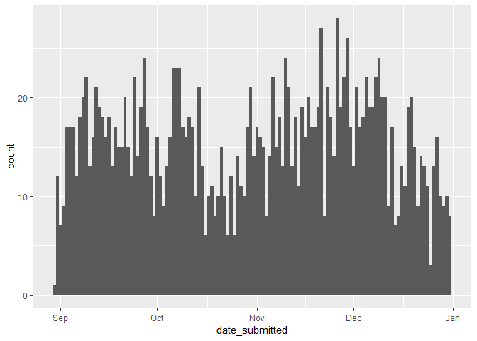

``` r
# .... apps_clean$ideal_adoption_timeline ----
str(apps_clean$ideal_adoption_timeline)
```

    ##  chr [1:1907] "today" "today" "today" "today" "one-month-or-more" ...

``` r
unique(apps_clean$ideal_adoption_timeline)
```

    ## [1] "today"             "one-month-or-more" "next-few-weeks"   
    ## [4] "few-months"        "few-weeks"

``` r
apps_clean$ideal_adoption_timeline <- gsub("next-few-weeks", "few-weeks", apps_clean$ideal_adoption_timeline)
unique(apps_clean$ideal_adoption_timeline)
```

    ## [1] "today"             "one-month-or-more" "few-weeks"        
    ## [4] "few-months"

``` r
apps_clean$ideal_adoption_timeline <- as.factor(apps_clean$ideal_adoption_timeline)
str(apps_clean$ideal_adoption_timeline)
```

    ##  Factor w/ 4 levels "few-months","few-weeks",..: 4 4 4 4 3 4 4 3 3 3 ...

``` r
summary(apps_clean$ideal_adoption_timeline)
```

    ##        few-months         few-weeks one-month-or-more             today 
    ##               102               381               629               795

``` r
# .... apps_clean$reason_for_adoption ----
apps_clean <- apps
str(apps_clean$reason_for_adoption)
```

    ##  chr [1:1907] "myself,other" "myself" "myself" "myself" "myself" ...

``` r
summary(apps_clean$reason_for_adoption)
```

    ##    Length     Class      Mode 
    ##      1907 character character

``` r
unique(apps_clean$reason_for_adoption)
```

    ##  [1] "myself,other"                   "myself"                        
    ##  [3] "my-kids"                        "mouser"                        
    ##  [5] "my-kids,myself"                 "myself,my-kids"                
    ##  [7] "myself,mouser"                  "gift,my-kids"                  
    ##  [9] "my-kids,mouser,gift"            "myself,mouser,other"           
    ## [11] "myself,my-kids,mouser"          "myself,my-kids,gift"           
    ## [13] "other"                          "gift,myself"                   
    ## [15] "myself,gift"                    "my-kids,myself,gift"           
    ## [17] "my-kids,gift"                   "my-kids,myself,mouser"         
    ## [19] "gift"                           "mouser,my-kids,myself"         
    ## [21] "myself,my-kids,other"           "mouser,myself"                 
    ## [23] "mouser,my-kids"                 "my-kids,mouser"                
    ## [25] "other,myself"                   "mouser,gift"                   
    ## [27] "myself,mouser,my-kids"          "myself,mouser,gift"            
    ## [29] "my-kids,myself,other"           "my-kids,mouser,myself"         
    ## [31] "myself,my-kids,mouser,other"    "myself,my-kids,mouser,gift"    
    ## [33] "mouser,other"                   NA                              
    ## [35] "protection,my-kids,myself"      "myself,protection"             
    ## [37] "myself,protection,my-kids,gift" "my-kids,protection,myself"     
    ## [39] "myself,my-kids,protection"      "my-kids,gift,myself"           
    ## [41] "protection"                     "myself,my-kids,protection,gift"
    ## [43] "myself,other,my-kids"           "protection,myself"             
    ## [45] "my-kids,myself,protection"      "my-kids,protection"

``` r
apps_clean$reason_for_adoption <- gsub("it-s-a-surprise", "a-surprise", apps_clean$reason_for_adoption)
reason_for_adoption_tidy <- tidy_elements(apps_clean, "reason_for_adoption")
apps_clean <- reason_for_adoption_tidy$output_df
reason_for_adoption_elements <- reason_for_adoption_tidy$elements
reason_for_adoption_new_colnames <- reason_for_adoption_tidy$new_colnames
reason_for_adoption_elements_summary <- reason_for_adoption_tidy$elements_summary
ggplot(reason_for_adoption_elements_summary, aes(x = fct_reorder(reason_for_adoption, count), y = count)) +
  geom_bar(stat = "identity") +
  geom_text(aes(label = count), vjust = -0.25, position = "identity", size = 2.5) +
  theme(axis.text.x = element_text(angle = 45, hjust = 1)) +
  guides(fill=FALSE)
```

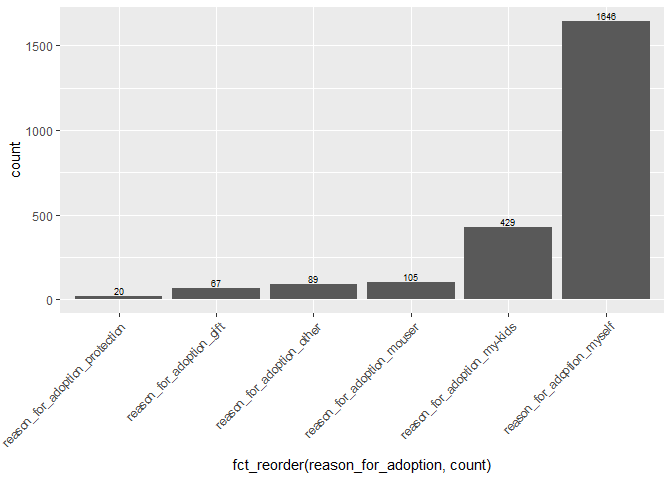

``` r
# .... apps_clean$specific_animal ----
str(apps_clean$specific_animal) # boolean
```

    ##  logi [1:1907] FALSE FALSE TRUE TRUE TRUE TRUE ...

``` r
summary(apps_clean$specific_animal)
```

    ##    Mode   FALSE    TRUE 
    ## logical     839    1068

``` r
# .... apps_clean$adults_in_home ----
summary(apps_clean$adults_in_home) # should change to numeric
```

    ##    Length     Class      Mode 
    ##      1907 character character

``` r
apps_clean$adults_in_home <- gsub("-", "", apps_clean$adults_in_home) # get rid of "-"
apps_clean$adults_in_home <- word(apps_clean$adults_in_home,1) # get first word
unique(apps_clean$adults_in_home)
```

    ##  [1] "1"  "0"  "3"  "2"  "4"  "24" "12" "5"  "7"  "11" "56" "9"  "15" "17"
    ## [15] "6"  "29" "19" "10" "13"

``` r
apps_clean$adults_in_home <- as.numeric(as.character(apps_clean$adults_in_home))
ggplot(apps_clean, aes(x = adults_in_home)) + # weird outliers
  geom_histogram(binwidth = 1)
```

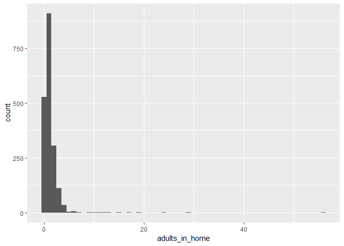

``` r
str(apps_clean$adults_in_home)
```

    ##  num [1:1907] 1 1 1 1 1 0 1 1 3 2 ...

``` r
# .... apps_clean$children_in_home ----
summary(apps_clean$children_in_home) # should change to numeric
```

    ##     Min.  1st Qu.   Median     Mean  3rd Qu.     Max. 
    ## -47.0000   0.0000   0.0000   0.4342   1.0000   9.0000

``` r
apps_clean$children_in_home <- gsub("-", "", apps_clean$children_in_home) # get rid of "-"
apps_clean$children_in_home <- word(apps_clean$children_in_home,1) # get first word
unique(apps_clean$children_in_home)
```

    ##  [1] "0"  "1"  "3"  "5"  "4"  "2"  "46" "9"  "41" "24" "27" "47" "23" "7" 
    ## [15] "6"  "40"

``` r
apps_clean$children_in_home <- as.numeric(as.character(apps_clean$children_in_home))
ggplot(apps_clean, aes(x = children_in_home)) + # weird outliers
  geom_histogram(binwidth = 1)
```

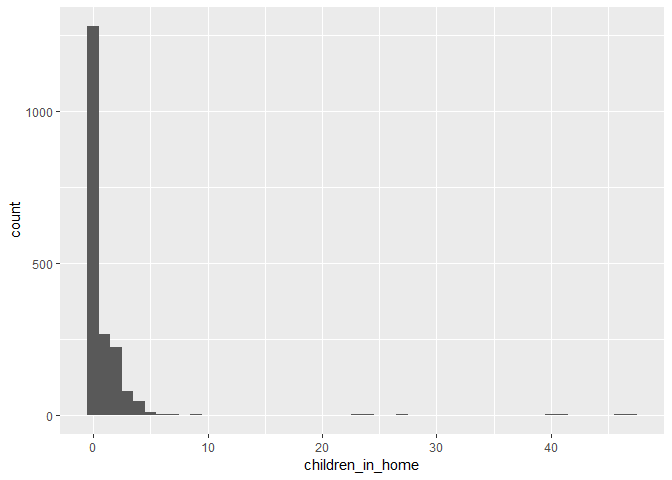

``` r
str(apps_clean$children_in_home)
```

    ##  num [1:1907] 0 0 0 0 0 0 0 0 1 0 ...

``` r
# .... apps_clean$all_household_agree ----
str(apps_clean$all_household_agree)
```

    ##  chr [1:1907] "yes" "yes" "yes" "yes" "yes" "yes" "yes" "yes" "yes" ...

``` r
summary(apps_clean$all_household_agree)
```

    ##    Length     Class      Mode 
    ##      1907 character character

``` r
unique(apps_clean$all_household_agree)
```

    ##  [1] "yes"                 "a-surprise"          "yes,a-surprise"     
    ##  [4] "a-surprise,yes"      "no,yes"              "no"                 
    ##  [7] "yes,no"              "it-s-a-surprise"     "yes,it-s-a-surprise"
    ## [10] "it-s-a-surprise,yes"

``` r
apps_clean$all_household_agree <- gsub("it-s-a-surprise", "a-surprise", apps_clean$all_household_agree)
get_unique_elements(apps_clean, "all_household_agree")
```

    ## [1] "yes"        "a-surprise" "no"

``` r
all_household_agree_tidy <- tidy_elements(apps_clean, "all_household_agree")
apps_clean <- all_household_agree_tidy$output_df
all_household_agree_elements <- all_household_agree_tidy$elements
all_household_agree_new_colnames <- all_household_agree_tidy$new_colnames
all_household_agree_elements_summary <- all_household_agree_tidy$elements_summary
ggplot(all_household_agree_elements_summary, aes(x = fct_reorder(all_household_agree, count), y = count)) +
  geom_bar(stat = "identity") +
  geom_text(aes(label = count), vjust = -0.25, position = "identity", size = 2.5) +
  theme(axis.text.x = element_text(angle = 45, hjust = 1)) +
  guides(fill=FALSE)
```

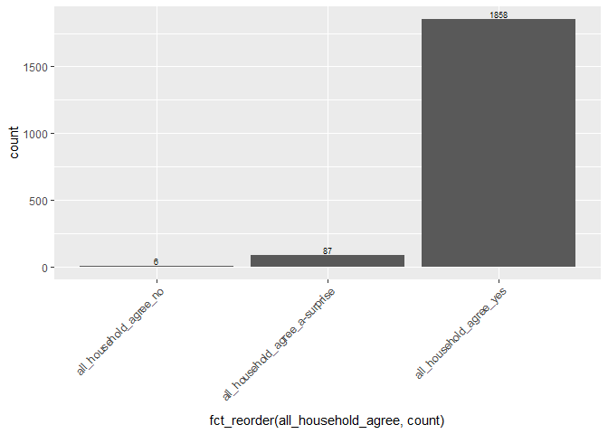

``` r
# .... apps_clean$allergies ----
str(apps_clean$allergies)
```

    ##  chr [1:1907] "mildly-allergic" "no-allergies" "no-allergies" ...

``` r
summary(apps_clean$allergies)
```

    ##    Length     Class      Mode 
    ##      1907 character character

``` r
unique(apps_clean$allergies)
```

    ##  [1] "mildly-allergic"               "no-allergies"                 
    ##  [3] "not-sure"                      "not-sure,no-allergies"        
    ##  [5] "very-allergic"                 "mildly-allergic,no-allergies" 
    ##  [7] "no-allergies,not-sure"         "mildly-allergic,very-allergic"
    ##  [9] "no-allergies,mildly-allergic"  "mildly-allergic,not-sure"     
    ## [11] "very-allergic,no-allergies"    "very-allergic,mildly-allergic"

``` r
allergies_tidy <- tidy_elements(apps_clean, "allergies")
apps_clean <- allergies_tidy$output_df
allergies_elements <- allergies_tidy$elements
allergies_new_colnames <- allergies_tidy$new_colnames
allergies_elements_summary <- allergies_tidy$elements_summary
ggplot(allergies_elements_summary, aes(x = fct_reorder(allergies, count), y = count)) +
  geom_bar(stat = "identity") +
  geom_text(aes(label = count), vjust = -0.25, position = "identity", size = 2.5) +
  theme(axis.text.x = element_text(angle = 45, hjust = 1)) +
  guides(fill=FALSE)
```

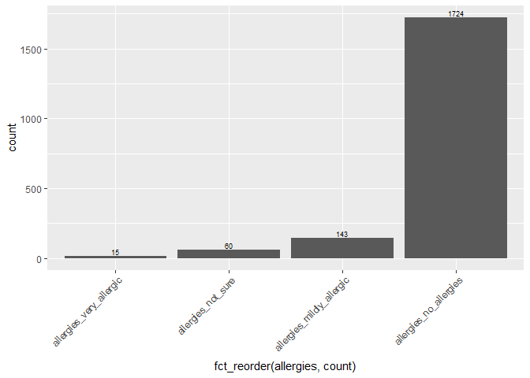

``` r
# .... apps_clean$home_owner ----
str(apps_clean$home_owner)
```

    ##  chr [1:1907] "company" "company" "myself" "family-member-or-friend" ...

``` r
summary(apps_clean$home_owner)
```

    ##    Length     Class      Mode 
    ##      1907 character character

``` r
unique(apps_clean$home_owner)
```

    ## [1] "company"                 "myself"                 
    ## [3] "family-member-or-friend" NA                       
    ## [5] "landlord"                "family-friend"

``` r
apps_clean$home_owner <- as.factor(apps_clean$home_owner)
summary(apps_clean$home_owner)
```

    ##                 company           family-friend family-member-or-friend 
    ##                     530                      98                     138 
    ##                landlord                  myself                    NA's 
    ##                     227                     887                      27

``` r
# .... apps_clean$home_pet_policy ----
str(apps_clean$home_pet_policy)
```

    ##  chr [1:1907] "yes" "havent-asked" NA NA NA NA "yes" NA "yes" NA NA NA ...

``` r
summary(apps_clean$home_pet_policy)
```

    ##    Length     Class      Mode 
    ##      1907 character character

``` r
apps_clean$home_pet_policy <- gsub("no-yet", "not-yet", apps_clean$home_pet_policy)
apps_clean[apps_clean$home_pet_policy == "not-applicable" & 
             !is.na(apps_clean$home_pet_policy) |
             apps_clean$home_pet_policy == "n-a" & 
             !is.na(apps_clean$home_pet_policy),]$home_pet_policy <- NA
unique(apps_clean$home_pet_policy)
```

    ## [1] "yes"                 "havent-asked"        NA                   
    ## [4] "not-yet"             "no-but-pets-allowed" "yes-with-pet-policy"

``` r
apps_clean$home_pet_policy <- as.factor(apps_clean$home_pet_policy)
summary(apps_clean$home_pet_policy)
```

    ##        havent-asked no-but-pets-allowed             not-yet 
    ##                 103                  64                  14 
    ##                 yes yes-with-pet-policy                NA's 
    ##                 421                 128                1177

``` r
# .... apps_clean$experience ----
str(apps_clean$experience)
```

    ##  chr [1:1907] "euthanized-a-pet,grew-up-with-pet" ...

``` r
summary(apps_clean$experience)
```

    ##    Length     Class      Mode 
    ##      1907 character character

``` r
length(unique(apps_clean$experience))
```

    ## [1] 323

``` r
experience_tidy <- tidy_elements(apps_clean, "experience")
apps_clean <- experience_tidy$output_df
experience_elements <- experience_tidy$elements
experience_new_colnames <- experience_tidy$new_colnames
experience_elements_summary <- experience_tidy$elements_summary
ggplot(experience_elements_summary, aes(x = fct_reorder(experience, count), y = count)) +
  geom_bar(stat = "identity") +
  geom_text(aes(label = count), vjust = -0.25, position = "identity", size = 2.5) +
  theme(axis.text.x = element_text(angle = 45, hjust = 1)) +
  guides(fill=FALSE)
```

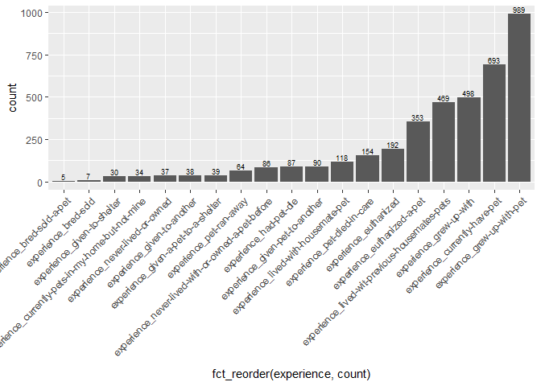

``` r
# .... apps_clean$budget_monthly ----
str(apps_clean$budget_monthly)
```

    ##  chr [1:1907] "$150.00" "$120.00" "$125.00" "$150.00" "($75.00)" ...

``` r
summary(apps_clean$budget_monthly)
```

    ##    Length     Class      Mode 
    ##      1907 character character

``` r
unique(apps_clean$budget_monthly)
```

    ##   [1] "$150.00"       "$120.00"       "$125.00"       "($75.00)"     
    ##   [5] "$200.00"       "$600.00"       "$100.00"       "$300.00"      
    ##   [9] "$50.00"        "$3,000.00"     "$250.00"       "$260.00"      
    ##  [13] "$500.00"       "$70.00"        "$40.00"        "($300.00)"    
    ##  [17] "($0.50)"       "$80.00"        "$60.00"        "$400.00"      
    ##  [21] "$75.00"        "$1,000.00"     "$150"          "$110.00"      
    ##  [25] "$700.00"       "$65.00"        "$30.00"        "$240.00"      
    ##  [29] "$210.00"       "$85.00"        "$350.00"       "$35.00"       
    ##  [33] "$12.00"        "$650.00"       "$250.20"       "($200.00)"    
    ##  [37] "$200"          "$5,000.00"     "$0.00"         "$490.00"      
    ##  [41] "$99.00"        "$90.00"        "$100"          "($120.00)"    
    ##  [45] "$450.00"       "$640.00"       "$800.00"       "$1,500.00"    
    ##  [49] "$3,500.00"     "$0.30"         "($500.00)"     "$25.00"       
    ##  [53] "($100.00)"     "$140.00"       "($250.00)"     "$500"         
    ##  [57] "$280.00"       "($1,000.00)"   "$3.00"         "$510.00"      
    ##  [61] "$2,000.00"     "$20.00"        "$220.00"       "$180.00"      
    ##  [65] "$105.00"       "$160.00"       "$115.00"       "($0.06)"      
    ##  [69] "($100,150.00)" "$1,100.00"     "$1,200.00"     "$750.00"      
    ##  [73] "($150.00)"     "$860.00"       "$175.00"       "($0.05)"      
    ##  [77] "$170.00"       "$4,000.00"     "$204.00"       "$10,000.00"   
    ##  [81] "-$150.00"      "-$1.00"        "-$0.50"        "-$20.00"      
    ##  [85] "$9,000.00"     "$45.00"        "$800"          "-$100.00"     
    ##  [89] "$550.00"       "-$400.00"      "$230.00"       "$900.00"      
    ##  [93] "$245.00"       "$150,159.00"   "$380.00"       "$130.00"      
    ##  [97] "-$3,000.00"    "-$0.08"        "$460.00"       "$1,000,000.00"
    ## [101] "$890.00"       "$1,000"        "$320.00"       "-$200.00"     
    ## [105] "-$300.00"      "$8,000.00"

``` r
apps_clean$budget_monthly <- gsub("[$]|[(]|[)]|,|-", "", apps_clean$budget_monthly)
apps_clean$budget_monthly <- as.numeric(as.character(apps_clean$budget_monthly))
ggplot(apps_clean, aes(x = budget_monthly)) +
  geom_histogram(binwidth = 50) +
  xlim(0,5000)
```

    ## Warning: Removed 6 rows containing non-finite values (stat_bin).

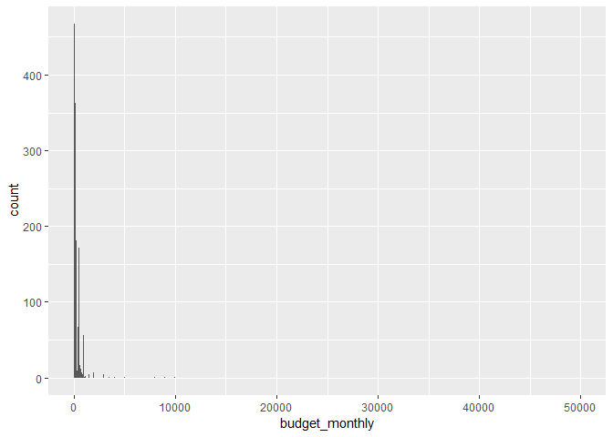

``` r
unique(apps_clean$budget_monthly)
```

    ##  [1]     150.00     120.00     125.00      75.00     200.00     600.00
    ##  [7]     100.00     300.00      50.00    3000.00     250.00     260.00
    ## [13]     500.00      70.00      40.00       0.50      80.00      60.00
    ## [19]     400.00    1000.00     110.00     700.00      65.00      30.00
    ## [25]     240.00     210.00      85.00     350.00      35.00      12.00
    ## [31]     650.00     250.20    5000.00       0.00     490.00      99.00
    ## [37]      90.00     450.00     640.00     800.00    1500.00    3500.00
    ## [43]       0.30      25.00     140.00     280.00       3.00     510.00
    ## [49]    2000.00      20.00     220.00     180.00     105.00     160.00
    ## [55]     115.00       0.06  100150.00    1100.00    1200.00     750.00
    ## [61]     860.00     175.00       0.05     170.00    4000.00     204.00
    ## [67]   10000.00       1.00    9000.00      45.00     550.00     230.00
    ## [73]     900.00     245.00  150159.00     380.00     130.00       0.08
    ## [79]     460.00 1000000.00     890.00     320.00    8000.00

``` r
# .... apps_clean$budget_emergency ----
str(apps_clean$budget_emergency)
```

    ##  chr [1:1907] "$1,000.00" "$220.00" "$3,000.00" "$500.00" "$1,000.00" ...

``` r
summary(apps_clean$budget_emergency)
```

    ##    Length     Class      Mode 
    ##      1907 character character

``` r
unique(apps_clean$budget_emergency)
```

    ##   [1] "$1,000.00"             "$220.00"              
    ##   [3] "$3,000.00"             "$500.00"              
    ##   [5] "$2,000.00"             "$10,000.00"           
    ##   [7] "$5,000.00"             "$100.00"              
    ##   [9] "$300.00"               "$350.00"              
    ##  [11] "$70.00"                "$150.00"              
    ##  [13] "$200.00"               "$2,500.00"            
    ##  [15] "$800.00"               "$1,400.00"            
    ##  [17] "$1,500.00"             "$250.00"              
    ##  [19] "$1,200.00"             "$700.00"              
    ##  [21] "$600.00"               "$7,500.00"            
    ##  [23] "$750.00"               "$400.00"              
    ##  [25] "$30.00"                "$40.00"               
    ##  [27] "$109.00"               "$550.00"              
    ##  [29] "$130.00"               "$125.00"              
    ##  [31] "$4,000.00"             "$9,800.00"            
    ##  [33] "($300,500.00)"         "$440.00"              
    ##  [35] "$7,000.00"             "$490.00"              
    ##  [37] "$540.00"               "$230.00"              
    ##  [39] "$6,500.00"             "$12.00"               
    ##  [41] "($200.00)"             "$480.00"              
    ##  [43] "$2,100.00"             "$60,025.00"           
    ##  [45] "$160.00"               "$500"                 
    ##  [47] "$3,500.00"             "($0.60)"              
    ##  [49] "$450.00"               "$60.00"               
    ##  [51] "$900.00"               "$1,000,000,000,000.00"
    ##  [53] "$8,000.00"             "$410.00"              
    ##  [55] "$6,000.00"             "$77.00"               
    ##  [57] "$20,000.00"            "$400"                 
    ##  [59] "$1,700.00"             "($1,000.00)"          
    ##  [61] "$2,800.00"             "$15,000.00"           
    ##  [63] "$10,500.00"            "$0.00"                
    ##  [65] "$25.00"                "($0.20)"              
    ##  [67] "$340.00"               "$45.00"               
    ##  [69] "$75.00"                "$50.00"               
    ##  [71] "($100,000.00)"         "$260.00"              
    ##  [73] "$5.00"                 "$890.00"              
    ##  [75] "$650.00"               "$600"                 
    ##  [77] "$3,900.00"             "$90.00"               
    ##  [79] "$280.00"               "$590.00"              
    ##  [81] "$9,000.00"             "($0.80)"              
    ##  [83] "($500.00)"             "$90,000.00"           
    ##  [85] "$3,600.00"             "$20.00"               
    ##  [87] "($200,400.00)"         "$860.00"              
    ##  [89] "$1"                    "$1,800.00"            
    ##  [91] "$190.00"               "$710.00"              
    ##  [93] "($50)"                 "$1,009.00"            
    ##  [95] "$140.00"               "$10.00"               
    ##  [97] "$80.00"                "$1,000"               
    ##  [99] "$850.00"               "($300.00)"            
    ## [101] "$204.00"               "-$3,000.00"           
    ## [103] "-$500.00"              "$1,100.00"            
    ## [105] "$740.00"               "-$1,000.00"           
    ## [107] "$25,000.00"            "$770.00"              
    ## [109] "-$5,000.00"            "$470.00"              
    ## [111] "$900"                  "-$2,500.00"           
    ## [113] "$830.00"               "$39,500.00"           
    ## [115] "$11,900.00"            "$790.00"              
    ## [117] "-$2,100.00"            "$1,000,000.00"        
    ## [119] "$950.00"               "$1,300.00"            
    ## [121] "$2,202,000.00"         "$300"                 
    ## [123] "$50,000.00"            "$1,600.00"            
    ## [125] "$1,900.00"             "$555.00"              
    ## [127] "$5,200.00"             "$6,600.00"

``` r
apps_clean$budget_emergency <- gsub("[$]|[(]|[)]|,|-", "", apps_clean$budget_emergency)
apps_clean$budget_emergency <- as.numeric(as.character(apps_clean$budget_emergency))
ggplot(apps_clean, aes(x = budget_monthly)) +
  geom_histogram(binwidth = 50) +
  xlim(0,5000)
```

    ## Warning: Removed 6 rows containing non-finite values (stat_bin).

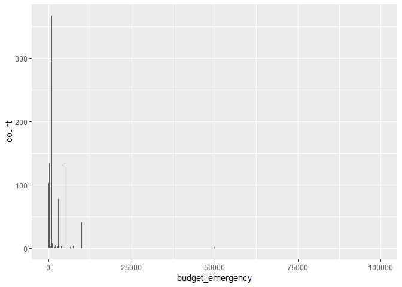

``` r
unique(apps_clean$budget_emergency)
```

    ##   [1]          1000.0           220.0          3000.0           500.0
    ##   [5]          2000.0         10000.0          5000.0           100.0
    ##   [9]           300.0           350.0            70.0           150.0
    ##  [13]           200.0          2500.0           800.0          1400.0
    ##  [17]          1500.0           250.0          1200.0           700.0
    ##  [21]           600.0          7500.0           750.0           400.0
    ##  [25]            30.0            40.0           109.0           550.0
    ##  [29]           130.0           125.0          4000.0          9800.0
    ##  [33]        300500.0           440.0          7000.0           490.0
    ##  [37]           540.0           230.0          6500.0            12.0
    ##  [41]           480.0          2100.0         60025.0           160.0
    ##  [45]          3500.0             0.6           450.0            60.0
    ##  [49]           900.0 1000000000000.0          8000.0           410.0
    ##  [53]          6000.0            77.0         20000.0          1700.0
    ##  [57]          2800.0         15000.0         10500.0             0.0
    ##  [61]            25.0             0.2           340.0            45.0
    ##  [65]            75.0            50.0        100000.0           260.0
    ##  [69]             5.0           890.0           650.0          3900.0
    ##  [73]            90.0           280.0           590.0          9000.0
    ##  [77]             0.8         90000.0          3600.0            20.0
    ##  [81]        200400.0           860.0             1.0          1800.0
    ##  [85]           190.0           710.0          1009.0           140.0
    ##  [89]            10.0            80.0           850.0           204.0
    ##  [93]          1100.0           740.0         25000.0           770.0
    ##  [97]           470.0           830.0         39500.0         11900.0
    ## [101]           790.0       1000000.0           950.0          1300.0
    ## [105]       2202000.0         50000.0          1600.0          1900.0
    ## [109]           555.0          5200.0          6600.0

``` r
# .... apps_clean$home_alone_avg ----
str(apps_clean$home_alone_avg)
```

    ##  chr [1:1907] "6 h" "4 h" NA "7 h" "10 h" "8h" "0 h" "8 h" NA "10 h" ...

``` r
summary(apps_clean$home_alone_avg)
```

    ##    Length     Class      Mode 
    ##      1907 character character

``` r
unique(apps_clean$home_alone_avg)
```

    ##  [1] "6 h"  "4 h"  NA     "7 h"  "10 h" "8h"   "0 h"  "8 h"  "3 h"  "2 h" 
    ## [11] "5 h"  "9 h"  "2h"   "4h"   "13 h" "3h"   "1h"   "1 h"  "5h"   "10h" 
    ## [21] "11 h" "6h"   "7h"   "9h"   "12 h" "24 h" "0h"   "12h"

``` r
apps_clean$home_alone_avg <- trimws(gsub("h", "", apps_clean$home_alone_avg))
apps_clean$home_alone_avg <- as.numeric(as.character(apps_clean$home_alone_avg))
ggplot(apps_clean, aes(x = home_alone_avg)) +
  geom_histogram(binwidth = 1)
```

    ## Warning: Removed 480 rows containing non-finite values (stat_bin).

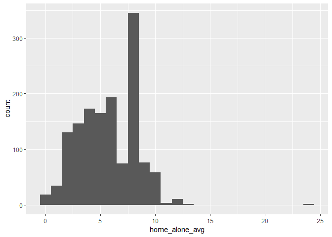

``` r
unique(apps_clean$home_alone_avg)
```

    ##  [1]  6  4 NA  7 10  8  0  3  2  5  9 13  1 11 12 24

``` r
# .... apps_clean$home_alone_max ----
str(apps_clean$home_alone_max)
```

    ##  chr [1:1907] "6 h" "6 h" "3 h" "10 h" "12 h" "18h" "8 h" "9 h" NA ...

``` r
summary(apps_clean$home_alone_max)
```

    ##    Length     Class      Mode 
    ##      1907 character character

``` r
unique(apps_clean$home_alone_max)
```

    ##  [1] "6 h"  "3 h"  "10 h" "12 h" "18h"  "8 h"  "9 h"  NA     "5 h"  "36 h"
    ## [11] "4 h"  "7 h"  "0 h"  "1 h"  "18 h" "4h"   "14 h" "2 h"  "11 h" "20 h"
    ## [21] "3h"   "24 h" "1h"   "48 h" "15 h" "7h"   "24h"  "2h"   "10h"  "12h" 
    ## [31] "8h"   "6h"   "5h"   "28 h" "9h"   "16 h" "13 h" "30 h" "14h"  "23 h"

``` r
apps_clean$home_alone_max <- trimws(gsub("h", "", apps_clean$home_alone_max))
apps_clean$home_alone_max <- as.numeric(as.character(apps_clean$home_alone_max))
ggplot(apps_clean, aes(x = home_alone_max)) +
  geom_histogram(binwidth = 1)
```

    ## Warning: Removed 492 rows containing non-finite values (stat_bin).

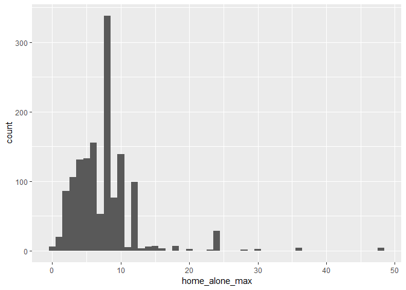

``` r
unique(apps_clean$home_alone_max)
```

    ##  [1]  6  3 10 12 18  8  9 NA  5 36  4  7  0  1 14  2 11 20 24 48 15 28 16
    ## [24] 13 30 23

``` r
# .... apps_clean$pet_kept ----
str(apps_clean$pet_kept)
```

    ##  chr [1:1907] "inside-only,leash-harness" "inside-only" "inside-only" ...

``` r
summary(apps_clean$pet_kept)
```

    ##    Length     Class      Mode 
    ##      1907 character character

``` r
length(unique(apps_clean$pet_kept))
```

    ## [1] 56

``` r
apps_clean$pet_kept <- gsub("unsupervised-access-to-my-yard-9doggie-door-etc",
                            "unsupervised-access-to-my-yard-doggie-door-etc",
                            apps_clean$pet_kept)
pet_kept_tidy <- tidy_elements(apps_clean, "pet_kept")
apps_clean <- pet_kept_tidy$output_df
pet_kept_elements <- pet_kept_tidy$elements
pet_kept_new_colnames <- pet_kept_tidy$new_colnames
pet_kept_elements_summary <- pet_kept_tidy$elements_summary
ggplot(pet_kept_elements_summary, aes(x = fct_reorder(pet_kept, count), y = count)) +
  geom_bar(stat = "identity") +
  geom_text(aes(label = count), vjust = -0.25, position = "identity", size = 2.5) +
  theme(axis.text.x = element_text(angle = 45, hjust = 1)) +
  guides(fill=FALSE)
```

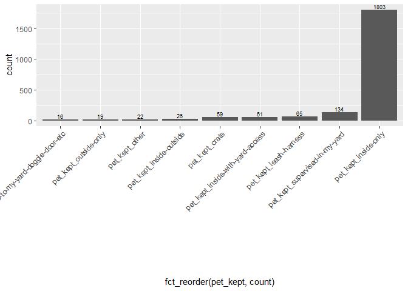

``` r
# .... apps_clean$exercise ----
str(apps_clean$exercise)
```

    ##  chr [1:1907] "toy-mice,wand-toys" "wand-toys,toy-mice" ...

``` r
summary(apps_clean$exercise)
```

    ##    Length     Class      Mode 
    ##      1907 character character

``` r
length(unique(apps_clean$exercise))
```

    ## [1] 180

``` r
exercise_tidy <- tidy_elements(apps_clean, "exercise")
apps_clean <- exercise_tidy$output_df
exercise_elements <- exercise_tidy$elements
exercise_new_colnames <- exercise_tidy$new_colnames
exercise_elements_summary <- exercise_tidy$elements_summary
ggplot(exercise_elements_summary, aes(x = fct_reorder(exercise, count), y = count)) +
  geom_bar(stat = "identity") +
  geom_text(aes(label = count), vjust = -0.25, position = "identity", size = 2.5) +
  theme(axis.text.x = element_text(angle = 45, hjust = 1)) +
  guides(fill=FALSE)
```

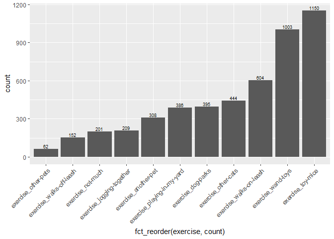

``` r
# .... apps_clean$return_pet ----
str(apps_clean$return_pet)
```

    ##  chr [1:1907] "none" "new-baby,not-enough-time" ...

``` r
summary(apps_clean$return_pet)
```

    ##    Length     Class      Mode 
    ##      1907 character character

``` r
length(unique(apps_clean$return_pet))
```

    ## [1] 152

``` r
return_pet_tidy <- tidy_elements(apps_clean, "return_pet")
apps_clean <- return_pet_tidy$output_df
return_pet_elements <- return_pet_tidy$elements
return_pet_new_colnames <- return_pet_tidy$new_colnames
return_pet_elements_summary <- return_pet_tidy$elements_summary
ggplot(return_pet_elements_summary, aes(x = fct_reorder(return_pet, count), y = count)) + 
  geom_bar(stat = "identity") +
  geom_text(aes(label = count), vjust = -0.25, position = "identity", size = 2.5) +
  theme(axis.text.x = element_text(angle = 45, hjust = 1)) +
  guides(fill=FALSE)
```

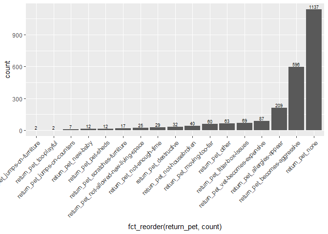

``` r
# .... apps_clean$how_heard ----
str(apps_clean$how_heard)
```

    ##  chr [1:1907] NA NA "other" "website" "other" "website" "other" ...

``` r
summary(apps_clean$how_heard)
```

    ##    Length     Class      Mode 
    ##      1907 character character

``` r
unique(apps_clean$how_heard)
```

    ##  [1] NA                       "other"                 
    ##  [3] "website"                "twitter"               
    ##  [5] "website,other"          "email"                 
    ##  [7] "other,event"            "website,insta"         
    ##  [9] "other,website"          "website,insta,event"   
    ## [11] "insta"                  "facebook"              
    ## [13] "other,insta"            "event"                 
    ## [15] "facebook,other"         "other,email"           
    ## [17] "other,facebook,website" "facebook,website"      
    ## [19] "email,website"          "other,website,facebook"
    ## [21] "website,facebook"       "insta,other"           
    ## [23] "website,insta,other"    "website,event"         
    ## [25] "website,facebook,other" "insta,website"         
    ## [27] "event,other"            "insta,facebook,other"  
    ## [29] "website,email"          "website,email,event"   
    ## [31] "website,twitter"        "email,other"           
    ## [33] "event,website"          "facebook,insta"        
    ## [35] "facebook,other,insta"

``` r
how_heard_tidy <- tidy_elements(apps_clean, "how_heard")
apps_clean <- how_heard_tidy$output_df
how_heard_elements <- how_heard_tidy$elements
how_heard_new_colnames <- how_heard_tidy$new_colnames
how_heard_elements_summary <- how_heard_tidy$elements_summary
ggplot(how_heard_elements_summary, aes(x = fct_reorder(how_heard, count), y = count)) +
  geom_bar(stat = "identity") +
  geom_text(aes(label = count), vjust = -0.25, position = "identity", size = 2.5) +
  theme(axis.text.x = element_text(angle = 45, hjust = 1)) +
  guides(fill=FALSE)
```

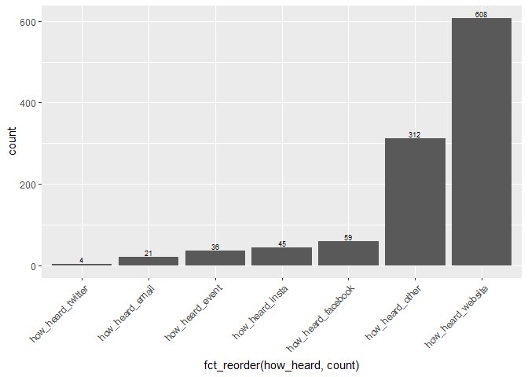

``` r
# .... apps_clean$outcome_trello_id ----
str(apps_clean$outcome_trello_id)
```

    ##  chr [1:1907] NA NA "5bfecbeaf9c3e187eb632753" NA NA NA NA NA NA ...

``` r
summary(apps_clean$outcome_trello_id)
```

    ##    Length     Class      Mode 
    ##      1907 character character

``` r
nrow(apps_clean[is.na(apps_clean$outcome_trello_id),])
```

    ## [1] 276

``` r
length(unique(apps_clean$outcome_trello_id))
```

    ## [1] 1594

``` r
id_summary <- ddply(apps_clean, .(outcome_trello_id), summarise,
                    id_count = length(outcome_trello_id))
id_summary[is.na(id_summary$outcome_trello_id),]
```

    ##      outcome_trello_id id_count
    ## 1594              <NA>      276

``` r
id_summary <- subset(id_summary, !is.na(outcome_trello_id))
id_summary_2 <- ddply(id_summary, .(id_count), summarise,
                      num_ids_with_count = length(outcome_trello_id))
id_summary_2
```

    ##   id_count num_ids_with_count
    ## 1        1               1558
    ## 2        2                 32
    ## 3        3                  3

``` r
# .... apps_clean$STATEFP ----
str(apps_clean$STATEFP)
```

    ##  int [1:1907] 42 42 42 42 42 42 42 42 42 42 ...

``` r
summary(apps_clean$STATEFP)
```

    ##    Min. 1st Qu.  Median    Mean 3rd Qu.    Max.    NA's 
    ##   34.00   42.00   42.00   41.37   42.00   42.00      53

``` r
unique(apps_clean$STATEFP)
```

    ## [1] 42 NA 34

``` r
apps_clean$STATEFP <- as.factor(apps_clean$STATEFP)
summary(apps_clean$STATEFP)
```

    ##   34   42 NA's 
    ##  146 1708   53

``` r
# .... apps_clean$COUNTYFP ----
str(apps_clean$COUNTYFP)
```

    ##  int [1:1907] 101 101 101 101 101 101 101 91 45 101 ...

``` r
summary(apps_clean$COUNTYFP)
```

    ##    Min. 1st Qu.  Median    Mean 3rd Qu.    Max.    NA's 
    ##    1.00   91.00  101.00   85.07  101.00  133.00      53

``` r
unique(apps_clean$COUNTYFP)
```

    ##  [1] 101  91  45  29  17  NA   7   5  21  15  11  71  13  25 119  19  77
    ## [18]  23   1  79   9  41  89  31  95 133   3  97  37 107  87

``` r
apps_clean$COUNTYFP <- as.factor(apps_clean$COUNTYFP)
summary(apps_clean$COUNTYFP)
```

    ##    1    3    5    7    9   11   13   15   17   19   21   23   25   29   31 
    ##    5    2   27   58    2    4    4   21   72    2   12    5    2   33    1 
    ##   37   41   45   71   77   79   87   89   91   95   97  101  107  119  133 
    ##    1    2  109    5    4    2    1    2  139    2    1 1332    1    1    2 
    ## NA's 
    ##   53

``` r
# .... apps_clean$TRACTCE ----
str(apps_clean$TRACTCE)
```

    ##  int [1:1907] 600 700 8701 7400 17900 20700 12500 203000 403402 3100 ...

``` r
summary(apps_clean$TRACTCE)
```

    ##    Min. 1st Qu.  Median    Mean 3rd Qu.    Max.    NA's 
    ##     100    7725   16951  100852  100208  980200      53

``` r
length(unique(apps_clean$TRACTCE))
```

    ## [1] 677

``` r
apps_clean$TRACTCE <- as.factor(apps_clean$TRACTCE)
summary(apps_clean$TRACTCE)
```

    ##    9000    3100    8701    3002    8702     100    1201    8000    8500 
    ##      25      23      20      18      15      14      13      13      13 
    ##   12500   15300     804    1400    7400    7900     700    8802   16000 
    ##      13      13      12      12      12      12      11      11      11 
    ##    3901   10400   12204   20700  210500     803    2702    4201    4202 
    ##      10      10      10      10      10       9       9       9       9 
    ##    7800    8601    9100   11200   21400   26600   33000   34100     500 
    ##       9       9       9       9       9       9       9       9       8 
    ##    1101    1700    2400    4001    6700   10800   13300   15800   34502 
    ##       8       8       8       8       8       8       8       8       8 
    ##     300     600    1202    1300    3300    8200   11000   11100   13500 
    ##       7       7       7       7       7       7       7       7       7 
    ##   14200   31900   36700   37600    1001    1600    2300    2500    2900 
    ##       7       7       7       7       6       6       6       6       6 
    ##    3200    3600    3701    4002    4101    7200    7300    7700   11400 
    ##       6       6       6       6       6       6       6       6       6 
    ##   14700   17900   31700   35301     401     801     902    1002    1800 
    ##       6       6       6       6       5       5       5       5       5 
    ##    2801    2802    6000    9200    9300   10700   11800   11900   13602 
    ##       5       5       5       5       5       5       5       5       5 
    ##   13700   16100   16200   17800   24200   31000   31200   32000 (Other) 
    ##       5       5       5       5       5       5       5       5    1046 
    ##    NA's 
    ##      53

``` r
# .... apps_clean$TRACTCE ----
str(apps_clean$GEOID)
```

    ##  num [1:1907] 42101000600 42101000700 42101008701 42101007400 42101017900 ...

``` r
summary(apps_clean$GEOID)
```

    ##        Min.     1st Qu.      Median        Mean     3rd Qu.        Max. 
    ## 34001010501 42091204825 42101007102 41455180679 42101016575 42133023301 
    ##        NA's 
    ##          53

``` r
length(unique(apps_clean$GEOID))
```

    ## [1] 694

``` r
apps_clean$GEOID <- as.factor(apps_clean$GEOID)
summary(apps_clean$GEOID)
```

    ## 42101009000 42101003100 42101008701 42101003002 42101008702 42101000100 
    ##          25          23          20          18          15          14 
    ## 42101001201 42101008000 42101008500 42101012500 42101015300 42101000804 
    ##          13          13          13          13          13          12 
    ## 42101001400 42101007400 42101007900 42101008802 42101016000 42091210500 
    ##          12          12          12          11          11          10 
    ## 42101003901 42101010400 42101012204 42101000700 42101000803 42101002702 
    ##          10          10          10           9           9           9 
    ## 42101004201 42101004202 42101007800 42101008601 42101009100 42101011200 
    ##           9           9           9           9           9           9 
    ## 42101020700 42101026600 42101033000 42101034100 42101001101 42101002400 
    ##           9           9           9           9           8           8 
    ## 42101004001 42101006700 42101010800 42101013300 42101021400 42101034502 
    ##           8           8           8           8           8           8 
    ## 42101000300 42101000600 42101001202 42101001700 42101003300 42101008200 
    ##           7           7           7           7           7           7 
    ## 42101011000 42101013500 42101014200 42101015800 42101031900 42101036700 
    ##           7           7           7           7           7           7 
    ## 42101037600 42101000500 42101001001 42101001300 42101001600 42101002300 
    ##           7           6           6           6           6           6 
    ## 42101002500 42101002900 42101003200 42101003600 42101003701 42101004002 
    ##           6           6           6           6           6           6 
    ## 42101004101 42101007200 42101007300 42101007700 42101011100 42101011400 
    ##           6           6           6           6           6           6 
    ## 42101014700 42101017900 42101031700 42101035301 42101000401 42101000801 
    ##           6           6           6           6           5           5 
    ## 42101000902 42101001002 42101001800 42101002801 42101002802 42101006000 
    ##           5           5           5           5           5           5 
    ## 42101009200 42101009300 42101010700 42101011800 42101013602 42101013700 
    ##           5           5           5           5           5           5 
    ## 42101016100 42101016200 42101017800 42101024200 42101031000 42101031200 
    ##           5           5           5           5           5           5 
    ## 42101032000 42101033600     (Other)        NA's 
    ##           5           5        1056          53

``` r
# .... apps_clean$NAME ----
str(apps_clean$NAME)
```

    ##  num [1:1907] 6 7 87 74 179 ...

``` r
summary(apps_clean$NAME)
```

    ##    Min. 1st Qu.  Median    Mean 3rd Qu.    Max.    NA's 
    ##    1.00   77.25  169.51 1008.52 1002.08 9802.00      53

``` r
length(unique(apps_clean$NAME))
```

    ## [1] 677

``` r
apps_clean$NAME <- as.factor(apps_clean$NAME)
summary(apps_clean$NAME)
```

    ##      90      31   87.01   30.02   87.02       1   12.01      80      85 
    ##      25      23      20      18      15      14      13      13      13 
    ##     125     153    8.04      14      74      79       7   88.02     160 
    ##      13      13      12      12      12      12      11      11      11 
    ##   39.01     104  122.04     207    2105    8.03   27.02   42.01   42.02 
    ##      10      10      10      10      10       9       9       9       9 
    ##      78   86.01      91     112     214     266     330     341       5 
    ##       9       9       9       9       9       9       9       9       8 
    ##   11.01      17      24   40.01      67     108     133     158  345.02 
    ##       8       8       8       8       8       8       8       8       8 
    ##       3       6   12.02      13      33      82     110     111     135 
    ##       7       7       7       7       7       7       7       7       7 
    ##     142     319     367     376   10.01      16      23      25      29 
    ##       7       7       7       7       6       6       6       6       6 
    ##      32      36   37.01   40.02   41.01      72      73      77     114 
    ##       6       6       6       6       6       6       6       6       6 
    ##     147     179     317  353.01    4.01    8.01    9.02   10.02      18 
    ##       6       6       6       6       5       5       5       5       5 
    ##   28.01   28.02      60      92      93     107     118     119  136.02 
    ##       5       5       5       5       5       5       5       5       5 
    ##     137     161     162     178     242     310     312     320 (Other) 
    ##       5       5       5       5       5       5       5       5    1046 
    ##    NA's 
    ##      53

``` r
# .... apps_clean$NAMELSAD ----
str(apps_clean$NAMELSAD)
```

    ##  chr [1:1907] "Census Tract 6" "Census Tract 7" "Census Tract 87.01" ...

``` r
summary(apps_clean$NAMELSAD)
```

    ##    Length     Class      Mode 
    ##      1907 character character

``` r
unique(apps_clean$NAMELSAD)[1:5]
```

    ## [1] "Census Tract 6"     "Census Tract 7"     "Census Tract 87.01"
    ## [4] "Census Tract 74"    "Census Tract 179"

``` r
apps_clean$NAMELSAD <- trimws(gsub("Census Tract", "", apps_clean$NAMELSAD))
length(unique(apps_clean$NAMELSAD))
```

    ## [1] 677

``` r
apps_clean$NAMELSAD <- as.factor(apps_clean$NAMELSAD)
summary(apps_clean$NAMELSAD)
```

    ##      90      31   87.01   30.02   87.02       1   12.01     125     153 
    ##      25      23      20      18      15      14      13      13      13 
    ##      80      85      14      74      79    8.04     160       7   88.02 
    ##      13      13      12      12      12      12      11      11      11 
    ##     104  122.04     207    2105   39.01     112     214     266   27.02 
    ##      10      10      10      10      10       9       9       9       9 
    ##     330     341   42.01   42.02      78    8.03   86.01      91     108 
    ##       9       9       9       9       9       9       9       9       8 
    ##   11.01     133     158      17      24  345.02   40.01       5      67 
    ##       8       8       8       8       8       8       8       8       8 
    ##     110     111   12.02      13     135     142       3     319      33 
    ##       7       7       7       7       7       7       7       7       7 
    ##     367     376       6      82   10.01     114     147      16     179 
    ##       7       7       7       7       6       6       6       6       6 
    ##      23      25      29     317      32  353.01      36   37.01   40.02 
    ##       6       6       6       6       6       6       6       6       6 
    ##   41.01      72      73      77   10.02     107     118     119  136.02 
    ##       6       6       6       6       5       5       5       5       5 
    ##     137     161     162     178      18     242   28.01   28.02     310 
    ##       5       5       5       5       5       5       5       5       5 
    ##     312     320     336  363.01     388    4.01      60    8.01 (Other) 
    ##       5       5       5       5       5       5       5       5    1046 
    ##    NA's 
    ##      53

``` r
# .... apps_clean$MTFCC ----
str(apps_clean$MTFCC)
```

    ##  chr [1:1907] "G5020" "G5020" "G5020" "G5020" "G5020" "G5020" "G5020" ...

``` r
summary(apps_clean$MTFCC)
```

    ##    Length     Class      Mode 
    ##      1907 character character

``` r
length(unique(apps_clean$MTFCC))
```

    ## [1] 2

``` r
apps_clean$MTFCC <- as.factor(apps_clean$MTFCC)
summary(apps_clean$MTFCC)
```

    ## G5020  NA's 
    ##  1854    53

``` r
# .... apps_clean$FUNCSTAT ----
str(apps_clean$FUNCSTAT)
```

    ##  chr [1:1907] "S" "S" "S" "S" "S" "S" "S" "S" "S" "S" "S" "S" "S" "S" ...

``` r
summary(apps_clean$FUNCSTAT)
```

    ##    Length     Class      Mode 
    ##      1907 character character

``` r
length(unique(apps_clean$FUNCSTAT))
```

    ## [1] 2

``` r
apps_clean$FUNCSTAT <- as.factor(apps_clean$FUNCSTAT)
summary(apps_clean$FUNCSTAT)
```

    ##    S NA's 
    ## 1854   53

``` r
# .... apps_clean$ALAND ----
str(apps_clean$ALAND)
```

    ##  int [1:1907] 172652 246683 259546 675931 714138 1424663 864871 16743142 2286703 395908 ...

``` r
summary(apps_clean$ALAND)
```

    ##      Min.   1st Qu.    Median      Mean   3rd Qu.      Max.      NA's 
    ##     99957    402542    699364   2676080   1424663 106395939        53

``` r
length(unique(apps_clean$ALAND))
```

    ## [1] 694

``` r
apps_clean$ALAND <- as.factor(apps_clean$ALAND)
summary(apps_clean$ALAND)
```

    ##  434900  395908  259546  226951  283544  704917  327555  430891  469148 
    ##      25      23      20      18      15      14      13      13      13 
    ##  621445  864871  145453  315833  377950  675931  394307  721031  420397 
    ##      13      13      12      12      12      12      11      11      10 
    ##  472075  849290 3379105  152820  246683  252480  361680  367675  425574 
    ##      10      10      10       9       9       9       9       9       9 
    ##  427404  453345  503162  732828  912758 1338392 1424663  174011  314911 
    ##       9       9       9       9       9       9       9       8       8 
    ##  357932  535423  585733  606691 1001468 1021492  172652  221571  308561 
    ##       8       8       8       8       8       8       7       7       7 
    ##  404892  472867  546269  580218  717210  773212  788168  801977  832282 
    ##       7       7       7       7       7       7       7       7       7 
    ## 1062472  196389  212379  229397  322265  337677  344839  355619  370258 
    ##       7       6       6       6       6       6       6       6       6 
    ##  374000  387096  398698  428780  491790  502118  714138  727890  881417 
    ##       6       6       6       6       6       6       6       6       6 
    ##  964586  972947 1301616 1398730   99957  155166  216838  222950  234728 
    ##       6       6       6       6       5       5       5       5       5 
    ##  242440  362691  364983  402542  429735  460475  471655  512009  532060 
    ##       5       5       5       5       5       5       5       5       5 
    ##  589734  662615  680731  707751  914502 1063411 1088841 1153477 (Other) 
    ##       5       5       5       5       5       5       5       5    1056 
    ##    NA's 
    ##      53

``` r
# .... apps_clean$AWATER ----
str(apps_clean$AWATER)
```

    ##  int [1:1907] 0 7087 0 0 0 94030 32791 0 455833 0 ...

``` r
summary(apps_clean$AWATER)
```

    ##     Min.  1st Qu.   Median     Mean  3rd Qu.     Max.     NA's 
    ##        0        0        0   121011     5330 47436715       53

``` r
length(unique(apps_clean$AWATER))
```

    ## [1] 296

``` r
apps_clean$AWATER <- as.factor(apps_clean$AWATER)
summary(apps_clean$AWATER)
```

    ##        0    30728    32791    56473     7087    94030    55277    11202 
    ##     1333       13       13       10        9        9        8        7 
    ##    22680    72863   277434    13466    60713     4751     9583    12755 
    ##        7        7        7        6        6        5        5        5 
    ##    15884     6714    10675    12010    13905    16098    35427    55718 
    ##        5        4        4        4        4        4        4        4 
    ##   193283   241117   282807   447058       57      729     1549     1972 
    ##        4        4        4        4        3        3        3        3 
    ##     5188     6352     7044     8028    11284    24008    29445    30135 
    ##        3        3        3        3        3        3        3        3 
    ##    73887    74899   102802   136650   145214   235089   341591  1423384 
    ##        3        3        3        3        3        3        3        3 
    ##  1907950  2444806      408      495     2396     2470     2788     4072 
    ##        3        3        2        2        2        2        2        2 
    ##     4584     5378     5492     7008     8015     9921    10506    11386 
    ##        2        2        2        2        2        2        2        2 
    ##    12503    13220    14453    14613    16162    17275    17290    19609 
    ##        2        2        2        2        2        2        2        2 
    ##    21617    31552    36337    38394    43071    45004    53598    63982 
    ##        2        2        2        2        2        2        2        2 
    ##    75686    81995    82675    97858   129204   188185   228528   296689 
    ##        2        2        2        2        2        2        2        2 
    ##   326435   467868   707404  1426274  1500478 12083037      430      436 
    ##        2        2        2        2        2        2        1        1 
    ##      531      613  (Other)     NA's 
    ##        1        1      197       53

``` r
# .... apps_clean$INTPTLAT ----
str(apps_clean$INTPTLAT)
```

    ##  num [1:1907] 39.9 40 40 39.9 40 ...

``` r
length(summary(apps_clean$INTPTLAT))
```

    ## [1] 7

``` r
ggplot(apps_clean, aes(x = INTPTLAT)) +
  geom_histogram(binwidth = 0.1)
```

    ## Warning: Removed 53 rows containing non-finite values (stat_bin).

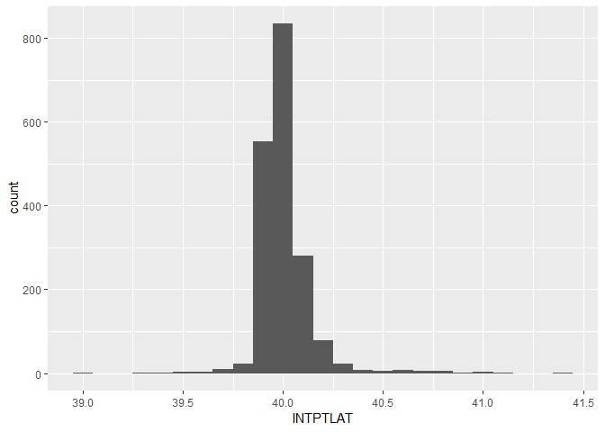

``` r
# .... apps_clean$INTPTLON ----
str(apps_clean$INTPTLON)
```

    ##  num [1:1907] -75.2 -75.2 -75.2 -75.2 -75.1 ...

``` r
summary(apps_clean$INTPTLON)
```

    ##    Min. 1st Qu.  Median    Mean 3rd Qu.    Max.    NA's 
    ##  -80.31  -75.22  -75.17  -75.17  -75.12  -73.96      53

``` r
ggplot(apps_clean, aes(x = INTPTLON)) +
  geom_histogram(binwidth = 0.1)
```

    ## Warning: Removed 53 rows containing non-finite values (stat_bin).

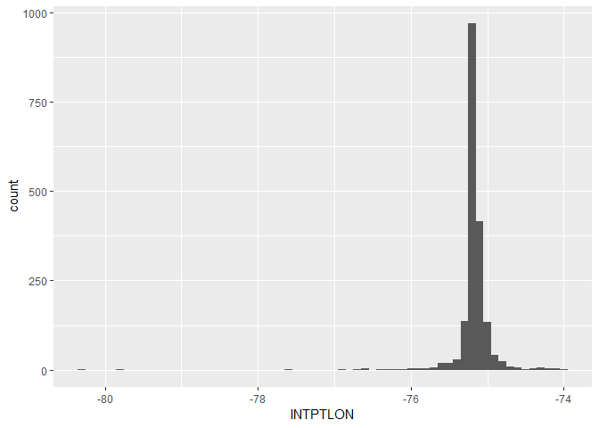

``` r
# .... apps_clean$City ---- 
str(apps_clean$City)
```

    ##  chr [1:1907] "Philadelphia" "Philadelphia" "Philadelphia" ...

``` r
summary(apps_clean$City)
```

    ##    Length     Class      Mode 
    ##      1907 character character

``` r
apps_clean$City <- toupper(apps_clean$City)
apps_clean$City <- gsub("[.]|[,]| PA$", "", apps_clean$City)
apps_clean$City <- trimws(gsub("  ", " ", apps_clean$City))
apps_clean$City <- gsub("MT ", "MOUNT ", apps_clean$City)
apps_clean$City <- gsub("19010", "BRYN MAWR", apps_clean$City)
apps_clean$City <- gsub("ABINGDON", "ABINGTON", apps_clean$City)
apps_clean$City <- gsub("CHETSER", "CHESTER", apps_clean$City)
apps_clean$City <- gsub("ROYERFORD", "ROYERSFORD", apps_clean$City)
apps_clean$City <- gsub("NORTH WHALES", "NORTH WALES", apps_clean$City)
apps_clean$City <- gsub("MONTGOMERY VALLAGE", "MONTGOMERY VILLAGE", apps_clean$City)
apps_clean$City <- gsub("E LANSDOWNE", "EAST LANSDOWNE", apps_clean$City)
apps_clean$City <- gsub("PHILLY|FILADELFIA|PHILIDELPHIA|PHIMADELPHIA|PHIALADELPHIA|PHIALDELPHIA|PHILDELPHIA", "PHILADELPHIA", apps_clean$City)
apps_clean[startsWith(apps_clean$City, "PHILA"),]$City <- "PHILADELPHIA"
sort(unique(apps_clean$City))
```

    ##   [1] "ABINGTON"            "ABSECON"             "ALDAN"              
    ##   [4] "ALLENTOWN"           "ALPHA"               "AMBLER"             
    ##   [7] "ANDALUSIA"           "ARDMORE"             "ATGLEN"             
    ##  [10] "ATLANTA"             "AUDUBON"             "AVENEL"             
    ##  [13] "AVONDALE"            "BALA CYNWYD"         "BALTIMORE"          
    ##  [16] "BARRINGTON"          "BAYVILLE"            "BEL AIR"            
    ##  [19] "BELLEVILLE"          "BELLMAWR"            "BENSALEM"           
    ##  [22] "BERLIN"              "BLACKWOOD"           "BLOOMFIELD"         
    ##  [25] "BLOOMSBURY"          "BLUE BELL"           "BORDENTOWN"         
    ##  [28] "BOULDER"             "BRIDGEPORT"          "BRIGHTON"           
    ##  [31] "BRISTOL"             "BROOKHAVEN"          "BROOKLYN"           
    ##  [34] "BROOMALL"            "BRYN ATHYN"          "BRYN MAWR"          
    ##  [37] "BUCKINGHAM"          "BUENA"               "BUFFALO"            
    ##  [40] "BURLINGTON"          "CAMDEN"              "CATAWISSA"          
    ##  [43] "CHALFONT"            "CHARLOTTE"           "CHELTENHAM"         
    ##  [46] "CHERRY HILL"         "CHESTER"             "CHESTERFIELD"       
    ##  [49] "CINNAMINSON"         "CLAYMONT"            "CLIFTON HEIGHTS"    
    ##  [52] "COATESVILLE"         "COCKEYSVILLE"        "COLLEGEVILLE"       
    ##  [55] "COLLINGDALE"         "COLLINGSWOOD"        "COLUMBUS"           
    ##  [58] "CONSHOHOCKEN"        "COPLAY"              "CRESCO"             
    ##  [61] "CROYDON"             "CRUM LYNNE"          "CRYSTAL LAKE"       
    ##  [64] "DALLAS"              "DARBY"               "DELANCO"            
    ##  [67] "DELRAN"              "DEPTFORD"            "DEVON"              
    ##  [70] "DOWNINGTOWN"         "DOYLESTOWN"          "DRESHER"            
    ##  [73] "DREXEL HILL"         "EAGLEVILLE"          "EAST LANSDOWNE"     
    ##  [76] "EAST WINDSOR"        "EASTON"              "EFFORT"             
    ##  [79] "EGG HARBOR"          "ELIZABETHTOWN"       "ELKINS PARK"        
    ##  [82] "ELLICOTT CITY"       "ELVERSON"            "EMMAUS"             
    ##  [85] "ENGLEWOOD"           "EWING"               "EXTON"              
    ##  [88] "FAIRLESSHILLS"       "FEASTERVILLE"        "FLEMINGTON"         
    ##  [91] "FLOURTOWN"           "FOLCROFT"            "FOLSOM"             
    ##  [94] "FORDS"               "FORKED RIVER"        "FORT WASHINGTON"    
    ##  [97] "GALLOWAY"            "GLASSBORO"           "GLEN BURNIE"        
    ## [100] "GLEN MILLS"          "GLENDORA"            "GLENOLDEN"          
    ## [103] "GLENSIDE"            "HADDON TOWNSHIP"     "HADDONFEILD"        
    ## [106] "HAFIELD"             "HAINESPORT"          "HAMILTON"           
    ## [109] "HAMILTON TOWNSHIP"   "HARLEYSVILLE"        "HATBORO"            
    ## [112] "HATFIELD"            "HAVERTOWN"           "HOLLAND"            
    ## [115] "HONEY BROOK"         "HORSHAM"             "HUNTINGDON VALLEY"  
    ## [118] "ISELIN"              "JACKSON"             "JENKINTOWN"         
    ## [121] "KING OF PRUSSIA"     "LAFAYETTE AHILL"     "LAFAYETTE HILL"     
    ## [124] "LANCASTER"           "LANGHORNE"           "LANSDALE"           
    ## [127] "LANSDOWNE"           "LAUREL"              "LAWNSIDE"           
    ## [130] "LAWRENCE TOWNSHIP"   "LEIGHTON"            "LESTER"             
    ## [133] "LEVITTOWN"           "LEWES"               "LEWISBURG"          
    ## [136] "LEWISTOWN"           "LINDENWOLD"          "LINWOOD"            
    ## [139] "LITITZ"              "LITTLE EGG HARBOR"   "LOS ANGELES"        
    ## [142] "MAGNOLIA"            "MAHANOY PLANE"       "MANDEVILLE"         
    ## [145] "MANTUA"              "MAPLE SHADE"         "MAPLEWOOD"          
    ## [148] "MARIETTA"            "MARLBORO"            "MARLTON"            
    ## [151] "MEDFORD"             "MEDIA"               "MILFORD"            
    ## [154] "MILLBOURNE"          "MILTON"              "MONT CLARE"         
    ## [157] "MONTGOMERY VILLAGE"  "MOORESTOWN"          "MORRISVILLE"        
    ## [160] "MORTON"              "MOUNT EPHRAIM"       "MOUNT HOLLY"        
    ## [163] "MOUNT LAUREL"        "MOUNTAIN TOP"        "NARBERTH"           
    ## [166] "NATIONAL PARK"       "NEW BRIGHTON"        "NEWARK"             
    ## [169] "NEWFIELD"            "NEWTOWN"             "NORRISTOWN"         
    ## [172] "NORTH BRUNSWICK"     "NORTH WALES"         "NORTHAMPTON"        
    ## [175] "NORWOOD"             "ORELAND"             "PALMYRA"            
    ## [178] "PATERSON"            "PENNSAUKEN"          "PERKASIE"           
    ## [181] "PH3"                 "PHIA"                "PHILADELPHIA"       
    ## [184] "PHOENIXVILLE"        "PHUK"                "PITCAIRN"           
    ## [187] "PLYMOUTH MEETING"    "PORT DEPOSIT"        "POTTSTOWN"          
    ## [190] "PRINCETON"           "QUAKERTOWN"          "READING"            
    ## [193] "REISTERSTOWN"        "RICHBORO"            "RICHLANDTOWN"       
    ## [196] "RIEGELSVILLE"        "ROBBINSVILLE"        "ROCKLEDGE"          
    ## [199] "ROSEDALE"            "ROSLYN"              "ROYERSFORD"         
    ## [202] "RUNNEMEDE"           "SCHWENKSVILLE"       "SECANE"             
    ## [205] "SEEKONK"             "SELLERSVILLE"        "SEWELL"             
    ## [208] "SHARON HILL"         "SICKLERVILLE"        "SKIPPACK"           
    ## [211] "SOUTHHAMPTON"        "SOUTHWICK"           "SPRINGFIELD"        
    ## [214] "ST DAVIDA"           "STATEN ISLAND"       "SWARTHMORE"         
    ## [217] "TOMS RIVER"          "TRAPPE"              "TRENTON"            
    ## [220] "TREVOSE"             "TURNERSVILLE"        "UPPER DARBY"        
    ## [223] "VILLAS"              "VOORHEES"            "WALLINGFORD"        
    ## [226] "WAPPINGERS FALLS"    "WARMINSTER"          "WARRINGTON"         
    ## [229] "WASHINGTON CROSSING" "WATERBURY"           "WATERFORD WORKS"    
    ## [232] "WAYNE"               "WERNERSVILLE"        "WEST CALDWELL"      
    ## [235] "WEST CHESTER"        "WEST DEPTFORD"       "WESTWOOD"           
    ## [238] "WILDWOOD"            "WILLIAMSTOWN"        "WILLOW GROVE"       
    ## [241] "WILMINGTON"          "WOODBURY HEIGHTS"    "WOODLYN"            
    ## [244] "WRIGHTSTOWN"         "WYNCOTE"             "WYNDMOOR"           
    ## [247] "WYNNEWOOD"           "Y"                   "YARDLEY"            
    ## [250] "YEADON"              "YORK"

``` r
apps_clean$City <- as.factor(apps_clean$City)
summary(apps_clean$City)
```

    ##      PHILADELPHIA            CAMDEN          BENSALEM          GLENSIDE 
    ##              1344                14                12                12 
    ##             DARBY       UPPER DARBY       ELKINS PARK         LANSDOWNE 
    ##                11                11                 9                 9 
    ##      WEST CHESTER        WILMINGTON         HAVERTOWN         BRYN MAWR 
    ##                 9                 9                 8                 7 
    ##      COLLINGSWOOD         LEVITTOWN          WYNDMOOR         BLACKWOOD 
    ##                 7                 7                 7                 6 
    ##       CHERRY HILL           HATBORO             MEDIA         POTTSTOWN 
    ##                 6                 6                 6                 6 
    ##            YEADON            AMBLER        CHELTENHAM       COATESVILLE 
    ##                 6                 5                 5                 5 
    ##      COLLEGEVILLE       COLLINGDALE HUNTINGDON VALLEY    LAFAYETTE HILL 
    ##                 5                 5                 5                 5 
    ##          LANSDALE       MORRISVILLE        NORRISTOWN      PHOENIXVILLE 
    ##                 5                 5                 5                 5 
    ##         WYNNEWOOD           AUDUBON        BROOKHAVEN   CLIFTON HEIGHTS 
    ##                 5                 4                 4                 4 
    ##       DREXEL HILL         GLASSBORO         GLENOLDEN           HOLLAND 
    ##                 4                 4                 4                 4 
    ##        JENKINTOWN          NARBERTH            NEWARK       NORTH WALES 
    ##                 4                 4                 4                 4 
    ##        PENNSAUKEN           TRENTON          VOORHEES           ARDMORE 
    ##                 4                 4                 4                 3 
    ##         BLUE BELL           BRISTOL      CONSHOHOCKEN        DOYLESTOWN 
    ##                 3                 3                 3                 3 
    ##      FEASTERVILLE            FOLSOM   HADDON TOWNSHIP          HAMILTON 
    ##                 3                 3                 3                 3 
    ##         LANGHORNE        MOORESTOWN       MOUNT HOLLY      MOUNT LAUREL 
    ##                 3                 3                 3                 3 
    ##           NEWTOWN        QUAKERTOWN        ROYERSFORD      WILLOW GROVE 
    ##                 3                 3                 3                 3 
    ##          ABINGTON         ALLENTOWN       BALA CYNWYD        BRIDGEPORT 
    ##                 2                 2                 2                 2 
    ##       CINNAMINSON          DEPTFORD       DOWNINGTOWN        EAGLEVILLE 
    ##                 2                 2                 2                 2 
    ##    EAST LANSDOWNE     ELIZABETHTOWN             EXTON        FLEMINGTON 
    ##                 2                 2                 2                 2 
    ##         FLOURTOWN        HAINESPORT      HARLEYSVILLE           HORSHAM 
    ##                 2                 2                 2                 2 
    ##   KING OF PRUSSIA           LINWOOD           MARLTON            MORTON 
    ##                 2                 2                 2                 2 
    ##          NEWFIELD           NORWOOD           PALMYRA  PLYMOUTH MEETING 
    ##                 2                 2                 2                 2 
    ##            SECANE      SELLERSVILLE            SEWELL       SHARON HILL 
    ##                 2                 2                 2                 2 
    ##      SICKLERVILLE        SWARTHMORE           TREVOSE      TURNERSVILLE 
    ##                 2                 2                 2                 2 
    ##       WALLINGFORD  WAPPINGERS FALLS        WARMINSTER           (Other) 
    ##                 2                 2                 2               158

``` r
apps_clean %>% 
  group_by(City) %>% 
  tally() %>% 
  ungroup(City) %>% 
  filter(n > 5 ) %>% 
  ggplot(aes(x = fct_reorder(City, n), y = n)) +
    geom_bar(stat = "identity") +
    coord_flip() +
  geom_text(aes(label = n), vjust = 0.25, hjust = -0.25, position = "identity", size = 2.5) +
  guides(fill=FALSE)
```

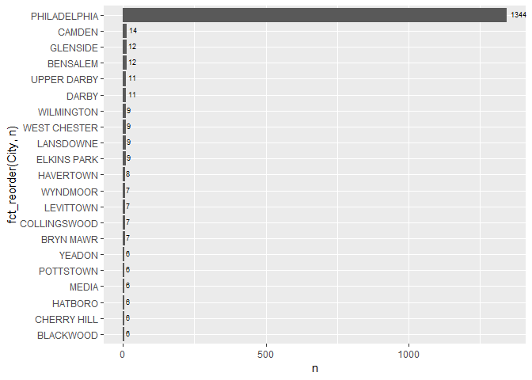

``` r
# .... apps_clean$State ----
str(apps_clean$State)
```

    ##  chr [1:1907] "PA" "PA" "PA" "PA" "PA" "PA" "PA" "PA" "PA" "PA" "PA" ...

``` r
summary(apps_clean$State)
```

    ##    Length     Class      Mode 
    ##      1907 character character

``` r
unique(apps_clean$State)
```

    ##  [1] "PA" "DE" "NJ" "NY" "CT" "IL" "MD" "CO" "MA" "LA" "NC" "MS" "GA" "CA"

``` r
apps_clean$State <- as.factor(apps_clean$State)
summary(apps_clean$State)
```

    ##   CA   CO   CT   DE   GA   IL   LA   MA   MD   MS   NC   NJ   NY   PA 
    ##    1    1    1   17    1    1    1    4   11    1    1  147    9 1711

``` r
# .... apps_clean$ZIP ----
str(apps_clean$ZIP)
```

    ##  chr [1:1907] "19107" "19103" "19104" "19143" "19134" "19129" "19102" ...

``` r
summary(apps_clean$ZIP)
```

    ##    Length     Class      Mode 
    ##      1907 character character

``` r
apps_clean$ZIP <- if_else(nchar(apps_clean$ZIP) == 4,
                          paste0("0",apps_clean$ZIP),
                          apps_clean$ZIP)
apps_clean$ZIP <- str_extract(apps_clean$ZIP, "^.{5}")
length(unique(apps_clean$ZIP))
```

    ## [1] 305

``` r
apps_clean$ZIP <- as.factor(apps_clean$ZIP)
summary(apps_clean$ZIP)
```

    ##   19104   19143   19146   19147   19148   19145   19131   19139   19103 
    ##     125      99      80      63      60      52      49      47      46 
    ##   19111   19121   19130   19124   19125   19107   19134   19149   19106 
    ##      38      38      38      29      29      28      27      27      26 
    ##   19123   19128   19142   19144   19120   19136   19102   19122   19135 
    ##      26      26      26      25      23      23      22      21      21 
    ##   19038   19115   19132   19050   19138   19152   19023   19114   19151 
    ##      20      20      19      18      17      17      16      16      15 
    ##   19119   19154   19020   19082   19140   19127   19150   19129   19027 
    ##      14      14      13      12      12      11      11      10       9 
    ##   08012   19083   19118   19133   19141   19153   08108   19010   19018 
    ##       8       8       8       8       8       8       7       7       7 
    ##   19067   19380   08104   19040   19444   19446   08002   18966   19002 
    ##       7       7       6       6       6       6       5       5       5 
    ##   19006   19026   19046   19053   19063   19126   19320   19426   19460 
    ##       5       5       5       5       5       5       5       5       5 
    ##   19464   08028   08043   08054   08103   08105   08106   19012   19015 
    ##       5       4       4       4       4       4       4       4       4 
    ##   19036   19057   19072   19096   19116   19454   08057   08060   08096 
    ##       4       4       4       4       4       4       3       3       3 
    ##   08107   08619   18901   18940   18951   18977   19003   19007 (Other) 
    ##       3       3       3       3       3       3       3       3     264 
    ##    NA's 
    ##       4

``` r
# Duplicates ----
all(duplicated(apps_clean) == FALSE)
```

    ## [1] TRUE

``` r
# Structure ----
colnames(apps_clean)
```

    ##   [1] "X1"                                                     
    ##   [2] "date_submitted"                                         
    ##   [3] "ideal_adoption_timeline"                                
    ##   [4] "reason_for_adoption"                                    
    ##   [5] "specific_animal"                                        
    ##   [6] "adults_in_home"                                         
    ##   [7] "children_in_home"                                       
    ##   [8] "all_household_agree"                                    
    ##   [9] "allergies"                                              
    ##  [10] "home_owner"                                             
    ##  [11] "home_pet_policy"                                        
    ##  [12] "experience"                                             
    ##  [13] "budget_monthly"                                         
    ##  [14] "budget_emergency"                                       
    ##  [15] "home_alone_avg"                                         
    ##  [16] "home_alone_max"                                         
    ##  [17] "pet_kept"                                               
    ##  [18] "exercise"                                               
    ##  [19] "needs"                                                  
    ##  [20] "return_pet"                                             
    ##  [21] "how_heard"                                              
    ##  [22] "outcome_trello_id"                                      
    ##  [23] "STATEFP"                                                
    ##  [24] "COUNTYFP"                                               
    ##  [25] "TRACTCE"                                                
    ##  [26] "GEOID"                                                  
    ##  [27] "NAME"                                                   
    ##  [28] "NAMELSAD"                                               
    ##  [29] "MTFCC"                                                  
    ##  [30] "FUNCSTAT"                                               
    ##  [31] "ALAND"                                                  
    ##  [32] "AWATER"                                                 
    ##  [33] "INTPTLAT"                                               
    ##  [34] "INTPTLON"                                               
    ##  [35] "City"                                                   
    ##  [36] "State"                                                  
    ##  [37] "ZIP"                                                    
    ##  [38] "animal_type"                                            
    ##  [39] "reason_for_adoption_myself"                             
    ##  [40] "reason_for_adoption_other"                              
    ##  [41] "reason_for_adoption_my_kids"                            
    ##  [42] "reason_for_adoption_mouser"                             
    ##  [43] "reason_for_adoption_gift"                               
    ##  [44] "reason_for_adoption_protection"                         
    ##  [45] "all_household_agree_yes"                                
    ##  [46] "all_household_agree_a_surprise"                         
    ##  [47] "all_household_agree_no"                                 
    ##  [48] "allergies_mildly_allergic"                              
    ##  [49] "allergies_no_allergies"                                 
    ##  [50] "allergies_not_sure"                                     
    ##  [51] "allergies_very_allergic"                                
    ##  [52] "experience_euthanized_a_pet"                            
    ##  [53] "experience_grew_up_with_pet"                            
    ##  [54] "experience_given_pet_to_another"                        
    ##  [55] "experience_pet_died_in_care"                            
    ##  [56] "experience_currently_have_pet"                          
    ##  [57] "experience_currently_pets_in_my_home_but_not_mine"      
    ##  [58] "experience_lived_wit_previous_housemates_pets"          
    ##  [59] "experience_never_lived_with_or_owned_a_pet_before"      
    ##  [60] "experience_pet_ran_away"                                
    ##  [61] "experience_given_a_pet_to_a_shelter"                    
    ##  [62] "experience_bred_sold_a_pet"                             
    ##  [63] "experience_given_to_shelter"                            
    ##  [64] "experience_had_pet_die"                                 
    ##  [65] "experience_euthanized"                                  
    ##  [66] "experience_grew_up_with"                                
    ##  [67] "experience_never_lived_or_owned"                        
    ##  [68] "experience_lived_with_housemate_pet"                    
    ##  [69] "experience_given_to_another"                            
    ##  [70] "experience_bred_sold"                                   
    ##  [71] "pet_kept_inside_only"                                   
    ##  [72] "pet_kept_leash_harness"                                 
    ##  [73] "pet_kept_inside_with_yard_access"                       
    ##  [74] "pet_kept_inside_outside"                                
    ##  [75] "pet_kept_outside_only"                                  
    ##  [76] "pet_kept_supervised_in_my_yard"                         
    ##  [77] "pet_kept_crate"                                         
    ##  [78] "pet_kept_other"                                         
    ##  [79] "pet_kept_unsupervised_access_to_my_yard_doggie_door_etc"
    ##  [80] "exercise_toy_mice"                                      
    ##  [81] "exercise_wand_toys"                                     
    ##  [82] "exercise_other_pets"                                    
    ##  [83] "exercise_not_much"                                      
    ##  [84] "exercise_other_cats"                                    
    ##  [85] "exercise_walks_on_leash"                                
    ##  [86] "exercise_playing_in_my_yard"                            
    ##  [87] "exercise_another_pet"                                   
    ##  [88] "exercise_jogging_together"                              
    ##  [89] "exercise_dog_parks"                                     
    ##  [90] "exercise_walks_off_leash"                               
    ##  [91] "return_pet_none"                                        
    ##  [92] "return_pet_new_baby"                                    
    ##  [93] "return_pet_not_enough_time"                             
    ##  [94] "return_pet_becomes_aggressive"                          
    ##  [95] "return_pet_allergies_appear"                            
    ##  [96] "return_pet_other"                                       
    ##  [97] "return_pet_vet_becomes_expensive"                       
    ##  [98] "return_pet_moving_too_far"                              
    ##  [99] "return_pet_litter_box_issues"                           
    ## [100] "return_pet_not_allowed_new_living_space"                
    ## [101] "return_pet_scratches_furniture"                         
    ## [102] "return_pet_pet_sheds"                                   
    ## [103] "return_pet_jumps_on_counters"                           
    ## [104] "return_pet_too_playful"                                 
    ## [105] "return_pet_not_housebroken"                             
    ## [106] "return_pet_destructive"                                 
    ## [107] "return_pet_jumps_on_furniture"                          
    ## [108] "how_heard_other"                                        
    ## [109] "how_heard_website"                                      
    ## [110] "how_heard_twitter"                                      
    ## [111] "how_heard_email"                                        
    ## [112] "how_heard_event"                                        
    ## [113] "how_heard_insta"                                        
    ## [114] "how_heard_facebook"

``` r
nrow(apps_clean)
```

    ## [1] 1907

``` r
head(apps_clean)
```

    ## # A tibble: 6 x 114
    ##      X1 date_submitted ideal_adoption_~ reason_for_adop~ specific_animal
    ##   <int> <chr>          <chr>            <chr>            <lgl>          
    ## 1     1 12/31/2018     today            myself,other     FALSE          
    ## 2     2 12/31/2018     today            myself           FALSE          
    ## 3     3 12/31/2018     today            myself           TRUE           
    ## 4     4 12/31/2018     today            myself           TRUE           
    ## 5     5 12/31/2018     one-month-or-mo~ myself           TRUE           
    ## 6     6 12/30/2018     today            myself           TRUE           
    ## # ... with 109 more variables: adults_in_home <dbl>,
    ## #   children_in_home <dbl>, all_household_agree <chr>, allergies <chr>,
    ## #   home_owner <fct>, home_pet_policy <fct>, experience <chr>,
    ## #   budget_monthly <dbl>, budget_emergency <dbl>, home_alone_avg <dbl>,
    ## #   home_alone_max <dbl>, pet_kept <chr>, exercise <chr>, needs <chr>,
    ## #   return_pet <chr>, how_heard <chr>, outcome_trello_id <chr>,
    ## #   STATEFP <fct>, COUNTYFP <fct>, TRACTCE <fct>, GEOID <fct>, NAME <fct>,
    ## #   NAMELSAD <fct>, MTFCC <fct>, FUNCSTAT <fct>, ALAND <fct>,
    ## #   AWATER <fct>, INTPTLAT <dbl>, INTPTLON <dbl>, City <fct>, State <fct>,
    ## #   ZIP <fct>, animal_type <chr>, reason_for_adoption_myself <lgl>,
    ## #   reason_for_adoption_other <lgl>, reason_for_adoption_my_kids <lgl>,
    ## #   reason_for_adoption_mouser <lgl>, reason_for_adoption_gift <lgl>,
    ## #   reason_for_adoption_protection <lgl>, all_household_agree_yes <lgl>,
    ## #   all_household_agree_a_surprise <lgl>, all_household_agree_no <lgl>,
    ## #   allergies_mildly_allergic <lgl>, allergies_no_allergies <lgl>,
    ## #   allergies_not_sure <lgl>, allergies_very_allergic <lgl>,
    ## #   experience_euthanized_a_pet <lgl>, experience_grew_up_with_pet <lgl>,
    ## #   experience_given_pet_to_another <lgl>,
    ## #   experience_pet_died_in_care <lgl>,
    ## #   experience_currently_have_pet <lgl>,
    ## #   experience_currently_pets_in_my_home_but_not_mine <lgl>,
    ## #   experience_lived_wit_previous_housemates_pets <lgl>,
    ## #   experience_never_lived_with_or_owned_a_pet_before <lgl>,
    ## #   experience_pet_ran_away <lgl>,
    ## #   experience_given_a_pet_to_a_shelter <lgl>,
    ## #   experience_bred_sold_a_pet <lgl>, experience_given_to_shelter <lgl>,
    ## #   experience_had_pet_die <lgl>, experience_euthanized <lgl>,
    ## #   experience_grew_up_with <lgl>, experience_never_lived_or_owned <lgl>,
    ## #   experience_lived_with_housemate_pet <lgl>,
    ## #   experience_given_to_another <lgl>, experience_bred_sold <lgl>,
    ## #   pet_kept_inside_only <lgl>, pet_kept_leash_harness <lgl>,
    ## #   pet_kept_inside_with_yard_access <lgl>, pet_kept_inside_outside <lgl>,
    ## #   pet_kept_outside_only <lgl>, pet_kept_supervised_in_my_yard <lgl>,
    ## #   pet_kept_crate <lgl>, pet_kept_other <lgl>,
    ## #   pet_kept_unsupervised_access_to_my_yard_doggie_door_etc <lgl>,
    ## #   exercise_toy_mice <lgl>, exercise_wand_toys <lgl>,
    ## #   exercise_other_pets <lgl>, exercise_not_much <lgl>,
    ## #   exercise_other_cats <lgl>, exercise_walks_on_leash <lgl>,
    ## #   exercise_playing_in_my_yard <lgl>, exercise_another_pet <lgl>,
    ## #   exercise_jogging_together <lgl>, exercise_dog_parks <lgl>,
    ## #   exercise_walks_off_leash <lgl>, return_pet_none <lgl>,
    ## #   return_pet_new_baby <lgl>, return_pet_not_enough_time <lgl>,
    ## #   return_pet_becomes_aggressive <lgl>,
    ## #   return_pet_allergies_appear <lgl>, return_pet_other <lgl>,
    ## #   return_pet_vet_becomes_expensive <lgl>,
    ## #   return_pet_moving_too_far <lgl>, return_pet_litter_box_issues <lgl>,
    ## #   return_pet_not_allowed_new_living_space <lgl>,
    ## #   return_pet_scratches_furniture <lgl>, return_pet_pet_sheds <lgl>,
    ## #   return_pet_jumps_on_counters <lgl>, return_pet_too_playful <lgl>,
    ## #   return_pet_not_housebroken <lgl>, ...

``` r
str(apps_clean)
```

    ## Classes 'tbl_df', 'tbl' and 'data.frame':    1907 obs. of  114 variables:
    ##  $ X1                                                     : int  1 2 3 4 5 6 7 8 9 10 ...
    ##  $ date_submitted                                         : chr  "12/31/2018" "12/31/2018" "12/31/2018" "12/31/2018" ...
    ##  $ ideal_adoption_timeline                                : chr  "today" "today" "today" "today" ...
    ##  $ reason_for_adoption                                    : chr  "myself,other" "myself" "myself" "myself" ...
    ##  $ specific_animal                                        : logi  FALSE FALSE TRUE TRUE TRUE TRUE ...
    ##  $ adults_in_home                                         : num  1 1 1 1 1 0 1 1 3 2 ...
    ##  $ children_in_home                                       : num  0 0 0 0 0 0 0 0 1 0 ...
    ##  $ all_household_agree                                    : chr  "yes" "yes" "yes" "yes" ...
    ##  $ allergies                                              : chr  "mildly-allergic" "no-allergies" "no-allergies" "no-allergies" ...
    ##  $ home_owner                                             : Factor w/ 5 levels "company","family-friend",..: 1 1 5 3 5 5 1 5 1 3 ...
    ##  $ home_pet_policy                                        : Factor w/ 5 levels "havent-asked",..: 4 1 NA NA NA NA 4 NA 4 NA ...
    ##  $ experience                                             : chr  "euthanized-a-pet,grew-up-with-pet" "given-pet-to-another" "given-pet-to-another,pet-died-in-care,euthanized-a-pet,grew-up-with-pet,currently-have-pet,currently-pets-in-my"| __truncated__ "euthanized-a-pet,grew-up-with-pet,currently-have-pet,lived-wit-previous-housemates-pets" ...
    ##  $ budget_monthly                                         : num  150 120 125 150 75 200 600 100 300 100 ...
    ##  $ budget_emergency                                       : num  1000 220 3000 500 1000 2000 10000 5000 500 2000 ...
    ##  $ home_alone_avg                                         : num  6 4 NA 7 10 8 0 8 NA 10 ...
    ##  $ home_alone_max                                         : num  6 6 3 10 12 18 8 9 NA 10 ...
    ##  $ pet_kept                                               : chr  "inside-only,leash-harness" "inside-only" "inside-only" "leash-harness" ...
    ##  $ exercise                                               : chr  "toy-mice,wand-toys" "wand-toys,toy-mice" "toy-mice,wand-toys,other-pets" "other-pets,toy-mice" ...
    ##  $ needs                                                  : chr  "nail-clip,scratching-post" "scratching-post,nail-clip" "nail-clip,scratching-post" "scratching-post" ...
    ##  $ return_pet                                             : chr  "none" "new-baby,not-enough-time" "none,becomes-aggressive" "none" ...
    ##  $ how_heard                                              : chr  NA NA "other" "website" ...
    ##  $ outcome_trello_id                                      : chr  NA NA "5bfecbeaf9c3e187eb632753" NA ...
    ##  $ STATEFP                                                : Factor w/ 2 levels "34","42": 2 2 2 2 2 2 2 2 2 2 ...
    ##  $ COUNTYFP                                               : Factor w/ 30 levels "1","3","5","7",..: 27 27 27 27 27 27 27 24 18 27 ...
    ##  $ TRACTCE                                                : Factor w/ 676 levels "100","200","300",..: 7 8 100 85 196 215 146 449 550 44 ...
    ##  $ GEOID                                                  : Factor w/ 693 levels "34001010501",..: 372 373 452 438 532 550 486 315 227 405 ...
    ##  $ NAME                                                   : Factor w/ 676 levels "1","2","3","4.01",..: 7 8 100 85 196 215 146 449 550 44 ...
    ##  $ NAMELSAD                                               : Factor w/ 676 levels "1","10.01","10.02",..: 550 604 657 637 146 245 91 206 483 366 ...
    ##  $ MTFCC                                                  : Factor w/ 1 level "G5020": 1 1 1 1 1 1 1 1 1 1 ...
    ##  $ FUNCSTAT                                               : Factor w/ 1 level "S": 1 1 1 1 1 1 1 1 1 1 ...
    ##  $ ALAND                                                  : Factor w/ 693 levels "99957","105511",..: 8 31 37 205 218 367 259 638 447 91 ...
    ##  $ AWATER                                                 : Factor w/ 295 levels "0","57","408",..: 1 51 1 1 1 171 121 1 250 1 ...
    ##  $ INTPTLAT                                               : num  39.9 40 40 39.9 40 ...
    ##  $ INTPTLON                                               : num  -75.2 -75.2 -75.2 -75.2 -75.1 ...
    ##  $ City                                                   : Factor w/ 251 levels "ABINGTON","ABSECON",..: 183 183 183 183 183 183 183 96 92 183 ...
    ##  $ State                                                  : Factor w/ 14 levels "CA","CO","CT",..: 14 14 14 14 14 14 14 14 14 14 ...
    ##  $ ZIP                                                    : Factor w/ 304 levels "01077","01945",..: 200 196 197 231 222 217 195 161 159 234 ...
    ##  $ animal_type                                            : chr  "cat" "cat" "cat" "cat" ...
    ##  $ reason_for_adoption_myself                             : logi  TRUE TRUE TRUE TRUE TRUE TRUE ...
    ##  $ reason_for_adoption_other                              : logi  TRUE FALSE FALSE FALSE FALSE FALSE ...
    ##  $ reason_for_adoption_my_kids                            : logi  FALSE FALSE FALSE FALSE FALSE FALSE ...
    ##  $ reason_for_adoption_mouser                             : logi  FALSE FALSE FALSE FALSE FALSE FALSE ...
    ##  $ reason_for_adoption_gift                               : logi  FALSE FALSE FALSE FALSE FALSE FALSE ...
    ##  $ reason_for_adoption_protection                         : logi  FALSE FALSE FALSE FALSE FALSE FALSE ...
    ##  $ all_household_agree_yes                                : logi  TRUE TRUE TRUE TRUE TRUE TRUE ...
    ##  $ all_household_agree_a_surprise                         : logi  FALSE FALSE FALSE FALSE FALSE FALSE ...
    ##  $ all_household_agree_no                                 : logi  FALSE FALSE FALSE FALSE FALSE FALSE ...
    ##  $ allergies_mildly_allergic                              : logi  TRUE FALSE FALSE FALSE FALSE FALSE ...
    ##  $ allergies_no_allergies                                 : logi  FALSE TRUE TRUE TRUE TRUE TRUE ...
    ##  $ allergies_not_sure                                     : logi  FALSE FALSE FALSE FALSE FALSE FALSE ...
    ##  $ allergies_very_allergic                                : logi  FALSE FALSE FALSE FALSE FALSE FALSE ...
    ##  $ experience_euthanized_a_pet                            : logi  TRUE FALSE TRUE TRUE FALSE FALSE ...
    ##  $ experience_grew_up_with_pet                            : logi  TRUE FALSE TRUE TRUE TRUE FALSE ...
    ##  $ experience_given_pet_to_another                        : logi  FALSE TRUE TRUE FALSE FALSE FALSE ...
    ##  $ experience_pet_died_in_care                            : logi  FALSE FALSE TRUE FALSE FALSE FALSE ...
    ##  $ experience_currently_have_pet                          : logi  FALSE FALSE TRUE TRUE TRUE TRUE ...
    ##  $ experience_currently_pets_in_my_home_but_not_mine      : logi  FALSE FALSE TRUE FALSE FALSE FALSE ...
    ##  $ experience_lived_wit_previous_housemates_pets          : logi  FALSE FALSE FALSE TRUE FALSE FALSE ...
    ##  $ experience_never_lived_with_or_owned_a_pet_before      : logi  FALSE FALSE FALSE FALSE FALSE FALSE ...
    ##  $ experience_pet_ran_away                                : logi  FALSE FALSE FALSE FALSE FALSE FALSE ...
    ##  $ experience_given_a_pet_to_a_shelter                    : logi  FALSE FALSE FALSE FALSE FALSE FALSE ...
    ##  $ experience_bred_sold_a_pet                             : logi  FALSE FALSE FALSE FALSE FALSE FALSE ...
    ##  $ experience_given_to_shelter                            : logi  FALSE FALSE FALSE FALSE FALSE FALSE ...
    ##  $ experience_had_pet_die                                 : logi  FALSE FALSE FALSE FALSE FALSE FALSE ...
    ##  $ experience_euthanized                                  : logi  FALSE FALSE FALSE FALSE FALSE FALSE ...
    ##  $ experience_grew_up_with                                : logi  FALSE FALSE FALSE FALSE FALSE FALSE ...
    ##  $ experience_never_lived_or_owned                        : logi  FALSE FALSE FALSE FALSE FALSE FALSE ...
    ##  $ experience_lived_with_housemate_pet                    : logi  FALSE FALSE FALSE FALSE FALSE FALSE ...
    ##  $ experience_given_to_another                            : logi  FALSE FALSE FALSE FALSE FALSE FALSE ...
    ##  $ experience_bred_sold                                   : logi  FALSE FALSE FALSE FALSE FALSE FALSE ...
    ##  $ pet_kept_inside_only                                   : logi  TRUE TRUE TRUE FALSE TRUE TRUE ...
    ##  $ pet_kept_leash_harness                                 : logi  TRUE FALSE FALSE TRUE FALSE FALSE ...
    ##  $ pet_kept_inside_with_yard_access                       : logi  FALSE FALSE FALSE FALSE FALSE FALSE ...
    ##  $ pet_kept_inside_outside                                : logi  FALSE FALSE FALSE FALSE FALSE FALSE ...
    ##  $ pet_kept_outside_only                                  : logi  FALSE FALSE FALSE FALSE FALSE FALSE ...
    ##  $ pet_kept_supervised_in_my_yard                         : logi  FALSE FALSE FALSE FALSE FALSE FALSE ...
    ##  $ pet_kept_crate                                         : logi  FALSE FALSE FALSE FALSE FALSE FALSE ...
    ##  $ pet_kept_other                                         : logi  FALSE FALSE FALSE FALSE FALSE FALSE ...
    ##  $ pet_kept_unsupervised_access_to_my_yard_doggie_door_etc: logi  FALSE FALSE FALSE FALSE FALSE FALSE ...
    ##  $ exercise_toy_mice                                      : logi  TRUE TRUE TRUE TRUE TRUE TRUE ...
    ##  $ exercise_wand_toys                                     : logi  TRUE TRUE TRUE FALSE TRUE TRUE ...
    ##  $ exercise_other_pets                                    : logi  FALSE FALSE TRUE TRUE TRUE TRUE ...
    ##  $ exercise_not_much                                      : logi  FALSE FALSE FALSE FALSE FALSE FALSE ...
    ##  $ exercise_other_cats                                    : logi  FALSE FALSE FALSE FALSE FALSE FALSE ...
    ##  $ exercise_walks_on_leash                                : logi  FALSE FALSE FALSE FALSE FALSE FALSE ...
    ##  $ exercise_playing_in_my_yard                            : logi  FALSE FALSE FALSE FALSE FALSE FALSE ...
    ##  $ exercise_another_pet                                   : logi  FALSE FALSE FALSE FALSE FALSE FALSE ...
    ##  $ exercise_jogging_together                              : logi  FALSE FALSE FALSE FALSE FALSE FALSE ...
    ##  $ exercise_dog_parks                                     : logi  FALSE FALSE FALSE FALSE FALSE FALSE ...
    ##  $ exercise_walks_off_leash                               : logi  FALSE FALSE FALSE FALSE FALSE FALSE ...
    ##  $ return_pet_none                                        : logi  TRUE FALSE TRUE TRUE FALSE FALSE ...
    ##  $ return_pet_new_baby                                    : logi  FALSE TRUE FALSE FALSE FALSE FALSE ...
    ##  $ return_pet_not_enough_time                             : logi  FALSE TRUE FALSE FALSE FALSE FALSE ...
    ##  $ return_pet_becomes_aggressive                          : logi  FALSE FALSE TRUE FALSE TRUE TRUE ...
    ##  $ return_pet_allergies_appear                            : logi  FALSE FALSE FALSE FALSE FALSE FALSE ...
    ##  $ return_pet_other                                       : logi  FALSE FALSE FALSE FALSE FALSE FALSE ...
    ##  $ return_pet_vet_becomes_expensive                       : logi  FALSE FALSE FALSE FALSE FALSE FALSE ...
    ##  $ return_pet_moving_too_far                              : logi  FALSE FALSE FALSE FALSE FALSE FALSE ...
    ##  $ return_pet_litter_box_issues                           : logi  FALSE FALSE FALSE FALSE FALSE FALSE ...
    ##   [list output truncated]
    ##  - attr(*, "spec")=List of 2
    ##   ..$ cols   :List of 37
    ##   .. ..$ X1                     : list()
    ##   .. .. ..- attr(*, "class")= chr  "collector_integer" "collector"
    ##   .. ..$ date_submitted         : list()
    ##   .. .. ..- attr(*, "class")= chr  "collector_character" "collector"
    ##   .. ..$ ideal_adoption_timeline: list()
    ##   .. .. ..- attr(*, "class")= chr  "collector_character" "collector"
    ##   .. ..$ reason_for_adoption    : list()
    ##   .. .. ..- attr(*, "class")= chr  "collector_character" "collector"
    ##   .. ..$ specific_animal        : list()
    ##   .. .. ..- attr(*, "class")= chr  "collector_logical" "collector"
    ##   .. ..$ adults_in_home         : list()
    ##   .. .. ..- attr(*, "class")= chr  "collector_character" "collector"
    ##   .. ..$ children_in_home       : list()
    ##   .. .. ..- attr(*, "class")= chr  "collector_integer" "collector"
    ##   .. ..$ all_household_agree    : list()
    ##   .. .. ..- attr(*, "class")= chr  "collector_character" "collector"
    ##   .. ..$ allergies              : list()
    ##   .. .. ..- attr(*, "class")= chr  "collector_character" "collector"
    ##   .. ..$ home_owner             : list()
    ##   .. .. ..- attr(*, "class")= chr  "collector_character" "collector"
    ##   .. ..$ home_pet_policy        : list()
    ##   .. .. ..- attr(*, "class")= chr  "collector_character" "collector"
    ##   .. ..$ experience             : list()
    ##   .. .. ..- attr(*, "class")= chr  "collector_character" "collector"
    ##   .. ..$ budget_monthly         : list()
    ##   .. .. ..- attr(*, "class")= chr  "collector_character" "collector"
    ##   .. ..$ budget_emergency       : list()
    ##   .. .. ..- attr(*, "class")= chr  "collector_character" "collector"
    ##   .. ..$ home_alone_avg         : list()
    ##   .. .. ..- attr(*, "class")= chr  "collector_character" "collector"
    ##   .. ..$ home_alone_max         : list()
    ##   .. .. ..- attr(*, "class")= chr  "collector_character" "collector"
    ##   .. ..$ pet_kept               : list()
    ##   .. .. ..- attr(*, "class")= chr  "collector_character" "collector"
    ##   .. ..$ exercise               : list()
    ##   .. .. ..- attr(*, "class")= chr  "collector_character" "collector"
    ##   .. ..$ needs                  : list()
    ##   .. .. ..- attr(*, "class")= chr  "collector_character" "collector"
    ##   .. ..$ return_pet             : list()
    ##   .. .. ..- attr(*, "class")= chr  "collector_character" "collector"
    ##   .. ..$ how_heard              : list()
    ##   .. .. ..- attr(*, "class")= chr  "collector_character" "collector"
    ##   .. ..$ outcome_trello_id      : list()
    ##   .. .. ..- attr(*, "class")= chr  "collector_character" "collector"
    ##   .. ..$ STATEFP                : list()
    ##   .. .. ..- attr(*, "class")= chr  "collector_integer" "collector"
    ##   .. ..$ COUNTYFP               : list()
    ##   .. .. ..- attr(*, "class")= chr  "collector_integer" "collector"
    ##   .. ..$ TRACTCE                : list()
    ##   .. .. ..- attr(*, "class")= chr  "collector_integer" "collector"
    ##   .. ..$ GEOID                  : list()
    ##   .. .. ..- attr(*, "class")= chr  "collector_double" "collector"
    ##   .. ..$ NAME                   : list()
    ##   .. .. ..- attr(*, "class")= chr  "collector_double" "collector"
    ##   .. ..$ NAMELSAD               : list()
    ##   .. .. ..- attr(*, "class")= chr  "collector_character" "collector"
    ##   .. ..$ MTFCC                  : list()
    ##   .. .. ..- attr(*, "class")= chr  "collector_character" "collector"
    ##   .. ..$ FUNCSTAT               : list()
    ##   .. .. ..- attr(*, "class")= chr  "collector_character" "collector"
    ##   .. ..$ ALAND                  : list()
    ##   .. .. ..- attr(*, "class")= chr  "collector_integer" "collector"
    ##   .. ..$ AWATER                 : list()
    ##   .. .. ..- attr(*, "class")= chr  "collector_integer" "collector"
    ##   .. ..$ INTPTLAT               : list()
    ##   .. .. ..- attr(*, "class")= chr  "collector_double" "collector"
    ##   .. ..$ INTPTLON               : list()
    ##   .. .. ..- attr(*, "class")= chr  "collector_double" "collector"
    ##   .. ..$ City                   : list()
    ##   .. .. ..- attr(*, "class")= chr  "collector_character" "collector"
    ##   .. ..$ State                  : list()
    ##   .. .. ..- attr(*, "class")= chr  "collector_character" "collector"
    ##   .. ..$ ZIP                    : list()
    ##   .. .. ..- attr(*, "class")= chr  "collector_character" "collector"
    ##   ..$ default: list()
    ##   .. ..- attr(*, "class")= chr  "collector_guess" "collector"
    ##   ..- attr(*, "class")= chr "col_spec"

``` r
summary(apps_clean)
```

    ##        X1         date_submitted     ideal_adoption_timeline
    ##  Min.   :   1.0   Length:1907        Length:1907            
    ##  1st Qu.: 239.0   Class :character   Class :character       
    ##  Median : 477.0   Mode  :character   Mode  :character       
    ##  Mean   : 529.4                                             
    ##  3rd Qu.: 792.5                                             
    ##  Max.   :1269.0                                             
    ##                                                             
    ##  reason_for_adoption specific_animal adults_in_home   children_in_home 
    ##  Length:1907         Mode :logical   Min.   : 0.000   Min.   : 0.0000  
    ##  Class :character    FALSE:839       1st Qu.: 0.000   1st Qu.: 0.0000  
    ##  Mode  :character    TRUE :1068      Median : 1.000   Median : 0.0000  
    ##                                      Mean   : 1.185   Mean   : 0.7866  
    ##                                      3rd Qu.: 1.000   3rd Qu.: 1.0000  
    ##                                      Max.   :56.000   Max.   :47.0000  
    ##                                                                        
    ##  all_household_agree  allergies                           home_owner 
    ##  Length:1907         Length:1907        company                :530  
    ##  Class :character    Class :character   family-friend          : 98  
    ##  Mode  :character    Mode  :character   family-member-or-friend:138  
    ##                                         landlord               :227  
    ##                                         myself                 :887  
    ##                                         NA's                   : 27  
    ##                                                                      
    ##             home_pet_policy  experience        budget_monthly     
    ##  havent-asked       : 103   Length:1907        Min.   :      0.0  
    ##  no-but-pets-allowed:  64   Class :character   1st Qu.:    100.0  
    ##  not-yet            :  14   Mode  :character   Median :    200.0  
    ##  yes                : 421                      Mean   :    928.2  
    ##  yes-with-pet-policy: 128                      3rd Qu.:    300.0  
    ##  NA's               :1177                      Max.   :1000000.0  
    ##                                                                   
    ##  budget_emergency        home_alone_avg   home_alone_max  
    ##  Min.   :            0   Min.   : 0.000   Min.   : 0.000  
    ##  1st Qu.:          400   1st Qu.: 4.000   1st Qu.: 5.000  
    ##  Median :         1000   Median : 6.000   Median : 8.000  
    ##  Mean   :    524388695   Mean   : 5.704   Mean   : 7.478  
    ##  3rd Qu.:         2000   3rd Qu.: 8.000   3rd Qu.: 9.000  
    ##  Max.   :1000000000000   Max.   :24.000   Max.   :48.000  
    ##                          NA's   :480      NA's   :492     
    ##    pet_kept           exercise            needs          
    ##  Length:1907        Length:1907        Length:1907       
    ##  Class :character   Class :character   Class :character  
    ##  Mode  :character   Mode  :character   Mode  :character  
    ##                                                          
    ##                                                          
    ##                                                          
    ##                                                          
    ##   return_pet         how_heard         outcome_trello_id  STATEFP    
    ##  Length:1907        Length:1907        Length:1907        34  : 146  
    ##  Class :character   Class :character   Class :character   42  :1708  
    ##  Mode  :character   Mode  :character   Mode  :character   NA's:  53  
    ##                                                                      
    ##                                                                      
    ##                                                                      
    ##                                                                      
    ##     COUNTYFP       TRACTCE             GEOID           NAME     
    ##  101    :1332   9000   :  25   42101009000:  25   90     :  25  
    ##  91     : 139   3100   :  23   42101003100:  23   31     :  23  
    ##  45     : 109   8701   :  20   42101008701:  20   87.01  :  20  
    ##  17     :  72   3002   :  18   42101003002:  18   30.02  :  18  
    ##  7      :  58   8702   :  15   42101008702:  15   87.02  :  15  
    ##  (Other): 144   (Other):1753   (Other)    :1753   (Other):1753  
    ##  NA's   :  53   NA's   :  53   NA's       :  53   NA's   :  53  
    ##     NAMELSAD      MTFCC      FUNCSTAT        ALAND          AWATER    
    ##  90     :  25   G5020:1854   S   :1854   434900 :  25   0      :1333  
    ##  31     :  23   NA's :  53   NA's:  53   395908 :  23   30728  :  13  
    ##  87.01  :  20                            259546 :  20   32791  :  13  
    ##  30.02  :  18                            226951 :  18   56473  :  10  
    ##  87.02  :  15                            283544 :  15   7087   :   9  
    ##  (Other):1753                            (Other):1753   (Other): 476  
    ##  NA's   :  53                            NA's   :  53   NA's   :  53  
    ##     INTPTLAT        INTPTLON                City          State     
    ##  Min.   :38.99   Min.   :-80.31   PHILADELPHIA:1344   PA     :1711  
    ##  1st Qu.:39.94   1st Qu.:-75.22   CAMDEN      :  14   NJ     : 147  
    ##  Median :39.97   Median :-75.17   BENSALEM    :  12   DE     :  17  
    ##  Mean   :40.01   Mean   :-75.17   GLENSIDE    :  12   MD     :  11  
    ##  3rd Qu.:40.04   3rd Qu.:-75.12   DARBY       :  11   NY     :   9  
    ##  Max.   :41.37   Max.   :-73.96   UPPER DARBY :  11   MA     :   4  
    ##  NA's   :53      NA's   :53       (Other)     : 503   (Other):   8  
    ##       ZIP       animal_type        reason_for_adoption_myself
    ##  19104  : 125   Length:1907        Mode :logical             
    ##  19143  :  99   Class :character   FALSE:214                 
    ##  19146  :  80   Mode  :character   TRUE :1646                
    ##  19147  :  63                      NA's :47                  
    ##  19148  :  60                                                
    ##  (Other):1476                                                
    ##  NA's   :   4                                                
    ##  reason_for_adoption_other reason_for_adoption_my_kids
    ##  Mode :logical             Mode :logical              
    ##  FALSE:1771                FALSE:1431                 
    ##  TRUE :89                  TRUE :429                  
    ##  NA's :47                  NA's :47                   
    ##                                                       
    ##                                                       
    ##                                                       
    ##  reason_for_adoption_mouser reason_for_adoption_gift
    ##  Mode :logical              Mode :logical           
    ##  FALSE:1755                 FALSE:1793              
    ##  TRUE :105                  TRUE :67                
    ##  NA's :47                   NA's :47                
    ##                                                     
    ##                                                     
    ##                                                     
    ##  reason_for_adoption_protection all_household_agree_yes
    ##  Mode :logical                  Mode :logical          
    ##  FALSE:1840                     FALSE:49               
    ##  TRUE :20                       TRUE :1858             
    ##  NA's :47                                              
    ##                                                        
    ##                                                        
    ##                                                        
    ##  all_household_agree_a_surprise all_household_agree_no
    ##  Mode :logical                  Mode :logical         
    ##  FALSE:1820                     FALSE:1901            
    ##  TRUE :87                       TRUE :6               
    ##                                                       
    ##                                                       
    ##                                                       
    ##                                                       
    ##  allergies_mildly_allergic allergies_no_allergies allergies_not_sure
    ##  Mode :logical             Mode :logical          Mode :logical     
    ##  FALSE:1764                FALSE:183              FALSE:1847        
    ##  TRUE :143                 TRUE :1724             TRUE :60          
    ##                                                                     
    ##                                                                     
    ##                                                                     
    ##                                                                     
    ##  allergies_very_allergic experience_euthanized_a_pet
    ##  Mode :logical           Mode :logical              
    ##  FALSE:1892              FALSE:1554                 
    ##  TRUE :15                TRUE :353                  
    ##                                                     
    ##                                                     
    ##                                                     
    ##                                                     
    ##  experience_grew_up_with_pet experience_given_pet_to_another
    ##  Mode :logical               Mode :logical                  
    ##  FALSE:918                   FALSE:1817                     
    ##  TRUE :989                   TRUE :90                       
    ##                                                             
    ##                                                             
    ##                                                             
    ##                                                             
    ##  experience_pet_died_in_care experience_currently_have_pet
    ##  Mode :logical               Mode :logical                
    ##  FALSE:1753                  FALSE:1214                   
    ##  TRUE :154                   TRUE :693                    
    ##                                                           
    ##                                                           
    ##                                                           
    ##                                                           
    ##  experience_currently_pets_in_my_home_but_not_mine
    ##  Mode :logical                                    
    ##  FALSE:1873                                       
    ##  TRUE :34                                         
    ##                                                   
    ##                                                   
    ##                                                   
    ##                                                   
    ##  experience_lived_wit_previous_housemates_pets
    ##  Mode :logical                                
    ##  FALSE:1438                                   
    ##  TRUE :469                                    
    ##                                               
    ##                                               
    ##                                               
    ##                                               
    ##  experience_never_lived_with_or_owned_a_pet_before experience_pet_ran_away
    ##  Mode :logical                                     Mode :logical          
    ##  FALSE:1821                                        FALSE:1843             
    ##  TRUE :86                                          TRUE :64               
    ##                                                                           
    ##                                                                           
    ##                                                                           
    ##                                                                           
    ##  experience_given_a_pet_to_a_shelter experience_bred_sold_a_pet
    ##  Mode :logical                       Mode :logical             
    ##  FALSE:1868                          FALSE:1902                
    ##  TRUE :39                            TRUE :5                   
    ##                                                                
    ##                                                                
    ##                                                                
    ##                                                                
    ##  experience_given_to_shelter experience_had_pet_die experience_euthanized
    ##  Mode :logical               Mode :logical          Mode :logical        
    ##  FALSE:1877                  FALSE:1820             FALSE:1715           
    ##  TRUE :30                    TRUE :87               TRUE :192            
    ##                                                                          
    ##                                                                          
    ##                                                                          
    ##                                                                          
    ##  experience_grew_up_with experience_never_lived_or_owned
    ##  Mode :logical           Mode :logical                  
    ##  FALSE:1409              FALSE:1870                     
    ##  TRUE :498               TRUE :37                       
    ##                                                         
    ##                                                         
    ##                                                         
    ##                                                         
    ##  experience_lived_with_housemate_pet experience_given_to_another
    ##  Mode :logical                       Mode :logical              
    ##  FALSE:1789                          FALSE:1869                 
    ##  TRUE :118                           TRUE :38                   
    ##                                                                 
    ##                                                                 
    ##                                                                 
    ##                                                                 
    ##  experience_bred_sold pet_kept_inside_only pet_kept_leash_harness
    ##  Mode :logical        Mode :logical        Mode :logical         
    ##  FALSE:1900           FALSE:74             FALSE:1812            
    ##  TRUE :7              TRUE :1803           TRUE :65              
    ##                       NA's :30             NA's :30              
    ##                                                                  
    ##                                                                  
    ##                                                                  
    ##  pet_kept_inside_with_yard_access pet_kept_inside_outside
    ##  Mode :logical                    Mode :logical          
    ##  FALSE:1816                       FALSE:1851             
    ##  TRUE :61                         TRUE :26               
    ##  NA's :30                         NA's :30               
    ##                                                          
    ##                                                          
    ##                                                          
    ##  pet_kept_outside_only pet_kept_supervised_in_my_yard pet_kept_crate 
    ##  Mode :logical         Mode :logical                  Mode :logical  
    ##  FALSE:1858            FALSE:1743                     FALSE:1818     
    ##  TRUE :19              TRUE :134                      TRUE :59       
    ##  NA's :30              NA's :30                       NA's :30       
    ##                                                                      
    ##                                                                      
    ##                                                                      
    ##  pet_kept_other  pet_kept_unsupervised_access_to_my_yard_doggie_door_etc
    ##  Mode :logical   Mode :logical                                          
    ##  FALSE:1855      FALSE:1861                                             
    ##  TRUE :22        TRUE :16                                               
    ##  NA's :30        NA's :30                                               
    ##                                                                         
    ##                                                                         
    ##                                                                         
    ##  exercise_toy_mice exercise_wand_toys exercise_other_pets
    ##  Mode :logical     Mode :logical      Mode :logical      
    ##  FALSE:709         FALSE:856          FALSE:1797         
    ##  TRUE :1150        TRUE :1003         TRUE :62           
    ##  NA's :48          NA's :48           NA's :48           
    ##                                                          
    ##                                                          
    ##                                                          
    ##  exercise_not_much exercise_other_cats exercise_walks_on_leash
    ##  Mode :logical     Mode :logical       Mode :logical          
    ##  FALSE:1658        FALSE:1415          FALSE:1255             
    ##  TRUE :201         TRUE :444           TRUE :604              
    ##  NA's :48          NA's :48            NA's :48               
    ##                                                               
    ##                                                               
    ##                                                               
    ##  exercise_playing_in_my_yard exercise_another_pet
    ##  Mode :logical               Mode :logical       
    ##  FALSE:1473                  FALSE:1551          
    ##  TRUE :386                   TRUE :308           
    ##  NA's :48                    NA's :48            
    ##                                                  
    ##                                                  
    ##                                                  
    ##  exercise_jogging_together exercise_dog_parks exercise_walks_off_leash
    ##  Mode :logical             Mode :logical      Mode :logical           
    ##  FALSE:1650                FALSE:1464         FALSE:1707              
    ##  TRUE :209                 TRUE :395          TRUE :152               
    ##  NA's :48                  NA's :48           NA's :48                
    ##                                                                       
    ##                                                                       
    ##                                                                       
    ##  return_pet_none return_pet_new_baby return_pet_not_enough_time
    ##  Mode :logical   Mode :logical       Mode :logical             
    ##  FALSE:770       FALSE:1895          FALSE:1878                
    ##  TRUE :1137      TRUE :12            TRUE :29                  
    ##                                                                
    ##                                                                
    ##                                                                
    ##                                                                
    ##  return_pet_becomes_aggressive return_pet_allergies_appear
    ##  Mode :logical                 Mode :logical              
    ##  FALSE:1311                    FALSE:1698                 
    ##  TRUE :596                     TRUE :209                  
    ##                                                           
    ##                                                           
    ##                                                           
    ##                                                           
    ##  return_pet_other return_pet_vet_becomes_expensive
    ##  Mode :logical    Mode :logical                   
    ##  FALSE:1844       FALSE:1820                      
    ##  TRUE :63         TRUE :87                        
    ##                                                   
    ##                                                   
    ##                                                   
    ##                                                   
    ##  return_pet_moving_too_far return_pet_litter_box_issues
    ##  Mode :logical             Mode :logical               
    ##  FALSE:1847                FALSE:1838                  
    ##  TRUE :60                  TRUE :69                    
    ##                                                        
    ##                                                        
    ##                                                        
    ##                                                        
    ##  return_pet_not_allowed_new_living_space return_pet_scratches_furniture
    ##  Mode :logical                           Mode :logical                 
    ##  FALSE:1882                              FALSE:1890                    
    ##  TRUE :25                                TRUE :17                      
    ##                                                                        
    ##                                                                        
    ##                                                                        
    ##                                                                        
    ##  return_pet_pet_sheds return_pet_jumps_on_counters return_pet_too_playful
    ##  Mode :logical        Mode :logical                Mode :logical         
    ##  FALSE:1895           FALSE:1900                   FALSE:1905            
    ##  TRUE :12             TRUE :7                      TRUE :2               
    ##                                                                          
    ##                                                                          
    ##                                                                          
    ##                                                                          
    ##  return_pet_not_housebroken return_pet_destructive
    ##  Mode :logical              Mode :logical         
    ##  FALSE:1867                 FALSE:1875            
    ##  TRUE :40                   TRUE :32              
    ##                                                   
    ##                                                   
    ##                                                   
    ##                                                   
    ##  return_pet_jumps_on_furniture how_heard_other how_heard_website
    ##  Mode :logical                 Mode :logical   Mode :logical    
    ##  FALSE:1905                    FALSE:675       FALSE:379        
    ##  TRUE :2                       TRUE :312       TRUE :608        
    ##                                NA's :920       NA's :920        
    ##                                                                 
    ##                                                                 
    ##                                                                 
    ##  how_heard_twitter how_heard_email how_heard_event how_heard_insta
    ##  Mode :logical     Mode :logical   Mode :logical   Mode :logical  
    ##  FALSE:983         FALSE:966       FALSE:951       FALSE:942      
    ##  TRUE :4           TRUE :21        TRUE :36        TRUE :45       
    ##  NA's :920         NA's :920       NA's :920       NA's :920      
    ##                                                                   
    ##                                                                   
    ##                                                                   
    ##  how_heard_facebook
    ##  Mode :logical     
    ##  FALSE:928         
    ##  TRUE :59          
    ##  NA's :920         
    ##                    
    ##                    
    ## 

``` r
# Write cleaned data ----
write_csv(apps_clean, "Analyses/2_Applicants/amygood/output/apps_clean.csv")
```
