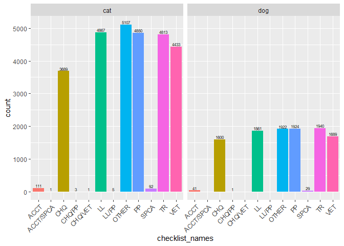
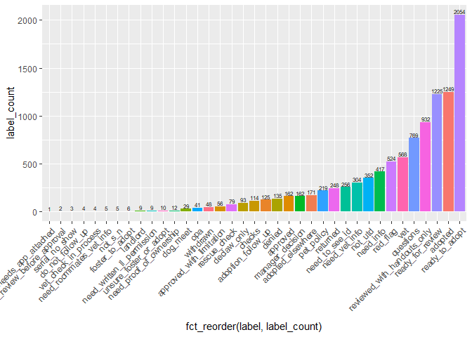

Initial data exploration
================
Amy Goodwin Davies

-   [Our questions:](#our-questions)
-   [Actions](#actions)
-   [Cards](#cards)

Our questions:
==============

-   2.1 How long does each step of an application take? (by animal species and PAWS location where available); i.e., from date of processing start, through checking off each checklist item, to the date and time when an animal was adopted.
-   2.2 What are the applicant and animal characteristics that predict a speedy adoption?
-   2.3 What are the applicant and animal characteristics that predict a denied application?
-   2.4 Are there seasonal patterns to adoptions?
-   2.5 What predicts an applicant who adopts elsewhere?

Load packages

``` r
library(tidyverse)
library(lubridate)
library(data.table)
library(forcats)
library(plyr)
```

Source helper function(s)

``` r
source("Analyses/2_Applicants/helper_functions.R")
```

Load data

``` r
cat_actions <- read_csv("Data/cat_actions.csv")
dog_actions <- read_csv("Data/dog_actions.csv")
cat_cards <- read_csv("Data/cat_cards.csv")
dog_cards <- read_csv("Data/dog_cards.csv")
cat_apps <- read_csv("Data/cat_apps.csv")
```

    ## Warning: Missing column names filled in: 'X1' [1]

``` r
dog_apps <- read_csv("Data/dog_apps.csv")
```

    ## Warning: Missing column names filled in: 'X1' [1]

``` r
petpoint <- read_csv("Data/petpoint.csv")
```

    ## Warning: Missing column names filled in: 'X1' [1]

Actions
=======

Create checklist\_names as a factor for each checklist name combination...

``` r
actions <- rbind(cat_actions, dog_actions)
actions$checklist_names <- ""
actions$checklist_names <- as.character(actions$checklist_names)
actions[actions$checklist_ACCT == TRUE,]$checklist_names <- 
  paste(actions[actions$checklist_ACCT == TRUE,]$checklist_names, "ACCT", sep = "/")
actions[actions$checklist_CHQ == TRUE,]$checklist_names <- 
  paste(actions[actions$checklist_CHQ == TRUE,]$checklist_names, "CHQ", sep = "/")
actions[actions$checklist_LL == TRUE,]$checklist_names <- 
  paste(actions[actions$checklist_LL == TRUE,]$checklist_names, "LL", sep = "/")
actions[actions$checklist_PP == TRUE,]$checklist_names <- 
  paste(actions[actions$checklist_PP == TRUE,]$checklist_names, "PP", sep = "/")
actions[actions$checklist_SPCA == TRUE,]$checklist_names <- 
  paste(actions[actions$checklist_SPCA == TRUE,]$checklist_names, "SPCA", sep = "/")
actions[actions$checklist_TR == TRUE,]$checklist_names <- 
  paste(actions[actions$checklist_TR == TRUE,]$checklist_names, "TR", sep = "/")
actions[actions$checklist_VET == TRUE,]$checklist_names <- 
  paste(actions[actions$checklist_VET == TRUE,]$checklist_names, "VET", sep = "/")
actions[actions$checklist_ACCT == FALSE &
          actions$checklist_CHQ == FALSE &
          actions$checklist_LL == FALSE &
          actions$checklist_PP == FALSE &
          actions$checklist_SPCA == FALSE &
          actions$checklist_TR == FALSE &
          actions$checklist_VET == FALSE,]$checklist_names <- "OTHER"
actions$checklist_names <- trimws(gsub("^/", " ", actions$checklist_names))
actions$checklist_names <- as.factor(actions$checklist_names)
summary(actions$checklist_names)
```

    ##      ACCT ACCT/SPCA       CHQ    CHQ/PP   CHQ/VET        LL     LL/PP 
    ##       152         1      5289         4         1      6728         5 
    ##     OTHER        PP      SPCA        TR       VET 
    ##      7029      6774       121      6753      6122

``` r
actions_summary <- ddply(actions, .(checklist_names, animal_type), summarise,
                         count = length(checklist_names))
ggplot(actions_summary, aes(x = fct_reorder(checklist_names, count), y = count)) +
  geom_bar(stat = "identity") +
  geom_text(aes(label = count), vjust = -0.25, position = "identity", size = 2.5) +
  theme(axis.text.x = element_text(angle = 45, hjust = 1)) +
  guides(fill=FALSE) +
  facet_wrap(~ animal_type)
```



Make wide version of data (each row corresponds to unique data.card.id)...

``` r
actions <- actions %>%
  dplyr::arrange(date) %>%
  dplyr::group_by(data.card.id) %>%
  dplyr::mutate(new_checklist_seq_num = seq_along(date))
wide_actions <- dcast(actions, formula = data.card.id + animal_type ~ new_checklist_seq_num, value.var = c("checklist_names"))
nrow(wide_actions) == length(unique(actions$data.card.id))
```

    ## [1] TRUE

``` r
wide_actions <- wide_actions %>% mutate_if(is.character, as.factor)
```

Cards
=====

``` r
cards <- rbind(dog_cards, cat_cards)
head(cards)
```

    ## # A tibble: 6 x 6
    ##   id      dateLastActivity dueComplete due        animal_type label_names 
    ##   <chr>   <date>           <lgl>       <date>     <chr>       <chr>       
    ## 1 5a6b7b~ 2018-01-31       FALSE       2018-01-26 dog         ready for r~
    ## 2 5a6d20~ 2018-01-31       TRUE        2018-01-27 dog         ready for r~
    ## 3 5a6a4f~ 2018-01-31       TRUE        2018-01-25 dog         not utd     
    ## 4 5a6533~ 2018-01-31       TRUE        2018-01-21 dog         not utd     
    ## 5 5a673b~ 2018-01-30       FALSE       NA         dog         need info   
    ## 6 5a6d23~ 2018-01-30       FALSE       NA         dog         need vet in~

``` r
length(unique(cards$id)) == nrow(cards)
```

    ## [1] TRUE

Create boolean variables for each label name...

``` r
str(cards$label_names)
```

    ##  chr [1:9989] "ready for review" "ready for review" "not utd" ...

``` r
summary(cards$label_names)
```

    ##    Length     Class      Mode 
    ##      9989 character character

``` r
length(unique(cards$label_names))
```

    ## [1] 819

``` r
label_names_tidy <- tidy_elements(cards, "label_names") # slow...
cards <- label_names_tidy$output_df
label_names_elements <- label_names_tidy$elements
label_names_new_colnames <- label_names_tidy$new_colnames
label_names_elements_summary <- label_names_tidy$elements_summary
ggplot(label_names_elements_summary, aes(x = fct_reorder(label_names, count), y = count)) +
  geom_bar(stat = "identity") +
  geom_text(aes(label = count), vjust = -0.25, position = "identity", size = 2.5) +
  theme(axis.text.x = element_text(angle = 45, hjust = 1)) +
  guides(fill=FALSE)
```



``` r
label_names_elements
```

    ##  [1] "ready for review"             "not utd"                     
    ##  [3] "need info"                    "need vet info"               
    ##  [5] "questions"                    "ready to adopt"              
    ##  [7] "withdrawn"                    "adopted"                     
    ##  [9] "returned"                     "pet policy"                  
    ## [11] "adopted elsewhere"            "need to see id"              
    ## [13] "denied"                       "red flag"                    
    ## [15] "dog meet"                     "manager decision"            
    ## [17] "rescue check"                 "approved with limitation"    
    ## [19] "approved"                     "reviewed with handouts only" 
    ## [21] "vet"                          "opa"                         
    ## [23] "checks"                       "unsure foster or adopt"      
    ## [25] "adoption follow up"           "needs app attached"          
    ## [27] "declaw only"                  "serial no show"              
    ## [29] "foster to adopt"              "needs review before approval"
    ## [31] "do not follow up"             "need written ll permission"  
    ## [33] "need proof of ownership"      "not s n"                     
    ## [35] "landlord"                     "vet check in process"        
    ## [37] "need roommates vet info"

``` r
label_names_new_colnames
```

    ##  [1] "label_names_ready_for_review"            
    ##  [2] "label_names_not_utd"                     
    ##  [3] "label_names_need_info"                   
    ##  [4] "label_names_need_vet_info"               
    ##  [5] "label_names_questions"                   
    ##  [6] "label_names_ready_to_adopt"              
    ##  [7] "label_names_withdrawn"                   
    ##  [8] "label_names_adopted"                     
    ##  [9] "label_names_returned"                    
    ## [10] "label_names_pet_policy"                  
    ## [11] "label_names_adopted_elsewhere"           
    ## [12] "label_names_need_to_see_id"              
    ## [13] "label_names_denied"                      
    ## [14] "label_names_red_flag"                    
    ## [15] "label_names_dog_meet"                    
    ## [16] "label_names_manager_decision"            
    ## [17] "label_names_rescue_check"                
    ## [18] "label_names_approved_with_limitation"    
    ## [19] "label_names_approved"                    
    ## [20] "label_names_reviewed_with_handouts_only" 
    ## [21] "label_names_vet"                         
    ## [22] "label_names_opa"                         
    ## [23] "label_names_checks"                      
    ## [24] "label_names_unsure_foster_or_adopt"      
    ## [25] "label_names_adoption_follow_up"          
    ## [26] "label_names_needs_app_attached"          
    ## [27] "label_names_declaw_only"                 
    ## [28] "label_names_serial_no_show"              
    ## [29] "label_names_foster_to_adopt"             
    ## [30] "label_names_needs_review_before_approval"
    ## [31] "label_names_do_not_follow_up"            
    ## [32] "label_names_need_written_ll_permission"  
    ## [33] "label_names_need_proof_of_ownership"     
    ## [34] "label_names_not_s_n"                     
    ## [35] "label_names_landlord"                    
    ## [36] "label_names_vet_check_in_process"        
    ## [37] "label_names_need_roommates_vet_info"

``` r
write_csv(cards, "Analyses/2_Applicants/amygood/output/cards_edited.csv")
```
