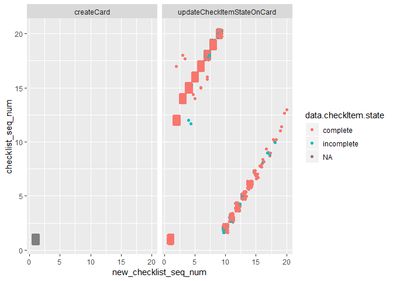
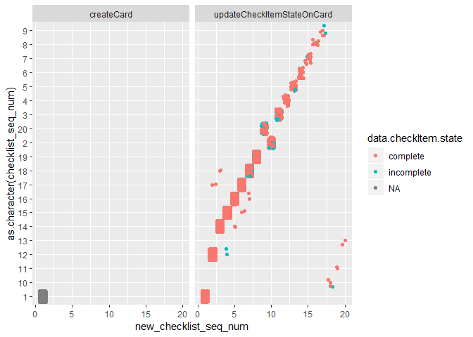

Initial data exploration
================
Amy Goodwin Davies

-   [Actions](#actions)
-   [Cards](#cards)
-   [Apps](#apps)

Load packages

``` r
library(tidyverse)
library(lubridate)
library(data.table)
library(forcats)
library(plyr)
```

Source helper function(s)

``` r
source("Analyses/2_Applicants/helper_functions.R")
```

Load data

``` r
cat_actions <- read_csv("Data/cat_actions.csv")
dog_actions <- read_csv("Data/dog_actions.csv")
cat_cards <- read_csv("Data/cat_cards.csv")
dog_cards <- read_csv("Data/dog_cards.csv")
cat_apps <- read_csv("Data/cat_apps.csv")
dog_apps <- read_csv("Data/dog_apps.csv")
```

Actions
-------

Create checklist\_names as a factor for each checklist name combination...

``` r
actions <- rbind(cat_actions, dog_actions)
actions$checklist_names <- ""
actions$checklist_names <- as.character(actions$checklist_names)
actions[actions$checklist_ACCT == TRUE,]$checklist_names <- 
  paste(actions[actions$checklist_ACCT == TRUE,]$checklist_names, "ACCT", sep = "/")
actions[actions$checklist_CHQ == TRUE,]$checklist_names <- 
  paste(actions[actions$checklist_CHQ == TRUE,]$checklist_names, "CHQ", sep = "/")
actions[actions$checklist_LL == TRUE,]$checklist_names <- 
  paste(actions[actions$checklist_LL == TRUE,]$checklist_names, "LL", sep = "/")
actions[actions$checklist_PP == TRUE,]$checklist_names <- 
  paste(actions[actions$checklist_PP == TRUE,]$checklist_names, "PP", sep = "/")
actions[actions$checklist_SPCA == TRUE,]$checklist_names <- 
  paste(actions[actions$checklist_SPCA == TRUE,]$checklist_names, "SPCA", sep = "/")
actions[actions$checklist_TR == TRUE,]$checklist_names <- 
  paste(actions[actions$checklist_TR == TRUE,]$checklist_names, "TR", sep = "/")
actions[actions$checklist_VET == TRUE,]$checklist_names <- 
  paste(actions[actions$checklist_VET == TRUE,]$checklist_names, "VET", sep = "/")
actions[actions$checklist_ACCT == FALSE &
          actions$checklist_CHQ == FALSE &
          actions$checklist_LL == FALSE &
          actions$checklist_PP == FALSE &
          actions$checklist_SPCA == FALSE &
          actions$checklist_TR == FALSE &
          actions$checklist_VET == FALSE,]$checklist_names <- "OTHER"
actions$checklist_names <- trimws(gsub("^/", " ", actions$checklist_names))
actions$checklist_names <- as.factor(actions$checklist_names)
summary(actions$checklist_names)
```

    ##      ACCT ACCT/SPCA       CHQ    CHQ/PP   CHQ/VET        LL     LL/PP 
    ##       152         1      5289         4         1      6728         5 
    ##     OTHER        PP      SPCA        TR       VET 
    ##      7029      6774       121      6753      6122

``` r
ggplot(actions, aes(x = checklist_names, fill = checklist_names)) +
  geom_bar(stat = "count") +
  geom_text(aes(label = ..count..), vjust = -0.25, stat = "count", position = "identity", size = 2) +
  theme(axis.text.x = element_text(angle = 45, hjust = 1)) +
  facet_wrap(~ animal_type) +
  guides(fill=FALSE)
```


Make wide version of data (each row corresponds to unique data.card.id)...

-   Why is the sequence numbering so strange? Looks like the original "checklist\_seq\_num" was treated as a character at some point messing up the ordering.

``` r
actions <- arrange(actions, date)
actions <- ddply(actions, .(data.card.id), mutate, new_checklist_seq_num = seq_along(date))
ggplot(actions, aes(x = new_checklist_seq_num, y = checklist_seq_num, colour = data.checkItem.state)) +
  geom_point() +
  geom_jitter() +
  facet_grid(. ~ type)
```



``` r
ggplot(actions, aes(x = new_checklist_seq_num, y = as.character(checklist_seq_num), colour = data.checkItem.state)) +
  geom_point() +
  geom_jitter() +
  facet_grid(. ~ type)
```



``` r
wide_actions <- dcast(actions, formula = data.card.id + animal_type ~ new_checklist_seq_num, value.var = c("checklist_names"))
nrow(wide_actions) == length(unique(actions$data.card.id))
```

    ## [1] TRUE

``` r
wide_actions <- wide_actions %>% mutate_if(is.character, as.factor)
summary(wide_actions)
```

    ##                    data.card.id  animal_type       1              2       
    ##  57acc2f1d4009ea56a2cb2be:   1   cat:5226    OTHER  :6893   PP     :2532  
    ##  57b0d0a3c473065ae66852c6:   1   dog:1983    PP     : 119   TR     :2408  
    ##  57bf545a4204dda43853983a:   1               TR     : 104   LL     : 601  
    ##  57ed4d88d27ca2801d342858:   1               VET    :  46   VET    : 528  
    ##  58027874ff46111221ad74ad:   1               CHQ    :  24   CHQ    : 483  
    ##  581ce61069899a9f8c04e021:   1               LL     :  18   (Other):  26  
    ##  (Other)                 :7203               (Other):   5   NA's   : 631  
    ##        3              4              5              6       
    ##  TR     :2293   LL     :2070   LL     :1919   VET    :2347  
    ##  PP     :2007   CHQ    :1689   VET    :1578   LL     : 799  
    ##  LL     : 962   TR     :1194   CHQ    :1445   CHQ    : 512  
    ##  CHQ    : 930   PP     : 921   PP     : 625   PP     : 356  
    ##  VET    : 332   VET    : 568   TR     : 474   TR     : 148  
    ##  (Other):  20   (Other):  23   (Other):  54   (Other):  99  
    ##  NA's   : 665   NA's   : 744   NA's   :1114   NA's   :2948  
    ##        7              8              9              10      
    ##  VET    : 371   VET    : 211   VET    :  63   VET    :  29  
    ##  LL     : 186   LL     :  99   LL     :  23   LL     :  15  
    ##  CHQ    : 108   PP     :  50   PP     :  21   PP     :  15  
    ##  PP     :  99   CHQ    :  40   TR     :  20   TR     :  15  
    ##  TR     :  43   TR     :  22   CHQ    :  17   CHQ    :  14  
    ##  (Other): 108   (Other):  44   (Other):  19   (Other):  10  
    ##  NA's   :6294   NA's   :6743   NA's   :7046   NA's   :7111  
    ##        11             12          13          14          15      
    ##  VET    :  17   PP     :  10   ACCT:   1   CHQ :   5   ACCT:   1  
    ##  PP     :  13   VET    :  10   CHQ :   5   LL  :   8   CHQ :   2  
    ##  TR     :  11   LL     :   7   LL  :   9   PP  :   2   LL  :   3  
    ##  CHQ    :   4   CHQ    :   6   PP  :   3   TR  :   3   TR  :   2  
    ##  LL     :   4   TR     :   6   TR  :   8   VET :   6   VET :   5  
    ##  (Other):   7   (Other):   2   VET :   7   NA's:7185   NA's:7196  
    ##  NA's   :7153   NA's   :7168   NA's:7176                          
    ##     16          17          18          19          20      
    ##  CHQ :   4   LL  :   3   LL  :   1   CHQ :   1   LL  :   1  
    ##  SPCA:   1   PP  :   1   TR  :   1   NA's:7208   NA's:7208  
    ##  VET :   3   TR  :   1   VET :   1                          
    ##  NA's:7201   NA's:7204   NA's:7206                          
    ##                                                             
    ##                                                             
    ## 

``` r
summary(wide_actions$`1`)
```

    ##  ACCT   CHQ    LL OTHER    PP  SPCA    TR   VET 
    ##     4    24    18  6893   119     1   104    46

``` r
summary(wide_actions$`2`)
```

    ##   ACCT    CHQ CHQ/PP     LL  OTHER     PP   SPCA     TR    VET   NA's 
    ##      6    483      1    601     13   2532      6   2408    528    631

``` r
summary(wide_actions$`3`)
```

    ##   ACCT    CHQ CHQ/PP     LL  OTHER     PP   SPCA     TR    VET   NA's 
    ##      5    930      3    962     10   2007      2   2293    332    665

``` r
summary(wide_actions$`4`)
```

    ##  ACCT   CHQ    LL OTHER    PP  SPCA    TR   VET  NA's 
    ##     7  1689  2070    11   921     5  1194   568   744

``` r
summary(wide_actions$`5`)
```

    ##  ACCT   CHQ    LL OTHER    PP  SPCA    TR   VET  NA's 
    ##    29  1445  1919    14   625    11   474  1578  1114

``` r
summary(wide_actions$`6`)
```

    ##  ACCT   CHQ    LL OTHER    PP  SPCA    TR   VET  NA's 
    ##    35   512   799    27   356    37   148  2347  2948

``` r
summary(wide_actions$`7`)
```

    ##      ACCT ACCT/SPCA       CHQ   CHQ/VET        LL     LL/PP     OTHER 
    ##        35         1       108         1       186         3        34 
    ##        PP      SPCA        TR       VET      NA's 
    ##        99        34        43       371      6294

``` r
summary(wide_actions$`8`)
```

    ##  ACCT   CHQ    LL LL/PP OTHER    PP  SPCA    TR   VET  NA's 
    ##    17    40    99     1    13    50    13    22   211  6743

``` r
summary(wide_actions$`9`)
```

    ##  ACCT   CHQ    LL LL/PP OTHER    PP  SPCA    TR   VET  NA's 
    ##     7    17    23     1     7    21     4    20    63  7046

``` r
summary(wide_actions$`10`)
```

    ##  ACCT   CHQ    LL OTHER    PP  SPCA    TR   VET  NA's 
    ##     2    14    15     3    15     5    15    29  7111

``` r
summary(wide_actions$`11`)
```

    ##  ACCT   CHQ    LL OTHER    PP  SPCA    TR   VET  NA's 
    ##     2     4     4     3    13     2    11    17  7153

``` r
summary(wide_actions$`12`)
```

    ##  ACCT   CHQ    LL OTHER    PP    TR   VET  NA's 
    ##     1     6     7     1    10     6    10  7168

``` r
summary(wide_actions$`13`)
```

    ## ACCT  CHQ   LL   PP   TR  VET NA's 
    ##    1    5    9    3    8    7 7176

``` r
summary(wide_actions$`14`)
```

    ##  CHQ   LL   PP   TR  VET NA's 
    ##    5    8    2    3    6 7185

``` r
summary(wide_actions$`15`)
```

    ## ACCT  CHQ   LL   TR  VET NA's 
    ##    1    2    3    2    5 7196

``` r
summary(wide_actions$`16`)
```

    ##  CHQ SPCA  VET NA's 
    ##    4    1    3 7201

Cards
-----

``` r
cards <- rbind(dog_cards, cat_cards)
head(cards)
```

    ## # A tibble: 6 x 6
    ##   id      dateLastActivity dueComplete due        animal_type label_names 
    ##   <chr>   <date>           <lgl>       <date>     <chr>       <chr>       
    ## 1 5a6b7b~ 2018-01-31       FALSE       2018-01-26 dog         ready for r~
    ## 2 5a6d20~ 2018-01-31       TRUE        2018-01-27 dog         ready for r~
    ## 3 5a6a4f~ 2018-01-31       TRUE        2018-01-25 dog         not utd     
    ## 4 5a6533~ 2018-01-31       TRUE        2018-01-21 dog         not utd     
    ## 5 5a673b~ 2018-01-30       FALSE       NA         dog         need info   
    ## 6 5a6d23~ 2018-01-30       FALSE       NA         dog         need vet in~

``` r
length(unique(cards$id)) == nrow(cards)
```

    ## [1] TRUE

Create boolean variables for each label name...

``` r
all_label_names_string <- do.call(paste, c(as.list(cards$label_names), sep = ","))
all_label_names <- unlist(strsplit(all_label_names_string, c(","))) 
label_name_list <- unique(trimws(all_label_names))
label_name_list <- label_name_list[label_name_list != ""]
label_name_list <- label_name_list[label_name_list != "NA"]
sort(label_name_list)
```

    ##  [1] "adopted"                      "adopted elsewhere"           
    ##  [3] "adoption follow up"           "approved"                    
    ##  [5] "approved with limitation"     "checks"                      
    ##  [7] "declaw only"                  "denied"                      
    ##  [9] "do not follow up"             "dog meet"                    
    ## [11] "foster to adopt"              "landlord"                    
    ## [13] "manager decision"             "need info"                   
    ## [15] "need proof of ownership"      "need roommates vet info"     
    ## [17] "need to see id"               "need vet info"               
    ## [19] "need written ll permission"   "needs app attached"          
    ## [21] "needs review before approval" "not s n"                     
    ## [23] "not utd"                      "opa"                         
    ## [25] "pet policy"                   "questions"                   
    ## [27] "ready for review"             "ready to adopt"              
    ## [29] "red flag"                     "rescue check"                
    ## [31] "returned"                     "reviewed with handouts only" 
    ## [33] "serial no show"               "unsure foster or adopt"      
    ## [35] "vet"                          "vet check in process"        
    ## [37] "withdrawn"

``` r
length(label_name_list)
```

    ## [1] 37

``` r
cards <- tidy_paws_labels(cards, "label_names", label_name_list) # see function in helper_functions.R (this is slow and can be improved)
summary(cards)
```

    ##       id            dateLastActivity     dueComplete    
    ##  Length:9989        Min.   :2017-12-01   Mode :logical  
    ##  Class :character   1st Qu.:2018-07-29   FALSE:7258     
    ##  Mode  :character   Median :2018-08-31   TRUE :2731     
    ##                     Mean   :2018-08-15                  
    ##                     3rd Qu.:2018-10-05                  
    ##                     Max.   :2019-01-22                  
    ##                                                         
    ##       due             animal_type        label_names       
    ##  Min.   :2016-08-11   Length:9989        Length:9989       
    ##  1st Qu.:2018-02-14   Class :character   Class :character  
    ##  Median :2018-07-19   Mode  :character   Mode  :character  
    ##  Mean   :2018-05-29                                        
    ##  3rd Qu.:2018-10-12                                        
    ##  Max.   :2019-01-26                                        
    ##  NA's   :2974                                              
    ##  ready_for_review not_utd        need_info      need_vet_info 
    ##  Mode:logical     Mode:logical   Mode:logical   Mode:logical  
    ##  TRUE:1225        TRUE:352       TRUE:417       TRUE:304      
    ##  NA's:8764        NA's:9637      NA's:9572      NA's:9685     
    ##                                                               
    ##                                                               
    ##                                                               
    ##                                                               
    ##  questions      ready_to_adopt withdrawn      adopted       
    ##  Mode:logical   Mode:logical   Mode:logical   Mode:logical  
    ##  TRUE:769       TRUE:2054      TRUE:48        TRUE:1249     
    ##  NA's:9220      NA's:7935      NA's:9941      NA's:8740     
    ##                                                             
    ##                                                             
    ##                                                             
    ##                                                             
    ##  returned       pet_policy     adopted_elsewhere need_to_see_id
    ##  Mode:logical   Mode:logical   Mode:logical      Mode:logical  
    ##  TRUE:248       TRUE:219       TRUE:171          TRUE:256      
    ##  NA's:9741      NA's:9770      NA's:9818         NA's:9733     
    ##                                                                
    ##                                                                
    ##                                                                
    ##                                                                
    ##   denied        red_flag       dog_meet       manager_decision
    ##  Mode:logical   Mode:logical   Mode:logical   Mode:logical    
    ##  TRUE:135       TRUE:524       TRUE:29        TRUE:162        
    ##  NA's:9854      NA's:9465      NA's:9960      NA's:9827       
    ##                                                               
    ##                                                               
    ##                                                               
    ##                                                               
    ##  rescue_check   approved_with_limitation approved      
    ##  Mode:logical   Mode:logical             Mode:logical  
    ##  TRUE:79        TRUE:56                  TRUE:162      
    ##  NA's:9910      NA's:9933                NA's:9827     
    ##                                                        
    ##                                                        
    ##                                                        
    ##                                                        
    ##  reviewed_with_handouts_only   vet            opa           checks       
    ##  Mode:logical                Mode:logical   Mode:logical   Mode:logical  
    ##  TRUE:932                    TRUE:568       TRUE:41        TRUE:114      
    ##  NA's:9057                   NA's:9421      NA's:9948      NA's:9875     
    ##                                                                          
    ##                                                                          
    ##                                                                          
    ##                                                                          
    ##  unsure_foster_or_adopt adoption_follow_up needs_app_attached
    ##  Mode:logical           Mode:logical       Mode:logical      
    ##  TRUE:10                TRUE:125           TRUE:1            
    ##  NA's:9979              NA's:9864          NA's:9988         
    ##                                                              
    ##                                                              
    ##                                                              
    ##                                                              
    ##  declaw_only    serial_no_show foster_to_adopt
    ##  Mode:logical   Mode:logical   Mode:logical   
    ##  TRUE:93        TRUE:3         TRUE:6         
    ##  NA's:9896      NA's:9986      NA's:9983      
    ##                                               
    ##                                               
    ##                                               
    ##                                               
    ##  needs_review_before_approval do_not_follow_up need_written_ll_permission
    ##  Mode:logical                 Mode:logical     Mode:logical              
    ##  TRUE:2                       TRUE:4           TRUE:9                    
    ##  NA's:9987                    NA's:9985        NA's:9980                 
    ##                                                                          
    ##                                                                          
    ##                                                                          
    ##                                                                          
    ##  need_proof_of_ownership not_s_n        landlord      
    ##  Mode:logical            Mode:logical   Mode:logical  
    ##  TRUE:12                 TRUE:5         TRUE:9        
    ##  NA's:9977               NA's:9984      NA's:9980     
    ##                                                       
    ##                                                       
    ##                                                       
    ##                                                       
    ##  vet_check_in_process need_roommates_vet_info
    ##  Mode:logical         Mode:logical           
    ##  TRUE:4               TRUE:5                 
    ##  NA's:9985            NA's:9984              
    ##                                              
    ##                                              
    ##                                              
    ## 

``` r
cards_labels <- cards[!names(cards) %in% c("id", "dateLastActivity", "dueComplete", "due", "animal_type", "label_names")]
cards_labels_summary <- as.data.frame(colSums(cards_labels, na.rm = TRUE))
cards_labels_summary$label <- rownames(cards_labels_summary)
colnames(cards_labels_summary)[1] <- "label_count"
cards_labels_summary
```

    ##                              label_count                        label
    ## ready_for_review                    1225             ready_for_review
    ## not_utd                              352                      not_utd
    ## need_info                            417                    need_info
    ## need_vet_info                        304                need_vet_info
    ## questions                            769                    questions
    ## ready_to_adopt                      2054               ready_to_adopt
    ## withdrawn                             48                    withdrawn
    ## adopted                             1249                      adopted
    ## returned                             248                     returned
    ## pet_policy                           219                   pet_policy
    ## adopted_elsewhere                    171            adopted_elsewhere
    ## need_to_see_id                       256               need_to_see_id
    ## denied                               135                       denied
    ## red_flag                             524                     red_flag
    ## dog_meet                              29                     dog_meet
    ## manager_decision                     162             manager_decision
    ## rescue_check                          79                 rescue_check
    ## approved_with_limitation              56     approved_with_limitation
    ## approved                             162                     approved
    ## reviewed_with_handouts_only          932  reviewed_with_handouts_only
    ## vet                                  568                          vet
    ## opa                                   41                          opa
    ## checks                               114                       checks
    ## unsure_foster_or_adopt                10       unsure_foster_or_adopt
    ## adoption_follow_up                   125           adoption_follow_up
    ## needs_app_attached                     1           needs_app_attached
    ## declaw_only                           93                  declaw_only
    ## serial_no_show                         3               serial_no_show
    ## foster_to_adopt                        6              foster_to_adopt
    ## needs_review_before_approval           2 needs_review_before_approval
    ## do_not_follow_up                       4             do_not_follow_up
    ## need_written_ll_permission             9   need_written_ll_permission
    ## need_proof_of_ownership               12      need_proof_of_ownership
    ## not_s_n                                5                      not_s_n
    ## landlord                               9                     landlord
    ## vet_check_in_process                   4         vet_check_in_process
    ## need_roommates_vet_info                5      need_roommates_vet_info

``` r
ggplot(cards_labels_summary, aes(x = fct_reorder(label, label_count), y = label_count, fill = label)) +
  geom_bar(stat = "identity") +
  geom_text(aes(label = label_count), vjust = -0.25, position = "identity", size = 2) +
  theme(axis.text.x = element_text(angle = 45, hjust = 1)) +
  guides(fill=FALSE)
```


Apps
----

``` r
apps <- rbind(cat_apps, dog_apps)
apps$outcome_trello_id <- as.factor(apps$outcome_trello_id)
apps_with_trello_id <- subset(apps, !is.na(apps$outcome_trello_id))
nrow(apps_with_trello_id)
```

    ## [1] 1631

``` r
length(unique(apps_with_trello_id$outcome_trello_id)) == nrow(apps_with_trello_id)
```

    ## [1] FALSE

``` r
length(unique(apps_with_trello_id$outcome_trello_id)) # some duplicates
```

    ## [1] 1593
