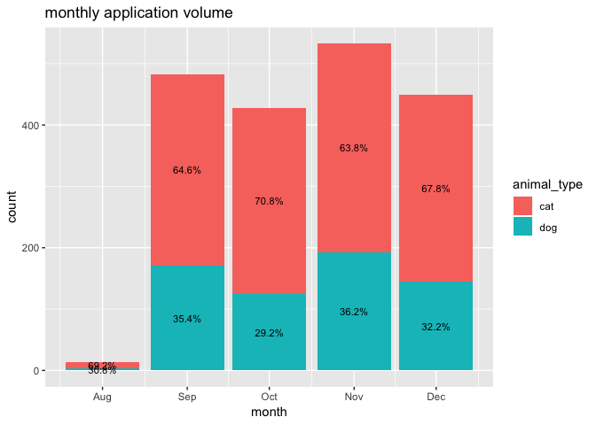
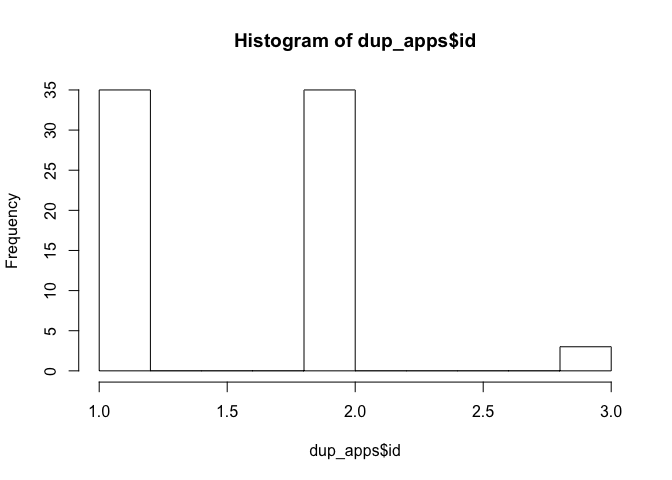

PAWS EDA
================
Brendan Graham

-   [Read in Data](#read-in-data)
-   [Dataset Overview and Questions](#dataset-overview-and-questions)
    -   [Data Generation Process and Some Notes / Questions](#data-generation-process-and-some-notes-questions)
    -   [Data Model](#data-model)
-   [Check for duplicates and missing data](#check-for-duplicates-and-missing-data)
-   [Check data model assumptions](#check-data-model-assumptions)
-   [Applications](#applications)
    -   [Application volume by month](#application-volume-by-month)
    -   [Visualizing duplicate applications](#visualizing-duplicate-applications)
-   [Cards](#cards)
    -   [Method for splitting cards into separate rows based on label names](#method-for-splitting-cards-into-separate-rows-based-on-label-names)
-   [Actions](#actions)
    -   [Method to collapse actions into 1 row per id](#method-to-collapse-actions-into-1-row-per-id)
-   [Looking into Successful/Unsuccessful Apps](#looking-into-successfulunsuccessful-apps)
-   [Ideal Dataset](#ideal-dataset)

Read in Data
------------

``` r
#load data

cat_actions <- readr::read_csv(file = "Data/cat_actions.csv") %>%  
  mutate(animal_type = "cat") 
cat_apps <- readr::read_csv(file = "Data/cat_apps.csv" ) %>%
  mutate(animal_type = "cat")
cat_cards <- readr::read_csv(file = "Data/cat_cards.csv") %>%
  mutate(animal_type = "cat")

 
dog_actions <- readr::read_csv(file = "Data/dog_actions.csv") %>% 
  mutate(animal_type = "dog")
dog_apps <- readr::read_csv(file = "Data/dog_apps.csv") %>% 
  mutate(animal_type = "dog")
dog_cards <- readr::read_csv(file = "Data/dog_cards.csv") %>%
  mutate(animal_type = "dog")

pets <-  readr::read_csv(file = "Data/petpoint.csv")

 
#combine
apps_raw <- rbind(cat_apps, dog_apps)
cards_raw <- rbind(cat_cards, dog_cards)
actions_raw <- rbind(cat_actions, dog_actions)
```

Dataset Overview and Questions
------------------------------

### Data Generation Process and Some Notes / Questions

*(based on notes from meeting, may be innacurate)*

-   **Applications:** `dog_apps.csv` and `cat_apps.csv`
    -   filled out and submitted online
    -   applications range from 2018-08-30 to 2018-12-31
        -   *Note: may not be enough data for timeseries/seasonal approach*
    -   every one needs to be triaged by PAWS staff, can we help automate its or make it easier somehow?
    -   Every application should have a card associated with it (cards are auto-generated with an online application)
    -   **<span style="color:red">Question</span>: some applications have no `outcome_trello_id`, does ths mean they do not have a card associated with them? if so, how can we tell the outcome? May need to remove these applications**
    -   **<span style="color:red">Question</span>: some `outcome_trello_id`'s appear twice (see Appicaitons section below, or id = `5bfecbeaf9c3e187eb632753` for example), are these duplicates?**

<br>

-   **Cards:** `cat_cards.csv` and `dog_cards.csv`
    -   keeps track of last state of the application via `label_names` column
    -   cards range from 2017-12-01 to 2019-01-22
        -   *Note: cards seem to include data before the min application date, so maybe not all rows will not be necessary*
    -   data is 1 row per id
        -   *Note: Can have multiple labels per id, keep in mind when trying to categorize an application as successful or not*
    -   based on the definition in the codebook, `dateLastActivity` should match the max `date` for the corresponding id in the `actions` data
        -   *this does not hold for id = `5bfecbeaf9c3e187eb632753`*
    -   **<span style="color:red">Question</span>: It seems like when `dueComplete == TRUE`, it means the app was marked complete and there should be a corresponing date in `due`, but there are 6 records with blank dates where `dueComplete == TRUE`**
    -   **<span style="color:red">Question</span>: On the flipside, it seems like when `dueComplete == FALSE`, it means the app was not marked complete and they lost contact with applicant. In this case there should not be a corresponing date in `due`, but there there 4,290 records with completed application dates where `dueComplete == FALSE`**
    -   **<span style="color:red">Question</span>: It seems like some cards can be labelled with "adopted"" even though `dueComplete == FALSE`, see id = `5bfecbeaf9c3e187eb632753` for example**

<br>

-   **Actions:** `cat_actions.csv` and `dog_actions.csv`
    -   actions are things done to the cards
    -   actions track of the application process via the checklist columns & associated time stamps
    -   the `data.checkItem.state` column indicates the action taken for the given column at the specified date time
    -   the action is modifying the column to either complete or incomplete
    -   When the `type == createCard`, `data.checkItem.state` is always `NA` b/c the card is only being created at this step
    -   since all columns will be FALSE when `type == createCard`, it may make sense to split this data set into `type == createCard` for the card create date only, and `type == updateCheckItemStateOnCard` to get only the actions done after card was created
        -   may want to compare the `date` entry for the `type == createCard` data set to the `dateLastActivity` entry in the cards data to get the application time frame
    -   may want to check that when `type == createCard` the `date` is the same as the `date_submitted` in the applications data for each corresponding ID
    -   *Note: Can have multiple rows per id (1 for each action taken on the card)*
    -   **<span style="color:red">Question</span>: Why doesn't every `data.card.id` in the `actions` have a `createCard` type variable? some have it and some don't?**

<br>

-   **A Weird Example Case**
    -   ID = `5bfecbeaf9c3e187eb632753` has a lot of weird things going on
        -   2 seemingly different apps are associated with this ID in `apps_raw` data set
        -   seems like this ID in the `cards` data set was a successful adoption, **but** has no entry date in `due` and `dueComplete == FALSE`
        -   the `dateLastActiviy` in the `cards` data set does not match the max date in `actions` data set
        -   seems like there weren't any actions taken in the `actions` data for this ID, but based on the `cards` data for this ID, seems like a successful adoption

<br>

### Data Model

Based on the codebook and looking over the data, it seems the data sets are related in the following way:

-   `apps` joins to `cards` on `outcome_trello_id = id`
-   `cards` joins to `actions` on `id = data.card.id`
-   `apps` joins to `actions`on `outcome_trello_id = data.card.id` (but probably won't need to join these 2 directly)

Check for duplicates and missing data
-------------------------------------

``` r
#applications
missing_app_ids <- apps_raw %>%
  filter(is.na(outcome_trello_id))

dup_app_ids <- apps_raw %>%
  filter(!is.na(outcome_trello_id)) %>%
  group_by(outcome_trello_id) %>%
  summarise(count = n()) %>%
  filter(count > 1)

#cards
missing_card_ids <- cards_raw %>%
  filter(is.na(id))

dup_cards <- cards_raw  %>%
  filter(!is.na(id)) %>%
  group_by(id) %>%
  summarise(count = n()) %>%
  filter(count > 1)

#actions
missing_action_ids <- actions_raw %>%
  filter(is.na(data.card.id))

dup_actions <- actions_raw  %>%
  filter(!is.na(data.card.id)) %>%
  group_by(data.card.id) %>%
  summarise(count = n()) %>%
  filter(count > 1) 

missing_dups <- data.frame("Missing App IDs" = nrow(missing_app_ids), 
                          "Missing Card IDs" = nrow(missing_card_ids), 
                          "Missing Action IDs" = nrow(missing_action_ids),
                          "Duplicate App IDs" = nrow(dup_app_ids),
                          "Duplicate Card IDs" = nrow(dup_cards),
                          "Duplicate Action IDs" = nrow(dup_actions))

kable(missing_dups)
```

| Missing.App.IDs | Missing.Card.IDs | Missing.Action.IDs | Duplicate.App.IDs | Duplicate.Card.IDs | Duplicate.Action.IDs |
|:---------------:|:----------------:|:------------------:|:-----------------:|:------------------:|:--------------------:|
|       276       |         0        |          0         |         35        |          0         |         6578         |

Seems like there are 276 applications with no `outcome_trello_id`, and 35 applications with duplicate `outcome_trello_id`. The 6,578 duplicate action IDs are expected since that data set contains 1 row per action and a card can have multiple actions taken on it.

Check data model assumptions
----------------------------

checking a few things that can impact the data when joining these data sets

1.  check that every unique `application` (that has an ID) has a corresponding `card`
2.  check that there is at least 1 record in the `actions` data set for every `card`
3.  check that the application `submit_dt` is the same as the date the `createCard` action was taken (for those cards that have `createCard`)

``` r
#check every unique application, that has an ID, has a corresponding card
app_card_check <- apps_raw %>%
  filter(!is.na(outcome_trello_id)) %>%
  select(outcome_trello_id) %>%
  unique() %>%
  left_join(., cards_raw, by = c("outcome_trello_id" = "id")) %>%
  #these are all the cols in `one_row_per_action`, so if theyre all NULL then there's no corresponding entry
  filter(is.na(dateLastActivity),
         is.na(dueComplete),
         is.na(due),
         is.na(animal_type),
         is.na(label_names)
         )

nrow(app_card_check) # 6 apps with no card
```

    ## [1] 6

``` r
#check that there is at least 1 record in the actions dataset for every card
one_row_per_action <- actions_raw %>%
  select(data.card.id, date, type) %>%
  group_by(data.card.id) %>%
  mutate(row_num = row_number()) %>%
  filter(row_num == 1)

card_action_check <- cards_raw %>%
  left_join(., one_row_per_action, by = c("id" = "data.card.id")) %>%
  #these are all the cols in `one_row_per_action`, so if theyre all NULL then there's no corresponding entry
  filter(is.na(date),
         is.na(type),
         is.na(row_num))

nrow(card_action_check) # 2839 cards with no actions
```

    ## [1] 2839

``` r
# check that the application `submit_dt` is the same as the date the `createCard` action was taken (for those cards that have `createCard`)
created <- actions_raw %>%
  filter(type == "createCard") %>%
  select(type, date, data.card.id) %>%
  mutate(date = as.Date(date))

unique_apps <- apps_raw %>%
  filter(!is.na(outcome_trello_id)) %>%
  select(outcome_trello_id, date_submitted) %>%
  unique()

date_check <- created %>%
  left_join(., unique_apps, by = c( "data.card.id" = "outcome_trello_id")) %>%
  filter(!(is.na(date_submitted))) %>%
  mutate(date_check = ifelse(mdy(date_submitted) == as.Date(date), 1, 0)) %>%
  filter(date_check == 0)

nrow(date_check) # 407 cards with different create dates from the application submit date, which date should we use for the application timeframe?
```

    ## [1] 407

Applications
------------

### Application volume by month

``` r
apps_raw %>%
  mutate(date_submitted = lubridate::mdy(date_submitted),
         month = lubridate::floor_date(date_submitted, "month")) %>%
  group_by(month, animal_type) %>%
  summarise(count = n()) %>%
  mutate(freq = count/sum(count))  %>%
  ggplot(aes(x = month, y = count, fill = animal_type, label = scales::percent(freq))) +
  geom_bar(stat = "identity") +
  labs(title = "monthly application volume") +
  geom_text(size = 3, position = position_stack(vjust = 0.5))
```



### Visualizing duplicate applications

``` r
#create dataset with only duplicate apps
dup_apps <- apps_raw %>%
  filter(outcome_trello_id %in% dup_app_ids$outcome_trello_id) %>%
  group_by(outcome_trello_id) %>%
  mutate(id = row_number())

#most dups are people applying twice. 3 people have applied 3 times
hist(dup_apps$id)
```



Cards
-----

### Method for splitting cards into separate rows based on label names

might be needed for categorizing an application as successful or not. Also might be a good way to see if there is some common reasons why applications aren't successful.

``` r
split_cards <- cards_raw %>% 
    mutate(label_names = strsplit(as.character(label_names), ",")) %>% 
    unnest(label_names) %>%
     mutate(label_names = trimws(label_names),
            #renaming "adopted elsewhere" so regex can ID successful adoptions easier
            label_names = ifelse(label_names == "adopted elsewhere", "elsewhere", label_names))

#create some application outcome categories
adopted <- c("adopted", "adoption follow up")
mgr <- "manager decision"
ready <- c("approved", "ready to adopt", "ready for review", "reviewed with handouts only", "approved with limitation")
not_adopted <- c("denied", "withdrawn", "do not follow up", "red flag", "serial no show", "elsewhere")
adopted_elsewhere <- "elsewhere"
vet <- c("vet", "vet check in process", "need vet info", "need roommates vet info")
pet_issues <- c("not utd", "questions", "not s n", "dog meet")
more_info_needed <- c("need to see id", "need info", "needs app attached", "rescue check", "checks")
housing_landlord <- c("pet policy", "need written ll permission", "opa", "need proof of ownership", "landlord")

#assign labels to category
split_cards <- split_cards %>%
  mutate(label_names = trimws(label_names)) %>%
  ungroup() %>%
  rowwise() %>% 
  mutate(category = case_when(
    grepl(paste(adopted, collapse = '|'), label_names) ~ "adopted",
    grepl(paste(adopted_elsewhere, collapse = '|'), label_names) ~ "adopted elsewhere",
    grepl(paste(mgr,collapse = '|'), label_names) ~ "manager",
    grepl(paste(not_adopted,collapse = '|'), label_names) ~ "not_adopted",
    grepl(paste(ready, collapse = "|"), label_names) ~ "ready",
    grepl(paste(vet,collapse = '|'), label_names)  ~ "vet",
    grepl(paste(pet_issues,collapse = '|'), label_names)  ~ "pet_issues",
    grepl(paste(more_info_needed, collapse = '|'), label_names)  ~ "more_info_needed",
    grepl(paste(housing_landlord, collapse = '|'),label_names) ~ "housing_landlord",
    TRUE ~ 'other'
  ))

kable(head(split_cards, 15))
```

|            id            | dateLastActivity | dueComplete |     due    | animal\_type |   label\_names   |   category  |
|:------------------------:|:----------------:|:-----------:|:----------:|:------------:|:----------------:|:-----------:|
| 5a6d054eea0086b8d596b209 |    2018-01-31    |    FALSE    | 2018-01-27 |      cat     |  ready to adopt  |    ready    |
| 5a6e1189899dc1ca5caff197 |    2018-01-31    |    FALSE    | 2018-01-28 |      cat     |        vet       |     vet     |
| 5a6e338962147c1a458086c2 |    2018-01-31    |    FALSE    | 2018-01-29 |      cat     | ready for review |    ready    |
| 5a709fb3ced1c38cc2a08bbe |    2018-01-31    |     TRUE    | 2018-01-27 |      cat     | ready for review |    ready    |
| 5a709fb3ced1c38cc2a08bbe |    2018-01-31    |     TRUE    | 2018-01-27 |      cat     |    declaw only   |    other    |
| 5a6ba97899c14486eae65fac |    2018-01-31    |     TRUE    | 2018-01-26 |      cat     |  ready to adopt  |    ready    |
| 5a6cf38c54a75f237aa6e487 |    2018-01-31    |     TRUE    | 2018-01-27 |      cat     | ready for review |    ready    |
| 5a5efc0d28724cfc34539383 |    2018-01-31    |    FALSE    | 2018-01-16 |      cat     |      not utd     | pet\_issues |
| 5a57b426801c9376b12b7c82 |    2018-01-31    |    FALSE    | 2018-01-11 |      cat     | ready for review |    ready    |
| 5a6a2f7276848a98ea8d7f76 |    2018-01-31    |     TRUE    | 2018-01-25 |      cat     |     questions    | pet\_issues |
| 5a6a2f7276848a98ea8d7f76 |    2018-01-31    |     TRUE    | 2018-01-25 |      cat     | ready for review |    ready    |
| 5a67b95ca8e0fc805006dd9d |    2018-01-31    |     TRUE    | 2018-01-23 |      cat     |  ready to adopt  |    ready    |
| 5a692d83f4ffb3dfcdb29982 |    2018-01-31    |     TRUE    | 2018-01-24 |      cat     |  ready to adopt  |    ready    |
| 5a675c12045c4ae42dbc1dad |    2018-01-30    |     TRUE    | 2018-01-23 |      cat     |  ready to adopt  |    ready    |
| 5a64fe9ab73112061407f0a7 |    2018-01-30    |     TRUE    | 2018-01-21 |      cat     |  ready to adopt  |    ready    |

Actions
-------

### Method to collapse actions into 1 row per id

This will replace the `TRUE` cell entries with the `date`, and put `NA` for the `FALSE` cell entries. Then it collapses the dataset so there is 1 row per ID, with the time stamps each action took place. The only issue with this is that loses information regarding the `data.checkItem.state`, now we can't tell if the action was to mark it complete or incomplete. Might need to re-work this.

``` r
actions_collapsed <- actions_raw %>%
  filter(type != "createCard") %>%
  #group_by(data.card.id) %>%
  #mutate(first_date = min(date)) %>%
  #ungroup() %>%
  group_by(data.card.id) %>%
  mutate(row_number = row_number()) %>%
  select(-c(checklist_seq_num, row_number)) %>%
  mutate(checklist_ACCT = ifelse(checklist_ACCT == T, as.character(date), NA),
         checklist_CHQ = ifelse(checklist_CHQ == T, as.character(date), NA),
         checklist_LL = ifelse(checklist_LL == T, as.character(date), NA),
         checklist_PP = ifelse(checklist_PP == T, as.character(date), NA),
         checklist_SPCA = ifelse(checklist_SPCA == T, as.character(date), NA),
         checklist_TR = ifelse(checklist_TR == T, as.character(date), NA),
         checklist_VET = ifelse(checklist_VET == T, as.character(date), NA)
         ) %>%
  select(-date) %>%
  mutate_all(funs(na.locf(., na.rm = FALSE, fromLast = FALSE))) %>%
  filter(row_number()==n()) %>%
  ungroup()

kable(head(actions_collapsed, 15))
```

|            type            | data.checkItem.state |       data.card.id       | animal\_type |   checklist\_ACCT   |    checklist\_CHQ   |    checklist\_LL    |    checklist\_PP    |   checklist\_SPCA   |    checklist\_TR    |    checklist\_VET   |
|:--------------------------:|:--------------------:|:------------------------:|:------------:|:-------------------:|:-------------------:|:-------------------:|:-------------------:|:-------------------:|:-------------------:|:-------------------:|
| updateCheckItemStateOnCard |       complete       | 57b0d0a3c473065ae66852c6 |      cat     |          NA         | 2018-08-29 18:47:29 | 2018-08-29 18:25:34 | 2018-08-29 18:47:33 |          NA         | 2018-08-29 18:22:52 | 2018-08-30 16:54:51 |
| updateCheckItemStateOnCard |       complete       | 57bf545a4204dda43853983a |      cat     |          NA         | 2018-05-01 04:31:10 | 2018-05-01 04:31:09 | 2018-05-01 04:31:08 |          NA         | 2018-05-01 04:31:14 | 2018-05-01 04:31:12 |
| updateCheckItemStateOnCard |       complete       | 57ed4d88d27ca2801d342858 |      cat     |          NA         | 2018-03-25 00:20:12 | 2018-03-25 00:20:11 | 2018-03-25 00:20:09 |          NA         | 2018-03-25 00:20:10 |          NA         |
| updateCheckItemStateOnCard |       complete       | 58027874ff46111221ad74ad |      cat     |          NA         |          NA         |          NA         | 2017-12-24 17:10:40 |          NA         |          NA         |          NA         |
| updateCheckItemStateOnCard |       complete       | 581ce61069899a9f8c04e021 |      cat     |          NA         | 2018-07-22 19:35:08 | 2018-07-22 19:35:08 | 2018-07-22 19:35:09 |          NA         | 2018-07-22 19:35:08 |          NA         |
| updateCheckItemStateOnCard |       complete       | 582b71a2db8839b3b4e7d7c5 |      cat     | 2018-12-29 18:00:11 | 2018-12-28 14:53:36 |          NA         |          NA         | 2018-12-28 17:57:42 |          NA         |          NA         |
| updateCheckItemStateOnCard |       complete       | 5844597c2bad9fec0c257184 |      cat     |          NA         | 2018-06-04 12:49:35 |          NA         |          NA         |          NA         |          NA         | 2018-06-04 20:24:23 |
| updateCheckItemStateOnCard |       complete       | 58446d411bb756f80b06bfc0 |      cat     |          NA         | 2018-05-14 12:27:28 |          NA         |          NA         |          NA         |          NA         |          NA         |
| updateCheckItemStateOnCard |       complete       | 585ecb51aa42a4f16ecf3838 |      cat     |          NA         | 2018-05-31 22:50:12 |          NA         |          NA         |          NA         |          NA         |          NA         |
| updateCheckItemStateOnCard |       complete       | 588d2601f9c145563a238c09 |      cat     |          NA         | 2019-01-02 21:43:29 | 2019-01-02 21:36:02 | 2019-01-02 21:34:17 |          NA         | 2019-01-02 21:33:17 | 2019-01-02 21:33:02 |
| updateCheckItemStateOnCard |       complete       | 58a714a7e0bdb696114db8f6 |      cat     |          NA         | 2018-05-20 16:32:04 |          NA         |          NA         |          NA         |          NA         | 2018-05-21 13:05:54 |
| updateCheckItemStateOnCard |       complete       | 58a9c7ff688966021e6f0300 |      cat     | 2018-06-04 15:54:43 | 2018-06-04 16:40:22 | 2018-06-04 16:40:23 | 2018-06-04 16:40:25 |          NA         | 2018-06-04 16:40:24 | 2018-06-04 16:40:22 |
| updateCheckItemStateOnCard |       complete       | 58adf433830f9037777eee3a |      cat     |          NA         | 2018-05-15 11:40:32 | 2018-05-15 11:43:13 | 2018-05-15 11:40:29 |          NA         | 2018-05-15 11:40:29 | 2018-05-15 11:40:31 |
| updateCheckItemStateOnCard |       complete       | 58cd906b432ff68b21522edb |      cat     |          NA         | 2018-08-16 19:27:00 |          NA         |          NA         |          NA         |          NA         | 2018-08-16 19:45:35 |
| updateCheckItemStateOnCard |       complete       | 58ee873c305838989ea99dde |      cat     |          NA         |          NA         |          NA         |          NA         |          NA         |          NA         | 2018-04-16 16:59:09 |

Looking into Successful/Unsuccessful Apps
-----------------------------------------

``` r
#get list of IDs where adoption was successful
successful_ids <- pets %>%
  filter(outcome_type == "Adoption") %>%
  pull(outcome_trello_id)

#create indicator based on those IDs and check distribution: ~ 75% of apps in the sample are unsuccessful 
apps_raw <- apps_raw %>%
  mutate(successful = ifelse(outcome_trello_id %in% successful_ids, 1, 0)) 

apps_raw %>%
  filter(!is.na(outcome_trello_id)) %>%
  group_by(successful) %>%
  summarise(count = n()) %>%
  mutate(freq = count / sum(count))
```

    ## # A tibble: 2 x 3
    ##   successful count  freq
    ##        <dbl> <int> <dbl>
    ## 1          0  1229 0.754
    ## 2          1   402 0.246

possible analysis idea - why are so many unsuccessful? can we ID what part of the process apps get caught up? if so we can inform PAWS where they can provide applicants w/ extra support/materials (i.e. vet info)

``` r
#checking proportions of successful/unsuccessfuly between cats/dogs: cats about even, dogs overwhelmingly unsuccessful (only about 12% of dog apps are successful in the sample)
non_blank_apps <- apps_raw %>%
  filter(!is.na(outcome_trello_id))

prop.table(table(apps_raw$successful[!(is.na(apps_raw$outcome_trello_id))],
                 apps_raw$animal_type[!(is.na(apps_raw$outcome_trello_id))]), 
           margin = 2)
```

    ##    
    ##           cat       dog
    ##   0 0.6772908 0.8755981
    ##   1 0.3227092 0.1244019

given the large disparity, maybe dog applications have the largest potential for improvement? It seems like a lot of the unsuccessful dog apps were approved and ready...

``` r
#get labels for unsuccessful dog apps
unsuccessful <- apps_raw %>%
  filter(!is.na(outcome_trello_id))%>%
  filter(animal_type == "dog") %>%
  filter(successful == 0) %>%
  left_join(., cards_raw, by = c("outcome_trello_id" = "id"))

unsuccessful %>% 
  group_by(label_names) %>%
  summarise(count = n()) %>%
  arrange(desc(count)) %>%
  head(10)
```

    ## # A tibble: 10 x 2
    ##    label_names                                                 count
    ##    <chr>                                                       <int>
    ##  1 ready to adopt, reviewed with handouts only                   128
    ##  2 ready to adopt                                                 54
    ##  3 reviewed with handouts only, ready to adopt                    36
    ##  4 ready for review                                               35
    ##  5 need vet info                                                  19
    ##  6 need to see id, ready to adopt, reviewed with handouts only    11
    ##  7 not utd                                                         9
    ##  8 ready to adopt, approved, reviewed with handouts only           9
    ##  9 questions, ready for review                                     8
    ## 10 vet                                                             8

**What is the time spent on successfull vs unsuccessful apps?**
Could have some missing data issues here since we define the timeframe as card create date, and there are many cards with no `createCard` row

possible analysis idea - processing apps take a lot of time, can we quickly flag an app?

``` r
create_card <- actions_raw %>%
  filter(type == "createCard")

apps_raw <- apps_raw %>%
  left_join(., create_card, by = c("outcome_trello_id" = "data.card.id")) 

timeframe <- apps_raw %>%
  left_join(., cards_raw, by = c("outcome_trello_id" = "id")) %>%
  mutate(timeframe = difftime(dateLastActivity, date, units = "days"))

timeframe %>%
  filter(!is.na(outcome_trello_id)) %>%
  group_by(successful, animal_type) %>%
  summarise(mean_days = mean(timeframe, na.rm = T))
```

    ## # A tibble: 6 x 3
    ## # Groups:   successful [?]
    ##   successful animal_type mean_days     
    ##        <dbl> <chr>       <time>        
    ## 1          0 cat          9.745303 days
    ## 2          0 dog          8.871774 days
    ## 3          0 <NA>              NaN days
    ## 4          1 cat         24.640162 days
    ## 5          1 dog         16.107044 days
    ## 6          1 <NA>              NaN days

Ideal Dataset
-------------

just my initial thoughts, interested in the approach others are thinking of as well!

-   Would be at the application level (1 row per application)
-   Needs outcome ID (in order to join to other datasets)
-   Would have a card assocoated with each app in order to have a label associated with each app
-   need a `createCard` date in the actions dataset
-   needs all action checklist items in 1 row
-   Includes sucessful adoption indicator


``` r
has_id <- apps_raw %>%
  filter(!is.na(outcome_trello_id))

has_card <- has_id %>%
  inner_join(., cards_raw, by = c("outcome_trello_id" = "id"))

has_create_date <- has_card %>%
  inner_join(., created, by = c("outcome_trello_id" = "data.card.id")) 
```
