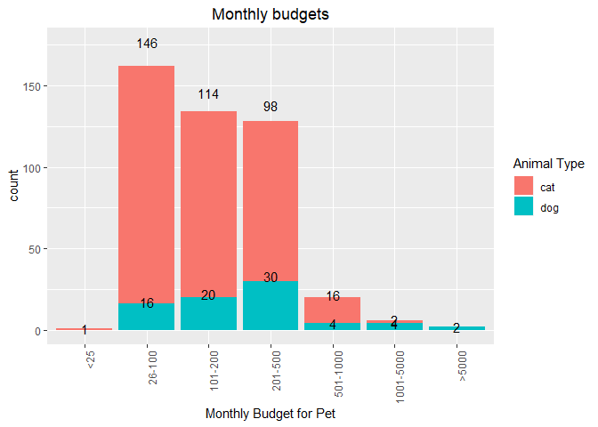
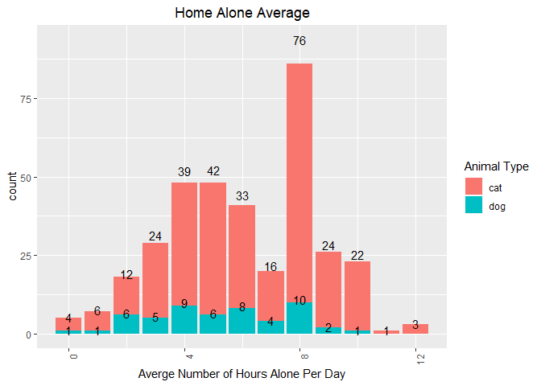
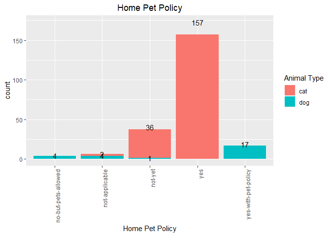

PAWS App-Trajectory Report
================
Ramaa Nathan
4/5/2019

-   [Executive Summary  - Amy (will wait until report is complete)](#executive-summary---amy-will-wait-until-report-is-complete)
-   [Feature Engineering  - Amy](#feature-engineering---amy)
    -   [Data Cleaning](#data-cleaning)
    -   [Data Conversion](#data-conversion)
    -   [Spreading/Creating to Indicator Variables](#spreadingcreating-to-indicator-variables)
    -   [Merging data](#merging-data)
-   [Analysis of Time in Processing Applications](#analysis-of-time-in-processing-applications)
    -   [How long does each application take?](#how-long-does-each-application-take)
    -   [Heatmap](#heatmap)
-   [Application Characteristics](#application-characteristics)
    -   [Affecting Adoption  - Ramaa ](#affecting-adoption---ramaa)
    -   [Affecting Decline](#affecting-decline)
-   [Data Issues affecting Analyses  - Brendan ](#data-issues-affecting-analyses---brendan)
    -   [Missing Data](#missing-data)
    -   [Unlimited Responses and Response Validation](#unlimited-responses-and-response-validation)
    -   [Recommendations for Collecting Clean Data](#recommendations-for-collecting-clean-data)
-   [Important Features for Prediction  - Ramaa](#important-features-for-prediction---ramaa)
-   [Conclusions and Recommendations](#conclusions-and-recommendations)
    -   [Recommendations to analyze the data frequently to check for improvements in processing application](#recommendations-to-analyze-the-data-frequently-to-check-for-improvements-in-processing-application)
    -   [Suggest](#suggest)
        -   [How findings can be translated into concrete actions](#how-findings-can-be-translated-into-concrete-actions)
        -   [How data collection strategy should be improved](#how-data-collection-strategy-should-be-improved)
        -   [How data analysis might be done on a regular basis](#how-data-analysis-might-be-done-on-a-regular-basis)

Executive Summary  - Amy (will wait until report is complete)
----------------------------------------------------------------------------------------------

Feature Engineering  - Amy
-----------------------------------------------------------

### Data Cleaning

### Data Conversion

### Spreading/Creating to Indicator Variables

### Merging data

Analysis of Time in Processing Applications
-------------------------------------------

### How long does each application take?

### Heatmap

Application Characteristics
---------------------------

### Affecting Adoption  - Ramaa 

We analysed the the different factors of the applications that ended with a successful adoption.

When applicants requested a specific type of animal, 30% of applications resulted in an adoption vs only 22% of the applications resultd in an adoption. This seems surprising as we would expect an applicant who is not specific about the type of animal to be able to adopt easily.

Most of the applicants who adopted a pet had allocated a monthly budget of less than $500.

Applicants who expected to leave the animal alone at home for longer hours chose to adopt a cat. The largest number of applicants expected the animal to be alone for 8 hours, which would be typical of an applicant who works full time.

Singles overwhelmingly seem to prefer to adopt a pet.

Again, families with no children at home seem to be the largest number of applicants. This correlates with mostly singles wanting to adopt.

Interestingly, more number of applicants who were able to successfully adopt had less expereince in each of the types of experiences.

Not surprisingly, the highest number of succesful adoptions were associated with a home policy that allowed pets.

The main reason that people would return a pet in the future seem to be if the pet sheds or if they moved too far away. Of these, more number of people who would return if the pet sheds did not adopt and of hte ones who adopted, they mainly adopted a cat.

Most of the people who adopted a pet had no allergies.

### Affecting Decline

Data Issues affecting Analyses  - Brendan 
---------------------------------------------------------------------------

### Missing Data

Overall we were able to achieve some insights given the application data. However, we were at times limited due to missing data in the applications data set. Below is a plot that shows counts of `NA`'s in each column of the data set.

The question with the most missing data is one regarding the home pet policy. This seems like an important question, especially for renters, and a non-response here may require manual follow up by PAWS staff. Making this a required question could save some time in the future.

### Unlimited Responses and Response Validation

Like many of the other teams, we ran into several challenges as a result of questions having a wide range of possible responses and illogical answers. For example, the 12 different responses below are for the Allergy question:

| Response                      | Count |
|-------------------------------|-------|
| no-allergies                  | 1,694 |
| mildly-allergic               | 130   |
| not-sure                      | 38    |
| not-sure,no-allergies         | 16    |
| very-allergic                 | 10    |
| no-allergies,mildly-allergic  | 5     |
| no-allergies,not-sure         | 5     |
| mildly-allergic,no-allergies  | 3     |
| mildly-allergic,very-allergic | 3     |
| mildly-allergic,not-sure      | 1     |
| very-allergic,mildly-allergic | 1     |
| very-allergic,no-allergies    | 1     |

In one case the responses conflict with each other: "very-allergic,no-allergies". This make grouping the data after the fact almost impossible because its not clear if this applicant has allergies or not. This is one example, but there were some other cases where this problem occurred as well, such a for the questions relating to Experience and Where the Pet Will be Kept.

For the monthly budget question, there were several negative numbers and some extremely large, strange values (i.e $150,159.00). Utilizing some kind of response validation logic (i.e.only allow positive values) and limiting the range of responses to a reasonable size given the question (in this case maybe between 200 and 1,000) would also make future analysis much more efficient.

### Recommendations for Collecting Clean Data

One of the most important recommendations moving forward would be to redesign the application to enforce standardized, limited and logical responses. Allowing only a single response combined with a limited response set would make analysis much easier in the future. Doing so will save PAWS staff time when reviewing applications *and* make future analyses easier and can lead to better insights.

Important Features for Prediction  - Ramaa
---------------------------------------------------------------------------

Conclusions and Recommendations
-------------------------------

### Recommendations to analyze the data frequently to check for improvements in processing application

### Suggest

#### How findings can be translated into concrete actions

#### How data collection strategy should be improved

#### How data analysis might be done on a regular basis
