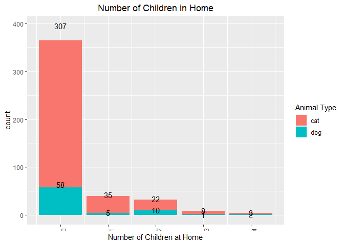
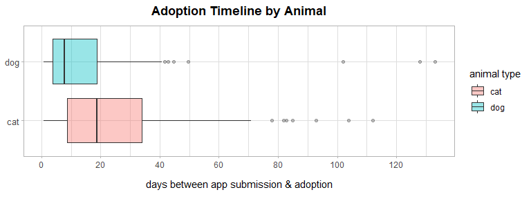
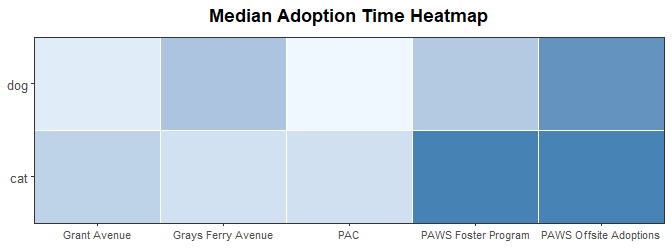
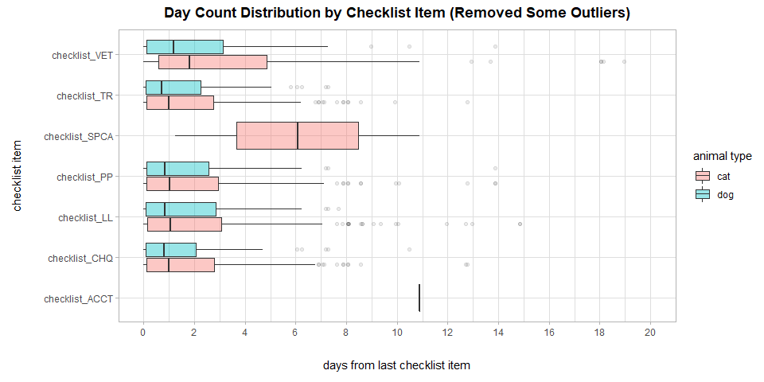
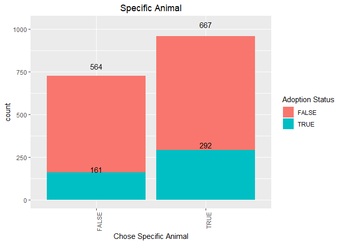
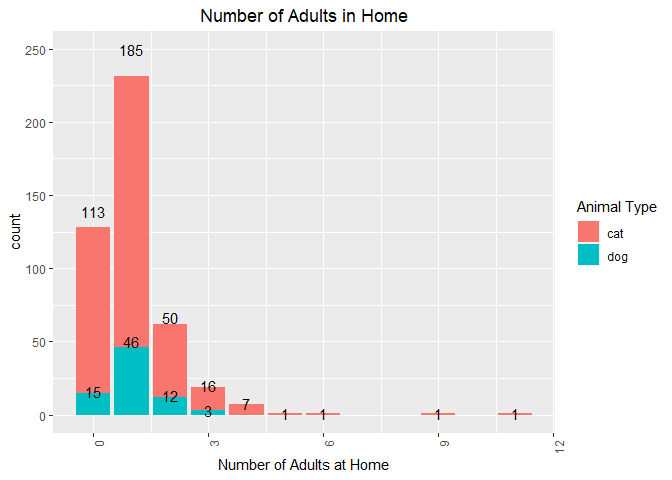
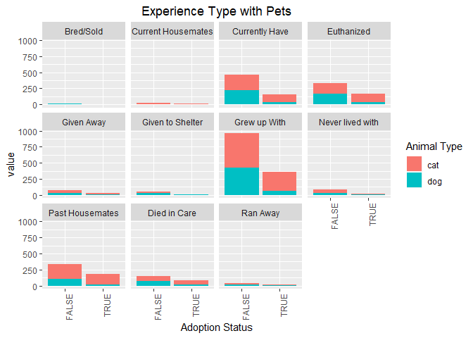
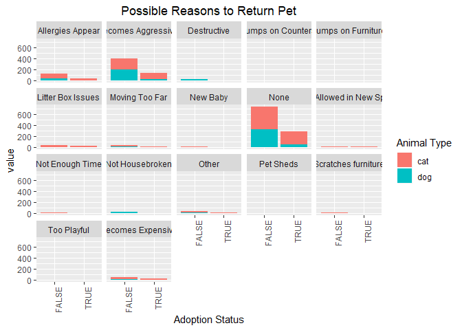
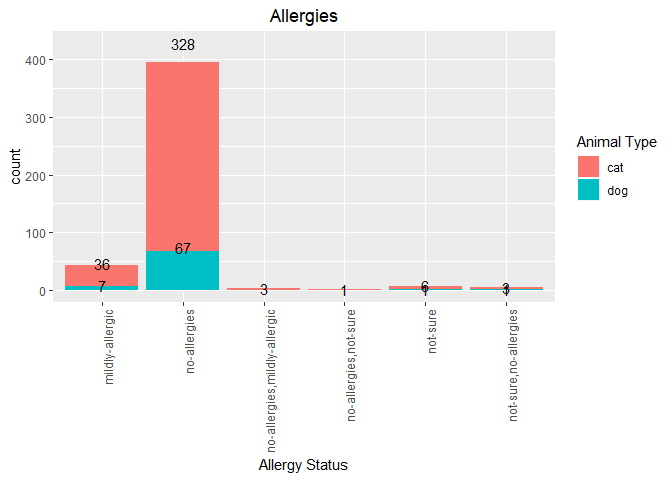
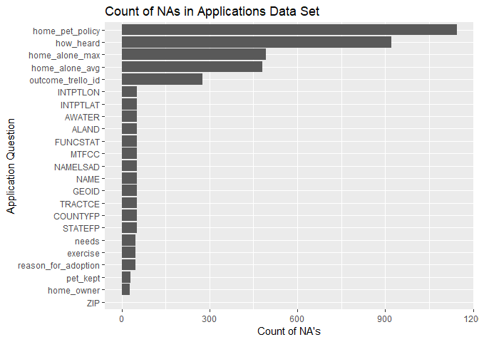

PAWS Application Trajectories: Final Report
================
Ramaa Nathan, Kate Connolly, Veena Dali, Amy Goodwin Davies, Brendan Graham, and Ambika Sowmyan
April 12, 2019

-   [Executive Summary](#executive-summary)
-   [Contributors](#contributors)
-   [Data Pre-processing](#data-pre-processing)
-   [Analysis of Time in Processing Applications](#analysis-of-time-in-processing-applications)
    -   [How Animal & Outcome Site Influence Appiclation Timelines](#how-animal-outcome-site-influence-appiclation-timelines)
    -   [How Animal & Outcome Site Influence Application Checklist Items](#how-animal-outcome-site-influence-application-checklist-items)
-   [Application Characteristics](#application-characteristics)
    -   [Affecting Adoption](#affecting-adoption)
    -   [Affecting Decline](#affecting-decline)
-   [Denied and Red Flagged Applications](#denied-and-red-flagged-applications)
-   [Data Issues affecting Analyses](#data-issues-affecting-analyses)
    -   [Missing Data](#missing-data)
    -   [Unlimited Responses and Response Validation](#unlimited-responses-and-response-validation)
    -   [Recommendations for Collecting Clean Data](#recommendations-for-collecting-clean-data)
-   [Important Features for Prediction](#important-features-for-prediction)
-   [Conclusions and Recommendations](#conclusions-and-recommendations)
    -   [Recommendations to analyze the data frequently to check for improvements in processing application](#recommendations-to-analyze-the-data-frequently-to-check-for-improvements-in-processing-application)
    -   [Suggest](#suggest)
        -   [How findings can be translated into concrete actions](#how-findings-can-be-translated-into-concrete-actions)
        -   [How data collection strategy should be improved](#how-data-collection-strategy-should-be-improved)
        -   [How data analysis might be done on a regular basis](#how-data-analysis-might-be-done-on-a-regular-basis)

Executive Summary
-----------------

Our task was describe an adoption application's trajectory at PAWS. We focussed on the following areas:

1.  Application processing timeline
2.  Application characteristics affecting successful adoptions
3.  Application characteristics affecting denied and red-flagged adoptions

In this report, we overview our data pre-processing steps, our analyses addressing the three areas above, and our recommendations for PAWS based on our findings for both application trajectory insights and data collection recommendations.

Contributors
------------

-   Ramaa Nathan (group leader) is an aspiring data scientist with a PhD in Computer Science and an ongoing masters in Applied Statistics. Her background is in finance and healthcare.

-   Kate Connolly is a digital analyst at the Philadelphia Inquirer where she helps to maintain the analytics framework and to provide data-driven support and decisions across the organization.

-   Veena Dali is a senior business intelligence analyst at Comcast working to provide data solutions to support business decisions. Her background is in Neuroscience and Computer Science.

-   Amy Goodwin Davies is a data scientist with a background in psycholinguistics.

-   Brendan Graham is a clinical data analyst at The Children’s Hospital of Philadelphia with a background in applied statistics.

-   Ambika Sowmyan heads the Marketing data analytics group at Hartford Funds. Her background is in Finance and Retail and has a graduate degree in Management and Predictive Analytics.

Data Pre-processing
-------------------

As our group focussed on questions about application trajectories, our starting point was an applications dataset comprised of `dog_apps.csv` and `cat_apps.csv`. For data pre-processing, the following steps were particularly important:

-   Standardizing responses for `ideal_adoption_timeline`, `all_household_agree`, `home_pet_policy`, `experience` and `pet_kept`. For example, `ideal_adoption_timeline` had responses "next-few-weeks" and "few-weeks" which we standardised as one response ("few-weeks").
-   For `children_in_home` and `adults_in_home`, ignoring "-" by taking the absolute value and replacing absurd values with NA (we replaced values greater than 15 with NAs).
-   Capping `budget_monthly` and `budget_emergency` at $10000 and $20000 respectively.
-   Addressing spelling variations in the `City` variable. For example, replacing the strings "PHILLY", "FILADELFIA", "PHILIDELPHIA", "PHIMADELPHIA", "PHIALADELPHIA", "PHIALDELPHIA", "PHILDELPHIA" with "PHILADELPHIA".
-   Adding new indicator variables for variables containing lists of responses. For example, from `allergies` we created indicator variables for each response (`allergies_mildly.allergic_ind`, `allergies_no.allergies_ind`, `allergies_not.sure_ind`, `allergies_very.allergic_ind`). For this, we used Jake Riley's function (Jake developed this function for the animal trajectory group):

``` r
convert_to_ind <- function(df, field){
    df %>% 
        mutate_(var = field) %>% 
        distinct(trello_id, animal_type, var) %>% 
        unnest(split = str_split(str_trim(var), ",")) %>%
        select(-var) %>% 
        filter(!is.na(split)) %>% 
        mutate(split = str_trim(split)) %>%
        mutate(n = 1,
               split = 
                   str_replace_all(split, "-", ".") %>% 
                   str_replace_all(., " ", ".") %>%
                   paste0(str_replace_all(field, "_", "."), 
                          "_", ., "_ind")) %>%
        distinct() %>% 
        spread(split, n, fill = 0)
}
```

Our cleaned applications dataset contained 1906 rows, 1594 unique trellos ids and the submitted dates ranged from 2018-08-30 to 2018-12-31:



To our applications dataset we added fields from the actions dataset (comprised of `dog_actions.csv` and `cat_actions.csv`), the cards dataset (comprised of `dog_cards.csv` and `cat_cards.csv`), and the petpoint dataset (`petpoint.csv`) to create our dataset for analysing successful applications. We also created another dataset comprised of the applications dataset and the cards dataset for analysing denied and red-flagged applications.

``` r
master_apps_report <- apps_with_indicators %>%
  filter(!is.na(trello_id)) %>%
  left_join(actions) %>%
  left_join(cards_with_indicators) %>%
  left_join(petpoint_with_indicators) %>% 
  mutate(adoption = factor(ifelse((!is.na(outcome_type) & outcome_type=="Adoption"),TRUE,FALSE)),
         adoption_time = difftime(outcome_date, date_submitted, units = "days"),
         adoption_time = round(as.numeric(adoption_time), 2),
         budget_monthly_ranges =factor(budget_monthly_ranges,
                                       levels=c("<25","26-100","101-200","201-500","501-1000","1001-5000",">5000","NA"),
                                       ordered=TRUE))

masterapps_20190324 <- readRDS("../masterapps_20190324.rds")
masterapps_20190324 <- masterapps_20190324 %>% 
  mutate(adoption = factor(ifelse((!is.na(outcome_type) & outcome_type=="Adoption"),TRUE,FALSE)),
         adoption_time = difftime(outcome_date, date_submitted, units = "days"),
         adoption_time = round(as.numeric(adoption_time), 2),
         budget_monthly_ranges =factor(budget_monthly_ranges,
                                       levels=c("<25","26-100","101-200","201-500","501-1000","1001-5000",">5000","NA"),
                                       ordered=TRUE))

setdiff(colnames(master_apps_report), colnames(masterapps_20190324))
```

    ## character(0)

``` r
dim(master_apps_report)
```

    ## [1] 1684  251

``` r
dim(masterapps_20190324)
```

    ## [1] 1684  251

``` r
identical(master_apps_report, masterapps_20190324)
```

    ## [1] FALSE

Analysis of Time in Processing Applications
-------------------------------------------

### How Animal & Outcome Site Influence Appiclation Timelines

Application timelines were measured by taking the difference between the time an application was submitted and the time that application resulted in an adoption. Only applications that resulted in adoption were assessed; applications that were denied were not included in the analysis. This is a potential area of further investigation.

In general, cat applications typically take longer than dog applications. The chart below shows that the median adoption timeline for **cats** is approximately **19** days (vertical black line inside red box), while **dog** applications average about **8** to result in an adoption (vertical black line inside blue box).



The chart also illuminates that for longer-than-average application timelines, animal type may influence just *how much longer* those above-average timelines are. Of the longer-than-usual applications, cat ones took between 35 days and 70 days compared to about 18 days to 40 days for dogs.

The outcome site for an adoption also influences the timeline of an application. It's important to note that this analysis does not consider all the potential locations that an animal spent its time during the application process; it is strictly based on the animal's outcome site.



<table class="table table-condensed">
<thead>
<tr>
<th style="text-align:left;">
outcome\_sitename
</th>
<th style="text-align:left;">
animal\_type
</th>
<th style="text-align:center;">
n
</th>
<th style="text-align:center;">
median adoption time
</th>
</tr>
</thead>
<tbody>
<tr>
<td style="text-align:left;">
Grant Avenue
</td>
<td style="text-align:left;">
cat
</td>
<td style="text-align:center;">
74
</td>
<td style="text-align:center;">
<span style="display: block; padding: 0 4px; border-radius: 4px; background-color: #ffffff">10</span>
</td>
</tr>
<tr>
<td style="text-align:left;">
</td>
<td style="text-align:left;">
dog
</td>
<td style="text-align:center;">
19
</td>
<td style="text-align:center;">
<span style="display: block; padding: 0 4px; border-radius: 4px; background-color: #ffffff">6</span>
</td>
</tr>
<tr>
<td style="text-align:left;">
Grays Ferry Avenue
</td>
<td style="text-align:left;">
cat
</td>
<td style="text-align:center;">
2
</td>
<td style="text-align:center;">
<span style="display: block; padding: 0 4px; border-radius: 4px; background-color: #ffffff">8</span>
</td>
</tr>
<tr>
<td style="text-align:left;">
</td>
<td style="text-align:left;">
dog
</td>
<td style="text-align:center;">
18
</td>
<td style="text-align:center;">
<span style="display: block; padding: 0 4px; border-radius: 4px; background-color: #ffffff">13</span>
</td>
</tr>
<tr>
<td style="text-align:left;">
PAC
</td>
<td style="text-align:left;">
cat
</td>
<td style="text-align:center;">
70
</td>
<td style="text-align:center;">
<span style="display: block; padding: 0 4px; border-radius: 4px; background-color: #ffffff">8</span>
</td>
</tr>
<tr>
<td style="text-align:left;">
</td>
<td style="text-align:left;">
dog
</td>
<td style="text-align:center;">
17
</td>
<td style="text-align:center;">
<span style="display: block; padding: 0 4px; border-radius: 4px; background-color: #ffffff">4</span>
</td>
</tr>
<tr>
<td style="text-align:left;">
PAWS Foster Program
</td>
<td style="text-align:left;">
cat
</td>
<td style="text-align:center;">
187
</td>
<td style="text-align:center;">
<span style="display: block; padding: 0 4px; border-radius: 4px; background-color: #ffffff">25</span>
</td>
</tr>
<tr>
<td style="text-align:left;">
</td>
<td style="text-align:left;">
dog
</td>
<td style="text-align:center;">
20
</td>
<td style="text-align:center;">
<span style="display: block; padding: 0 4px; border-radius: 4px; background-color: #ffffff">12</span>
</td>
</tr>
<tr>
<td style="text-align:left;">
PAWS Offsite Adoptions
</td>
<td style="text-align:left;">
cat
</td>
<td style="text-align:center;">
44
</td>
<td style="text-align:center;">
<span style="display: block; padding: 0 4px; border-radius: 4px; background-color: #ffffff">25</span>
</td>
</tr>
<tr>
<td style="text-align:left;">
</td>
<td style="text-align:left;">
dog
</td>
<td style="text-align:center;">
1
</td>
<td style="text-align:center;">
<span style="display: block; padding: 0 4px; border-radius: 4px; background-color: #ffffff">22</span>
</td>
</tr>
</tbody>
</table>
From the heatmap and table above, it's clear that overall average adoption times were higher at PAWS Foster Program & PAWS Offsite Adoptions locations. This is especially true for cat applications at those places

Based on median values, here are the fastest & slowest time-to-adoption sites:

-   **Cats**
    -   Slowest: PAWS Foster Program
    -   Fastest: Grays Ferry Avenue
-   **Dogs**
    -   Slowest: PAWS Foster Program
    -   Fastest: PAC

Only one site had a higher median adoption time for dogs than for cats—Grays Ferry Avenue. This site also had the fewest cat adoptions, though (n=2). It's also important to note the small n size for dog apps at PAWS Offsite Adoptions (n=1).

### How Animal & Outcome Site Influence Application Checklist Items



Most application items took between one and two days (median) to complete. While the animal type and outcome site didn't significantly impact the individual item times, cat applications generally exhibited slightly longer times between checklist items. Cat applications averaged about **1.2** days between checklist item, compared to **0.9** for dogs (excluding SPCA & ACCT items). The VET checklist item had the greatest difference between cats and dogs, and also was the item that took the longest (besides SPCA & ACCT items). This distinction between animals, while modest, could contribute to longer submission-to-adoption times for cat applications.

The chart above removed significant outliers, but further inspection of these outliers could be valuable. Understanding what causes certain application steps to take longer could help to streamline parts of the checklist process.

<table class="table table-condensed">
<thead>
<tr>
<th style="text-align:left;">
checklist item
</th>
<th style="text-align:center;">
n
</th>
<th style="text-align:center;">
median days from last item
</th>
<th style="text-align:center;">
percent of cards with item checked
</th>
</tr>
</thead>
<tbody>
<tr>
<td style="text-align:left;">
checklist\_ACCT
</td>
<td style="text-align:center;">
1
</td>
<td style="text-align:center;">
<span style="display: block; padding: 0 4px; border-radius: 4px; background-color: #ffffff">10.89</span>
</td>
<td style="text-align:center;">
0.2%
</td>
</tr>
<tr>
<td style="text-align:left;">
checklist\_SPCA
</td>
<td style="text-align:center;">
2
</td>
<td style="text-align:center;">
<span style="display: block; padding: 0 4px; border-radius: 4px; background-color: #ffffff">6.07</span>
</td>
<td style="text-align:center;">
0.4%
</td>
</tr>
<tr>
<td style="text-align:left;">
checklist\_VET
</td>
<td style="text-align:center;">
425
</td>
<td style="text-align:center;">
<span style="display: block; padding: 0 4px; border-radius: 4px; background-color: #ffffff">1.80</span>
</td>
<td style="text-align:center;">
93.8%
</td>
</tr>
<tr>
<td style="text-align:left;">
checklist\_CHQ
</td>
<td style="text-align:center;">
432
</td>
<td style="text-align:center;">
<span style="display: block; padding: 0 4px; border-radius: 4px; background-color: #ffffff">0.97</span>
</td>
<td style="text-align:center;">
95.4%
</td>
</tr>
<tr>
<td style="text-align:left;">
checklist\_LL
</td>
<td style="text-align:center;">
433
</td>
<td style="text-align:center;">
<span style="display: block; padding: 0 4px; border-radius: 4px; background-color: #ffffff">1.03</span>
</td>
<td style="text-align:center;">
95.6%
</td>
</tr>
<tr>
<td style="text-align:left;">
checklist\_PP
</td>
<td style="text-align:center;">
433
</td>
<td style="text-align:center;">
<span style="display: block; padding: 0 4px; border-radius: 4px; background-color: #ffffff">1.03</span>
</td>
<td style="text-align:center;">
95.6%
</td>
</tr>
<tr>
<td style="text-align:left;">
checklist\_TR
</td>
<td style="text-align:center;">
435
</td>
<td style="text-align:center;">
<span style="display: block; padding: 0 4px; border-radius: 4px; background-color: #ffffff">0.95</span>
</td>
<td style="text-align:center;">
96.0%
</td>
</tr>
</tbody>
</table>
The table above shows the exceptions to the average checklist times. The ACCT and SPCA checklist items took considerably longer to complete than other items, but they also were present in less than 1% of applications. This low sample limits any sound conclusions, but does present an area for potential further exploration. It may be valuable to assess if other components of an application—like red flags or particular animal information—lead to this item being more mandatory. But more data would be needed for this analysis.

Application Characteristics
---------------------------

### Affecting Adoption

We analysed the the different factors of the applications that ended with a successful adoption.



When applicants requested a specific type of animal, 30% of applications resulted in an adoption vs only 22% of the applications resultd in an adoption. This seems surprising as we would expect an applicant who is not specific about the type of animal to be able to adopt easily.



Most of the applicants who adopted a pet had allocated a monthly budget of less than $500.


Applicants who expected to leave the animal alone at home for longer hours chose to adopt a cat. The largest number of applicants expected the animal to be alone for 8 hours, which would be typical of an applicant who works full time.



Singles overwhelmingly seem to prefer to adopt a pet.


Again, families with no children at home seem to be the largest number of applicants. This correlates with mostly singles wanting to adopt.



Interestingly, more number of applicants who were able to successfully adopt had less expereince in each of the types of experiences.



Not surprisingly, the highest number of succesful adoptions were associated with a home policy that allowed pets.



The main reason that people would return a pet in the future seem to be if the pet sheds or if they moved too far away. Of these, more number of people who would return if the pet sheds did not adopt and of hte ones who adopted, they mainly adopted a cat.


Most of the people who adopted a pet had no allergies.

### Affecting Decline

Denied and Red Flagged Applications
-----------------------------------

<br> We further investigated the characteristics of applications that were denied or red flagged. There were 12 applications that were denied, 19 that were withdrawn, and 133 that were red flagged. <br><br> **Denied Applications**<br> Below are visualizations that illustrate the applicants' characteristics (e.g. allergies, budget, home pet policy, etc.). We only have data for 12 denied applications so the analysis is limited. In the future when we have more data, we could compare the denied applications to the adopted ones.<br><br>

Key takeaways:<br> \* No known allergies for the applicants \* Budget had no impact (same budget range for approved applications) \* All household members agreed to get a pet \* Majority of the applicants did not enter a home pet policy and not everyone is the home owner \* Many applicants had unfortunate incidents with prior pets (e.g. ran away, died in care)

 <br>**Red Flagged Applications**<br>

There were 133 applications that were red flagged.<br>129 of the 133 have not yet resulted in an adoption or are still being procesed. Two of the applications that were flagged were denied but that does not mean that the rest are going to result in adoption. Since the data set for the applications is from the end of 2018, many of the applications are still in progress. We do not have the final status of all the applications so we cannot conclude what happened to the red flagged applications. As a further project, I think it would be interesting to track the final status of the applications that were red flagged.

Below is a visualization that shows the last updated status for applications that were red flagged. After being flagged, the applications were sent to the manager to make a decision or the applicant was requested to provide more information (e.g. in many cases the applicant was required to provide more information about the vet).


Data Issues affecting Analyses
------------------------------

### Missing Data

Overall we were able to achieve some insights given the application data. However, we were at times limited due to missing data in the applications data set. Below is a plot that shows counts of `NA`'s in each column of the data set.


The question with the most missing data is one regarding the home pet policy. This seems like an important question, especially for renters, and a non-response here may require manual follow up by PAWS staff. Making this a required question could save some time in the future.

### Unlimited Responses and Response Validation

Like many of the other teams, we ran into several challenges as a result of questions having a wide range of possible responses and illogical answers. For example, the 12 different responses below are for the Allergy question:

| Response                      | Count |
|-------------------------------|-------|
| no-allergies                  | 1,694 |
| mildly-allergic               | 130   |
| not-sure                      | 38    |
| not-sure,no-allergies         | 16    |
| very-allergic                 | 10    |
| no-allergies,mildly-allergic  | 5     |
| no-allergies,not-sure         | 5     |
| mildly-allergic,no-allergies  | 3     |
| mildly-allergic,very-allergic | 3     |
| mildly-allergic,not-sure      | 1     |
| very-allergic,mildly-allergic | 1     |
| very-allergic,no-allergies    | 1     |

In one case the responses conflict with each other: "very-allergic,no-allergies". This make grouping the data after the fact almost impossible because its not clear if this applicant has allergies or not. This is one example, but there were some other cases where this problem occurred as well, such a for the questions relating to Experience and Where the Pet Will be Kept.

For the monthly budget question, there were several negative numbers and some extremely large, strange values (i.e $150,159.00). Utilizing some kind of response validation logic (i.e.only allow positive values) and limiting the range of responses to a reasonable size given the question (in this case maybe between 200 and 1,000) would also make future analysis much more efficient.

### Recommendations for Collecting Clean Data

One of the most important recommendations moving forward would be to redesign the application to enforce standardized, limited and logical responses. Allowing only a single response combined with a limited response set would make analysis much easier in the future. Doing so will save PAWS staff time when reviewing applications *and* make future analyses easier and can lead to better insights.

Important Features for Prediction
---------------------------------

Till now, we have separately analysed the different characteristics that affect adoption or decline. In an attempt to understand how the different features in the dataset could have had a combined effect on the adoption status, we ran a basic Random Forests model on the dataset. A Random Forest is basically a tree-based algorithm where a random subset of predictors (or features) are evaluated at each node and the observed data is split into two regions using one of the predictors and a threshold value for that predictor such that the error in predicting the adoption status is minimized. Starting from the top of the tree with one node, two new nodes are created with each split and the tree is grown recursively till there are only a few observations in each leaf node. Multiple trees are built similarly and the results are combined together to predict the adoption status for any given set of characteristics.

To successfully build a Random Forest, we further cleaned the data to take care of all the missing values. We used 1665 observations and 90 variables out of a total of 1684 observations and 251 variables.

The combined effect of different characteristics on the adoption status can be studied by considering one of the important outputs generated by the Random Forests, the subset of predictor values that are found to be most commonly used as a criteria for splitting the dataset into two smaller regions at each node. This subset of predictor values, referred to as Important Variables, are shown in the plot below. As seen in the list, we find that the top three characteristics are number of children in a home, the type of dog, and the date the application was submitted. Improved results or a different set of important characteristics can be obtained from better and more complete data.


Conclusions and Recommendations
-------------------------------

### Recommendations to analyze the data frequently to check for improvements in processing application

### Suggest

#### How findings can be translated into concrete actions

#### How data collection strategy should be improved

#### How data analysis might be done on a regular basis
