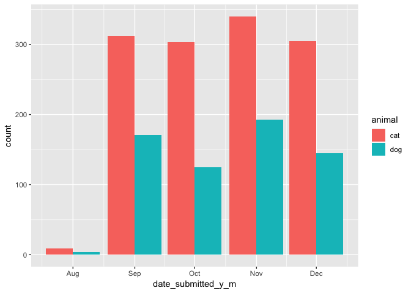
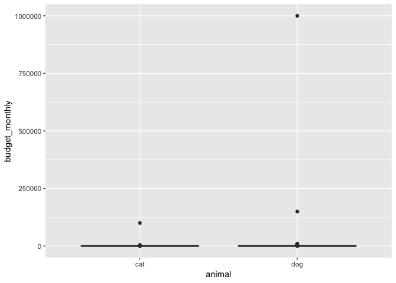
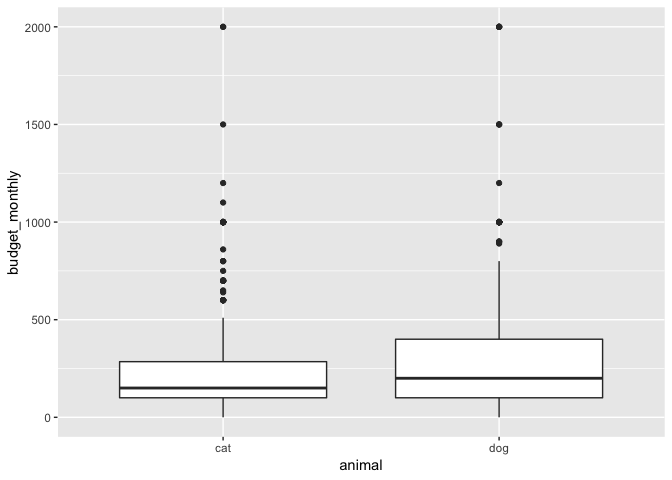
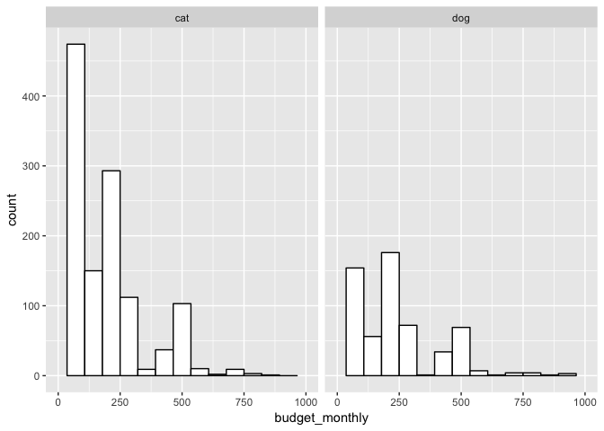
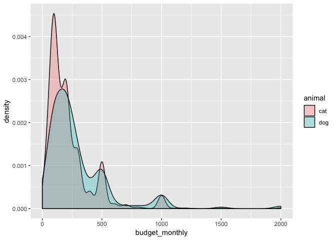
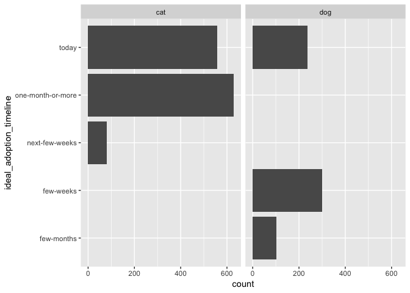
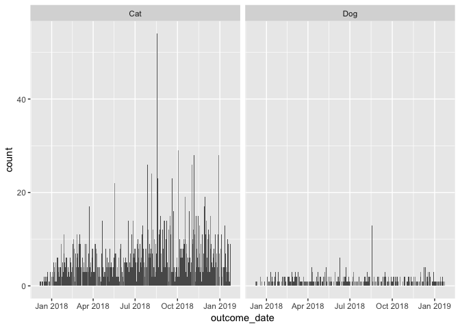
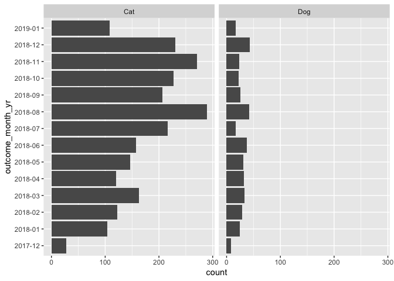
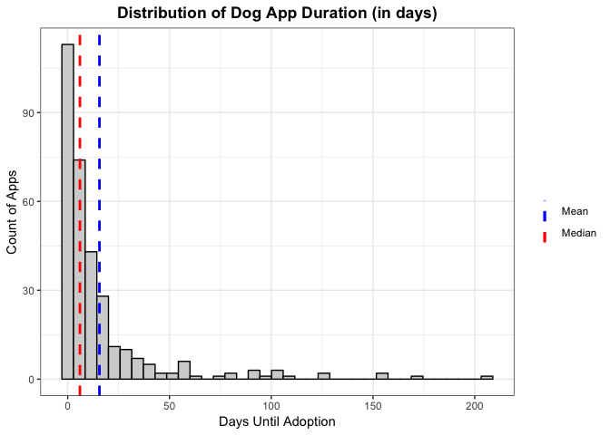
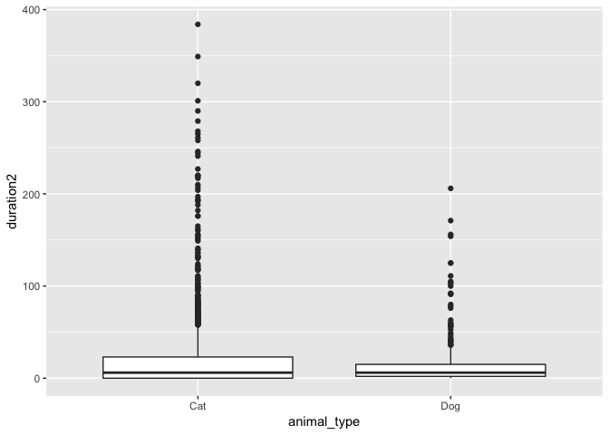

Libraries & Files
-----------------

    library(ggplot2)
    library(tidyverse)
    library(dplyr)
    library(readxl)
    library(readr)
    library(zoo)

    # data files
    cat_apps <- read_csv("data/cat_apps.csv") %>%
      mutate(animal = "cat")
    dog_apps <- read_csv("data/dog_apps.csv") %>%
      mutate(animal = "dog")

    cat_actions <- read_csv("data/cat_actions.csv") %>%
      mutate(animal = "cat")
    dog_actions <- read_csv("data/dog_actions.csv") %>%
      mutate(animal = "dog")

    petpoint <- read_csv("data/petpoint.csv")

    # combine
    apps_combined <- rbind(cat_apps, dog_apps)
    actions_combined <- rbind(cat_actions, dog_actions)

Application Submission Dates
============================

Made a plot to see the dates when applications were submitted, by
`animal`. Not too much here.

    # first had to convert date_submitted from character to string (as.Date)
    # then used as.yearmon to select the month and year only from the date

    apps_combined %>%
      mutate(date_submitted_y_m = as.Date(as.yearmon(c(apps_combined$date_submitted), "%m/%d/%y"))) %>%
      ggplot(aes(x = date_submitted_y_m, fill = animal)) +
      geom_bar(position = "dodge")

Monthly Budget Plots
====================

    # convert monthly_budget from character to a numeric in order to do calculations
    # removed parentheses, dollar signs, commas, negative sign
    apps_combined$budget_monthly <- as.numeric(gsub('[()$,-]', '', apps_combined$budget_monthly))

    # compute groupwise mean and median budget_monthly
    apps_combined %>%
      group_by(animal) %>%
      summarize(mean(budget_monthly),
                median(budget_monthly))

    ## # A tibble: 2 x 3
    ##   animal `mean(budget_monthly)` `median(budget_monthly)`
    ##   <chr>                   <dbl>                    <dbl>
    ## 1 cat                      312.                      150
    ## 2 dog                     2154.                      200

Can see here that the median may be a more useful measure of center. The
dog data probably has more outliers that are skewing the mean, which
can be further explored with a boxplot.

    # create box plot of budget_monthly by animal
    apps_combined %>% 
      ggplot(aes(x = animal, y = budget_monthly)) +
      geom_boxplot()

Confirmed! Some allegedly very rich dog applicants are heavily
influencing the mean. Removing some outliers and negative values gives a
better picture.

    # create same box plot as above, with outliers and negative values removed
    apps_combined %>%
      mutate(is_outlier = budget_monthly > 2000) %>%
      mutate(is_outlier_2 = budget_monthly < 0) %>%
      filter(!is_outlier) %>%
      filter(!is_outlier_2) %>%
      ggplot(aes(x = animal, y = budget_monthly)) +
      geom_boxplot()

There are still a few outliers, particularly in the cat data, but can
see here that applicants for dogs tend to list a higher monthly budget.

    # create hist of budget_monthly
    apps_combined %>%
      ggplot(aes(x = budget_monthly)) +
      geom_histogram(bins = 15, color = "black", fill = "white") +
      xlim(c(0, 1000)) +
      facet_wrap(~ animal)

In general, both application sets had similar monthly budget
distributions. Cat applications were a little more likely to list $100
or less compared to dog applications. But the median number, which was
calculated above, shows a relatively similar distribution overall.

Throwing a density plot in there too. Just like the histogram, can see
the multiple modes. This could be due to a couple things — applicants
may be unintentionally adding more zeros to their answers, or applicants
are more likely to list numbers ending in zero.

    # same plot as above, just density plot
    apps_combined %>%
      mutate(is_outlier = budget_monthly > 2000) %>%
      mutate(is_outlier_2 = budget_monthly < 0) %>%
      filter(!is_outlier) %>%
      filter(!is_outlier_2) %>%
      ggplot(aes(x = budget_monthly, fill = animal)) +
      geom_density(alpha = 0.3)

Ideal Adoption Time & Adoption Dates
====================================

    # bar plot for ideal_adoption_timeline by animal
    ggplot(apps_combined, aes(x = ideal_adoption_timeline)) +
      geom_bar() +
      facet_wrap(~ animal) +
      coord_flip()

Cat applications listed "one-month-or-more" and "today" for ideal times.
Dog applicants were similar, listing "few-weeks" and "today" most often.

Also plotted the adoption outcome days by animal.

    # get all adoption outcome_date timestamps, for cats & dogs
    # from petpoint, convert & select outcome_date & outcome_trello_id & animal_type and filter outcome_type by "Adoption"
    outcome_dates <- petpoint %>%
      mutate(outcome_date = as.Date(outcome_date,"%m/%d/%y")) %>%
      select(outcome_type, outcome_date, outcome_trello_id, animal_type) %>%
      filter(outcome_type == "Adoption") %>%
      arrange(desc(outcome_trello_id))
      
    # mutate removes time from outcome_date
    outcome_dates %>%
    #  mutate(outcome_date_day = date(outcome_dates$outcome_date)) %>%
      ggplot(aes(x = outcome_date)) +
      geom_bar() +
      facet_wrap(~ animal_type)

I didn't think the plot by day was very valuable, so then I wanted to
see it grouped by month. Then it's clearer when more adoptions occurred
— for cats, August & October through December; for dogs, a little more
even distribution with some spikes in August & December.

The dates labels aren't in the right order, but it gets the job done for
now.

    # mutate sets the outcome_date to just year and month, basically grouping counts by month
    outcome_dates %>%
      mutate(outcome_month_yr = format(as.Date(outcome_dates$outcome_date), "%Y-%m")) %>%  
      ggplot(aes(x = outcome_month_yr)) +
      geom_bar() +
      facet_wrap(~ animal_type) +   # show one chart for dogs and one for cats
      coord_flip()   # flip the x and y axis

Application to Adoption Duration
================================

Wanted to try to take a look at the time between an application being
submitted (in `cards`) and an adoption being finalized (in `petpoint`).
Not sure if some of these methods are the correct/most efficient way to
do this, but gave it a shot.

    ## The goal is to find all of the starting times & all the ending times
    ## Start times can be found in the actions data, end times in PetPoint
    ## First want to organize only the data that we need before joining the two data sets

    # get all the times when a card was created
    # from combined_actions, select date & id and filter by "createCard" type
    create_card <- actions_combined %>%
      select(type, date, data.card.id) %>%
      filter(type == "createCard")

    # check to see that there are no duplicate ids; run and consult console
    nrow(distinct(create_card, data.card.id))

    ## [1] 6892

    # get all adoption outcome_date timestamps
    # from petpoint, select outcome_date & outcome_trello_id & animal_type and filter outcome_type by "Adoption"
    outcome_dates <- petpoint %>%
      select(outcome_type, outcome_date, outcome_trello_id, animal_type) %>%
      filter(outcome_type == "Adoption") %>%
      arrange(desc(outcome_trello_id))
      
    # check to see that there are no duplicate ids; run and consult console
    nrow(distinct(outcome_dates, outcome_trello_id))

    ## [1] 2452

    # saw that there were indeed duplicates (petpoint is the culprit)
    # de-dupe
    outcome_dates <- outcome_dates[!duplicated(outcome_dates$outcome_trello_id),]

    # join the two datasets
    start_and_end_dates <- merge(create_card, outcome_dates, by.x="data.card.id", by.y="outcome_trello_id")

    # count the number of dogs & cats in the outcome_dates
    count(outcome_dates, vars = animal_type)  

    ## # A tibble: 2 x 2
    ##   vars      n
    ##   <chr> <int>
    ## 1 Cat    2077
    ## 2 Dog     375

Next up is getting the dates and times in similar formats.

    # make the relevant date columns date format
    start_and_end_dates <-
      start_and_end_dates %>%
      mutate(outcome_date = as.Date(outcome_date,"%m/%d/%y" )) %>%
      mutate(date = as.Date(date, "%m/%d/%y"))

    #start_and_end_dates <-
    #  start_and_end_dates %>%
    #  mutate(create_date_est = date(start_and_end_dates$date)) %>%    # remove hour from date EST time
    #  mutate(final_date = date(start_and_end_dates$outcome_date))    # remove hour from outcome_date
      
    # add column for difference between create and outcome dates (duration) 
    start_and_end_dates <-
      start_and_end_dates %>%
      mutate(duration = start_and_end_dates$outcome_date - start_and_end_dates$date) 

    # convert negative values in duration column to 0
    start_and_end_dates <-
      start_and_end_dates %>%
      mutate(duration2 = ifelse(start_and_end_dates$duration < 0, 0, start_and_end_dates$duration))   

Historgram that shows the distribution of duration. Initially used
`facet_wrap` to compare cat and dog, but I think it's easier to just
look at them as separate plots.

    # initial histogram plot
    gp1 <- start_and_end_dates %>%
          filter(animal_type == "Cat") %>%
          ggplot(aes(x = duration2)) +
          theme_bw() +
          geom_histogram(bins = 37, color = "black", fill = "lightgray") +
          ggtitle("Distribution of Cat App Duration (in days)") +
          theme(plot.title = element_text(hjust = 0.5, face = "bold")) +
          xlab("Days Until Adoption") +
          ylab("Count of Apps") +
          geom_vline(aes(xintercept = mean(duration2), 
                         color = (blue = "Mean")),
                    linetype = "dashed",
                    size = 1,
                    show.legend = TRUE) +
          geom_vline(aes(xintercept = median(duration2), 
                         color = (red = "Median")),
                     linetype = "dashed",
                     size = 1,
                     show.legend = TRUE)

    # customize legend
    gp1 +
      scale_color_manual(name = '', 
                         labels = c(Mean = "Mean", Median = "Median"),
                         values = c(Mean = 'blue', Median = 'red')) 

    # initial histogram plot
    gp1 <- start_and_end_dates %>%
          filter(animal_type == "Dog") %>%
          ggplot(aes(x = duration2)) +
          theme_bw() +
          geom_histogram(bins = 37, color = "black", fill = "lightgray") +
          ggtitle("Distribution of Dog App Duration (in days)") +
          theme(plot.title = element_text(hjust = 0.5, face = "bold")) +
          xlab("Days Until Adoption") +
          ylab("Count of Apps") +
          geom_vline(aes(xintercept = mean(duration2), 
                         color = (blue = "Mean")),
                    linetype = "dashed",
                    size = 1,
                    show.legend = TRUE) +
          geom_vline(aes(xintercept = median(duration2), 
                         color = (red = "Median")),
                     linetype = "dashed",
                     size = 1,
                     show.legend = TRUE)

    # customize legend
    gp1 +
      scale_color_manual(name = '', 
                         labels = c(Mean = "Mean", Median = "Median"),
                         values = c(Mean = 'blue', Median = 'red')) 

Perhaps not immediately obvious in the visualizaions, but doing some
quick calculations shows that the duration for cats and dogs is pretty
similar.

    start_and_end_dates %>%
      group_by(animal_type) %>%
      summarize(mean(duration2),
                median(duration2))

    ## # A tibble: 2 x 3
    ##   animal_type `mean(duration2)` `median(duration2)`
    ##   <chr>                   <dbl>               <dbl>
    ## 1 Cat                      19.7                   6
    ## 2 Dog                      15.6                   6

But there are a fair amoung of outliers. Those are what we'll want to
examine to understand what makes an application quick or slow.

    # create box plot of budget_monthly by animal
    start_and_end_dates %>% 
      ggplot(aes(x = animal_type, y = duration2)) +
      geom_boxplot()

